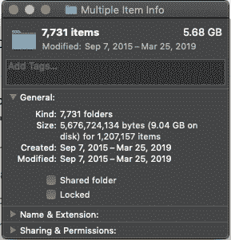

# 我从 node_modules 回收了 10GB 的磁盘空间

> 原文：<https://dev.to/irreverentmike/i-reclaimed-10gb-of-disk-space-from-node-modules-oal>

# 我*真的*不喜欢我的笔记本电脑。

过去几年，我一直在使用 2017 款 Macbook Pro。我相信你已经听说了，这是一款非常令人失望的设备，主要是因为它勇敢的缺少端口，有缺陷的键盘设计，以及惊人的标价。我的个人电脑是 13 英寸版本，16GB 内存， *no* touchbar，256GB 固态硬盘。当我买它的时候，升级到 16GB 的内存似乎更重要，在处理器速度或磁盘空间上挥霍。这可能仍然是正确的-但我发现自己在日常工作中对 SSD 的小容量感到无尽的沮丧。

大约每 6 周，当我用完磁盘空间时，我的机器就会停下来，所以我不得不忍受所有清理空间的常见问题:

*   倒垃圾
*   删除未使用的应用程序
*   确保我的所有照片都移动到我的 NAS、云存储和异地归档中
*   删除旧的 virtualbox 虚拟机映像

# 一种新的整肃

然而，上周我发现了一个令人惊讶的释放磁盘空间的新方法:清空`node_modules`目录。

好奇心袭来，我在 mac 上搜索名为`node_modules`的文件夹。这是我的发现:

*   我的机器总共有`7,731`*`node_modules`个文件夹。哇！*
**   在我保存所有开发项目的`~/src/**`下，我总共有 7，719 个`node_modules`*   这些文件夹包含*成千上万的文件*(这应该不足为奇)，并且占据了将近 **10GB** 的磁盘空间！*

 *# 一路海龟下来🐢🐢🐢

最初，最后一个数字对我来说是一个小小的启示。如果你不熟悉的话，`node_modules`包含了每个 [npm 包](https://npmjs.com)的副本，你可以在使用 node 的项目中把它们添加到你的项目中。它们中的每一个都被固定到一个特定的版本，通常在`package.json`中指定。

从逻辑上讲，项目的`node_modules`目录中的每个依赖项也可能有一个`node_modules`目录，包含它们的依赖项，每个依赖项都被固定到一个特定的版本(同样，在该依赖项的`package.json`文件中定义)。

这就是文件和磁盘空间膨胀的地方——您添加到项目中的库可能每个都包含几十个依赖项，每个依赖项又有几十个，等等，一直到构成 node 基本构件的超级基本 node 和 C 库。

(提醒你——这有点过于简化——取决于你如何设置`npm`或`yarn`，这里有*一些*优化。如果给定 npm 模块的一个版本被依赖关系树多次需要，它可能只出现一次。)

# 修罗

实际上，这很容易解决。我在`~/src/**`下搜索了所有的`node_modules`文件夹，并直接从 finder 中删除了它们(抱歉，终端辩护者)。然后，我清空了 mac 上的垃圾，我又多了 10GB。

# 它破了什么？

我这样做已经一周了，到目前为止，唯一的一点不好的地方是，当我重新访问我正在积极工作的项目时，我需要运行`yarn install`在那里重新创建`node_modules`目录。我很擅长这个。

# 我们能做得更好吗？

还有一个`npm`和`yarn`的替代品叫做 [`pnpm`](https://pnpm.js.org/) ，号称是“快速、磁盘空间高效的包管理器”。它的主要特点看起来很有希望:

我还没有尝试过，但肯定会尝试一下。

# 后记

我认为公平地说，这是一个 npm 和脸书(维护纱线)的人也在密切关注的问题。我的猜测是，一些良性竞争将改善这个磁盘空间的噩梦...希望在我被迫购买 1TB 存储空间的笔记本电脑之前。🥳

# 更多阅读

我当然不是第一个写这个的人。如果你感兴趣的话，可以看看更多的好书:

*   [node _ modules 问题](https://dev.to/leoat12/the-nodemodules-problem-29dc)
*   当我偷看我的 Node_Modules 目录时发生了什么
*   【node _ modules 到底出了什么问题，为什么这是你的错

* * *

*最初发表于[mike.biful.co](https://mike.biful.co/reclaimed-10gb-of-disk-space-from-node-modules)。**