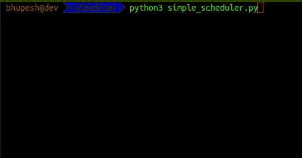

# Python 中的一个简单调度器

> 原文：<https://dev.to/bhupesh/a-simple-scheduler-in-python-49di>

我们在生活中都会遇到一些我们希望自动化的事情，设置提醒和日程安排就是其中之一

Python 让所有开发人员都可以轻松地编写小型 Python 脚本，为您安排一些无聊的事情。

[](https://i.giphy.com/media/6kvVGhp7bp2WA/giphy.gif)

这个#牛逼的库叫做**时间表**

(这个名字真不错😉)

让我们从玩这个开始

[](https://i.giphy.com/media/zf8yrM8nVERvW/giphy.gif)

# 安装

首先让我们先安装 python 包

```
pip install schedule 
```

Enter fullscreen mode Exit fullscreen mode

# 简介

[*调度*](https://pypi.org/project/schedule/) 是一个使用构建器模式进行配置的周期性任务的进程内调度程序。Schedule 允许您使用简单、友好的语法，以预定的时间间隔定期运行 Python 函数(或任何其他可调用函数)。

> 面向人类的 Python 作业调度。

让我们先不要担心[进程内调度](https://en.wikipedia.org/wiki/Scheduling_(computing))是什么

让我们写一些代码

```
import schedule  

def job():  
    print("A Simple Python Scheduler.")  

# run the function job() every 2 seconds schedule.every(2).seconds.do(job)  

while True:  
    schedule.run_pending() 
```

Enter fullscreen mode Exit fullscreen mode

上面的代码每 2 秒钟打印一次`A Simple Python Scheduler.`。

[](https://res.cloudinary.com/practicaldev/image/fetch/s--mxKgvzfn--/c_limit%2Cf_auto%2Cfl_progressive%2Cq_auto%2Cw_880/https://drive.google.com/uc%3Fexport%3Dview%26id%3D1g84A87coi30klXJXPav_7-34nWppEeBu)

让我们一行一行地理解

*   **`import schedule`**
    这个不用解释，只要导入包就可以用了。

*   **`def job()`**
    这是我们要根据自己的时间表执行的功能。

*   **`schedule.every(2).seconds.do(job)`**
    这就是神奇发生的地方

    一个作业被 [Scheduler.every()](https://schedule.readthedocs.io/en/stable/api.html#schedule.Scheduler.every) 方法创建并返回，该方法还定义了它的时间间隔(以*时间单位*表示)，这里的时间间隔以秒*为单位。

    [do()](https://schedule.readthedocs.io/en/stable/api.html#schedule.Job.do)指定作业每次运行时应该调用的 job_func。

    当作业运行时，任何附加参数都传递给 job_func。

    *即*语句
    `schedule.every(2).seconds.do(job(argument))`会给出错误
    改为使用

    `schedule.every(2).seconds.do(job, arg1, arg2)`

*   **`schedule.run_pending()`**
    run _ pending()只运行所有计划运行的作业。
    确保循环运行，因为这样调度任务会一直运行。

万岁我们使用 Python
[](https://i.giphy.com/media/xjUlxQHkMBqSvLeSTy/giphy.gif) 编写了我们的第一个调度程序

## 其他变化

```
import schedule
import time

def job():
    print("I'm working...")

def job2():
    print("yo boiss..")

def job3():
    print("Hello")

schedule.every(5).seconds.do(job)
# some other variations schedule.every().hour.do(job)
schedule.every().day.at("12:25").do(job)
schedule.every(5).to(10).minutes.do(job)
schedule.every().thursday.at("19:15").do(job)
schedule.every().wednesday.at("13:15").do(job)
schedule.every().minute.at(":17").do(job)
schedule.every(2).seconds.do(job2)

while True:
    schedule.run_pending()
    time.sleep(1) 
```

Enter fullscreen mode Exit fullscreen mode

以上是我们安排工作的一些其他方法

*   **T2`schedule.every().hour.do(job)`**

    每小时执行一次`job()`功能

*   **T2`schedule.every().day.at("12:25").do(job)`**

    这将在每天下午 12:25 执行`job()`功能
    默认时间表使用 24 小时格式。

*   **T2`schedule.every().wednesday.at("13:15").do(job)`**

    每周三下午 1:15 做`job()`。
    您还可以指定运行特定作业的日期名称。
    查看[列表](https://schedule.readthedocs.io/en/stable/api.html#schedule.Job.second)中的可用。

*   **T2`schedule.every(2).to(5).minutes.do(job3)`**

    这个每 2 到 5 分钟执行一次`job3()`；)

# 奖励物品

[](https://i.giphy.com/media/3o84UaGEtyayvBIFwc/giphy.gif)

所以现在你可以安排事情了，如果你能提醒自己一些要做的事情会怎么样？？

前来救援。

使用`smtplib`你可以发送电子邮件(尽管电子邮件会被放在垃圾邮件文件夹中🙃)

下面是一个使用 python
发送电子邮件的简单脚本

```
import smtplib

def sendEmail(sender_email, password, to, subject, msg):
    try:
        server = smtplib.SMTP('smtp.gmail.com', 587)
        server.starttls()
        server.login(sender_email, password)

        message = f'From: {sender_email}\nTo: {to}\nSubject: {subject}\n\n{msg}'
        print(message)

        server.sendmail(sender_email, to, message)
        server.quit()
        print("Email Sent")
    except:
        print("Some Error Occured")

if __name__ == '__main__':
    SENDER_EMAIL = "youremail@xyz.com"
    PASSWORD = "password"
    TO = "yourfrnds@email.com"
    SUBJECT = "Just having fun"
    MESSAGE = "hey dawg! it's my first Email"
    sendEmail(SENDER_EMAIL, PASSWORD, TO, SUBJECT, MESSAGE) 
```

Enter fullscreen mode Exit fullscreen mode

现在去检查你的垃圾邮件文件夹😜

我希望你喜欢这篇文章😄

> 似乎很有趣？，[订阅🚀](https://buttondown.email/bhupesh)阅读更多这类很酷的东西，或者在[推特上与我联系](https://twitter.com/bhupeshimself)。