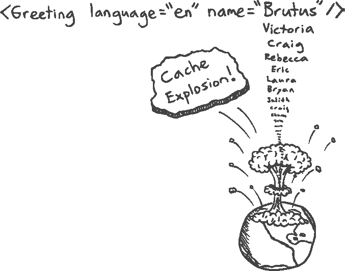
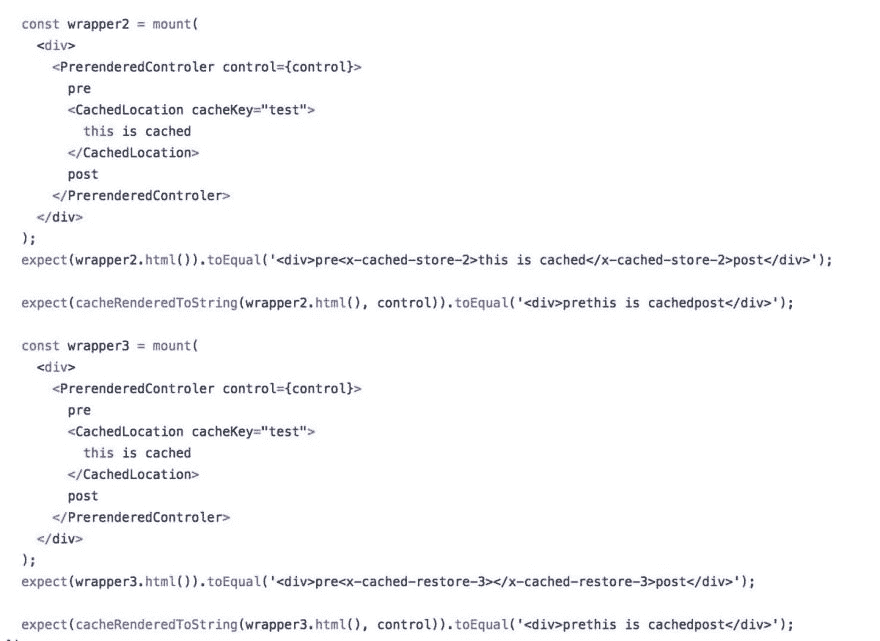

# 🧠新的反应和旧的缓存

> 原文：<https://dev.to/thekashey/a-new-react-and-the-old-cache-15h5>

是反应🚀快，或者说反应是🐌慢？回答这个问题超级简单，不费吹灰之力。

*   反应很快。句号。React 能快就快:不显示太多数据，不以每秒 60 帧的速度制作动画。街区里总有一个*更快*的孩子(苗条？)，但 React 几乎在任何情况下都足够快。
*   反应慢。又一个句号。这并不是什么大不了的事情——内联 1000 个 SVG 并使用 React 来呈现它们，或者在服务器端同时呈现 100 个页面。

简而言之——反应是👍作为一个客户端库，但对于服务器端渲染-哦，它会的🔥烧你的 CPU，还有 AWS 账单。不是因为它慢，而是因为一切都有极限。

这是显而易见的——你不能比较所有 CPU 都为一个客户工作的情况(在浏览器中)和你必须同时为十几个客户渲染相同内容的情况。

如何缓解这个问题也是显而易见的——这是一代人都知道的，对于 react 本身来说，它的主要思想是处理不必要的更新——记忆化。或者，用老派的 SSR 来说——只是**缓存**。
小块缓存，大块缓存，页面缓存，数据缓存，中间结果缓存。尽可能多的缓存，让一个客户的渲染结果加速另一个客户的渲染。

> 缓存是一种众所周知的模式，并且总是节省时间！几十年了！为了大家！除了 React。

### 反应过来的日子

那么，React 中的缓存？你还记得它的 API 吗？不，你不知道。没有了。

你仍然能够缓存`renderToString`结果——没什么大不了的，或者[缓存`renderToNodeStream`](https://zeit.co/blog/streaming-server-rendering-at-spectrum) 就像 **mxstbr** 去年为 Spectrum 做的那样。

但是我们需要缓存吗？

是的- React 15 确实很慢，React 16 即使快得多，也仍然需要一些时间来渲染结果。任何事情都需要一些时间。凡事都有要求和极限。

## 缓存在 React 中

只要问题存在，就有许多开发人员，用*缓存背景*(来自以前在不同框架或语言中的经验)来解决它——新的模式和库出现了。

#### 萝卜葱

反应空间的替代物。我们的英雄。节省了数百万个 CPU 周期。能够在组件级处理数据加载，并缓存结果。

完美地工作。**直到反应过来 16** 。之后就不工作了。

## /[萝卜](https://github.com/FormidableLabs/rapscallion)

### SSR 的异步 React VirtualDOM 渲染器。

<article class="markdown-body entry-content container-lg" itemprop="text">

# 流氓

[ ](https://circleci.com/gh/FormidableLabs/rapscallion) [ ](https://gitter.im/FormidableLabs/rapscallion?utm_source=badge&utm_medium=badge&utm_campaign=pr-badge&utm_content=badge)

## 概观

Rapscallion 是服务器的 React VirtualDOM 呈现器。其显著特点如下:

*   渲染是**异步非阻塞**。
*   Rapscallion 的速度大约是**比`renderToString`快 30%。**
***   它提供了一个流媒体接口，这样你就可以立即开始向客户端发送内容。*   它提供了一个模板特性，所以你可以**在样板文件**中包装你的组件的 HTML，而不会放弃流的好处。*   它提供了一个**组件缓存** API 来进一步加速你的渲染。**

 **## 目录

*   [安装](https://raw.githubusercontent.com/FormidableLabs/rapscallion/master/#installation)
*   [API](https://raw.githubusercontent.com/FormidableLabs/rapscallion/master/#api)
    *   [T2`render`](https://raw.githubusercontent.com/FormidableLabs/rapscallion/master/#render)
    *   [T2`Renderer#toPromise`](https://raw.githubusercontent.com/FormidableLabs/rapscallion/master/#renderertopromise)
    *   [T2`Renderer#toStream`](https://raw.githubusercontent.com/FormidableLabs/rapscallion/master/#renderertostream)
    *   [T2`Renderer#includeDataReactAttrs`](https://raw.githubusercontent.com/FormidableLabs/rapscallion/master/#rendererincludedatareactattrs)
    *   [T2`Renderer#tuneAsynchronicity`](https://raw.githubusercontent.com/FormidableLabs/rapscallion/master/#renderertuneasynchronicity)
    *   [T2`Renderer#checksum`](https://raw.githubusercontent.com/FormidableLabs/rapscallion/master/#rendererchecksum)
    *   [T2`setCacheStrategy`](https://raw.githubusercontent.com/FormidableLabs/rapscallion/master/#setcachestrategy)
    *   [T2`template`](https://raw.githubusercontent.com/FormidableLabs/rapscallion/master/#template)
        *   [有效表达式](https://raw.githubusercontent.com/FormidableLabs/rapscallion/master/#valid-expressions)
        *   [行为](https://raw.githubusercontent.com/FormidableLabs/rapscallion/master/#behavior)
        *   [例子](https://raw.githubusercontent.com/FormidableLabs/rapscallion/master/#example)
*   [缓存](https://raw.githubusercontent.com/FormidableLabs/rapscallion/master/#caching)
*   [巴别塔插件](https://raw.githubusercontent.com/FormidableLabs/rapscallion/master/#babel-plugins)
    *   [T2`babel-plugin-client`](https://raw.githubusercontent.com/FormidableLabs/rapscallion/master/#babel-plugin-client)
    *   [T2`babel-plugin-server`](https://raw.githubusercontent.com/FormidableLabs/rapscallion/master/#babel-plugin-server)
*   [基准](https://raw.githubusercontent.com/FormidableLabs/rapscallion/master/#benchmarks)
*   [执照](https://raw.githubusercontent.com/FormidableLabs/rapscallion/master/#license)

## 装置

使用 npm:

```
$ npm install --save rapscallion
```

在 Node.js 中:

```
const {
  render,
  template
} = require("rapscallion");
// ...
```

## 应用程序接口

### `render`

`render(VirtualDomNode) -> Renderer`

这个函数返回一个渲染器，一个渲染你的 VirtualDOM 元素的接口。下面列举了一些方法。

* * *

### `Renderer#toPromise`

…** </article>

**[View on GitHub](https://github.com/FormidableLabs/rapscallion)** **组件级缓存的另一个好工具。另一个侵入 React 并试图改变其工作方式的工具。还有一个工具**不能与 React 16** 一起使用。

##  [电极-io ](https://github.com/electrode-io) / [电极-反应-SSR-缓存](https://github.com/electrode-io/electrode-react-ssr-caching)

### 使用概要分析和组件缓存优化 React SSR

<article class="markdown-body entry-content container-lg" itemprop="text">

# 电极-反应-SSR-缓存[](https://npmjs.org/package/electrode-react-ssr-caching)[](https://travis-ci.org/electrode-io/electrode-react-ssr-caching)[](https://david-dm.org/electrode-io/electrode-react-ssr-caching)

支持 profiling React 服务器端渲染时间和组件缓存，帮助你加速 SSR。

# 安装

```
npm i electrode-react-ssr-caching 
```

# 使用

注意，由于这个模块修补了 React 的源代码来注入缓存逻辑，所以它必须在 React 模块之前加载。

例如:

```
import SSRCaching from "electrode-react-ssr-caching";
import React from 'react';
import ReactDOM from 'react-dom/server';
```

## 压型

你可以使用这个模块来检查每个组件渲染所花费的时间。

```
import SSRCaching from "electrode-react-ssr-caching";
import { renderToString } from "react-dom/server";
import MyComponent from "mycomponent";
// First you should render your component in a loop to prime the JS engine (i.e: V8 for NodeJS)
for( let i = 0; i < 10; i ++ ) {
    renderToString(<MyComponent />);
}
SSRCaching.clearProfileData();
SSRCaching.enableProfiling();
const html
```

…</article>

[View on GitHub](https://github.com/electrode-io/electrode-react-ssr-caching)

#### 反应-SSR-优化

来自沃尔玛实验室的用于*记忆*和*模板化*的神奇系统。在 React 14-15 迁移时曾被破坏，**没有得到 React 16** 支持。

## [walmartlab](https://github.com/walmartlabs)/[react-SSR-优化](https://github.com/walmartlabs/react-ssr-optimization)

### React.js 通过组件记忆化和模板化进行服务器端呈现优化

<article class="markdown-body entry-content container-lg" itemprop="text">

# [ ](https://raw.githubusercontent.com/walmartlabs/react-ssr-optimization/masteimg/react-ssr-logo.png) React 服务器端渲染优化库

这个 react 服务器端优化库是一个可配置的 ReactJS 扩展，用于在服务器上记忆 React 组件标记。它还支持组件模板化，以便用更动态的数据进一步缓存呈现的标记。这个服务器端模块通过使用一个`require()`钩子拦截 React 的 instantiateReactComponent 模块，避免分叉 React。

[](https://travis-ci.org/walmartlabs/react-ssr-optimization)[](https://www.npmjs.org/package/react-ssr-optimization)[](https://github.com/walmartlabs/react-ssr-optimization/blob/master/LICENSE)

## 我们为什么建造它

React 是一个同类最佳的 UI 组件框架，允许我们构建可以跨页面和应用程序共享和重用的高级组件。React 的虚拟 DOM 提供了出色的开发体验，将我们从管理细微的 DOM 更改中解放出来。最重要的是，React 为我们提供了一个优秀的开箱即用的同构/通用 JavaScript 解决方案。React 的`renderToString(..)`可以在服务器上将页面的 HTML 标记完全渲染成一个字符串。这对于初始页面加载性能(尤其是对于低带宽的移动用户)和搜索引擎索引和排名尤为重要…

</article>

[View on GitHub](https://github.com/walmartlabs/react-ssr-optimization)

#### 反应-组件-缓存

TLDR:实际上是一个正在工作的人！

## [rook lab](https://github.com/rookLab)/[react-组件-缓存](https://github.com/rookLab/react-component-caching)

### React 16 中的组件缓存加快了服务器端渲染速度

<article class="markdown-body entry-content container-lg" itemprop="text">

# React 组件缓存

## 概观

React 组件缓存是一个组件级的缓存库，用于使用 React 16 进行更快的服务器端渲染。

*   使用 React 的四种服务器端渲染方法中的任意一种。渲染是**异步**。
*   使用简单或模板策略缓存组件。
*   从三种缓存实现中选择(LRU、Redis 或 Memcached)。

## 装置

使用 npm:

```
$ npm install react-component-caching
```

## 使用

### 在节点渲染服务器中:

实例化一个缓存，并将其作为第二个参数传递给任何呈现方法(`renderToString`、`renderToStaticMarkup`、`renderToNodeStream`或`renderToStaticNodeStream`)。只要你想用`ReactDOM.renderToString`，就用`ReactCC.renderToString`。

**注意:所有这些方法都是异步的，并且返回一个承诺。要使用它们，`await`渲染前的响应**

```
const ReactCC = require("react-component-caching");
const cache = new ReactCC.ComponentCache();
app.get('/example', async (req,res) => {
    const renderString = await ReactCC.
```

…</article>

[View on GitHub](https://github.com/rookLab/react-component-caching)

引用[React 16 中更快的服务器端渲染和组件缓存](https://medium.com/@reactcomponentcaching/speedier-server-side-rendering-in-react-16-with-component-caching-e8aa677929b1)

> Sasha Aickin [在 2016 年关于加速服务器端渲染的演讲中介绍并演示了组件缓存](https://youtu.be/PnpfGy7q96U?t=22m35s)。不久之后，沃尔玛实验室创建了一个[组件缓存库](https://github.com/electrode-io/electrode-react-ssr-caching),它具有对渲染进行时间分析的功能。这个想法在去年的 [React Amsterdam](https://youtu.be/4TOi9l6x-jo) 上受到关注，并在 Github 的讨论中浮出水面。一个组件缓存 API 也被整合到了 React 的 React 服务器渲染器中，[rap callion](https://github.com/FormidableLabs/rapscallion)。
> 随着去年 9 月 React 16 的发布，许多这些工作都应该重新启动了。React 提高了其服务器端渲染方法的速度，现在提供了两种流方法。我们很好奇是否有可能利用这些新的和改进的方法来利用组件缓存的能力。所以我们构建了 [React 组件缓存](https://github.com/rookLab/react-component-caching)来给开发者提供这样的能力。

* * *

但是，你知道，这个库内部非常复杂，在下一个 React 版本中将会完全崩溃。面向用户的 API 也相当复杂...但是它在工作，与 memcache 或其他缓存库一起工作，并且是一个救世主...直到今天。

## 反应-预渲染-组件

然后——让我介绍 React 中组件级缓存的另一种方法，这种方法**永远不会被破坏**。从来不是故意的。

```
import {CachedLocation, NotCacheable} from 'react-prerendred-component';

const MyCachedComponent = () => (
  <CachedLocation cacheKey="MyCachedComponent">
    any code you want
  </CachedLocation> );

// component like this shall not be cached.
const SomeNonPureImportantComponent = () => (
 <NotCacheable>hey {global.userName}</NotCacheable> ); 
```

简单？容易吗？它是如何工作的？

#### 工作原理

1.  `CachedLocation`将使用`<x-cached-store>{children}<x-cached-store>`包装您的组件
2.  将针对此类标记分析`renderToString`的结果，并将标记的内容移动到缓存中。对于`renderToStream`来说，同样的工作通过`transform streams`进行。
3.  如果`key`存在于存储中，那么`CachedLocation`将呈现`<x-cached-restore-key />`，并且相同的后置过滤器将用存储的值替换该文本。

这在 HTML/流转换级别上有效，并且**不依赖于任何 React 内部机制**。

同样是**为客户端**工作！`CachedLocation`会用一个`div`包装你的数据，并使用`dangerouslySetInnerHTML`存储/恢复数据。例如，你可能*缓存*那些大的 SVG，我在开始提到过。

```
<CachedLocation cacheKey="svg-fileName">
  // react component first time, just a string second.
  <MySVRGComponent />
</CachedLocation> 
renderToString(...);

// - first render, cache is empty, making a full render
// <x-cached-store-1></x-cached-store-1>
// - cache stored, extra tags removed
//  

renderToString(...);

// - second render, cache exists - restore entity
// <x-cached-restore-1/>
// - we know what to restore
//  虽然`CachedLocation`在渲染过程中添加了额外的标签，但它们会在稍后被移除。这是一个透明的过程！

这完全是基于纯 HTML 的解决方案，在反应完成后，它在 T2 工作。

#### XSS 我的朋友？

所以，让我们再回忆一遍,`CachedLocation`会在结果 HTML 中放一些`tag`,一些虚拟的(它是)RegEx 会完成剩下的工作。

如果你亲爱的客户也会这样做呢？如果在 JSON、script 中发现相同的`tag`会怎样，反之亦然？当然，**会吹** :P

所以——在现实世界中，这个库不会使用如此明显的标记名，而是会在每次渲染时使用 [nanoid](https://github.com/ai/nanoid) 来生成唯一的标记名。所以-没有 XSS 和没有假阳性是可能的，放松。

```
<x-cached-supersecretstring-11 /> // it's "safe" 
```

唯一的问题是，在不同线程中生成的缓存彼此不兼容，所以在分布式缓存的情况下，你必须自己指定`super-secret-seed`。

#### 模板化

这是一个很长的，可能不太正确的术语，代表较少变化的记忆。

例如——`dev.to`的头包含你的头像，但其他都是一样的——你可以将它“模板化”到静态和缓存的`<Header/>`中。如果您将在每个用户的基础上缓存头，会发生什么？缓存不是无限的。

[](https://res.cloudinary.com/practicaldev/image/fetch/s--jBuGNTrR--/c_limit%2Cf_auto%2Cfl_progressive%2Cq_auto%2Cw_880/https://arkwright.github.img/scaling-react-server-side-rendering/cache-explosion.svg)

> 图片来自 [Scaling React 服务器端渲染](https://arkwright.github.io/scaling-react-server-side-rendering.html)。

不是有 100500 个不同的`<Button>unuqieText</Button>`，你可能只有`<Button>#text#</Button>`——所以你将只记忆复杂的 html 标记，使用简单的`replace`方法添加一些“变量”。

虽然使用*字符串代替*并不十分安全，但是这个库给了你一些组件来*注入*占位符，它使用上下文 API 来向下钻取道具，并且只需要很小的代码风格变化就可以使用。

```
const UserHeader = () => (
 <div>
   .....
   <Placeholder name="userName"/>
   ....
 </div> )

renderToString(<CacheLocation variables={{userName:'Joe'}}><UserHeader/></CacheLocation>); 
// <x-cached-store-1 userName="Joe">....{x-cached-placeholder-userName}...</x-cached-store-1>

renderToString(<CacheLocation variables={{userName:'Jack'}}><UserHeader/></CacheLocation>); 
// <x-cached-restore-1 userName="Jack"/>
// ....{x-cached-placeholder-userName}...
// ....Jack... 
```

这是一个非常强大的策略，通过将你全新的 React 应用程序转换成老式的模板引擎来减少内存使用并提升你的应用程序。

这是公正的🚀很🚀快的🚀。

PS:这可以给你亚毫秒 SSR，`react-component-caching`已经证明了这一点。
PPS:但是这对于客户端缓存来说*还*不起作用。使用变量进行 CSR 缓存将禁用缓存。

这种技术的另一个名字是缓存`interpolation`，如果你想真正理解片段缓存背后的一切，请阅读[文章](https://arkwright.github.io/scaling-react-server-side-rendering.html)。

#### 缓存在哪里？

这种方法的另一个很酷的时刻是`cache`。一个简单的 React 16/暂挂兼容缓存模型。

*   同步`get`缓存
*   同步`set`缓存。
*   没有可用的缓存？-扔一个承诺！

你可以使用 [react-cache](https://github.com/facebook/react/tree/master/packages/react-cache) ，只要它使用不同的模型(没有`set`)，但是任何其他的缓存，包括内存中的或者**共享内存**的，都很容易。

> 但 memcache 不行，只要不支持*异步*缓存。

预渲染组件为服务器和客户端提供了组件`memoization`和`templatization`的强大功能，并且将来也不会崩溃，因为它就是这样构建的——永远不会让您失望。

试试看。
或者只是想想。

##  [卡西](https://github.com/theKashey) / [反应-预渲染-组件](https://github.com/theKashey/react-prerendered-component)

### 🤔悬疑前时代的部分水合和缓存

<article class="markdown-body entry-content container-lg" itemprop="text">

# 反应预渲染组件

Partial Hydration and Component-Level Caching

[](https://www.npmjs.com/package/react-prerendered-component) 

## 想法

简而言之:不要试图**运行** js 代码，并生成一个匹配预渲染的 react 树，而是**使用**预渲染的 html，直到 js 代码准备好替换它。让它活起来。

在 HTML 级别上还能做什么？缓存，*模板化*，还有其他好东西给<g-emoji class="g-emoji" alias="rocket" fallback-src="https://github.githubassets.cimg/icons/emoji/unicode/1f680.png">🚀</g-emoji>，就在一个 3kb*里。

#### 预渲染组件

> 在服务器上渲染一些东西，在客户端上作为 HTML 使用

*   服务器端渲染数据
    *   调用`thisIsServer`来设置环境。
    *   React-prerendered-component `will leave trails`，用已知 id 的 div 包装每个块。
*   水合客户端
    *   React-prerendered-component 将搜索已知的 id*，并从页面返回`read rendered HTML`。*
*   你的网站准备好了
    *   react-预渲染-组件准备就绪。他们正在呈现你从服务器发送的预先存在的 HTML。
*   一旦任何组件准备好被替换-水合物
    *   但之前没有。那是…

</article>

[View on GitHub](https://github.com/theKashey/react-prerendered-component)

> 安东·科尔祖诺夫[@ the kashey](https://dev.to/thekashey)一个月前 [@olivtassinari](https://twitter.com/olivtassinari) 介绍 JSS 缓存给梅-[github.com/mui-org/materi…](https://t.co/SNp2Y6OE9K)，然后 [@tannerlinsley](https://twitter.com/tannerlinsley) 问了一些关于“冷模块重装”的事情。但我把它当成“缓存”来读。
> T24】....让我来贴一张 CachedLocation 如何工作的图片👨‍🔧
> [github.com/theKashey/reac…](https://t.co/QgjE8KG3w3)07:21AM-08 2018 年 11 月[](https://twitter.com/intent/tweet?in_reply_to=1060432205829201920)[](https://twitter.com/intent/retweet?tweet_id=1060432205829201920)0[](https://twitter.com/intent/like?tweet_id=1060432205829201920)7

PS:顺便说一下，react-prerendered-component 是其他文章的主角:

[](/thekashey) [## 💡2019 年反应代码拆分

### 安东·科尔祖诺夫 3 月 19 日 19 时 7 分读取

#react #javascript #ssr #codesplitting](/thekashey/react-code-splitting-in2019-3cmg)**