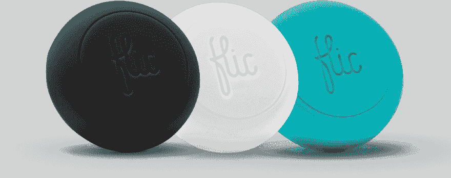
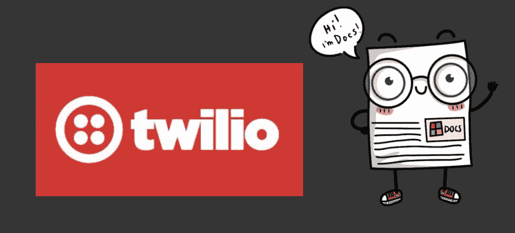
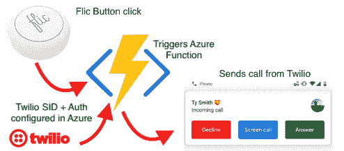
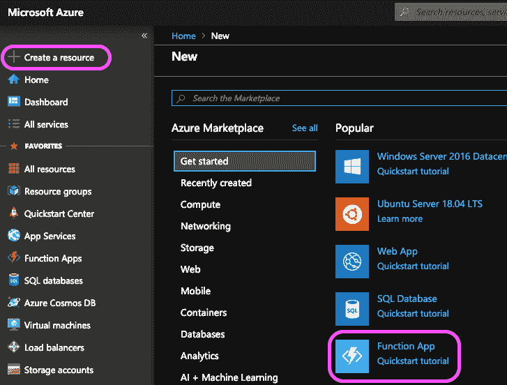
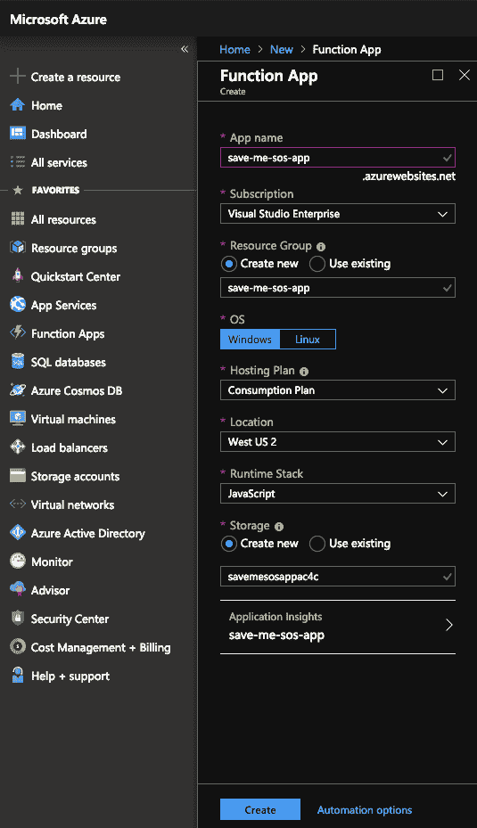
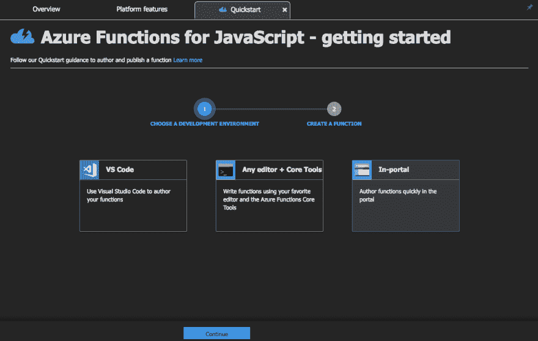
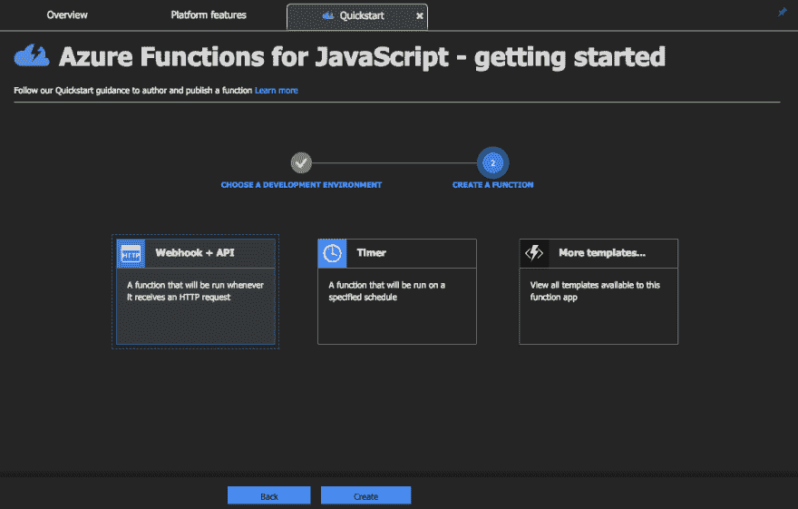
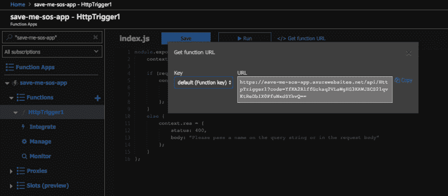
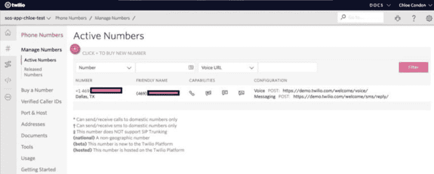
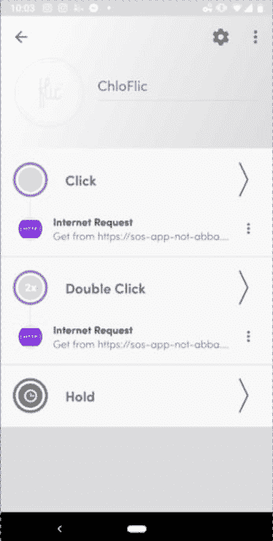

# Azure 函数的 Ambivert 指南

> 原文：<https://dev.to/azure/an-ambivert-s-guide-to-azure-functions-27b8>

*下面这篇博文将带你了解如何使用 [Azure 功能](https://azure.microsoft.com/en-us/services/functions/?WT.mc_id=devto-blog-chcondon)、 [Twilio](https://www.twilio.com/) 和 [Flic 按钮](http://flic.io/shop/flic-1pack?aff=10)来创建一个应用程序，以触发电话/短信到你的手机。如果你正在寻找一个关于 Azure 函数的快速总结和概述，我推荐[从我们的文档](https://docs.microsoft.com/en-us/azure/azure-functions/?WT.mc_id=devto-blog-chcondon)开始，或者花 4 分钟阅读更多细节[如何创建你的第一个 Azure 函数](https://docs.microsoft.com/en-us/azure/azure-functions/functions-create-first-azure-function?WT.mc_id=devto-blog-chcondon)，这样你就有一些关于如何在 Azure 中使用函数的背景知识。*

*如果您想直接跳到代码，请向下滚动到* **让我们进入代码！** *下面一节。*

*快乐学习！*

*——克洛伊*

## 大家好，我的名字叫克洛伊，我是一名志愿者👋

作为一名前演员(现在是开发商的拥护者)，人们经常认为我是一个外向的人。最大的秘密是…我没有！我实际上是一个内向外向的人(也被称为[多面手](https://www.coursereport.com/blog/the-ambivert-s-guide-to-staying-in-tech))。日复一日，这意味着我在舞台上、在会议上发表演讲、与与会者社交、接受几次镜头采访、在欢乐时光逗留闲聊……事实上，我喜欢这样！但之后我会逃到我的酒店房间，在接下来的 3 个小时里盖着毯子看电视，因为我必须“充电”​

这条推特就是一个很好的例子

> 可儿康登🎀[@ chloecondon](https://dev.to/chloecondon)我试图在科技会议上成为一个外向的人。😐2018 年 1 月 10 日上午 07:345744554

这是 ambivert 的定义:

性格中外向和内向特征平衡的人。

描述我的环境特征的最好方式(不是雄辩的方式)是我同样喜欢和讨厌和其他人在一起(只是半开玩笑！).我喜欢社交——会议、聚会和咖啡聊天都是我的拿手好戏(事实上，这是我工作的一大部分！)….但只有一半的时间。之后我不得不充电，或者甚至安排几个晚上呆在家里来抵消我的社交活动。我可能在晚宴上非常健谈，但选择不去晚上的卡拉 ok(相信我-你的女孩喜欢卡拉 ok)。​​

所以，我想说的是，如果你看到我在会议的欢乐时光逗留，我要么在下午晚些时候喝了浓咖啡，我在倒时差，要么我在内心偷偷死去。​

 

###### 我的内心感受与外在表现

记住…我有戏剧学位。我很擅长让人们相信我没有在内心尖叫😐。我认为我的外向性几乎就像一个按钮，我可以根据情况打开和关闭…这是一个很好的继续，我将使用这个设备来展示我是如何建立它的。

在会议、聚会和集会中学习和创造驾驭我“野外”雄心的方法是一个有趣的过程！今天，在这篇文章中，我想向你展示我为自己创造的一个技巧…希望，如果你是一个内向的人(或者是一个外向的人，或者是一个想做一些很酷的东西的人/机器人),你可以自己尝试一下这个演示，并通过编码摆脱尴尬或不受欢迎的社交场合！​

当决定接手这个项目时，我考虑了几种不同的设备来构建我的项目。起初，我把它想象成一个可穿戴设备。我联系了[萨拉·奇普斯](https://twitter.com/SaraJChipps)和[詹妮弗·瓦德拉](https://twitter.com/likeOMGitsFEDAY)，看看[犹太机器人](https://jewelbots.com/)的功能是否适用于我的用例。不幸的是，虽然非常时尚和有趣，但这些设备的范围是有限的(但如果你的生活中有一个年轻的女孩- [给她们买一个这样的](https://jewelbots.com/))。非常酷，有趣的学习编程的方式！).我也考虑过 FitBit 作为一个选项，但担心人们会认为我是在他们面前通过它触发我的功能。我需要一些小巧、精致、能放进口袋的东西。

## 警察按钮

所以，获胜者是…一个 [Flic 按钮](http://flic.io/shop/flic-1pack?aff=10)！什么是 [Flic 按钮](http://flic.io/shop/flic-1pack?aff=10)？很棒的问题！它是一个小按钮(大约 25 美分硬币大小)，充当 iOS 和 Android 的蓝牙遥控器。你可以对这些按钮进行编程，让它们做任何事情，从打开家中的智能灯、控制音乐、拍照、发短信、打电话、发布推文、呼叫 Ubers 等。

Flic 有许多你可以在他们的应用程序中使用的预建集成和应用程序，从发送推文到触发 MP3 播放笑声(我可能会也可能不会设置这个特定的例子，以便在我讲糟糕的笑话时打扰我的男朋友)。 [Suz Hinton](https://twitter.com/noopkat) 在几个月前的一次 Azure 练习中，为我们的导师会议送了我一个 [Flic Button](http://flic.io/shop/flic-1pack?aff=10) ，一旦我学会了如何将它与 Azure 功能相连接，我就知道我必须用它来创建一些有趣的东西。虽然 [Flic 按钮](http://flic.io/shop/flic-1pack?aff=10)在其应用程序中包含了一个预建的“虚假呼叫”功能，但它实际上并没有创建一个呼叫(你使用一个呼叫的截图，它会播放铃声)。这就是为什么使用 Twilio API 对于这个项目是必要的，以及这篇博文是如何诞生的。

## Azure 函数

如果你不熟悉， [Azure Functions](https://azure.microsoft.com/en-us/services/functions/?WT.mc_id=devto-blog-chcondon) 是一种[无服务器](https://azure.microsoft.com/en-us/solutions/serverless/?WT.mc_id=devto-blog-chcondon)计算服务，它使你能够按需运行代码，而不必显式地供应或管理基础设施。你不仅可以使用 Azure 函数运行脚本或代码来响应各种事件，还可以让你在一个[无服务器](https://azure.microsoft.com/en-us/solutions/serverless/?WT.mc_id=devto-blog-chcondon)环境中执行代码，而不必先创建一个 VM 或发布一个 web 应用。​

你可以用多种方式触发 Azure 函数的执行。以下是 5 个常见的例子:

☝🏻HTTP (这就是我今天要讲的内容)

✌🏻[定时器](https://docs.microsoft.com/en-us/azure/azure-functions/functions-bindings-timer/?WT.mc_id=devto-blog-chcondon)(例如:每天上午 11 点，执行此功能，启动+检查我的电视温度)

👌🏻您可以[创建一个在 Azure Cosmos DB](https://docs.microsoft.com/en-us/azure/azure-functions/functions-create-cosmos-db-triggered-function/?WT.mc_id=devto-blog-chcondon) 中添加或更改数据时触发的函数

🖖🏻您可以[创建一个当文件上传到 Azure Blob 存储或在其中更新时触发的函数](https://docs.microsoft.com/en-us/azure/azure-functions/functions-create-storage-blob-triggered-function/?WT.mc_id=devto-blog-chcondon)

🖐🏻您可以[创建一个当消息被提交到 Azure 存储队列](https://docs.microsoft.com/en-us/azure/azure-functions/functions-create-storage-queue-triggered-function/?WT.mc_id=devto-blog-chcondon)时被触发的函数

还有更多！要获得 Azure Functions 功能的完整列表、教程、文档和其他细节，请从 Azure Functions 文档开始。

如果你没怎么玩过无服务器/Azure 函数，我建议你先阅读这个 [Azure 函数概述](https://docs.microsoft.com/en-us/azure/azure-functions/functions-overview?WT.mc_id=devto-blog-chcondon)并完成这个[用 Azure 函数创建无服务器逻辑](https://docs.microsoft.com/en-us/learn/modules/create-serverless-logic-with-azure-functions/?WT.mc_id=devto-blog-chcondon)模块，以便在开始编程你的 [Flic 按钮](http://flic.io/shop/flic-1pack?aff=10)之前更好地了解所有这些部分是如何组合在一起的。Microsoft docs 是获取免费资源和入门课程的好地方！

说到很棒的文档/入门，我也用 Twilio 创建了这个。Twilio 允许软件开发者以编程方式拨打和接听电话，发送和接收文本消息，并使用其 web 服务 API 执行其他通信功能。他们的演练/演示代码有一个特殊的[里克·阿斯特利](https://www.youtube.com/watch?v=dQw4w9WgXcQ)复活节彩蛋，因为我把它放在我的演示中了，所以我稍后会给你看🙃

好吧-让我们回顾一下我们的目标！

## 目标:

### 使用 Azure 函数创建一个按钮，它将通过以下方式把我从尴尬的社交互动中解救出来…

-给我的朋友发求救信息来救我

-触发我“男朋友”的电话*

我一会儿就开始引用这些话。[我保证我男朋友是真的](https://www.youtube.com/watch?v=A2egRZia504)。

## 说代码吧！​

为了易于理解的视觉效果/截图，我使用了 Azure 门户来创建这个。也可以用 [VS 代码](https://docs.microsoft.com/en-us/azure/azure-functions/functions-create-first-function-vs-code?WT.mc_id=devto-blog-chcondon)、 [Azure CLI](https://docs.microsoft.com/en-us/azure/azure-functions/functions-create-first-azure-function-azure-cli?WT.mc_id=devto-blog-chcondon) 等。有了 Azure Functions，您可以在本地机器上编码和测试功能，而不必每次想测试时都部署到云上(节省了大量时间！).

要创建一个 Azure 函数，你只需从入门菜单开始，选择(惊喜！)功能 App。

## 创建资源

然后你需要在这里填写一些关于你的职能的基本信息。包括应用程序名称、您想要使用的 Azure 订阅、一个[资源组](https://docs.microsoft.com/en-us/azure/azure-resource-manager/resource-group-overview?WT.mc_id=devto-blog-chcondon)(在这种情况下我正在创建一个新的)、您想要使用的操作系统、[托管计划](https://docs.microsoft.com/en-us/azure/azure-functions/functions-scale?WT.mc_id=devto-blog-chcondon)(我正在使用消费)、我想要使用的位置(我在加利福尼亚州，所以 West US 2 通常是我的默认值)、我想要使用的运行时堆栈(在这种情况下我正在使用 JavaScript)，并且我可以选择创建新的[存储](https://docs.microsoft.com/en-us/azure/storage/common/storage-introduction?WT.mc_id=devto-blog-chcondon)或使用在这种情况下，我创建了一个新的。​​

一旦我完成了所有这些，我就可以开始部署了！等待大约一两分钟，然后观察**部署成功**消息。​

呜！如果你遵循这些步骤，我们有我们的资源！我们只需选择**“转到资源”**即可查看您的新功能应用。现在我们将添加一个新函数。

###### 对于本例，我选择的是门户内。

###### 我选择了 **Webhook + API**

部署通常需要大约一分钟，然后我们将有一个全新的 Azure 函数等待调用。默认代码是一个简单的 hello world 应用程序，如果您将函数 URL 粘贴到浏览器的地址栏中。将查询字符串 value &name=添加到此 URL 的末尾，然后按键盘上的 Enter 键来执行请求。您应该会看到浏览器中显示的函数返回的响应。​

酷！所以，我们现在看到这个工作了。让我们进入有趣的部分…

## 让我们创造一个假男友

我的男朋友泰·史密斯(Ty Smith)在优步做全职的安卓开发者，他是安卓 GDG 和 GDE 的粉丝，**和**也经常出差参加会议。不用说，他很忙，我不想让我的应用程序打电话给他，因为他可能在开会/吃饭/玩新的生化危机游戏，我不想打扰他(另外，测试这个可能有点像噩梦——例子可以在这个 [Twitter 帖子](https://twitter.com/ChloeCondon/status/1105613535487225857)中看到)。

###### 青蛙木偶重演的我试图用泰来测试这一点。

所以，各位，请见见我的新假男友 Twilio Smith——他是我买的 Twilio #(有德州区号🌵🤠).​

在阅读了 Twilio API 文档之后，我能够很快地使用一些示例代码(为了获得优秀的文档，向 Twilio 大喊！).​

我需要创建和调用 2 个 Azure 函数。一个用来打电话，一个用来发短信。**请注意**:在开始时硬编码您的 Twilio 凭证是可以的，但是在部署到生产环境之前，您应该使用环境变量来保密。查看 [Frank Boucher](https://twitter.com/fboucheros) 关于[如何在 Azure 函数](https://www.youtube.com/watch?v=Stg----kHPg)中使用环境变量的视频，这是一个很棒的 5 分钟教程！

👉[示例消息触发器 index.js](https://gist.github.com/ChloeCodesThings/4c41eb0fc8399d226edd67629e1ce853)

您可能会注意到，这个函数在会议上向我而不是朋友/同事发送文本。为了这个演示，我把代码发给我，这样我就可以在台上演示的时候亲自展示了(另外，在调试的时候，你可以用测试文本少打扰一些人…同样，你可以在这个 [Twitter 帖子](https://twitter.com/ChloeCondon/status/1105613535487225857)中了解更多😬🤦‍♀️).但是很明显，你会把这些号码替换成你想提醒的朋友的号码。

👉[示例调用触发 index.js 要点](https://gist.github.com/ChloeCodesThings/b11b1c41397ff0bc9a7f27d800db968a)

我们的电话触发代码非常相似，除了我们在打电话，而不是发短信。你也会注意到我在这里链接了一些东西。​..让我们看看这个链接是什么。

👉[示例调用触发 index.js 要点](https://gist.github.com/ChloeCodesThings/881b74777753b1ce7f6019bf5e93ae59)

正如我前面提到的，我决定使用 Twilio 的原因之一是能够在我的手机上有一个真正的来电。Twilio 还让我们能够使用 TwiML 编写语音消息，以及做一些事情，例如，哦，我不知道…播放里克·阿斯特利的 MP3？显然，你可以录制自己的语音消息 MP3(我已经在回购中包含了几个我作为你的表弟/伙伴/朋友[的声音样本)。如果你想更深入地了解 TwiML，或者有更多关于配置应用程序使用 Twilio 库的问题，你可以看看微软关于如何使用 Twilio 从 Azure 获得语音和短信功能的文档。](https://github.com/ChloeCodesThings/sos-plz-save-me)

现在我们可以合并我们的 [Flic 按钮](http://flic.io/shop/flic-1pack?aff=10)。下面是 Flic 应用的样子(上图)。由于时间关系，我不会详细介绍每一步，但本质上您只需添加 Azure 函数的 URL 并单击保存即可。Flic 的应用非常简单，只需要简单地复制/粘贴我们用 2 个 Azure 函数创建的 https 链接。

最后，但肯定不是最不重要的，我需要将我的假男友添加到我的联系人列表中(包括一张图片),这样当有电话打来时，它看起来更合法。#否则这将在我的手机中显示为未知#。所以…我们要不要继续测试一下？​​

###### 我“很真实”的假男友

正如我之前提到的，我想配置我的一个功能来给其他人发短信(因为它是实际的用例)，但是我自己真的不能演示/测试得那么好。有了这个演示，我的假男友将会给我发短信。

[https://www.youtube.com/embed/lCpO16JjoM8](https://www.youtube.com/embed/lCpO16JjoM8)

所以，就是这个 app！如你所见，使用 [Azure Functions](https://docs.microsoft.com/en-us/azure/azure-functions/functions-overview?WT.mc_id=devto-blog-chcondon) 非常容易。如果你想了解更多关于如何部署到 Azure 的说明，请点击这里查看[GitHub repo](https://github.com/ChloeCodesThings/sos-plz-save-me)。部署到 Azure 有很多简单的方法，你可以在我们的文档的[中读到更多细节。](https://docs.microsoft.com/en-us/azure/azure-functions/functions-run-local#publish/?WT.mc_id=devto-blog-chcondon)

像这样使用简单的 Azure 函数可以为你的应用程序甚至你的个人生活中过多的自动化打开大门。无论是让你的孩子放学回家时按下按钮(提醒他们公共汽车安全抵达)，还是在早上打开茶壶，让你在摇摇晃晃准备工作时准备好茶，或者在你的应用程序中创建一个定时检查数据库的功能。这个特定的 Twilio 演示只是为了好玩而创建的，但是想想在你的应用程序或日常任务中使用 Azure 函数会如何为你实现自动化！

那么，这个项目的下一步是什么？好吧，我很想再增加几个功能——如果你有兴趣贡献你自己的功能和想法，请查看 Github 上的回购协议。这里有一些人们在推特上提出的建议:

创建一个假的寻呼机义务警报(对于那些对假的重要的其他选项感到不舒服的人)
添加几个版本/MP3 的语音(代替 TwiML + music)
创建我自己的非常真实的假男朋友或女朋友机器人，并让按钮触发他们走过来救我(jk…🙃)

如果你已经读到这里，恭喜你！你已经成功地学会了如何利用技术让自己摆脱尴尬的社交场合。如果你想更深入地研究这些话题，这里有一些很好的开始点:

[Azure Functions 文档](https://docs.microsoft.com/en-us/azure/azure-functions/?WT.mc_id=devto-blog-chcondon) —初学者的绝佳起点，其中包括 5 分钟快速入门，用于创建基于通过以下方式创建的事件执行的函数:

💻 [HTTP](https://docs.microsoft.com/en-us/azure/azure-functions/functions-create-first-azure-function?WT.mc_id=devto-blog-chcondon) (这个博客我用的)

⏲[定时器](https://docs.microsoft.com/en-us/azure/azure-functions/functions-bindings-timer?WT.mc_id=devto-blog-chcondon)(如果你想要定时/固定通知/呼叫/提醒/等等。)

☁️ [使用 Azure Functions 模块](https://docs.microsoft.com/en-us/learn/modules/create-serverless-logic-with-azure-functions/?WT.mc_id=devto-blog-chcondon)创建无服务器逻辑(大约需要 36 分钟完成，将在沙盒模式中引导您完成每个步骤！)

👉[用触发器](https://docs.microsoft.com/en-us/learn/modules/execute-azure-function-with-triggers/?WT.mc_id=devto-blog-chcondon)执行 Azure 函数(1 小时 20 分钟完成 w/沙盒)

⛓ [使用输入和输出绑定将 Azure 功能链接在一起](https://docs.microsoft.com/en-us/learn/modules/chain-azure-functions-data-using-bindings/?WT.mc_id=devto-blog-chcondon) (1 小时 10 分钟完成 w/沙盒)

有什么问题吗？在下面评论，或者在 [Twitter](https://twitter.com/ChloeCondon) 给我拍留言！

###### 快乐的 Ambiverting！(GIF 由 Sentry.io 提供)