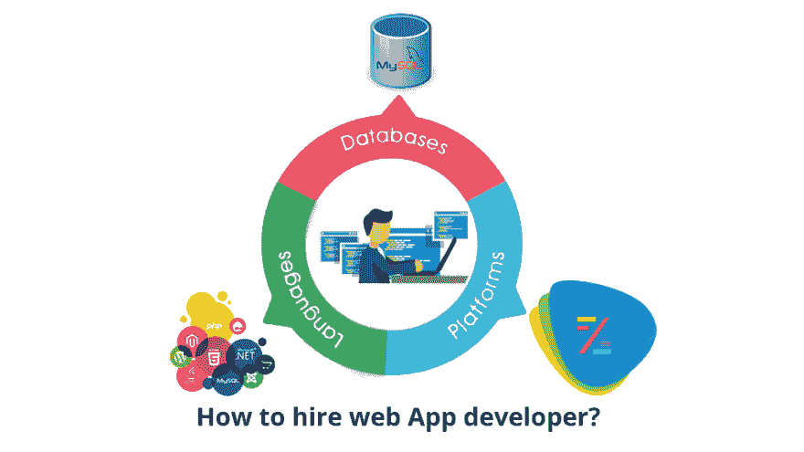

# 如何雇佣一个 Web 应用开发人员？

> 原文：<https://dev.to/decipherzonesoft/how-to-hire-a-web-application-developer-1ndm>

偶尔，您或您工作的组织需要软件应用程序来自动化工作，以提高生产率，但您可能不知道在哪里可以找到软件开发人员，但本文将启发您这个话题。软件开发包括独立软件应用程序、Web 应用程序和移动应用程序，其中 Web 应用程序开发是最流行的趋势，正在取代独立软件应用程序开发。

Web 应用程序开发是首选，因为软件通过 web 呈现在最终用户的屏幕上，这使其平台独立，配置有低端硬件的最终用户系统也可以轻松运行此 web 应用程序。

一个人可以找到来自多个平台的软件开发人员，但是他/她首先需要知道有多少类型的开发人员，以及他们应该雇佣谁来解决他们的问题。

点击此处阅读全文: