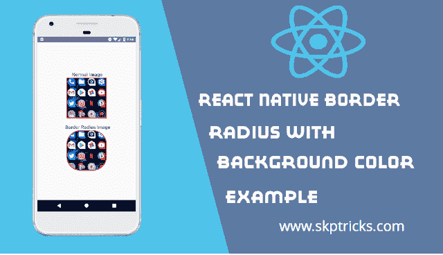

# 用背景色反应自然边框半径示例

> 原文：<https://dev.to/skptricks/react-native-border-radius-with-background-color-example-15g7>

帖子链接:[用背景色反应原生边框半径示例](https://www.skptricks.com/2019/04/react-native-border-radius-with-background-color-example.html)

本教程解释了如何在 react 本地应用程序的图像组件中添加边框半径和背景色。如果你还记得一个月前我们在 React Native 上分享了展示图片边框的演示，同样的，我们在这里也要实现设置图片边框半径。让我们开始吧。

在 react 本地组件中设置边框:
使用下面的 CSS 属性，你可以在 React 本地组件中设置边框宽度和颜色。
borderWidth:这将设置边框宽度。
borderColor:这将设置边框颜色。

在 react 原生组件中设置边框半径:
使用下面的 CSS 属性，您可以在 React 原生应用程序中设置图像周围的边框半径。
borderColor: '#F44336 '，//在此设置边框十六进制颜色代码。
borderRadius: 10 //设置边框半径。

[用背景色反应自然边框半径示例](https://www.skptricks.com/2019/04/react-native-border-radius-with-background-color-example.html)

[继续阅读...](https://www.skptricks.com/2019/04/react-native-border-radius-with-background-color-example.html)