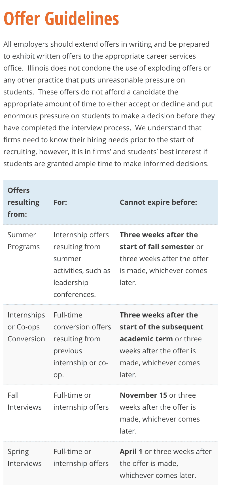

# 如何选择计算机科学课程

> 原文：<https://dev.to/flaque/how-to-pick-a-computer-science-program-278m>

# 你 18 岁了，正在做出人生中最大的购买决定

大学是一个怪异的概念。一方面，你应该选择一个能让你成为更好、更全面的人的地方。

另一方面，你在支付一个家的费用。

相对于 20 万英镑的债务，你获得的所有生存利益都变得相当多余。

以下是挑选一个好的 CS 项目的实用指南。对于那些知道自己想进入计算机科学领域，但在整个过程中无人指导的学生来说，这是一份清单。

大多数学生都有一个“斯坦福然后其他一切”的概念性想法。大部分学生不会去斯坦福或者其他什么大牌学校；这使得很大一部分高中生试图通过像美国新闻大学排名这样毫无意义的指标来“猜测”一个项目的有效性。

去他妈的。

这个指南是一个冷酷的实用指南，告诉你如何找到一个好的项目，包括*可操作的*和*可研究的*步骤。当你申请学校或者买了一栋你不想住的房子时，把它作为一个清单。一所学校并不需要所有这些，但一个都没有是一所学校应该避免的标志。

# TL；DR:清单

*   大学有没有保护你免受爆炸式录取？
*   学校定期举办有科技公司参加的招聘会吗？
*   大学有面试的课程吗？
*   学校有“寝室”投资机会吗？(反向资本，DormroomFund，roughdraft.vc，学校赞助)。
*   学校能接触到黑客马拉松吗？
*   学校有技术中心吗？

## 大学有没有保护你不被爆款录取？

一份爆炸性的工作邀请是指雇主带着一份工作邀请来到你面前，但你必须非常迅速地做出决定。比如，在今天结束前下定决心。

为计算机科学和计算机工程毕业生提供合法职业机会的大学有政策反对爆炸性的报价。如果一家公司给了一个学生一个爆炸性的报价，他们可以向大学报告，该公司被禁止招聘。

如果一所大学没有政策，T2，这是一个很好的迹象，表明他们正在努力给学校带来工作机会。如果你看到这个，就保释。

一所大学保护你免受爆炸式录取并不是非常重要；但对于一所对公司有吸引力的学校和一所没有吸引力的学校来说，这是一个很好的试金石。

### 如何发现

在谷歌中尝试以下搜索查询:

```
{COLLEGE I WANT} exploding offer
{COLLEGE I WANT} offer guidelines
{COLLEGE I WANT} employer guidelines
{COLLEGE I WANT} internship guidelines 
```

Enter fullscreen mode Exit fullscreen mode

如果他们没有可用的，复制/粘贴此电子邮件并将其发送到他们的职业中心:

```
Hi!

I'm a prospective student doing research on your university. 
I was wondering if you have any policies against exploding 
offers or other unreasonable pressure for computer science 
students.

Thanks! 
```

Enter fullscreen mode Exit fullscreen mode

### 层

#### 真好

录用指导方针给了几个月的时间在秋季做出实习决定。

#### 好

提供指导方针给实习和全职提供至少 3 周的时间。

#### 好的

要约准则只保护实习。

### 例如:伊利诺伊大学

伊利诺伊大学工程系有一个项目是这样的:

[](https://res.cloudinary.com/practicaldev/image/fetch/s--oW_sKMGT--/c_limit%2Cf_auto%2Cfl_progressive%2Cq_auto%2Cw_880/https://thepracticaldev.s3.amazonaws.com/i/vl861bzxnv0euk12a2eq.png)

[来源](https://ecs.engineering.illinois.edu/career-resources/offer-guidelines/)

## 你听说过的科技公司会定期参加学校举办的招聘会吗？

这是你获得就业机会的主要途径。如果大学没有公司来参加他们的招聘会，那事情就非常不对劲了。

许多公司只通过这些招聘会招聘大学毕业生，所以如果你去一个没有真正招聘会的学校，你就要支付 20 万英镑，从而减少 T2 获得工作的机会。

### 提问

公司需要付费吗？许多大学*向参加招聘会的公司收取费用。这是一个信号，表明这所大学有太多的公司想去 T4，所以他们不得不限制它。如果招聘会是免费的，大学就缺申请人。*

大学有 CS 专场招聘会吗？一些学校如此受欢迎，以至于他们把计算机科学搬到了自己的展览会上。这主要发生在较大的学校，但也发生在中型学校。

**参加的公司都是旅游吗？**如果一家公司不得不前往交易会，他们*真的*想在这里招人。这也意味着该公司提供支付其他地方住房的实习机会，这通常是高薪和高质量实习的标志。能够负担得起住房的公司通常能够支付更高的工资。

### 例如:圣何塞州立大学

[](https://res.cloudinary.com/practicaldev/image/fetch/s--aBwLKnyL--/c_limit%2Cf_auto%2Cfl_progressive%2Cq_auto%2Cw_880/https://thepracticaldev.s3.amazonaws.com/i/lggcu5fu4lb5isbndqkd.png) 
[来源](http://www.sjsu.edu/careercenter/employers/job-internship-fairs/index.html)

## 学校有面试的课程设置吗？

当你去面试工作时，你会被要求解决编码难题，通常是在有时间限制和压力的情况下。这种做法将来可能会改变，但这是非常普遍的。

任何一所名副其实的大学都开设了一门课程，为学生做好这方面的准备。

如果一个学校没有*没有*这门课，说明他们的 CS 部门*与行业*极度脱节或者不适应。这是一面红旗；如果你看不到这个，保释。

### 如何发现

在谷歌中尝试以下搜索查询:

```
{COLLEGE I WANT} interviewing cs course
{COLLEGE I WANT} technical interviews cs 
```

Enter fullscreen mode Exit fullscreen mode

如果他们没有可用的，复制/粘贴这封邮件，并将其发送给学校的计算机科学教授或他们的招生办:

```
Hi!

I'm a prospective student doing research on your university. 
Do you have a course dedicated to passing technical interviews as a computer science major?

Thanks! 
```

Enter fullscreen mode Exit fullscreen mode

### 例如:博伊西州立大学

> CS-HU 390 技术面试、工作和职业生涯(1-0-1)(F)。让学生为计算机科学技术面试做准备。展示如何将课堂上获得的知识用于解决新问题。鼓励团队合作和同伴反馈。学习如何谈判工作和管理职业发展。孵化单元(HU)课程是为计算机科学开发特定专业技能的短期课程。(通过/失败)先决条件:CS-HU 130，CS 253，CS 321。

[来源](https://registrar.boisestate.edu/undergraduate/course-catalog/cs-hu/)

## 学生有获得投资和资本的渠道吗？

很多技术都是由风险资本家资助的:专门投资小型创业公司的投资公司。有很多投资公司只对大学生创办的公司进行小额投资。

一些例子是:

*   [相反资本](https://contrarycap.com/team)
*   [宿舍基金](https://www.dormroomfund.com/team)
*   [草图 VC](http://www.roughdraft.vc/)

许多大学对此都有自己的版本。一些会给学生提供 N 千美元作为补助金的一部分。

即使你不想创业，拥有这些机会对 T2 来说也是非常宝贵的。也许*你*没有开始什么，但是莎莉开始了，现在她正帮你找一份甜蜜的工作。

从一所大学起步的公司经常回过头来从那所大学招聘员工。这为你创造了一个机会网络，即使你不会成为下一个脸书。

此外，拥有外部资金意味着某个地方的某个市场已经有效地“买入”了这所学校及其项目。这些投资者可能比你我做得更好，所以在这里接受他们的暗示是合理的。

### 如何发现

你可以去三大大学基金网站，尽管很多网站只有名牌学校才有。

另一种方法是给他们的招生部门发电子邮件

```
Hi!

I'm a prospective student doing research on your university. 
Have any tech companies been founded by your students while they were 
students here? If so, how did they get initial funding? Are there 
grants or other services that the university provides to CS students?

Thanks! 
```

Enter fullscreen mode Exit fullscreen mode

对那些只为商科专业学生提供资金的地方持怀疑态度。

### 例如:马里兰大学

UMD 可以获得相反的资本，Oculus Rift 就诞生在这里。像 [FiscalNote](https://fiscalnote.com/) 这样不太知名的公司，以及像 Digene 和 Martek Biosciences 这样的生物科学公司也从这个项目中脱颖而出。

## 大学是否可以接触到科技领域？

最好是，这是三大技术场景之一:

*   旧金山和海湾地区(迄今为止最大的)
*   纽约
*   西雅图

但不一定非要这样。你想要一个当地公司有兴趣雇佣当地人的地方。在这里，你无需离开校园就可以找到兼职合作工作或暑期实习。

很多城市都有科技场景，但规模并不能保证什么。以博伊西和斯波坎为例。

博伊西目前的人口是 22.6 万，斯波坎是 21.7 万。它们的规模差不多，都有几所大学，但只有一所大学有科技领域。

博伊西的主要特色之一是像惠普和美光这样的“关键石头”公司的存在。这些公司把主要办公室设在镇上，这吸引了许多技术工人。过了一段时间，这些技术工人离开并创办了自己的公司。其中一些形成了中型企业和小型初创企业。

### 如何发现

看学校的时候，搜索该地区的科技公司。如果你只看到较小或中等规模的地方，要持怀疑态度。你想让一家大公司投入资源在那里建一个办公室。那些大公司比你投资更多，而且经常对那里的市场做更多的研究。

## 学校有权限参加黑客马拉松吗？

黑客马拉松是许多程序员去大学校园，连续 24 小时编程，然后可能赢得现金的地方。它们可能适合你，也可能不适合你，但不可否认的是，接触它们是有效的。

许多学生从黑客马拉松中获得工作。当你经常没有太多东西要写的时候，赢得一个是一个简历项目。它们是认识其他聪明的程序员和探索新技术的机会。

即使你从不参加黑客马拉松，你仍然会受益。*做*去的人会为你建立关系网，成为你获得工作机会的第二或第三个联系人。

### 提问

*   这所大学举办黑客马拉松吗？
*   如果不是，是在当地吗？
*   如果没有，是否赞助学生去？
*   如果没有，学生是否在寻找其他出路？

# 总结

总的来说，你要找的学校是:

*   对科技行业有着深刻的理解
*   支持学生进入科技行业
*   成功地让名学生进入科技行业

这些应该是你的*基线*目标。大学、教授和校园的感觉是很好的打破僵局的方式。

但是它们结霜了。

如果你要支付房子的费用，确保你最终有一份工作。