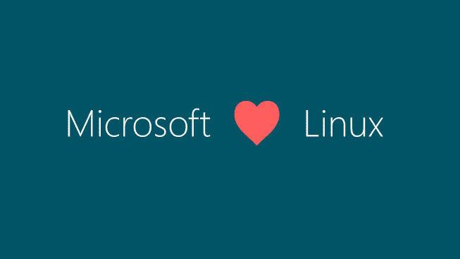
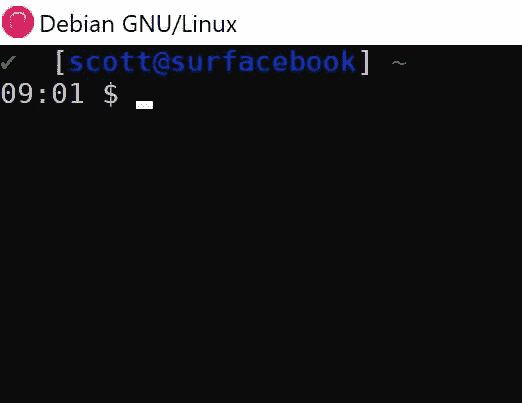
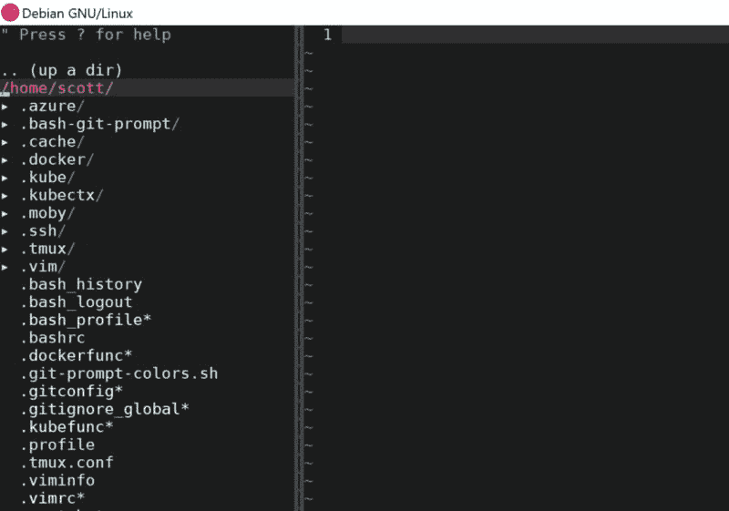
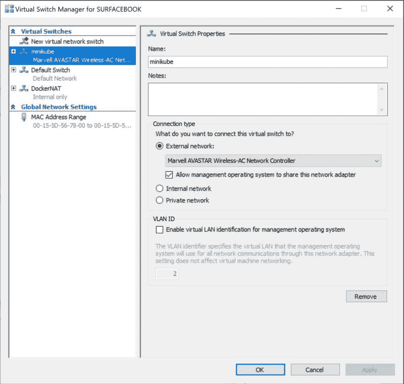
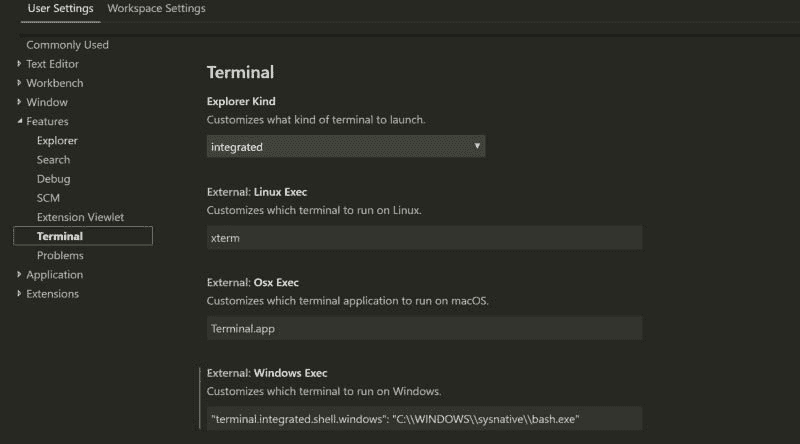

# 一个 Linux 家伙的 Windows

> 原文：<https://dev.to/azure/windows-for-a-linux-guy-390p>

[](https://res.cloudinary.com/practicaldev/image/fetch/s--9KZeY2nX--/c_limit%2Cf_auto%2Cfl_progressive%2Cq_auto%2Cw_880/https://cdn-images-1.medium.com/max/800/1%2AFJxoGsG4ZjsPhcfg9qFwjQ.png)

我最近去了微软工作，得到了一个笔记本电脑的选择。我决定走 Surfacebook 路线，因为改变就像度假一样好，而且我之前有一台戴尔 xps。作为一个 Linux 的家伙(Debian 选择的操作系统),我做的第一件事就是双启动它。一切正常运行，没有任何问题，这太棒了。然后我开始查看 WSL，我注意到有一个 Debian 的扩展安装。我开始想知道我能让它多接近我的原生 Linux 设置？

给你我的 Linux 设置的背景，我运行 [i3wm](https://i3wm.org/) ，我运行 vscode 用于 golang 开发，我仍然喜欢 vim 用于其他一切，golang 如上所述，azure cli，docker，minikube 和最后但并非最不重要的我的 git bash 提示符。如果我把这些都搞定了，我会很开心的。由于这将是一篇长文，我不打算安装 git 等，因为你只需使用`apt-get`就可以了。

在我们开始之前，有一个免责声明。如前所述，我不是 Windows 专家。因此，如果你是一个 Windows 专家，正在阅读这篇文章，你会发现一些错误或者可以做得更好。只要在 Twitter 上联系我，我会更新帖子，并对你的帮助给予奖励。

如果你是 WSL 的新手，请阅读这里的文档,它将帮助你入门。如前所述，我用的是 Debian，但我假设这个设置也能和 Ubuntu 一起工作。

现在我们开始吧。我清单上的第一件事是 i3wm，我喜欢 i3 的原因是它完全基于键盘，使用终端时超级高效。现在我发现你可以通过安装一个 x 服务器并把它转发到 Windows 端的一个客户端来让它在 WSL 上工作。我发现这对于我所需要的来说有点笨拙，所以我决定用 [tmux](https://github.com/tmux/tmux/wiki) ，因为我真正需要的是能够操纵终端面板。我发现了一个非常好的用于 tmux 的[包管理器](https://github.com/tmux-plugins/tpm)，它可以让你获得一些非常酷的特性，而不需要大量的`.tmux.conf`你可以在这里找到可用的插件列表。我的`.tmux.conf`长这样

```
# list of plugins
set -g @plugin 'tmux-plugins/tpm'
set -g @plugin 'tmux-plugins/tmux-sensible'
set -g @plugin 'tmux-plugins/tmux-online-status'
set -g @plugin 'tmux-plugins/tmux-yank'
set -g @plugin 'tmux-plugins/tmux-pain-control'

# status bar
set -g status-bg red
set -g status-fg white
​
# online check
set -g status-right "Online: #{online_status} | %a %h-%d %H:%M "
​
# Initialize TMUX plugin manager (keep this line at the very bottom of tmux.conf)
run -b '~/.tmux/plugins/tpm/tpm'
​
# mouse stuff
set -g mouse on
set-window-option -g mouse on 
```

正如你所看到的，它非常短，给了我操纵终端面板的权力，我可以用 vim 键进行复制和粘贴。赢了！除了您会注意到在线状态的右侧没有显示勾选标记。这是因为默认字体`consolas`没有我们需要的字符。所以我们将需要安装一个新的字体，我选择了使用`DejaVu Sans Mono`，所以你需要做的就是下载并在 Windows 操作系统上安装字体，然后右键单击 WSL 顶栏，选择`Defaults`，字体并将终端的字体改为使用`DejaVa Sans Mono`。然后问题被修复，终端现在看起来更像一个本地 Linux 终端。如果你想让 tmux 在 WSL 打开时自动启动，把它添加到你的`.bashrc`

`if [ "$TMUX" = ""]; then tmux -u; fi`

下一辆出租车是码头工。现在您可以让 Docker 在 WSL 中本地运行。要做到这一点，我们只需要做几件事。首先，安装 Docker for windows ( [说明，此处为](https://docs.docker.com/docker-for-windows/install/))当我们在 WSL 终端时，我们需要将以下内容添加到我们的`.bashrc`

`alias docker='docker.exe'`

现在，如果我们回到 WSL 终端并输入`docker ps`,它应该可以正常工作了。如果没有，确保你`source .bashrc`我们在这里做的是别名`docker.exe`二进制文件到 docker，这将使设置感觉更像一个 Docker 的本地 Linux 安装。这已经从我的原始帖子更新，在那里我们通过一个非加密的`tcp`端口转发 Docker 守护进程。这种新方式更安全。

接下来是 Azure cli，非常简单，按照 Debian 的说明[这里](https://docs.microsoft.com/en-us/cli/azure/install-azure-cli-apt?view=azure-cli-latest?WT.mc_id=wsl-dev.to-sccoulto)。然后从终端运行`az login`让您启动并运行。

然后，我们将按照下面的指令在 Debian 终端中安装 [kubectl](https://kubernetes.io/docs/tasks/tools/install-kubectl/#install-kubectl) 。

下一个工具是我最近才发现的，但它非常有用，如果你以前没有使用过它，我建议你检查一下，它基本上是一个管理你的 Kubernetes 集群凭证的工具。要安装，请访问这里的 Github 页面，并遵循 [bash](https://github.com/ahmetb/kubectx#linux) 的安装方法。我们将暂时搁置它，但稍后再回来，我们将在 bash 函数中使用`kubectx`,让一切无缝运行。

这个难题的最后一个简单部分是 bash git 提示符。我喜欢这个[https://github.com/magicmonty/bash-git-prompt](https://github.com/magicmonty/bash-git-prompt)，这是个人的选择，但是现在我们已经安装了新的字体，一切都可以工作了。

[](https://res.cloudinary.com/practicaldev/image/fetch/s--QtSssTzX--/c_limit%2Cf_auto%2Cfl_progressive%2Cq_auto%2Cw_880/https://cdn-images-1.medium.com/max/800/1%2AXKZlNT4owgPfwlCoYSO1LQ.jpeg)

Vim 也很容易安装，我喜欢添加一些调整，安装[病原体](https://github.com/tpope/vim-pathogen)和[神经树](https://github.com/scrooloose/nerdtree)。然后我们会得到类似下图的东西。

[](https://res.cloudinary.com/practicaldev/image/fetch/s--JjjXByef--/c_limit%2Cf_auto%2Cfl_progressive%2Cq_auto%2Cw_880/https://cdn-images-1.medium.com/max/800/1%2Aw4vPr4rc-C3dCOBR6aXBBw.jpeg)

现在，我们将进入更具挑战性的应用程序，首先我们将解决 minikube。现在安装 minikube 并让它在 Windows 上工作并不难，从 WSL 访问它也不难。我有一个工作流，允许我用一个命令在 Azure 或 minikube 上运行集群。我想复制那个工作流程。因此，实现这一点的两个最大障碍是你有两个`kubectl`的安装，一个在 Windows 操作系统上，另一个在 Debian 端。第二个问题是，由于使用 hyper-v，minikube 需要以管理员权限启动。因此，让我们来看一下这个解决方案。

我做的第一件事是在 hyper-v 中创建了一个名为 minikube 的默认开关。这可以在 hyper-v 管理器中完成，单击`virtual switch manager`，然后创建一个名为 minikube 的新交换机，这是一个外部交换机。

[](https://res.cloudinary.com/practicaldev/image/fetch/s--i4uEX_34--/c_limit%2Cf_auto%2Cfl_progressive%2Cq_auto%2Cw_880/https://cdn-images-1.medium.com/max/800/1%2Axbb4qNtLnwm0qXf8y3irxg.jpeg)

要安装 minikube，请使用 chocolatey 按照这里的说明进行操作。现在我们已经把所有的管道都安装好了。然后我们需要以管理员身份打开 WSL，否则如前所述，我们无法执行 hyper-v 命令。为此，我只需点击 WSL 图标并使用`run as adminstrator`(我知道我需要找到一种更好的方法来做到这一点)现在让我们添加一些 bash 别名。在 Linux 中调用结尾带有`.exe`的二进制文件感觉不太自然，所以第一个 bash 别名将仅仅是带有`minikube`的`minikube.exe`二进制文件的别名，就像这样`alias minikube='minikube.exe`这是当你在终端中手动输入命令时使用的。其次，您可能希望 bash 自动完成功能非常方便。将此添加到您的`.bashrc`
`source <(minikube.exe completion bash)>`

好了，现在让 alias 创建我们的 minikube 节点。我创建了一个名为`~/.kubefunc`的文件，我从我的`~/.bash_profile`中获取它，这是个人的选择，但我认为它保持了事物的整洁并易于更新。下面是运行集群的代码。

```
 #!/bin/bash
minikube_docker () {
minikube.exe start --memory=8192 --cpus=4 \
  --vm-driver=hyperv \
  --hyperv-virtual-switch=minikube \
  --kubernetes-version=v1.13.0 \
  --bootstrapper=kubeadm \
  --extra-config=apiserver.enable-admission-plugins="LimitRanger,NamespaceExists,NamespaceLifecycle,ResourceQuota,ServiceAccount,DefaultStorageClass,MutatingAdmissionWebhook"
kubectl config set-cluster minikube --server=https://$(minikube.exe ip):8443 --certificate-authority=/mnt/c/Users/sccoulto/.minikube/ca.crt
kubectl config set-context minikube --cluster=minikube --user=minikube
kubectl config set-credentials minikube --client-certificate=/mnt/c/Users/sccoulto/.minikube/client.crt --client-key=/mnt/c/Users/sccoulto/.minikube/client.key
kubectx minikube 
```

现在我们来分解一下。因此，该函数被称为`minikube_docker`(我也有一个 containerd)我们用 cpu 和内存启动服务器，使用 hyper-v 作为虚拟机驱动程序，参考我们之前创建的 hyper-v 开关，选择 kubernetes 版本，使用 kubeadm 引导集群，下一位是我传递给 kubelet 的额外配置，以便能够测试 Kubernetes 上的其他应用程序，如 istio 或 knative。最后四行我从 Windows 操作系统内部获取集群凭据，并将它们传递给本地 WSL `kubectl`，然后设置当前上下文以使用`minkube`和`kubectx`，现在我们已经准备好启动我们的集群。正如我前面提到的，我从我的`.bash_profile`中获取了`.kubefunc`文件，所以对我来说，它是`source ~/.bash_profile`，然后运行`minikube_docker`，等待几分钟，你将拥有一个工作集群。要测试这一点，只需从 WSL 内部运行`kubectl get nodes`。不要忘记，如果从上面复制和粘贴代码，以改变 sccoulto 到您的用户名。作为清理任务，我们需要做的最后一件事是创建另一个函数来删除集群，并将其从我们的`kubectl`配置中清除。

```
minikube_delete () {
minikube delete
kubectx -d minikube
} 
```

`minikube delete`将清理 Windows OS 端，`kubectx -d minikube`清理我们的 WSL Debian OS。

现在，我们已经讨论了很多内容，最后一件要讨论的事情是设置我们的 Go 环境。因此，为了能够使用 vscode，我们将按照常规在 Windows 上安装它。然后，我们将按照这里的说明[将 go 安装到 windows 操作系统上](https://code.visualstudio.com/docs/setup/windows)，但我们将更改一些东西，如`GOPATH`，这样我们就可以在一个我们可以从 Windows 操作系统和 WSL 访问它的地方安装它。我在我的主目录`Documents\Development\go`中创建了它，但是你可以在你的主目录的任何地方使用它。我们需要将环境变量添加到 Windows 操作系统的用户变量下。一个用于`GOPATH`，然后指向你刚刚创建的 go 文件夹。然后将新 go 文件夹中的`bin`目录添加到路径中。

然后我们在 WSL 上安装 go，只需遵循这里的普通 Linux 指令。然后，我们将以下内容添加到我们的`~/.bash_profile`

```
# golang
export GOROOT=/usr/local/go
export GOBIN=/mnt/c/Users/sccoulto/Documents/Development/go/bin
export GOPATH=/mnt/c/Users/sccoulto/Documents/Development/go
export PATH="$PATH:/usr/local/go/bin:/mnt/c/Users/sccoulto/Documents/Development/go/bin" 
```

现在，我们将两个安装指向相同的文件夹。现在是我们在 vscode 中的最后一个设置。我想在 vscode 中使用 WSL 终端，所以我需要将用户设置下的默认终端更改为`bash.exe`

[](https://res.cloudinary.com/practicaldev/image/fetch/s--bTrLVIA1--/c_limit%2Cf_auto%2Cfl_progressive%2Cq_auto%2Cw_880/https://cdn-images-1.medium.com/max/800/1%2AIGDQf06HVPEApN5u4xuNKw.jpeg)

现在我们完成了，所以我认为我们已经非常接近 Windows 上的原生 Linux 了。在这个过程中你会遇到一些困难，它比原生 Linux 要慢一些。但是如果你是一个想学习 Linux 的 Windows 工程师，或者是一个拥有 Windows 笔记本电脑的 Linux 爱好者，这是一个非常可靠的解决方案。至于两周后的 surface book，我很满意，键盘和屏幕都很棒。

最后一句话，向所有在 WSL 项目上工作的人大声欢呼。非常棒的作品！！！也感谢这篇文章中提到的所有其他开源开发者。非常感谢你的辛勤工作