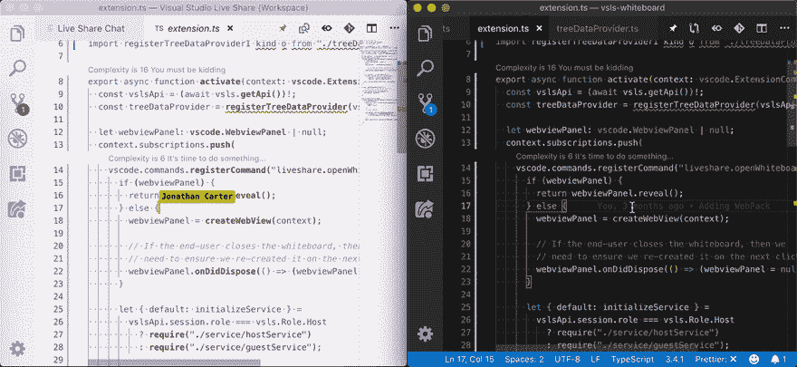
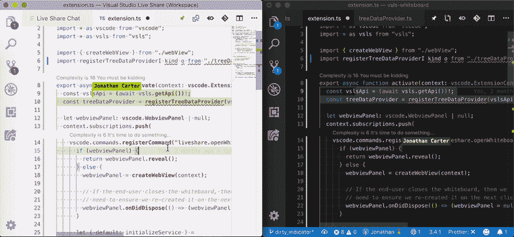
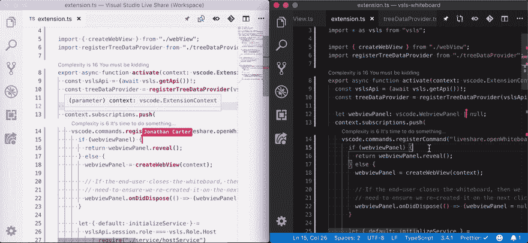
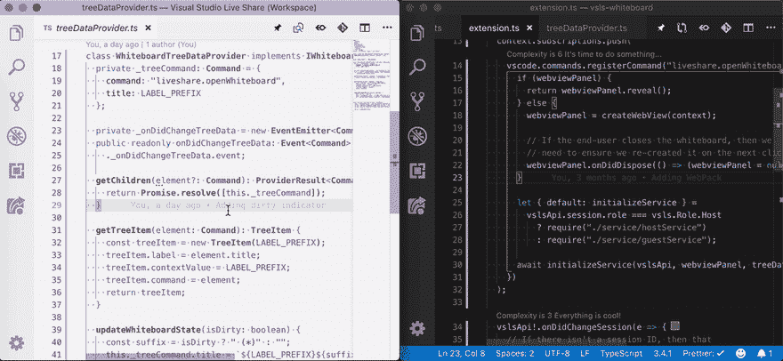
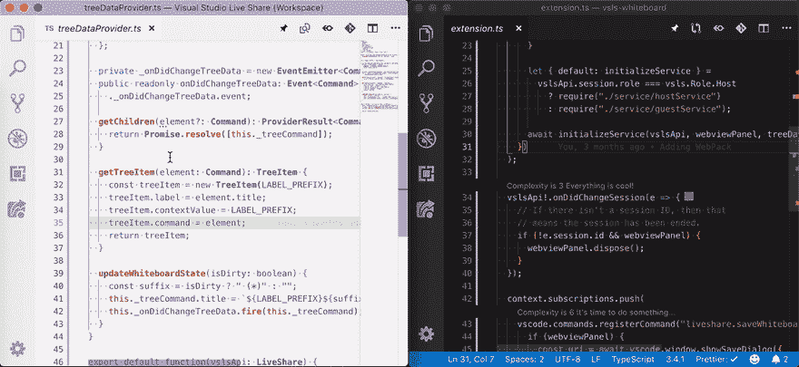

# 协作不会“一刀切”

> 原文：<https://dev.to/lostintangent/collaboration-doesn-t-come-in-one-size-fits-all-33ai>

与软件中的许多问题一样，对于“协作的最佳方式是什么？”是...看情况。诸如情境背景、个人偏好和团队动力等因素可能会有很大差异(这没关系！)，所以很难想象有单一的“正确方法”来做这件事。协作应该让人感觉**高效**和 **[愉快](https://dev.to/lostintangent/visual-studio-live-share-in-pursuit-of-enjoyable-developer-collaboration-2nko)** ，所以如果你的个人经历没有反映出这些品质中的*或*，那么可能值得重新考虑你正在使用的工具和/或流程。

> @ dhh结对编程是一种美好的实践，我尊重那些日复一日都能做到的人。但是如果我不得不一直做程序员，我就不想做了。我不仅需要长时间不受打扰的时间，还需要彻底的独处来茁壮成长。2018 年 7 月 19:08PM-09

当我们开始构建 [Visual Studio Live Share](https://aka.ms/vsls) 时，我们观察到的最基本的事情之一是对协作工具的兴趣，这些工具不*强加*特定的交互模型，而是允许您为每个任务选择最合适的，更重要的是**自然形态**。虽然屏幕共享在许多情况下都很棒，但它并不适合所有类型的协作开发，特别是因为一个原因:参与者天生就**精神耦合**，除了主持人之外的每个人都充当着**被动观察者**，如果不请求许可或打断团队，他们甚至不能执行简单的操作(例如，悬停在 API 上查看其描述)。

> 国际空间站@ intlspace[@ erinfoox](https://twitter.com/erinfoox)在 vs 代码直播分享中，在同一个分支上做不同的事情，你们不应该互相监视，除非你们中的一个被卡住了。否则，以我的经验来看，一个人最终会变得非常被动。2019 年 12 月 18 日上午 04:00

这种体验有时会让人觉得很受限制(例如原型制作、黑客马拉松)，而且不一定能提高您在教育环境中可能想要的参与度(例如课堂讲座、辅导课)。所以我们思考:如果我们能够**分离协作**，并把他们的键盘还给每个开发人员，而不牺牲屏幕共享提供的好处(这并不都是坏事！)?如果我们能够为远程和同处一地的团队提供允许同步和独立工作的体验，那么也许，仅仅是也许，我们可以适应[协作用例](https://aka.ms/vsls-usecases)的广阔前景，而不需要任何人来解决。让我举例说明这是什么样子。

液体错误:内部

## 跟随领导

当你加入某人的实时分享会话时，你最初是通过[“关注”](https://docs.microsoft.com/en-us/visualstudio/liveshare/use/vscode#following)他们开始的，这有三个副作用:

1.  他们正在编辑的文件将在您的 IDE 中自动打开

2.  当它们在文件中滚动时，您视口也会自动滚动

3.  当他们导航到其他文件时，目标文件也会在您的终端自动打开

这种行为允许您实现与“主机”的*共享焦点*，并在他们围绕代码库移动时保持该焦点。在加入会话时，我们会自动将您置于“关注模式”，因为大多数协作会话都是以相同的方式开始的:主持人需要解释有问题的代码(例如，描述他们寻求帮助的 bug，向您介绍自上次配对以来他们所做的工作)。这样，您只需点击一个实时共享链接，就可以立即获得开始使用所需的上下文。不错！

<figure>

<figcaption>A Live Share guest (left) following the host (right) as they scroll and navigate files</figcaption>

</figure>

就其本身而言，“关注模式”实际上相当于一个屏幕共享，但有一个额外的好处是**保留你的个性化环境**，而不是盯着别人的。这本身就很有价值，但我们需要做得更好，因为正如我提到的，我们希望防止客人仅限于“被动的观察者”。这就是事情开始变得有趣的地方。

在任何时候，您都可以开始编辑宿主所在的文件，当您键入时，您将收到您所期望的自动完成。此外，您可以悬停在 API 上和/或查看它们的定义，并再次获得您期望的语言支持。然而，在这两种情况下，您的完成列表或查看窗口都不会出现在主机的屏幕上。这提供了一种屏幕共享无法提供的体验，在这种体验中，您可以同时跟随主持人，并独立地做出贡献，**而不会在此过程中相互打断**。这是共享资源(例如文件内容)之上真正的精神并发的开始。

<figure>

<figcaption>A Live Share guest (left) interacting with a file, without interrupting the host (right)</figcaption>

</figure>

## 下面是这么最后一段

但是，如果您需要偏离主机当前关注的内容，该怎么办？例如，您可能想要读取另一个文件中的一些代码，以便为自己提供更多的上下文。或者你可以决定和你的搭档一起分担一项任务，然后完全并行地完成它。对于屏幕共享，这是不可能的，但对于实时共享，这很简单:只需打开另一个文件。一旦你这样做了，“follow mode”就会被自动禁用，你现在可以完全自己操作了，但仍然是在一个实时同步的共享代码库的上下文中。太棒了。

一旦您完成并准备好重新关注主持人，您可以通过按下`<CTRL+F>`或在 Live Share 选项卡中单击他们的名字来再次开始关注他们。需要再次偏离它们吗？太好了！只需导航到另一个文件或点击他们的名字再次明确关闭“跟随模式”。

<figure>

<figcaption>A Live Share guest (left) seamlessly transitioning between following on independent navigation</figcaption>

</figure>

这种专注于同一件事情或独立操作的能力，提供了执行“真正的”结对编程、与同事合作完成任务、指导团队以及其他一切所需的灵活性。每个人都可以选择自己的交互风格，这可能有助于防止纯粹串行协作可能带来的“肩扛”效应和/或“配对疲劳”。但是还有更好的。

## 让我们也拥有自己的代码并吃掉它

如果您在 Live Share 选项卡中右键单击一个参与者的姓名，并选择“跟随到旁边”，将会打开一个新的编辑器选项卡，并允许您被动地观察他们，同时编辑您自己的内容。更疯狂的是:如果在实时分享会话中有多个参与者，你可以在单独的标签中关注他们，就像是某种实时协作仪表板一样。

<figure>

<figcaption>A Live Share guest (left) following the host while also editing their own file</figcaption>

</figure>

除了“跟随到侧面”手势之外，您还可以将特定编辑器标签“锁定”到用户，只需在标签池中点按相应的锁定图标即可。这样，您可以设置一个完全自定义的网格布局，并按照您想要的任何配置跟踪任意数量的参与者。

## 调用所有光标

能够在任何时间关注任何人，这为每个参与者提供了选择他们希望何时以及如何相互协作的能力。然而，有些时候你想要主动地同步每个人的注意力，如果你不得不要求每个人单独地跟随你，那将是相当令人讨厌的。为了简化这种情况，Live Share 还允许您“关注”参与者，这将自动使他们关注您。

要进行聚焦，只需切换到“实时分享”选项卡，然后单击“会议详情”视图标题栏中的小扩音器图标。默认情况下，当其他人执行焦点操作时，您会自动移动到他们的光标处，并得到通知。但是，您可以通过将“liveShare.focusBehavior”设置为“prompt”来改变这一点，这将为您提供忽略焦点请求的选择，例如，如果您正在处理某件事情，并且希望在重新召集之前完成它。

<figure>

<figcaption>A Live Share guest (left) focusing the attention of the host (right)</figcaption>

</figure>

## 我们要专注...什么是重要的

希望这说明了在决定你的团队希望如何合作时，Live Share 是多么的通融。与具有固有交互模型的工具不同，Live Share 非常灵活，允许您在主动跟随、独立探索、同时编辑和被动观察之间无缝转换。我们发现这是非常有价值的，并且可以很好地扩展到合作变化的不同领域。

> 杰基罗[@ jackiehluo](https://dev.to/jackiehluo)注:我不喜欢传统的结对编程，因为这往往意味着一个人观看，而另一个人编码，这就是为什么 vs 代码直播分享对我来说是小组编程的一大部分——每个人都积极参与！您可以处理不同但相关的文件！2019 年 4 月 15 日下午 23:30

也就是说，强大的功能带来了巨大的复杂性，因此我们计划随着时间的推移继续改进这些功能的可发现性和人体工程学。此外，除了当前的特性集之外，我们还渴望听到其他有用的模式。无论是哪种情况，请不要犹豫[联系](https://GitHub.com/microsoft/Live-Share)并让我们知道您可能有的任何反馈，以及我们如何才能确保实时分享恰当地满足您团队的需求。