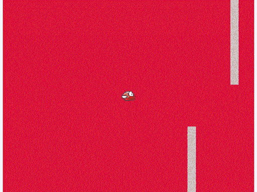

# ProGo Bird

> 原文：<https://dev.to/nsgonzalez/progo-bird-5h72>

[https://github.com/nsgonzalez/progo-bird](https://github.com/nsgonzalez/progo-bird)

ProGo Bird 是一个用 Prolog 编写的简单代理，它为 Flappy Bird 的自定义和基本版本设计了一个游戏，在这个游戏中，小鸟必须达到一个目标。这是非常基本的，它不计算它应该在线做什么动作，而是在游戏开始之前做所有的计算(通过 python 调用 swipl)，然后把要执行的动作存储在一个切片中并弹出它们，直到游戏结束。

游戏基于 Pixel 的 examples([https://github . com/fai face/Pixel-examples/tree/master/platformer](https://github.com/faiface/pixel-examples/tree/master/platformer))下的**平台**的修改版。

## 必需品

*   debian 软件包
    *   饭桶
    *   golang
    *   swi-prolog
    *   python3-pip
    *   libgl 1-主席团-dev
    *   libxccursor-dev
    *   libxrandr-dev
    *   libxinerama-发展
    *   利比西巨人
*   pip 包
    *   pyswip(重构分支)
*   OpenGL >= 3.0

###### 注:仅在 Debian 9.4 x86、Ubuntu 18.04.1 x64 和 Deepin 15.9.2 x64 下测试

##### 安装依赖项

```
$ sudo apt install -y git golang swi-prolog python3-pip libgl1-mesa-dev libxcursor-dev libxrandr-dev libxinerama-dev libxi-dev
$ wget -O pyswip.zip https://github.com/yuce/pyswip/archive/refactor.zip
$ unzip pyswip.zip
$ cd pyswip-refactor
$ python3 setup.py install --user 
```

## 工作原理

当游戏开始时，鸟在(0，0)处，我们需要它到达位于(X，Y)处半径为 r 的目标。游戏运行的循环速度是 60fps，因此为了使它工作，它乘以一个因子，该因子被传递给代理程序，以便它根据该因子从点(0，0)开始计算应该进行哪些移动。然后，乘法的结果给我们代理执行动作的 fps。例如，如果因子为 0.5，则结果为 30，代理将计算每 30fps(大约 0.5 秒)应执行的操作。

我找不到任何实现 prolog 解释器的 go 库，也无法获得成功的结果，所以在游戏循环开始之前，通过 tcp 套接字对实现 pyswip(python 的 swipl 库)的 python 脚本进行一些调用，并回读它应该执行的操作，以玩一个成功的游戏。

## 运行

克隆存储库，安装 go 依赖项并运行程序。

```
$ git clone https://github.com/nsgonzalez/progo-bird.git
$ cd progo-bird
$ go get ./...
$ go run *.go 
```

[](https://res.cloudinary.com/practicaldev/image/fetch/s--aVxhpeVe--/c_limit%2Cf_auto%2Cfl_progressive%2Cq_66%2Cw_880/https://thepracticaldev.s3.amazonaws.com/i/1ctkmvajxe9upiro69mn.gif)

#### 成功的游戏

在这种奇怪的实现下被证明是成功的游戏如下，它们都需要修改**参数。**

##### 游戏 1 - 30fps

```
TIME_AGENT_FACTOR = 0.5
START_AGENT_FACTOR = 4
PLATFORM_MARGIN_H  = 18
PLATFORM_MARGIN_V  = 0
PLATFORM_TB_MARGIN = 0 
```

##### 游戏 2 - 24fps

```
TIME_AGENT_FACTOR = 0.40
START_AGENT_FACTOR = 4
PLATFORM_MARGIN_H  = 10
PLATFORM_MARGIN_V  = 0
PLATFORM_TB_MARGIN = 0 
```

##### 游戏 3 - 18fps

```
TIME_AGENT_FACTOR = 0.30
START_AGENT_FACTOR = 5
PLATFORM_MARGIN_H  = 10
PLATFORM_MARGIN_V  = 0
PLATFORM_TB_MARGIN = 0 
```

##### 游戏 4 - 15fps

```
TIME_AGENT_FACTOR = 0.25
START_AGENT_FACTOR = 4
PLATFORM_MARGIN_H  = 10
PLATFORM_MARGIN_V  = 10
PLATFORM_TB_MARGIN = 10 
```

##### 游戏 5 - 12fps

```
TIME_AGENT_FACTOR = 0.20
START_AGENT_FACTOR = 7
PLATFORM_MARGIN_H  = 0
PLATFORM_MARGIN_V  = 10
PLATFORM_TB_MARGIN = 0 
```

关于变量(实际上是常数)的一点解释:

*   **TIME_AGENT_FACTOR** 是表示时间如何离散化的因子。
*   **START_AGENT_FACTOR** 乘以 **TIME_AGENT_FACTOR** 模拟游戏开始时的坠落。
*   **PLATFORM_MARGIN_H** 和 **PLATFORM_MARGIN_V** 是平台的水平和垂直边距，因此代理不会计算离它们太近的移动。
*   **PLATFORM_TB_MARGIN** 同上，但针对顶部和底部平台。