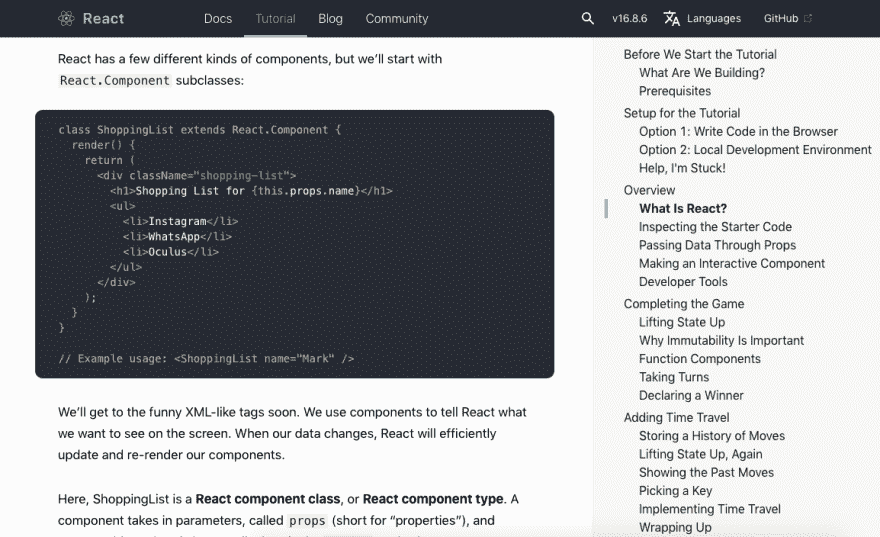
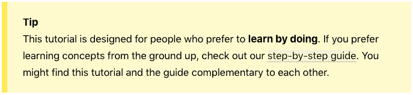
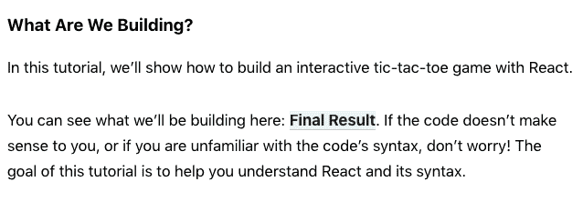
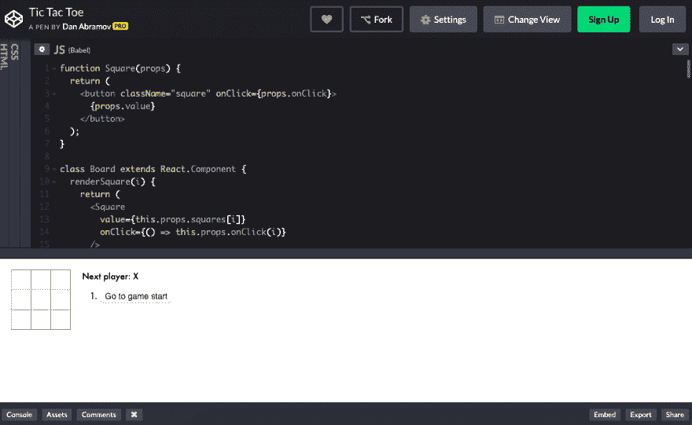
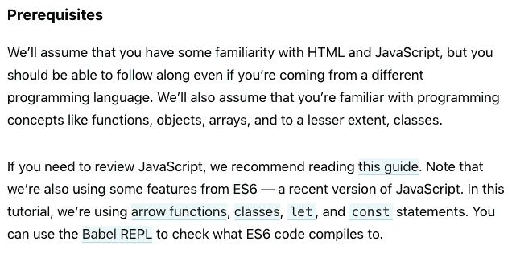
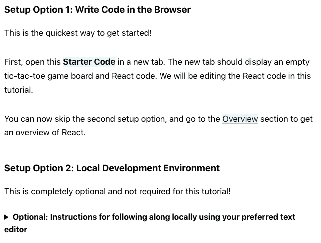
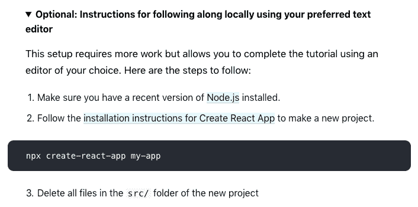
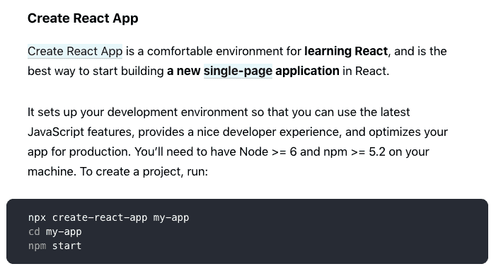
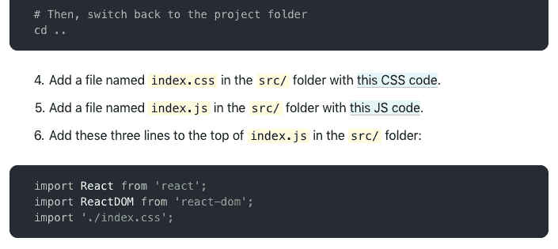
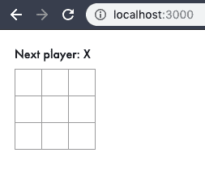

# 一个绝对的初学者学习反应

> 原文：<https://dev.to/awwsmm/an-absolute-beginner-learns-react-2j0f>

除了它是一个 JavaScript 框架和*我猜*它专注于反应式编程之外，我对 React 一无所知。我对 JavaScript 也知之甚少——我过去经常做 web 开发，但在 2012 年左右停止了。但是**我想重建我的网站**，现在每个人都在使用 JavaScript 框架，所以我认为这是一个获得一些经验的好项目。我会记录下我经历的[考验和磨难](https://www.youtube.com/watch?v=dfwQmnI6cR0)的意识流日志。希望这对于和我处于相同位置的新手来说是一个有用的资源，也许对于那些有更多经验的人来说也是一个有价值的资源——你将能够看到完全的初学者在哪里挣扎或者对 React 有误解。

## 第一步

当我在谷歌上搜索“intro to react”时，我得到了大约 2700 万个结果。前几个似乎很相关:

[](https://res.cloudinary.com/practicaldev/image/fetch/s--B9b4kLLx--/c_limit%2Cf_auto%2Cfl_progressive%2Cq_auto%2Cw_880/https://thepracticaldev.s3.amazonaws.com/i/kju04s51nvzd1fdqajms.png)

> React 是一个声明式的、高效的、灵活的 JavaScript 库，用于构建用户界面。它允许你用称为“组件”的小而孤立的代码片段组成复杂的 ui。 [(来源)](https://reactjs.org/tutorial/tutorial.html)

好吧，这看起来很有关系。让我们去那里吧——毕竟这个网站叫做*reactjs.org*...他们当然知道自己在做什么。

[](https://res.cloudinary.com/practicaldev/image/fetch/s--nmjVRCAI--/c_limit%2Cf_auto%2Cfl_progressive%2Cq_auto%2Cw_880/https://thepracticaldev.s3.amazonaws.com/i/tnp05k7ii8uio6908178.png)

好吧，这是一个很好的，干净的教程。它看起来不太长，格式也很好(有突出语法的代码片段，等等)。).我想我可以在不感到无聊的情况下解决这个问题。我们开始吧！

## ReactJS.org 教程第一印象

很快我找到了这个“提示”:

[](https://res.cloudinary.com/practicaldev/image/fetch/s--u3uaErx7--/c_limit%2Cf_auto%2Cfl_progressive%2Cq_auto%2Cw_880/https://thepracticaldev.s3.amazonaws.com/i/2s0dczpi3hjo0hfwm65t.png)

"...我更喜欢‘边做边学’吗？”我不知道。我的一部分认为我应该跳到“一步一步”指南，我可以从链接到“你好，世界！”举例。但我的一部分认为我应该坚持这个，因为我可能会厌倦另一个。让我们暂时呆在这里。

在几行之后，我开始...

[](https://res.cloudinary.com/practicaldev/image/fetch/s--_Dxl-r8l--/c_limit%2Cf_auto%2Cfl_progressive%2Cq_auto%2Cw_880/https://thepracticaldev.s3.amazonaws.com/i/iswxytx2vfi4z84ec3ur.png)

“我想看看最后的结果！”我冲向虚空，点击链接:

[](https://res.cloudinary.com/practicaldev/image/fetch/s--Oo68tZbC--/c_limit%2Cf_auto%2Cfl_progressive%2Cq_auto%2Cw_880/https://thepracticaldev.s3.amazonaws.com/i/sxaxxaz443c5lxuryafq.png)

哦，是‘密码笔’。我以前见过别人用这些，但是我从来没有用过。也许我会看到更多这样的东西，因为我正在做一些网站开发？这段代码看起来很有趣:

```
function Square(props) {
  return (
    <button className="square" onClick={props.onClick}>
      {props.value}
    </button>
  );
} 
```

Enter fullscreen mode Exit fullscreen mode

返回 HTML 标签的函数？使用程序确定的参数和内容？那绝对不是我以前见过的。这似乎很有趣。我现在真的对建造这个东西很感兴趣。让我们回到教程页面来学习如何构建它。

[](https://res.cloudinary.com/practicaldev/image/fetch/s--dlXxaoky--/c_limit%2Cf_auto%2Cfl_progressive%2Cq_auto%2Cw_880/https://thepracticaldev.s3.amazonaws.com/i/coh15d9psbwvzuz6stuh.png)

我认为我对第一段的所有内容都很满意，但第二段就不那么满意了。显然`const`语句指的是常量变量吧？我知道一般都有哪些类，但也许`classes`是不同的？箭头功能是 [lambdas](https://medium.freecodecamp.org/learn-these-4-things-and-working-with-lambda-expressions-b0ab36e0fffc) 对吧？我以前在 Java 里见过这些。也许我可以不读任何关于 ES6 的书就能通过...

* * *

哦，我无聊了，点开了一会儿 Twitter。我现在回来了。好吧，接下来呢？

[](https://res.cloudinary.com/practicaldev/image/fetch/s--a94DDSnW--/c_limit%2Cf_auto%2Cfl_progressive%2Cq_auto%2Cw_880/https://thepracticaldev.s3.amazonaws.com/i/2c3rftauzsi6oa9rbm62.png)

我讨厌做一些代码已经写好的代码教程，所以我强烈反对选项 1。相反，让我们来看看第二点:

[](https://res.cloudinary.com/practicaldev/image/fetch/s--PMs7Rst5--/c_limit%2Cf_auto%2Cfl_progressive%2Cq_auto%2Cw_880/https://thepracticaldev.s3.amazonaws.com/i/oknt9l8435ca3363ism3.png)

好的，我必须先完成所有的设置步骤。让我们安装 Node.js。这在 Mac 上真的很容易，因为教程中的[链接直接把我带到一个下载页面，在那里我下载了一个`*.pkg`文件，它作为一个安装程序运行。超级快速简单。](https://nodejs.org/en/)

我想下一步就是按照那些安装说明去做了。我需要点击链接吗？还是直接运行这个命令？不清楚。我点击链接:

[](https://res.cloudinary.com/practicaldev/image/fetch/s--aEuRcjyN--/c_limit%2Cf_auto%2Cfl_progressive%2Cq_auto%2Cw_880/https://thepracticaldev.s3.amazonaws.com/i/dxh4uz79mfj0qs5avv01.png)

看起来是一样的说明。因此，我将忽略该链接中的所有内容，只运行教程中的一个命令:

```
$ npx create-react-app my-app 
```

Enter fullscreen mode Exit fullscreen mode

...这个命令似乎运行了很长时间。也许它在做一些初始化的事情，因为这是我第一次使用 npm / React？

```
Creating a new React app in /Users/andrew/my-app.

Installing packages. This might take a couple of minutes.
Installing react, react-dom, and react-scripts...

⸨       ░░░░░░░░░░░⸩ ⠹ extract:eslint-plugin-flowtype: sill extract ... 
```

Enter fullscreen mode Exit fullscreen mode

...是的，看起来就是这样。我去喝一杯，然后回来。

* * *

下面是我回来后看到的:

```
added 1980 packages from 735 contributors and audited 36246 packages in 163.458s
found 63 low severity vulnerabilities
  run `npm audit fix` to fix them, or `npm audit` for details

Initialized a git repository.

Success! Created my-app at /Users/andrew/my-app
Inside that directory, you can run several commands:

  npm start
    Starts the development server.

  npm run build
    Bundles the app into static files for production.

  npm test
    Starts the test runner.

  npm run eject
    Removes this tool and copies build dependencies, configuration files
    and scripts into the app directory. If you do this, you can’t go back!

We suggest that you begin by typing:

  cd my-app
  npm start

Happy hacking! 
```

Enter fullscreen mode Exit fullscreen mode

关于“弱点”的那句话让我感觉不好。特别是随着[NPM 最近得到的坏消息](https://searchsecurity.techtarget.com/news/252453398/Compromised-NPM-package-highlights-open-source-trouble)。我真的需要安装*1980 个*包来运行演示应用吗？这看起来不疯狂吗？

不管怎么说，小小的“入门”菜单还是不错的。教程的下一步是删除项目的`src/`目录中的所有文件。所以我这么做:

```
$ ls my-app/src/
App.css           App.test.js       index.js          serviceWorker.js
App.js            index.css         logo.svg

$ rm my-app/src/* 
```

Enter fullscreen mode Exit fullscreen mode

继续教程，我碰到了这一节...

[](https://res.cloudinary.com/practicaldev/image/fetch/s--n_AKxGVn--/c_limit%2Cf_auto%2Cfl_progressive%2Cq_auto%2Cw_880/https://thepracticaldev.s3.amazonaws.com/i/9xox0ej0ecifgy515ha5.png)

...呃。他们还是让我复制粘贴代码。我不想那样做，这就是为什么我选择在我的机器上从头开始这个项目。也许我确实想做一个“你好，世界！”毕竟是 app。

不管怎样，我想我现在会继续这样做。我按照步骤 4、5 和 6 中的说明进行操作。我讨厌复制和粘贴代码。我觉得很脏。

我在项目文件夹中运行`npm start`,然后...什么都没发生。很长时间了。当**终端**请求访问**谷歌浏览器**的权限时，我开始担心自己做错了什么。肯定是打开 app 了！

* * *

我又等了一段难以忍受的漫长时间。

* * *

[](https://res.cloudinary.com/practicaldev/image/fetch/s--JU8Z_5y5--/c_limit%2Cf_auto%2Cfl_progressive%2Cq_auto%2Cw_880/https://thepracticaldev.s3.amazonaws.com/i/lj4prfxm9ehxz4s0tkf0.png)

哇！就在那里。我的第一个 React 应用。

* * *

这就是这篇日志的第一部分和关于 ReactJS.org 的反应教程的第一部分。下次再来看我的漫谈和抱怨吧！