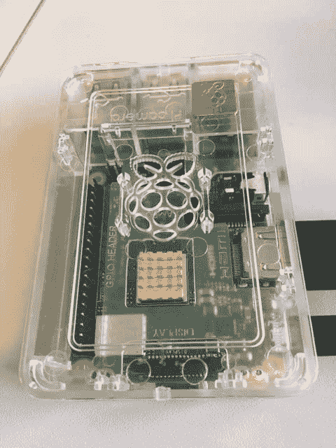

# Python 在 Raspberry Pi 上使用 VS 代码

> 原文：<https://dev.to/jimbobbennett/python-on-a-raspberry-pi-using-vs-code-2e45>

最近在玩一个树莓 Pi，目的是学习 Python。这些都是很棒的小电脑，取得了惊人的成功，截至 2018 年 3 月售出了 1900 万台，世界各地的孩子都在用它们学习用 [Scratch](https://scratch.mit.edu/) 和 Python 编程。

[](https://res.cloudinary.com/practicaldev/image/fetch/s--i0gsR3ny--/c_limit%2Cf_auto%2Cfl_progressive%2Cq_auto%2Cw_880/https://thepracticaldev.s3.amazonaws.com/i/nwzysoambe0bc94yk74j.jpg)

默认提供的 Python IDE 是空闲的。这是一个很棒的 IDE，作为标准 Python 安装的一部分——它有一个交互式 shell 和文件编辑器、调试器和您需要的一切。这已经足够好了，但是还不能与世界一流的编辑器相提并论，那就是 Visual Studio 代码。

虽然 GitHub 上有对 VS 代码的请求，但是目前还没有任何官方版本。请点击此链接并投赞成票:

[github.com/Microsoft/vscode/issues/6442](https://github.com/Microsoft/vscode/issues/6442)

然而，在杰伊·罗杰斯的帮助下，我们建立了一个社区。你可以在 code.headmelted.com 的[上找到安装说明，但是我发现由于 GPG 键](https://code.headmelted.com/)的[问题，这些说明不起作用。有变通办法！](https://github.com/headmelted/codebuilds/issues/71)

要安装 GPG 密钥，请启动终端并输入以下命令。

```
wget https://packagecloud.io/headmelted/codebuilds/gpgkey
sudo apt-key add gpgkey 
```

完成后，您就可以运行安装程序脚本了。使用以下命令进入 sudo 模式:

```
sudo -s 
```

然后运行安装程序:

```
. <( wget -O - https://code.headmelted.com/installers/apt.sh ) 
```

这将安装非 VS 品牌的代码版本。缺少 Visual Studio 品牌是有意的——代码是开源的，但徽标是微软的版权。这意味着社区构建不能使用这些图标。你可以从菜单*树莓- >编程- >代码- OSS(头端)*中启动。

v1.32 有个[问题。它将启动，但不能正常运行。修复方法是回滚到早期版本 1.29。为此，请运行以下命令:](https://github.com/headmelted/codebuilds/issues/67)

```
apt-get install code-oss=1.29.0-1539702286 
```

这将回滚到早期版本。这确实意味着如果你以后运行`apt-get update`，将会安装最新的版本，再次破坏它。要阻止这种情况发生，您可以使用以下方法锁定版本:

```
apt-mark hold code-oss 
```

一旦发布了修复程序，您可以通过以下方式移除版本锁定:

```
apt-mark unhold code-oss 
```

一旦你启动代码，你将能够安装你需要的扩展。在我的例子中，我想要 Python 扩展。

[](https://res.cloudinary.com/practicaldev/image/fetch/s--iAfvViH2--/c_limit%2Cf_auto%2Cfl_progressive%2Cq_auto%2Cw_880/https://thepracticaldev.s3.amazonaws.com/i/sxghdmte8p6bmip7c5lx.png)

稍后快速重启，我就可以在 VS 代码中运行一个完整的 Python 环境，有一个完整的调试器和所有我想要的东西！