# 如何构建一个价格合理且经过验证的空气质量传感器

> 原文：<https://dev.to/jaredwolff/homemade-particle-powered-indoor-air-quality-sensor-2ggb>

不久前，我得到了一些基于网格的碎料板。我一直渴望尝试它们，但还没有完全搞清楚这个项目。

不过有一件事一直困扰着我:空气质量。我在办公室花了大量时间修补、焊接、编码和写作。我偶尔打喷嚏，所以我总是想，有多糟糕？在炎热的几个月里，房子也容易发霉，这让我很担心。

所以为什么不做点什么呢？

**注意:**在你上手之前。这篇文章有点冗长。[点击这里查看 TDLR 版本。](https://www.jaredwolff.com/how-to-use-particle-squared-air-quality-sensor/)

## 需要什么

[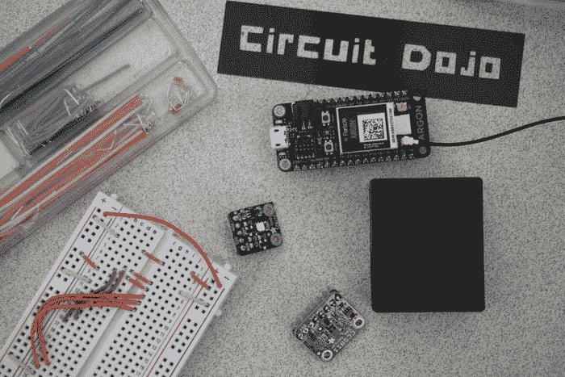](https://res.cloudinary.com/practicaldev/image/fetch/s--GptvxMA0--/c_limit%2Cf_auto%2Cfl_progressive%2Cq_auto%2Cw_880/https://www.jaredwolff.com/homemade-indoor-air-quality-sensimg/ingredients.jpg)

最重要的传感器是[霍尼韦尔 HPM 系列](https://www.honeywellscportal.com/honeywell-sensing-hpm-series-particle-sensors-datasheet-32322550-e-en.pdf) PM2.5/PM10 传感器。这告诉你有多少微克的物质漂浮在一立方体积的空间中。也就是说，它计算在你的空气中飞行的小颗粒。

其次是 [AMS CCS811](https://ams.com/documents/20143/36005/CCS811_DS000459_7-00.pdf) 。这个传感器告诉你空气中挥发性有机化合物的总量，还有像二氧化碳这样的东西。这是另一个有趣的数据点。我之前把这个传感器放在我们的地下室，结果却惊讶地发现我们的(燃油)炉子在早上打开时 VOC 和 CO2 水平出现了巨大的峰值。是时候改善通风了！

最后是 [Silicon Labs Si7021](https://www.silabs.com/documents/public/data-sheets/Si7021-A20.pdf) 温湿度传感器。这两个环境数据是有用的。更重要的是，它们被 CCS811 中的算法用来计算 TVOC 和 CO2。考虑到 CCS811 的成本，我很惊讶它没有这些测量，但也许在他们的下一个版本中..

## 把这一切连接在一起

是时候把所有东西连在一起了。至少你需要:

1.  无焊料试验板连接线
2.  无焊料试验板
3.  来自 Adafruit 的 [CCS811 分线板](https://www.adafruit.com/product/3566)([更多详情在此](https://learn.adafruit.com/adafruit-ccs811-air-quality-sensor?view=all)
4.  阿达果的一次 [Si7021 突围](https://www.adafruit.com/product/3251) ( [更多详情在此](https://learn.adafruit.com/adafruit-si7021-temperature-plus-humidity-sensor?view=all))
5.  你选择的碎料板。
6.  HPMA115 粒子传感器
7.  用于 HPMA115 的预组装 Molex 电缆(Molex 零件号 0151340803 或类似产品)
8.  一些 0.1 英寸间距的接头

我在这个项目中包含了一个 Fritzing 示例。下面还有一个连接图像:

[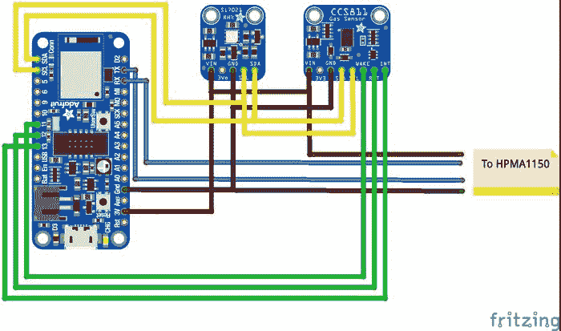](https://res.cloudinary.com/practicaldev/image/fetch/s--Fznd-7D---/c_limit%2Cf_auto%2Cfl_progressive%2Cq_auto%2Cw_880/https://www.jaredwolff.com/homemade-indoor-air-quality-sensimg/particle-squared-hookup-diagram.jpg) 
**注:**原烧结图有误。CCS811 和 Si7021 的 Vin 都应连接到粒子上的 3.3V

阿达果羽毛被用来代表粒子氩。粒子还没有烧结模型。

正如你所看到的，除了 PM2.5 传感器外，一切都连接好了。引脚排列包括在下面。

[](https://res.cloudinary.com/practicaldev/image/fetch/s--tXovUa-J--/c_limit%2Cf_auto%2Cfl_progressive%2Cq_auto%2Cw_880/https://www.jaredwolff.com/homemade-indoor-air-quality-sensimg/Screen%2520Shot%25202019-03-23%2520at%252012.31.03%2520PM.png)

最重要的引脚是 5V、GND、RX 和 TX 引脚。如果你愿意，其他的可以保持断开。以下是调出的连接:

```
5V     -> USB
GND    -> GND
RX     -> TX (on the Argon)
TX     -> RX (on the Argon). 
```

Enter fullscreen mode Exit fullscreen mode

这是一张组装在无焊料试验板上的所有东西的图片。

[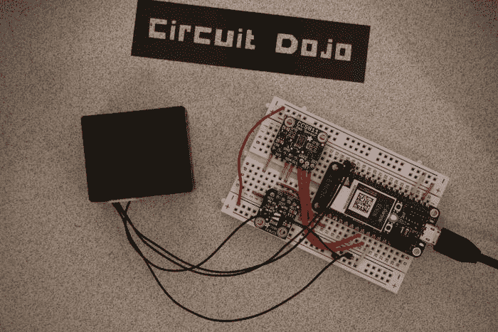](https://res.cloudinary.com/practicaldev/image/fetch/s--uwAul1gC--/c_limit%2Cf_auto%2Cfl_progressive%2Cq_auto%2Cw_880/https://www.jaredwolff.com/homemade-indoor-air-quality-sensimg/DSC01397.jpg)

另一个重要的注意事项是，我修改了 HPMA 的电缆，使它们在末端有公引脚。这使得它很容易插入无焊料试验板。这是一张放大的照片:

[](https://res.cloudinary.com/practicaldev/image/fetch/s--6NXLQaYq--/c_limit%2Cf_auto%2Cfl_progressive%2Cq_auto%2Cw_880/https://www.jaredwolff.com/homemade-indoor-air-quality-sensimg/DSC01370.jpg)

当您购买 PM2.5 传感器的电缆时，它预装了 8 根电线。为了使事情变得简单，你可以去掉 4 根不用的线。最好的方法是拿一个尖尖的工具(牙签、缝纫针等)放在我在下面用红色标出的夹子下面:

[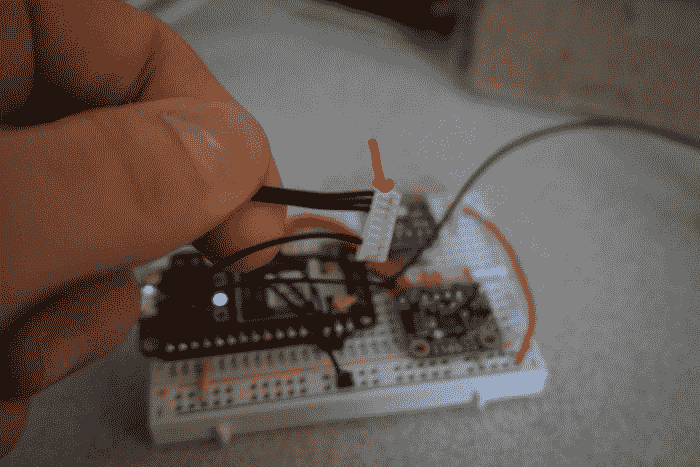](https://res.cloudinary.com/practicaldev/image/fetch/s--Tim_1WQN--/c_limit%2Cf_auto%2Cfl_progressive%2Cq_auto%2Cw_880/https://www.jaredwolff.com/homemade-indoor-air-quality-sensimg/DSC01371.jpg)

然后，一旦你把锋利的工具放在下面，用力拉电线，它就会滑出来。

现在你少了电线，少了头痛。您可以使用这种技术来修改任何类似 Molex 的连接器。

## 安装固件

对于这个项目，我决定让我的代码与 Wiring/Arduino-like API 保持一致。这意味着面向对象的 C++。我用 C++编程已经有一段时间了，所以当你看着代码库，想知道“他到底为什么这么做！?"抱歉，不是抱歉。😉

最好的开始方式是在这个项目中使用可视化代码和粒子插件。如果您尚未设置，请单击此处开始。

### Si7021

Si7021 超级简单。芯片上的 6 个引脚中只有 4 个有效。

[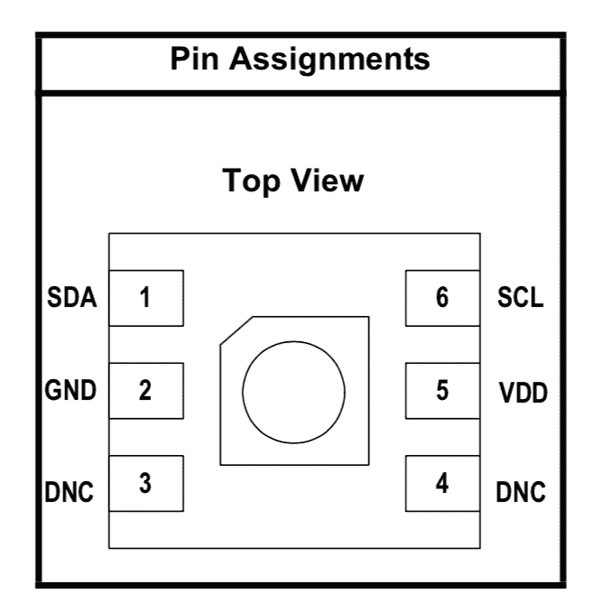](https://res.cloudinary.com/practicaldev/image/fetch/s--ItfnrwfN--/c_limit%2Cf_auto%2Cfl_progressive%2Cq_auto%2Cw_880/https://www.jaredwolff.com/homemade-indoor-air-quality-sensimg/Screen%2520Shot%25202019-03-23%2520at%25201.18.21%2520PM.png) 
(直接从 Si7021 文档中复制)

读取温度/湿度传感器的最佳方法是发出阻塞读取命令。在嵌入式世界中，这并不理想。不幸的是，没有办法知道读数何时准备好，因为没有中断引脚。

如数据手册所述，首先写入命令，然后尝试直接从器件读取。代码看起来像这样:

```
 // Si7021 Temperature
    Wire.beginTransmission(SI7021_ADDRESS);
    Wire.write(SI7021_TEMP_HOLD_CMD); // sends one byte
    Wire.endTransmission();           // stop transaction
    Wire.requestFrom(SI7021_ADDRESS, 2);

    // Get the raw temperature from the device
    uint16_t temp_code = (Wire.read() & 0x00ff) << 8 | (Wire.read() & 0x00ff); 
```

Enter fullscreen mode Exit fullscreen mode

连接器件的地址，写入命令，然后读取所需的字节数(本例中为 2)，然后 Si7021 将延长时钟，直到读取完成。

我没有乱动其他设置。根据你所处的环境，你可能需要调整供给加热器的电流。您的里程可能会有所不同，请做好相应准备！

最后，在一个重复出现的计时器上读取这些读数。我最初是使用`millis()`调用并计算开始时间和当前时间的差异，但这最终会中断(在 50 天左右)。相反，我决定使用一个系统定时器(类似于 NRF SDK 中的 APP _ TIMER)

```
Timer timer(MEASUREMENT_DELAY_MS, timer_handler); 
```

Enter fullscreen mode Exit fullscreen mode

这样，无论发生什么，你都会在`MEASUREMENT_DELAY_MS`被打断！(在我的例子中`MEASUREMENT_DELAY_MS` = 60000 毫秒= = 60 秒)

### CCS 811

CCS811 给了你更多的游戏自由，但它也有自己的特点。

[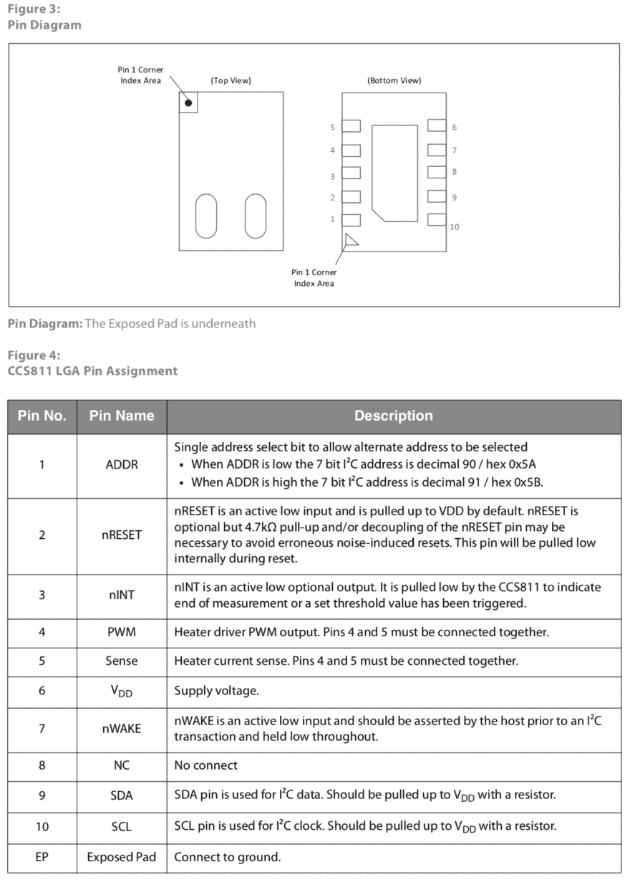](https://res.cloudinary.com/practicaldev/image/fetch/s--VWQkO82X--/c_limit%2Cf_auto%2Cfl_progressive%2Cq_auto%2Cw_880/https://www.jaredwolff.com/homemade-indoor-air-quality-sensimg/Screen%2520Shot%25202019-03-23%2520at%25202.34.14%2520PM.png)

大多数情况下，ADDR 引脚被设为低电平。此引脚修改地址的一位。如果在同一 I2C 总线上有两个相同的设备或两个地址相同的设备，这将非常有用。

CCS811 也有一些方便的输入和输出引脚。最重要的是中断引脚。每当读取完成时，此开漏引脚将被拉低。只有在读取状态寄存器后，它才会复位。这对于异步读取非常有用，因为这样您就不会锁定 MCU。

重要的一点是，CCS811 确实要求您发出“启动”命令。这迫使内部 MCU 开始执行 TVOC/二氧化碳检测算法。如果您试图在应用程序启动前读取数据寄存器，将会得到虚假数据。(命令是 0x90)

在固件中，CSS811 在与 Si7021 相同的环路中处理。该代码从 CSS811 异步读数中提取可用数据。没有阻塞代码！

### hpma 115

粒子传感器有点复杂。当它打开时，设备开始定期发送微粒数据。即它每次上电时都处于自动发送模式。

我以前尝试配置设备，但有时我得不到回应。它总是碰运气。这让我抓狂。

所以，为了在你不用的时候关掉这个设备，我强烈建议使用某种负载开关。根据霍尼韦尔公司的说法，这不仅可以省电，还可以延长风扇的寿命。

阅读材料的流动:

*   每分钟打开它
*   等待数据发送
*   通过 UART 异步读取读数
*   关掉它
*   将数据打包到 JSON blob 中发送给服务器

这样就没有必要弄乱任何寄存器。这就是为什么 I2C 甚至 SPI 是比 UART 更好的数据总线的原因。我只想它能工作！

[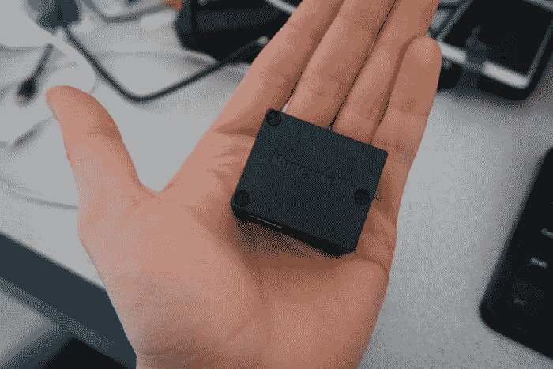](https://res.cloudinary.com/practicaldev/image/fetch/s--Qd7FaKWy--/c_limit%2Cf_auto%2Cfl_progressive%2Cq_auto%2Cw_880/https://www.jaredwolff.com/homemade-indoor-air-quality-sensimg/DSC01372.jpg)

我最初选择这个传感器是因为它的封闭性。在我看来，整合更容易。我的电子工程师大脑不想处理复杂的东西。给我一个盒子，我们走吧。

## 让一切运转起来

在这个项目的开发阶段，我碰巧在国外旅行。蹩脚的无线网络没有切断它，而且它花了很长时间来迭代代码。氩也很难连接到我的 iPhone 的 AP，所以我很早就放弃了这个想法。

因此，为了开发不需要互联网的代码，我将设备设置为手动模式。手动模式是做什么的？它允许代码开始执行，尽管没有连接到粒子云。这样你就可以全天读取数据，而不必连接 Wifi。您可以将此定义放入您的`.ino`文件:
中，将设备置于手动模式

```
SYSTEM_MODE(MANUAL); 
```

Enter fullscreen mode Exit fullscreen mode

在电池供电的应用中，这是理想的选择。Wifi 非常耗电，如果没有必要，你不需要运行它！

在之前的一个实验中，我发现从什么都没有到向粒子云发送数据大概需要 10-15 秒。在嵌入式领域，这是一段很长的时间。这是我怀疑粒子和他们的网格系统一起出现的主要原因之一。这使得休眠的终端节点(或获取数据并定期将其发送到中心点的节点)比其基于 Wifi 的表兄弟运行更长时间。

请记住，您必须运行`Particle.connect()`功能才能在手动模式下连接到 wifi。或者如果你准备好让它重新连接，从你的`.ino`文件中删除`SYSTEM_MODE(MANUAL);`。

### 更改 Wifi 凭证

在我尝试让我的 wifi 工作的实验中，我发现了一些方便的粒子工具来改变 wifi 凭证等。在操作过程中按住模式按钮，设备最终开始闪烁蓝色。一旦闪烁蓝色，您可以发出一个`particle serial wifi`，它将引导您完成更改凭证的过程。

上述过程比使用 iPhone/Android 应用快光年。一开始我觉得这个应用很酷，但是扫描和连接你的设备需要很长时间。

更多关于这一程序的信息请点击此处。

### 出了差错时挽回

在开发过程中，我必须回收氩气。我做了一些挖掘，发现重新编程操作系统，应用程序和引导程序似乎做到了这一点。

从这里获得文件:[发布 0.9.0(Gen 3)particle-IOT/device-OS GitHub](https://github.com/particle-iot/device-os/releases/tag/v0.9.0)(在撰写本文时，最新版本是 0 . 9 . 0)

轻按`reset`按钮一次后，按住`mode`按钮，在 [DFU 模式](https://docs.particle.io/tutorials/device-os/led/photon/#dfu-mode-device-firmware-upgrade-)下对这些文件进行编程。

```
particle flash --usb system-part1-0.9.0-argon.bin
particle flash --usb tinker-0.9.0-argon.bin 
```

Enter fullscreen mode Exit fullscreen mode

在[监听模式下编程这个:](https://docs.particle.io/tutorials/device-os/led/photon/#listening-mode)

```
particle flash --serial bootloader-0.9.0-argon.bin 
```

Enter fullscreen mode Exit fullscreen mode

*注意:*`-argon`后缀可能会有所不同，这取决于你编程的目的。其他选项有`-boron`和`-xenon`。

## 命令行上的监控

最后，最有用的命令之一是:

`particle serial monitor --follow`

这允许您使用 USB `Serial`接口从设备接收调试信息。这类似于将 FTDI 设备连接到 Arduino。

例如，我可能正在调试部分代码，所以我想查看一些数据。在`Setup()`函数中，我将确保运行`Serial.begin()`，然后稍后我将制作一个`Serial.printf(“data: %d”,data.tvoc);`，以便通过 USB 串行接口发送。

串口 UART 进行调试，很漂亮的东西。

## 出版

在开发过程中，我确实发现了粒子平台的发布限制。对于单个设备，您不能在一秒钟内`Particle.Publish`超过 4 条数据。尽管我每分钟都在获取数据，但我同时向服务器发送了 6 条单独的数据。测试后，我很快开始想知道为什么我的二氧化碳和 TVOC 读数消失了。

我找到了罪犯。

所以，为了让它工作，我必须把它格式化成一个 JSON blob。请看下面我是如何做到的:

```
String out = String::format("{\"temperature\":%.2f,\"humidity\":%.2f,\"pm25\":%d,\"pm10\":%d,\"tvoc\":%d,\"c02\":%d}",si7021_data.temperature,si7021_data.humidity,hpma115_data.pm25,hpma115_data.pm10,ccs811_data.tvoc,ccs811_data.c02);
Particle.publish("blob", out , PRIVATE, WITH_ACK); 
```

Enter fullscreen mode Exit fullscreen mode

我创建了一个 JSON 结构，然后使用`String::format`在需要的地方插入每一部分。如果您通过 LTE 运行设备，这将导致您发送不必要的数据。有更好的选择，如[协议缓冲区](https://www.jaredwolff.com/how-to-define-your-own-bluetooth-low-energy-configuration-service-using-protobuf/)或使用[消息包](https://msgpack.org)。如果您正在处理复杂的数据，我推荐前者，因为它具有编程的性质。另外，您可以将它用于任何编程语言。所以 web 转嵌入式？没问题。

每过一分钟，我只在三个传感器都被读取后才发送数据。我使用三个独立的布尔值来确定传感器读数的状态。一旦它们都被设置为`true`，我就调用`Particle.Publish`调用。

然后发布后，我像这样重置所有变量:

```
ccs811_data_ready = false;
si7021_data_ready = false;
hpma115_data_ready = false; 
```

Enter fullscreen mode Exit fullscreen mode

然后，一切又重新开始。您还可以创建一个状态结构，其中整齐地包含这些标志。考虑到我只有三个数据点，我没有多做什么。

## 使用 Webhook 发布到 Google Docs

有趣的事情来了。

一旦您的设备发布到云，您如何使用它？

实际上，这个解决方案只适合我。我不打算建立一个后端。我不期望有几百万人使用我的服务。我只想看数据。

所以，经过一番研究，我找到了一些关于谷歌文档的有用信息。特别是`Sheets`。

主要的想法是，对于每次更新，都有一个神奇的脚本将数据转换成 Google Sheets 中的新行。随着数据的添加，文档将随着数据的流入而不断更新。

这一切是如何运作的？

请继续阅读！

您可以通过创建一个专门绑定到工作表的 Webhook 将数据推送到 Google 工作表。我在下面概述了这个过程:

1.  转到`Tools` - > `Script Editor`。这将弹出一个脚本窗口。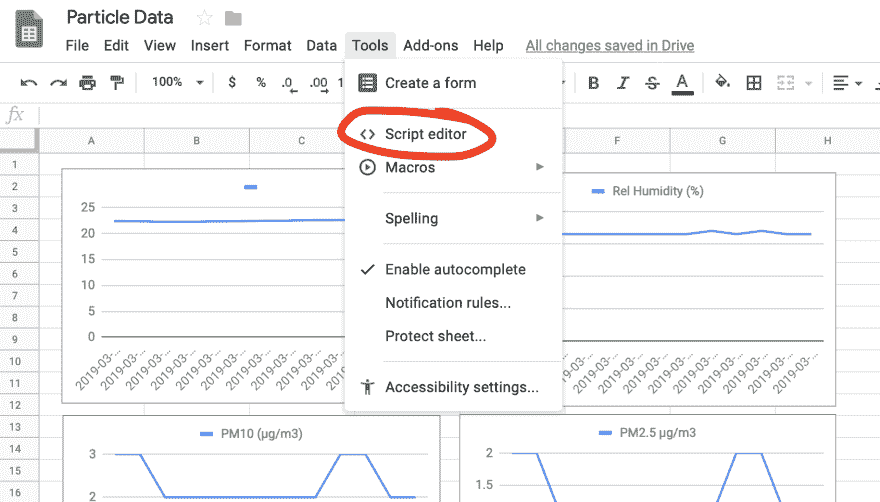
2.  创建新脚本。并把我写的内容抄在下面:

```
 //this is a function that fires when the webapp receives a POST request
   function doPost(e) {

     //Return if null
     if( e == undefined ) {
       Logger.log(“no data”);
       return HtmlService.createHtmlOutput(“need data”);
     }

     //Parse the JSON data
     var event = JSON.parse(e.postData.contents);
     var data = JSON.parse(event.data);

     //Get the last row without data
     var sheet = SpreadsheetApp.getActiveSheet();
     var lastRow = Math.max(sheet.getLastRow(),1);
     sheet.insertRowAfter(lastRow);

     //Get current timestamp
     var timestamp = new Date();

     //Insert the data into the sheet
     sheet.getRange(lastRow + 1, 1).setValue(event.published_at);
     sheet.getRange(lastRow + 1, 2).setValue(data.temperature);
     sheet.getRange(lastRow + 1, 3).setValue(data.humidity);
     sheet.getRange(lastRow + 1, 4).setValue(data.pm10);
     sheet.getRange(lastRow + 1, 5).setValue(data.pm25);
     sheet.getRange(lastRow + 1, 6).setValue(data.tvoc);
     sheet.getRange(lastRow + 1, 7).setValue(data.c02);

     SpreadsheetApp.flush();
     return HtmlService.createHtmlOutput(“post request received”);
   } 
```

Enter fullscreen mode Exit fullscreen mode

我的代码最初是基于我在这个主题上找到的[帖子。](https://blog.runscope.com/posts/tutorial-capturing-webhooks-with-google-sheets)

1.  然后我去了`Publish` - > `Deploy as web app` 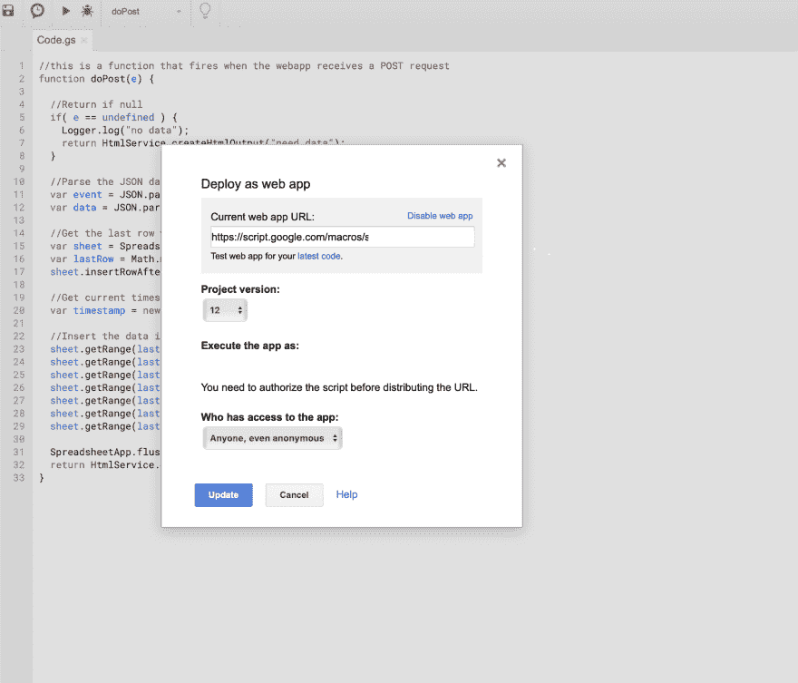
2.  请记住，除了您之外，任何人都不能使用此应用程序。可以设置`Execute the app as`自己选择。
3.  最后，`Who has access to the app`是`Anyone, even anonymous`,否则它将要求认证，这将不起作用！如果您已经发布了，您必须将`Project Version`更改为`new`才能应用您的更改。
4.  在粒子控制台中，转到`Integrations`部分并创建一个新的`Webhook`

    [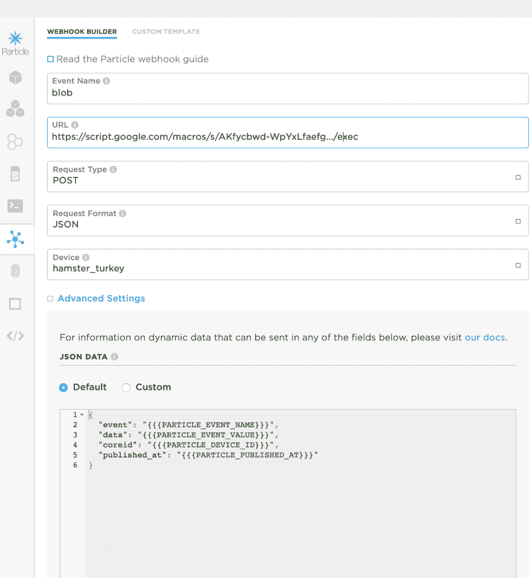](https://res.cloudinary.com/practicaldev/image/fetch/s--wDeKq4qG--/c_limit%2Cf_auto%2Cfl_progressive%2Cq_auto%2Cw_880/https://www.jaredwolff.com/homemade-indoor-air-quality-sensimg/Screen%2520Shot%25202019-03-19%2520at%25208.49.57%2520AM.png)

5.  填写您要转发的事件的名称。在我们的例子中是`blob`

6.  输入在**步骤 5** 中提供的 URL

7.  确保请求格式为`JSON`。您可以保留默认的 JSON 格式。保持`Enforce SSL`使能。

8.  确保定义了要监视的设备。在我的例子中，我使用了粒子给我的设备起的名字`hamster_turkey`(很棒的名字，对吧？)

9.  走到底部，点击`Save`

10.  如果你的粒子被编程，你应该开始看到更新的数据填充谷歌表。您可以将数据放入实时更新的图表中。

[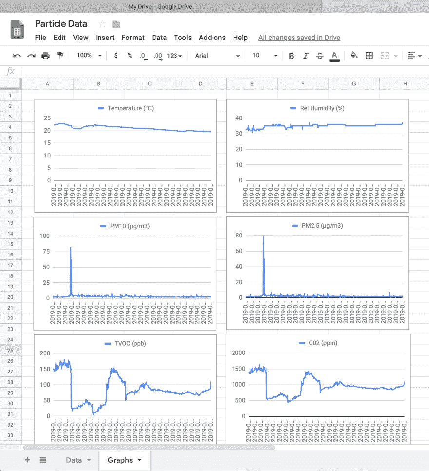](https://res.cloudinary.com/practicaldev/image/fetch/s--l313Ny71--/c_limit%2Cf_auto%2Cfl_progressive%2Cq_auto%2Cw_880/https://www.jaredwolff.com/homemade-indoor-air-quality-sensimg/Screen%2520Shot%25202019-03-19%2520at%25205.41.15%2520PM.png)

**注意:**这种类型的数据收集不适合跨越几天的大量数据。这是伟大的，虽然为短期试验和测试虽然！我最初使用 IFTTT，但是数据收集是零星的。现在还挺一致的！

你可以在这里看到我的[活生生的例子。](https://docs.google.com/spreadsheets/d/1l0fgXAKUOMOAkJ5_gvw9kq-u39TXIAurT9XrKUPuT90/edit?usp=sharing)

## 另一种方式:使用 Adafruit IO

1.  在这里创建一个账户:[https://io.adafruit.com](https://io.adafruit.com)
2.  下一步是为每种数据类型创建提要。我们总共需要 6 个。
    [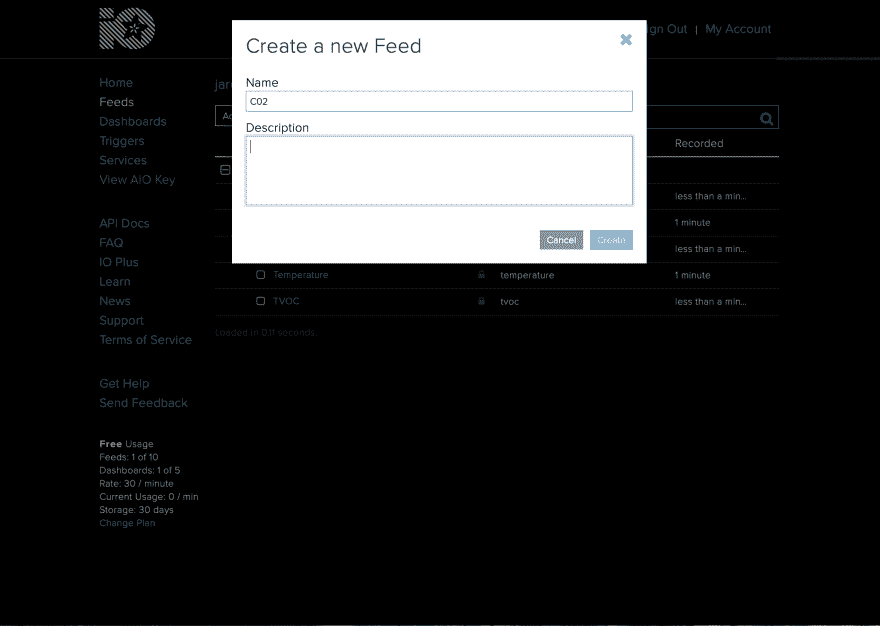T3】](https://res.cloudinary.com/practicaldev/image/fetch/s--1UWIovNY--/c_limit%2Cf_auto%2Cfl_progressive%2Cq_auto%2Cw_880/https://www.jaredwolff.com/homemade-indoor-air-quality-sensimg/Screen%2520Shot%25202019-03-19%2520at%25206.47.38%2520PM.png)

3.  对于每个提要，添加一个 Webhook。
    [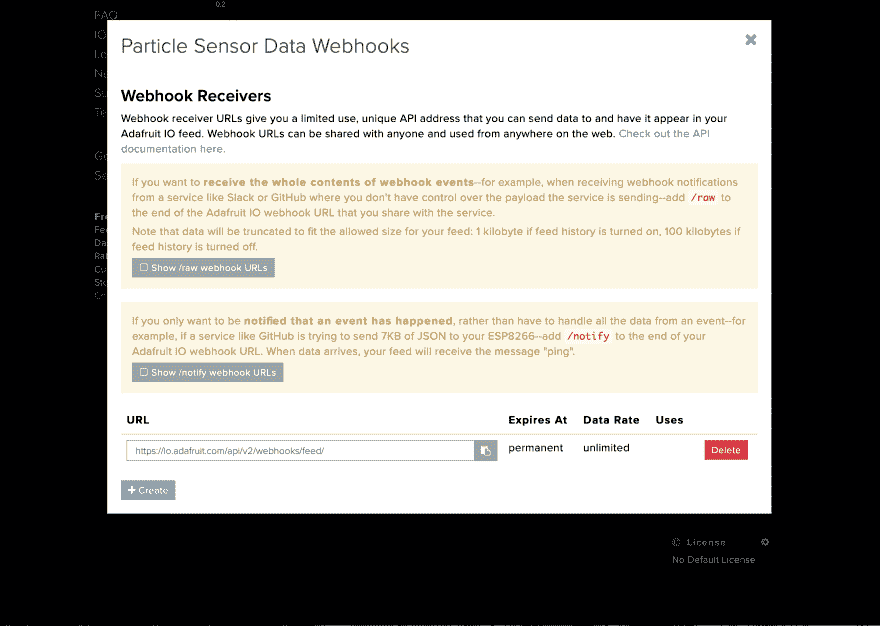T3】](https://res.cloudinary.com/practicaldev/image/fetch/s--QNjM1iIV--/c_limit%2Cf_auto%2Cfl_progressive%2Cq_auto%2Cw_880/https://www.jaredwolff.com/homemade-indoor-air-quality-sensimg/Screen%2520Shot%25202019-03-19%2520at%25206.45.27%2520PM.png)

4.  获取每个网页挂钩地址，并在粒子控制台中创建新的网页挂钩

5.  将`Request format`改为 JSON

6.  然后在`Advanced Settings`下点击`Custom`获取 **JSON 数据**

7.  使用[小胡子模板](https://docs.particle.io/reference/device-cloud/webhooks/#variable-substitution)替换现有的。Adafruit IO 正在寻找一个名为`value`的 JSON 键。所以这样设置:

```
 {
    “value”:”{{{c02}}}”
   } 
```

Enter fullscreen mode Exit fullscreen mode

您可以用 JSON blob 中的任何键替换`c02`。提醒一下，当前的 JSON blob 看起来像这样:

```
 {
    “temperature”:21.2,
    “humidity”:30,
    “pm10”:2,
    “pm25”:1,
    “tvoc”:650,
    “c02”:1001
   } 
```

Enter fullscreen mode Exit fullscreen mode

1.  根据需要重复此操作，直到所有提要都配置了相应的 Webhook。
2.  最后，您可以创建一个仪表板，在一个地方查看所有信息。这很简单，只要按照屏幕上的提示做就行了。:)

[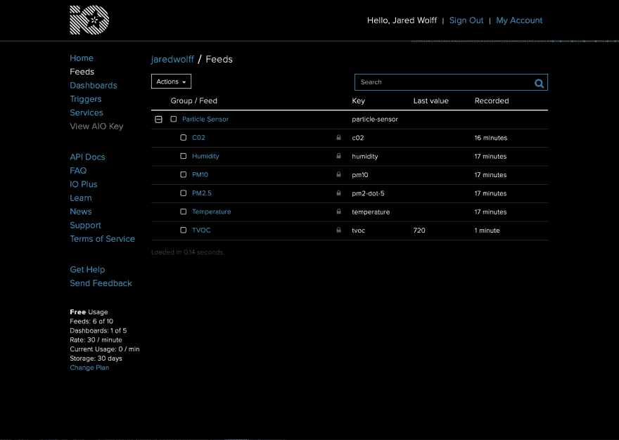](https://res.cloudinary.com/practicaldev/image/fetch/s--ITHR4XhK--/c_limit%2Cf_auto%2Cfl_progressive%2Cq_auto%2Cw_880/https://www.jaredwolff.com/homemade-indoor-air-quality-sensimg/Screen%2520Shot%25202019-03-19%2520at%25207.04.16%2520PM.png)
[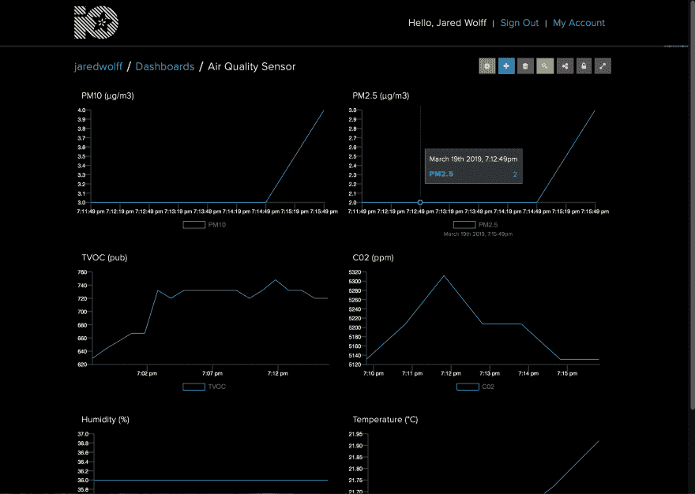T6】](https://res.cloudinary.com/practicaldev/image/fetch/s--lNN1TqZr--/c_limit%2Cf_auto%2Cfl_progressive%2Cq_auto%2Cw_880/https://www.jaredwolff.com/homemade-indoor-air-quality-sensimg/Screen%2520Shot%25202019-03-19%2520at%25207.16.17%2520PM.png)

你可以点击查看我的[实时仪表盘。这是显示数据的另一种方式。](https://io.adafruit.com/jaredwolff/dashboards/air-quality-sensor)

旁注:我对 Adafruit IO 的第一印象很好。它很容易安装和开始使用。主要的缺点是它很乏味，尤其是当你有很多数据点的时候。但是也许他们将来会解决这个问题！

## 解读读数

这些读数可能会令人困惑。下面是它们的工作原理:

1.  湿度以相对百分比显示。这就是我们所知道和喜爱的相对湿度。请记住，它可能与外面的不同。这取决于你的房子是有空调还是开着暖气等等。
2.  温度单位为摄氏度(如果您愿意，可以在固件中修改)
3.  TVOC 的单位是 ppb(十亿分之一)。挥发性有机化合物可能是你家里的有害化学物质。更多关于挥发性有机化合物的信息，请点击环保局的[链接。](https://www.epa.gov/indoor-air-quality-iaq/volatile-organic-compounds-impact-indoor-air-quality)
4.  CO2 的单位是 ppm(百万分之一)。我们吸进氧气，呼出二氧化碳。当你在房间里的时候，你可能会发现你的 VOC 和 CO2 水平在上升。二氧化碳也与挥发性有机化合物相关。数据手册中的更多信息。
5.  PM10。单位为克/立方米(微克每立方米)。粒子传感器使用散射激光，然后穿过空气室照射到另一侧的传感器。光线被阻挡得越多，空气中的颗粒就越多。然后，颗粒传感器进行一些计算，以确定一定体积内的颗粒数量，从而确定您的 g/m3。
6.  PM2.5 和上面的一样，但是它追踪更小的颗粒。(尺寸小于等于 2.5 m！)[更多信息请点击美国环保署网站。](https://www.epa.gov/pm-pollution/particulate-matter-pm-basics)

## 你做到了！

恭喜你。你已经走到这一步了。你应该去泡一天温泉。或者来点巧克力冰淇淋。或者你真的想冒险，两者同时进行。🍦🛀

在建立了其中一个之后，你可能会觉得你的时间值得投资在其他地方。也许你想用更好的图表和算法建立一个很酷的网络后端。甚至可能使用一些机器学习(为什么不呢！)

如果你想要一些已经组装好的可用的东西，你应该看看 Particle^2(发音为粒子平方)。它什么都有，包括开关 HPM 粒子传感器的能力。你甚至可以用电池运行它！所以把它放在任何你想放的地方。点击这里查看。

 [
T4】](/store/particle-squared/)

以下是入门的简单方法:

### Particle^2 设置

1.  插上你的
    [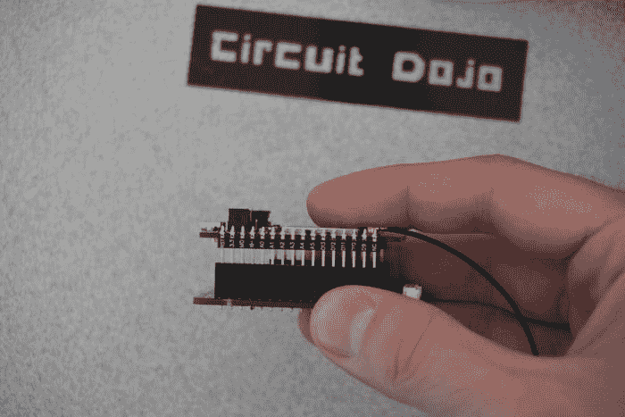](https://res.cloudinary.com/practicaldev/image/fetch/s--TtH0am_A--/c_limit%2Cf_auto%2Cfl_progressive%2Cq_auto%2Cw_880/https://www.jaredwolff.com/homemade-indoor-air-quality-sensimg/UNADJUSTEDRAW_largepv_2fff.jpg)

2.  连接 HPMA115S0 粒子传感器
    [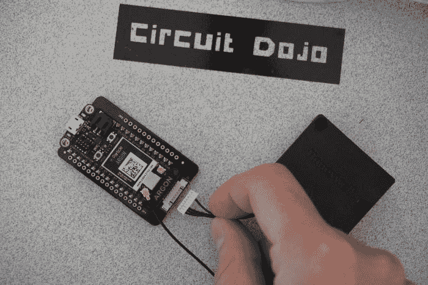](https://res.cloudinary.com/practicaldev/image/fetch/s--UdoXFJmE--/c_limit%2Cf_auto%2Cfl_progressive%2Cq_auto%2Cw_880/https://www.jaredwolff.com/homemade-indoor-air-quality-sensimg/UNADJUSTEDRAW_largepv_2ffe.jpg)

3.  开机
    [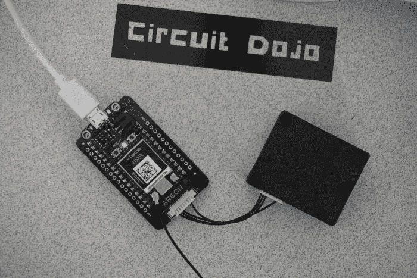](https://res.cloudinary.com/practicaldev/image/fetch/s--wEi_TJZq--/c_limit%2Cf_auto%2Cfl_progressive%2Cq_auto%2Cw_880/https://www.jaredwolff.com/homemade-indoor-air-quality-sensimg/UNADJUSTEDRAW_largepv_2ffd.jpg)

4.  还有程序！(下面是代码的更多细节)

## 代码和来源

整个项目是在知识共享共享许可下发布的。[在此获取源代码和硬件文件。](https://www.jaredwolff.com/air-quality-project-files/#main)

**关于代码的特殊说明:**代码将与基于粒子的板一起开箱即用。羽毛板可能需要一些额外的返工才能正常工作。

感谢阅读！请在评论中告诉我你的想法。我会让我的一天。