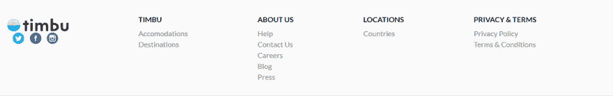

# 我的 HNG 编年史-调试 Timbu.com

> 原文：<https://dev.to/lawybanx/my-hng-chronicles-debugging-timbu-com-8hf>

[https://timbu.com/](https://timbu.com/)

今天，我们奉命在 Timbu 网站上寻找漏洞，作为本周晋级第二阶段挑战的第一部分。我发现了以下内容

在航班页面上，[https://timbu.com/flights](https://timbu.com/flights)我发现在“探索世界”类别下的“查看更多”链接不起作用了，而这些链接本应链接到一个包含该类别更详细信息的页面。
T3T5】

此外，就在这个类别下面，有一个随机的、不合适的字母“n”..
 
同一页面页脚处的“关于我们”链接失效
