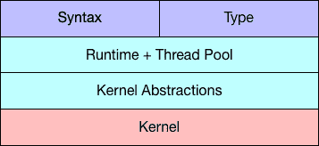
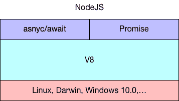
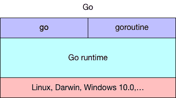
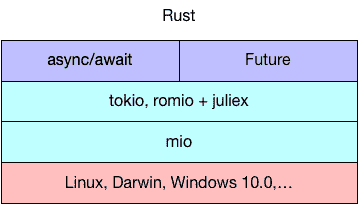
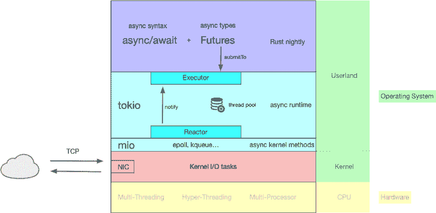

# 解释:异步在 Rust 中是如何工作的？

> 原文：<https://dev.to/gruberb/explained-how-does-async-work-in-rust-46f8>

这篇文章将概述异步在 Rust 中存在的原因和方式。并发性、并行性和异步代码之间的区别将不被讨论。

## 异步概念

异步编程是一个概念，它允许在等待某些动作的结果时不阻塞程序工作流。所以你可以打开一个大文件或者查询一个数据库，但是你的程序会继续处理每一行。

这个概念首先是在内核级别上需要的，因为您希望能够在键盘上打字的同时听音乐。在软件层面，这是通过多线程实现的。在 CPU 方面，您可以在每个内核上同时运行多个进程。

后来，web 服务器开始发挥作用，它需要在执行 I/O 任务时能够支持数百万个连接。为了能够以非阻塞的方式做到这一点，我们可以在内核级使用线程，或者实现我们自己处理线程和事件的方式。

## 需要什么，为什么

内核已经实现了这个概念(通过线程和其他概念)，但是它们非常“昂贵”，这意味着可用的资源是有限的，在操作系统级别处理这个问题增加了全新的复杂性。

因此，在程序级别上处理我们的内部异步流会很好。我们需要一个所谓的运行时，它可以处理异步代码，并能够与内核通信。

总的想法是:

*   在程序级别上实现自己处理线程和队列的方式(绿色线程)
*   在你的语言中加入语法糖，这样运行时/编译器可以识别代码的异步部分
*   添加异步类型，以便它们可以在“完成”时发出通知

[](https://res.cloudinary.com/practicaldev/image/fetch/s--dPz31mXr--/c_limit%2Cf_auto%2Cfl_progressive%2Cq_auto%2Cw_880/https://raw.githubusercontent.com/gruberb/web-programming-in-rust/master/assets/async_overview_02.png)

例如，与处理字符串不同，异步类型需要有特定的状态(正在处理和完成)。运行时可以处理这些类型并在其中设置状态。之后，您可以在代码中稍后访问该值，或者等待它们完成后再继续。

## 工作流程

您在代码中将一个方法标记为 async，在这个 async 方法中，您现在可以使用您的 async 类型。您可以等待它们完成(“从 GitHub 获取数据...”)或者您“启动”它们，继续您的流程，稍后检查它们是否完成并使用它们的值。

一旦完成了代码的编写，你就需要一个运行时来获取代码的异步部分并实际运行它。运行时还需要从队列中取出进程，并将其交给操作系统，因为真正的工作发生在那里。

在操作系统完成处理后，它将通知运行时，运行时反过来将设置异步类型内部的状态，并将其交还给程序工作流。

## NodeJS 对 Go。对比铁锈

让我们看看 Node、Go 和 Rust 是如何实现我们讨论过的概念的，即:语法、类型和运行时。

### 节点

在 NodeJS 中，有`async/await`语法和`Promises`。你可以`await`一个`Promise`也就是一个可能需要更多时间处理的动作。

[](https://res.cloudinary.com/practicaldev/image/fetch/s--WDzfocxB--/c_limit%2Cf_auto%2Cfl_progressive%2Cq_auto%2Cw_880/https://raw.githubusercontent.com/gruberb/web-programming-in-rust/master/assets/node_async.png)T3】

```
const async_method = async () => {
    const dbResults = await dbQuery();
    const results = await serviceCall(dbResults);
    console.log(results);
} 
```

Enter fullscreen mode Exit fullscreen mode

## 去吧

在围棋中，你开始的是`goroutines`而不是`Promises`。而不是`async/await`，你简单的写`go method_name()`。代替 V8，Go 自带 Go 运行时。

[](https://res.cloudinary.com/practicaldev/image/fetch/s--UQPxHJLP--/c_limit%2Cf_auto%2Cfl_progressive%2Cq_auto%2Cw_880/https://raw.githubusercontent.com/gruberb/web-programming-in-rust/master/assets/go_async.png)T3】

```
f(greeting string) {
    fmt.Println(greeting, ", World!")
}

go f("Hello") 
```

Enter fullscreen mode Exit fullscreen mode

## 生锈

Rust Async 生态系统仍在发展中，尚未最终成型。这里的建议是也使用`async/await`，而不是`Promises`和`Goroutines`，你有 [`Futures`](https://github.com/rust-lang-nursery/futures-rs) 。

Rust 语言团队决定[在任何运行时都不包含](https://github.com/rust-lang/rfcs/blob/0806be4f282144cfcd55b1d20284b43f87cbe1c6/text/0230-remove-runtime.md)。Rust 希望尽可能小，并且能够根据需要更换零件。因此你需要依靠 crates 来为你提供合适的运行时间。

最流行的是 [`tokio`](https://tokio.rs/) ，内部使用 [`mio`](https://github.com/carllerche/mio) 作为其事件队列。甚至其他运行时也在使用`mio`,因为它提供了对 epoll、kqueue 和 IOCP 等内核方法的抽象。

[](https://res.cloudinary.com/practicaldev/image/fetch/s--KaEZU8sa--/c_limit%2Cf_auto%2Cfl_progressive%2Cq_auto%2Cw_880/https://raw.githubusercontent.com/gruberb/web-programming-in-rust/master/assets/rust_async_01.png)

Rust 的一个特点是你必须“开始”一个未来。因此，仅仅像在 NodeJS 中承诺或写下`go name_of_goroutine()`那样宣布它还不会触发未来去做某事。所以如果你使用 tokio，你需要:

```
let response = client.get("http://httpbin.org")

let response_is_ok = response
    .and_then(|resp| {
        println!("Status: {}", resp.status());
        Ok(())

tokio::run(response_is_ok); 
```

Enter fullscreen mode Exit fullscreen mode

在不久的将来，你可以像这样在 Rust 中使用`async`:

```
#[async]
fn async_function_name(...) -> Result<ReturnType, ErrorType> {
    let db_results = await!(query_database());
    let more_data = await!(fetch_another_service(db_resukts));
    process(more_data)
} 
```

Enter fullscreen mode Exit fullscreen mode

[`async/await`语法](https://github.com/alexcrichton/futures-await)仍在进行中，需要被批准、合并，部分语言需要调整以适应新的形式。

## 详细锈异步

让我们放大一点，看看运行时是如何工作的:

[](https://res.cloudinary.com/practicaldev/image/fetch/s--xPciv2Zc--/c_limit%2Cf_auto%2Cfl_progressive%2Cq_auto%2Cw_880/https://raw.githubusercontent.com/gruberb/web-programming-in-rust/master/assets/async_01.png)

Tokio 正在内部使用[反应堆-执行器模式](https://www.puncsky.com/blog/2015/01/13/understanding-reactor-pattern-for-highly-scalable-i-o-bound-web-server/)。

tokio 和其他运行时想要实现的是一个高原始数据吞吐量的高可伸缩服务器。他们不想在做 I/O 操作时阻塞。这里我们基本上有两种选择:基于线程的或者事件驱动的架构。简而言之:基于线程是有局限性的，因为物理资源有限。

所以事件驱动对我们来说是最好的。它正在注册未来传入的请求，并保存一个指向异步函数处理程序的指针。然后它在内核中触发一个事件。一旦 I/O 操作完成，我们调用指针并使用来自 I/O(内核)的结果执行异步方法。

为此，我们需要一个反应器，它通知数据是否通过网络传入或者文件写操作是否正在进行，还需要一个执行器，它接收这些数据并执行异步函数(未来的)。

此外，每个运行时都需要理解启动 I/O 操作的内核方法(如 [epoll](https://people.eecs.berkeley.edu/~sangjin/2012/12/21/epoll-vs-kqueue.html) )。对于 Rust，有一个叫做 [mio](https://github.com/carllerche/mio) 的机箱实现了这些内核方法。Tokio 正在内部使用 mio。

## 是否可用？

目前在异步 Rust 世界中发生了很多事情。要有一个易于使用和理解的最终版本还需要一点时间。在此之前，您可以像以前一样使用 web 框架，因为它们已经附带了运行时。

例如，Dropbox 将 Futures 与生产中的`tokio`结合使用，从 Dropbox 服务器的磁盘上提供数据。Futures 在 0.1 版本中是 Rust stable，在 0.3 版本中是 Rust nightly。运行时`tokio`依赖于 Rust stable，所以它使用 Futures 0.1。

您可以通过 [compat 模块](https://rust-lang-nursery.github.io/futures-api-docs/0.3.0-alpha.9/futures/compat/index.html)将 0.3 转换为 0.1 期货，反之亦然。

Rust 还需要几个月的时间来为其易用和强大的未来做准备。它们不像其他语言那样昂贵，你可以有一个瘦或厚的运行时，这完全取决于你。

## 开始使用

如前所述，tokio 是您可以使用的运行时之一。另一个是罗米奥和 T2 的组合。

如果你在构建 web 应用，有一个板条箱叫做 [hyper](https://hyper.rs/) ，里面已经包含了 tokio。因此，您可以在应用程序中使用 Futures 0.1。

### 保持最新

你可以登陆网站[areweasynctive](https://areweasyncyet.rs/)来关注异步 Rust 的进展。类似地， [arewewebyet](http://www.arewewebyet.org/) 正在跟踪围绕构建 web 应用的框架和工具的进展。

##### 进一步阅读

1.  【Tokio 和 Async IO 是怎么回事？
2.  [期货在拉斯特和哈斯克尔](https://slides.com/wraithm/async-io-in-rust-and-haskell/#/)
3.  [节点中的快速异步](https://v8.dev/blog/fast-async)
4.  [举例说明:Goroutines](https://gobyexample.com/goroutines)
5.  [Tokio:构建运行时](https://tokio.rs/docs/going-deeper/building-runtime/)