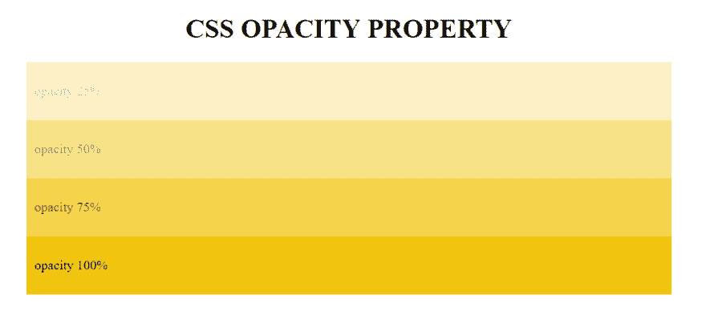
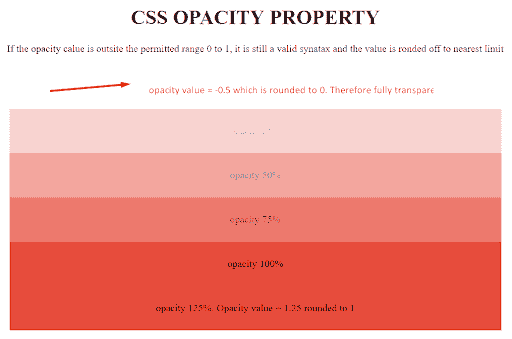
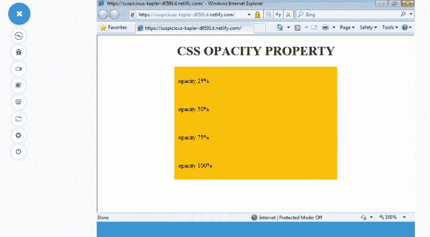
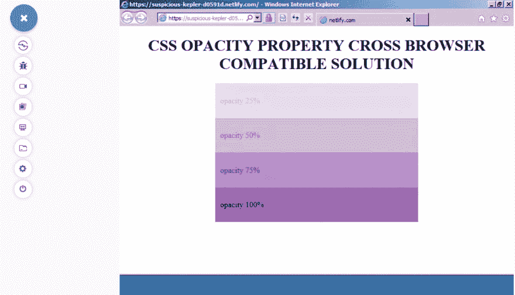
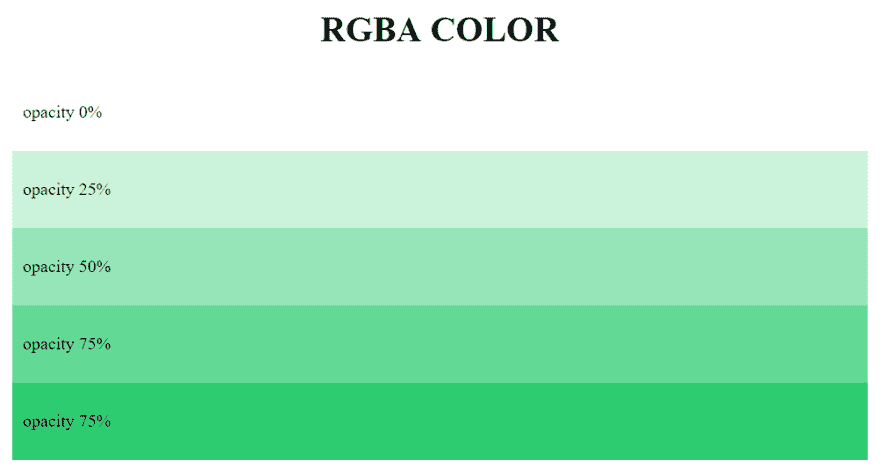
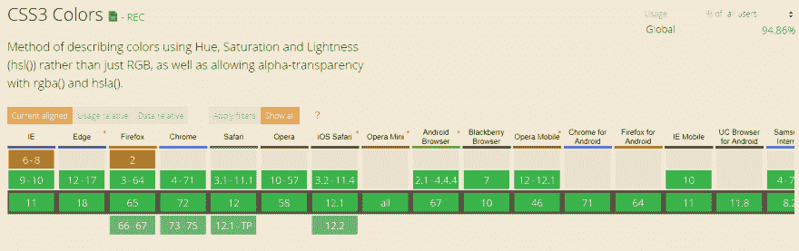
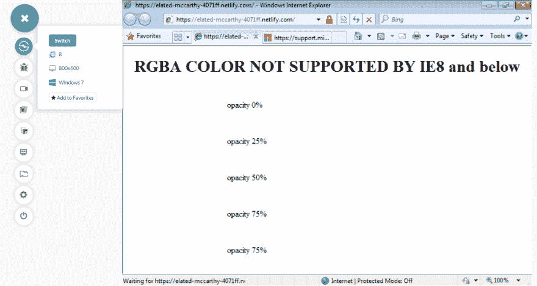
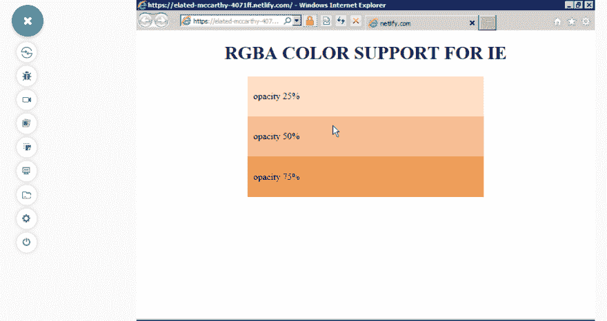

# 修复 CSS 不透明和 RGBA 的浏览器兼容性问题

> 原文：<https://dev.to/lambdatest/fixing-browser-compatibility-issues-with-css-opacity-rgba-587e>

网站设计者经常会遇到这样的需求:通过对背景、文本和图像使用 CSS 不透明度来构建现代柔和的风格效果，从而为他们的网站增添情趣。不透明度也被广泛用于在文本和文本框上创建微妙的阴影效果，以使网页对用户更具吸引力。这可以通过使用 CSS 不透明属性或者使用 RGBA 颜色来实现，每种方法都有自己的优点和缺点。我们将探索它们最流行的实际用途和跨浏览器兼容性解决方案，使它们能够在 IE8 及以下版本的遗留浏览器上工作，这些浏览器要么提供部分支持，要么完全不支持。

## CSS 不透明度属性

CSS opacity 属性用于设置元素的不透明度值。它通过使用 0 到 1 范围内的数字来定义透明度级别，其中 1 对应于 100%不透明(或 0%透明)，0 对应于 0%不透明(或 100%透明)。但是，CSS opacity 属性会将指定的透明度级别添加到整个元素中，包括它的所有子元素。例如，如果为 div 元素定义了不透明度属性，那么 div 中的所有元素(可能是一些文本、图像或其他 div)也将从父 div 获得相同的不透明度，即使不透明度不是显式继承的。

在我们深入研究本文之前，您可能会看到我在一个 LambdaTest 实验中用来表示背景 CSS 不透明度的示例代码，在这里您可以看到 CSS 不透明度值差异的输出。

### 使用 CSS 不透明度的语法

**不透明度:数字|初始|继承；**

*   数字:指定 alpha 通道值-不透明度/透明度级别。范围从 0(零不透明度)到 1(完全不透明度)
*   初始:设置为默认值 1-完全不透明
*   Inherit:从父元素继承值

### 示例代码以 CSS 不透明度为背景色来表示跨浏览器兼容性问题

```
 <!DOCTYPE html>
<html>
<head>
    <style>
        h1 {
            text-align: center;
        }
        div {
            width: 50%;
            margin: 0 auto;
            background-color: #f1c40f;
            padding: 10px;
        }
        .opacity25 {
            opacity: 0.25;
        }
        .opacity50 {
            opacity: 0.5;
        }
        .opacity75 {
            opacity: 0.75;
        }
    </style>
</head>
<body>
    <h1>CSS OPACITY PROPERTY</h1>
    <div class="opacity25">
        <p>opacity 25%</p>
    </div>
    <div class="opacity50">
        <p>opacity 50%</p>
    </div>
    <div class="opacity75">
        <p>opacity 75%</p>
    </div>
    <div>
        <p>opacity 100%</p>
    </div>
</body>
</html> 
```

Enter fullscreen mode Exit fullscreen mode

[](https://res.cloudinary.com/practicaldev/image/fetch/s--pR-4X_61--/c_limit%2Cf_auto%2Cfl_progressive%2Cq_auto%2Cw_880/https://www.lambdatest.com/blog/wp-content/uploads/2019/03/css-opacity-property-1.png)

*背景颜色的 CSS 不透明度*

**注意:**如果 CSS 不透明度数值设置为 0 到 1 定义范围之外的值，它仍然是有效的语法。该值被舍入到最近的极限点。例如，如果 CSS 不透明度设置为-0.5，它将被四舍五入为 0。同样，如果 CSS 不透明度设置为 1.25，它将被四舍五入为 1。

```
<style>
.opacity-25{
 opacity: -0.25;
 }
.opacity125{
 opacity: 1.25;
 }
</style> 
```

Enter fullscreen mode Exit fullscreen mode

[](https://res.cloudinary.com/practicaldev/image/fetch/s--QYoqTdMu--/c_limit%2Cf_auto%2Cfl_progressive%2Cq_auto%2Cw_880/https://www.lambdatest.com/blog/wp-content/uploads/2019/03/css-opacity-property1.png)

*背景色 CSS 不透明度的取整值*

### 浏览器支持 CSS 不透明属性

[](https://res.cloudinary.com/practicaldev/image/fetch/s--03A3GJF4--/c_limit%2Cf_auto%2Cfl_progressive%2Cq_auto%2Cw_880/https://www.lambdatest.com/blog/wp-content/uploads/2019/03/browser-support-for-css-property-1.png)

*can use 浏览器兼容性&背景色 CSS 不透明度支持表*

CSS3 提供了一个短的单线样式规则来为背景色添加 CSS 不透明度，这是所有现代浏览器都支持的。然而，早期由于跨浏览器兼容性和功能支持问题，使 CSS 不透明的工作是相当麻烦的，并需要广泛的浏览器特定的规则和后备如下所示。

[](https://res.cloudinary.com/practicaldev/image/fetch/s--kqm0PaCc--/c_limit%2Cf_auto%2Cfl_progressive%2Cq_auto%2Cw_880/https://www.lambdatest.com/blog/wp-content/uploads/2019/03/pasted-image-0-35-1.png)

*IE8 及以下版本的实时测试不支持 CSS 不透明背景色*

为了在传统浏览器上访问我的网页，我使用 LambdaTest 执行了[浏览器兼容性测试](https://www.lambdatest.com/feature?utm_source=dev&utm_medium=Blog&utm_campaign=ni-02-020419eu&utm_term=OrganicPosting)，以确保我的代码能够按照预期呈现。LambdaTest 是一个[跨浏览器测试工具](https://www.lambdatest.com/?utm_source=dev&utm_medium=Blog&utm_campaign=ni-02-020419eu&utm_term=OrganicPosting)，提供 2000 多种真实浏览器和运行在众多操作系统上的浏览器版本。对于这个 CSS 背景色不透明度的实验，我使用了 LambdaTest 的实时交互特性，称为实时测试。实时测试通过运行托管在 LambdaTest 云服务器上的虚拟机，帮助您跨数千种浏览器和浏览器版本与您的 webapp 进行交互。

我还使用了 Lambda Tunnel，它允许我通过建立 SSH(安全外壳)连接在 LambdaTest 平台上测试我的本地托管网页。

### CSS 不透明的跨浏览器兼容解决方案

如果你看下面的代码，你会了解 CSS 不透明性的跨浏览器兼容性在早期是如何被利用的。

```
div{
/* IE 8 */ 
-ms-filter: "progid:DXImageTransform.Microsoft.Alpha(Opacity=50)";

 /* IE 5, IE6 and IE7 */ 
filter: alpha(opacity=50); 

/* Netscape */ 
-moz-opacity: 0.5;

 /* Safari 1.x Pre webkit */ 
-khtml-opacity: 0.5; 

/* Modern browsers */
opacity: 0.5; 
} 
```

Enter fullscreen mode Exit fullscreen mode

但是很明显，对于现代应用来说，这不是一个实用的解决方案。今天，有一个简短的现代技巧可以让 CSS 不透明性适用于所有浏览器，包括 IE6-IE8 的传统版本。

```
div {
  opacity: 1;
  filter: alpha(opacity=100); /* IE8 and lower */
  zoom: 1; /* Triggers "hasLayout" in IE 7 and lower */
} 
```

Enter fullscreen mode Exit fullscreen mode

[](https://res.cloudinary.com/practicaldev/image/fetch/s--VOnmozsO--/c_limit%2Cf_auto%2Cfl_progressive%2Cq_auto%2Cw_880/https://www.lambdatest.com/blog/wp-content/uploads/2019/03/pasted-image-0-36.png)

*CSS 不透明度属性现在被 IE8、IE7 和 IE6 支持——LambdaTest 实时测试*

如果没有指定“zoom :1 ”,上面提到的代码在 IE 中不起作用，特别是在 IE8 中。IE 不会对没有布局的元素应用几个 CSS 样式规则。“zoom:1”或“width :100%”将触发元素的“has layout ”,并启用应用背景色或图像的 CSS 不透明度。

### 适用于 Internet Explorer 的不透明聚合填充(IE6–IE8)

我们解决背景和图像 CSS 不透明的跨浏览器兼容性问题的最终解决方案是一个小的 [polyfill](https://github.com/bladeSk/internet-explorer-opacity-polyfill) ，它增加了对旧 IE 版本 IE6、IE7 和 IE8 的支持。就 IE 遗留浏览器而言，使用这个 polyfill 消除了担心供应商前缀或回退的需要。但是，请注意，此聚合填充不适用于内嵌 CSS 样式规则。

**用法—**

使用 IE 条件语句在 IE8、IE7、IE6 中加载 polyfill JS 文件。

```
 <!--[if lte IE 8]> <script src="jquery.ie-opacity-polyfill.js"></script>  <![endif]--> 
```

Enter fullscreen mode Exit fullscreen mode

这不会被任何现代的浏览器解释，而会被简单地作为一个注释丢弃。如果你想了解更多关于 IE 条件语句和 CSS 特性查询的知识，请点击这里查看我的文章。

```
<!doctype html>
<html>

<head>
    <meta charset="utf-8">
    CSS Opacity Polyfill for IE
    <!--[if lte IE 8]><script src="jquery.ie-opacity-polyfill.js"></script><![endif]-->
    <style type="text/css">
        .square {
            float: left;
            width: 90px;
            height: 90px;
            padding: 5px;
            margin: 25px;
            background: #000;
            color: #fff;
        }
        .opacity75 {
            opacity: .75;
        }
        .opacity50 {
            opacity: .5;
        }
        .opacity25 {
            opacity: .25;
        }
    </style>
</head>
<body>
    <div class="square">Opacity: 100%</div>
    <div class="square opacity75">Opacity: 75%</div>
    <div class="square opacity50">Opacity: 50%</div>
    <div class="square opacity25">Opacity: 25%</div>
</body>
</html> 
```

Enter fullscreen mode Exit fullscreen mode

CSS 提供了 CSS 不透明的另一种替代方法，通过使用 RGBA 颜色来实现类似的不透明或透明效果。这在创建叠加背景、渐变背景、文本和方框阴影、渐变文本等方面非常流行。

## RGBA 色

CSS 不透明度属性的一个基本问题是，如果为父元素指定了该属性，它也会影响所有子元素。如果将 div 元素的背景设置为透明，那么父 div 的所有子元素(如文本和图像)也将设置为透明。这就是 RGBA·科尔拯救我们的地方。RGBA 颜色值类似于 RGB，但有一个 alpha 通道，它指定元素的不透明度或相反的透明度值，但不影响其子元素。

### 使用 RGBA 进行不透明的语法

rgba(R，B，G，alpha 通道)

*   R/B/G:通过 0 到 255 范围内的整数值或 0-100%范围内的%值分别指定红色、蓝色和绿色的值或强度。
*   Alpha 通道:将不透明度值设置为 0 到 1 之间的范围。0 表示 0%不透明度(或 100%透明度)，1 表示 100%不透明度(或 0%透明度)。

### 代表跨浏览器兼容性问题的示例代码，在 RGBA 背景色中不透明

你可以参考我们关于 [RGBA 不透明背景色](https://www.lambdatest.com/experiment/rgba-error.html?utm_source=dev&utm_medium=Blog&utm_campaign=ni-02-020419eu&utm_term=OrganicPosting)属性的 LambdaTest 实验。下面是用于 RGBA 不透明度的跨浏览器兼容性实验的代码示例。

```
<!DOCTYPE html>
<html>
<head>
    <style>
        h1 {
            text-align: center;
        }
        div {
            width: 50%;
            margin: 0 auto;
            padding: 10px;
        }
        .opacity0{
            background: rgba(46, 204, 113,0);
        }
        .opacity25{
            background: rgba(46, 204, 113,0.25);
        }
        .opacity50{
            background: rgba(46, 204, 113,0.5);
        }
        .opacity75{
            background: rgba(46, 204, 113,0.75);
        }
        .opacity100{
            background: rgba(46, 204, 113,1.0);
        }

    </style>
</head>
<body>
    <h1>RGBA COLOR</h1>
    <div class="opacity0">
        <p>opacity 0%</p>
    </div>
    <div class="opacity25">
        <p>opacity 25%</p>
    </div>
    <div class="opacity50">
        <p>opacity 50%</p>
    </div>
    <div class="opacity75">
        <p>opacity 75%</p>
    </div>
    <div class="opacity100">
        <p>opacity 75%</p>
    </div>
</body>
</html> 
```

Enter fullscreen mode Exit fullscreen mode

[](https://res.cloudinary.com/practicaldev/image/fetch/s--PVrScfAa--/c_limit%2Cf_auto%2Cfl_progressive%2Cq_auto%2Cw_880/https://www.lambdatest.com/blog/wp-content/uploads/2019/03/RGBA-color.png)

### 浏览器支持 RGBA 颜色类型

[](https://res.cloudinary.com/practicaldev/image/fetch/s--GnBje6uf--/c_limit%2Cf_auto%2Cfl_progressive%2Cq_auto%2Cw_880/https://www.lambdatest.com/blog/wp-content/uploads/2019/03/image2-6.png)

*can 使用 RGBA 彩色浏览器兼容性和支持表*

尽管 RGBA 色彩在所有主流浏览器中享有极好的支持，并且在很大程度上是跨浏览器兼容的。然而，值得注意的例外是 IE6–IE8 不支持此功能。一种解决方案是使用没有任何 alpha 值的后退纯色(100%不透明度)，即没有任何不透明度/透明度值。不理解 RGBA 值的浏览器将呈现回退颜色。然而，我们将探索如何使 RGBA 跨浏览器兼容，以及在 IE6-IE8 版本的工作。[](https://res.cloudinary.com/practicaldev/image/fetch/s--WltC_yFz--/c_limit%2Cf_auto%2Cfl_progressive%2Cq_auto%2Cw_880/https://www.lambdatest.com/blog/wp-content/uploads/2019/03/pasted-image-0-37-1.png)

*IE8 及以下版本不支持 RGBA 彩色实时测试*

### 跨浏览器兼容使用 RGBA 不透明的解决方案

Microsoft Internet explorer(IE6-IE8)有自己的渐变和滤镜属性，与 RGBA 略有不同。它使用名为“ARGB”(alpha RGB)的 8 字符十六进制值来定义带有透明度值的颜色。与 4 个字符长传统 RGBA 不同，R、G、B 值的范围是 0-255，alpha 通道值的范围是 0-1，#ARGB 有一个十六进制格式，第一个是 2-# aarggbb。前 2 个字符指定 alpha 值并控制不透明度(00-FF)，而后 6 个字符分别指定红色、蓝色和绿色的颜色强度。

下表显示了以%表示的 alpha 值及其在#ARGB 格式中的对应 alpha 值–如果您有 RGBA 值–rgba(F，0，0，0.5)，则在#ARGB 格式中的对应值将是#80FF0000，其中前两个字符“80”表示 0.5 或 50%的不透明度。

| 100% | FF |
| 95% | F2 |
| 90% | E6 |
| 85% | D9 |
| 80% | CC |
| 75% | BF |
| 70% | B3 |
| 65% | A6 |
| 60% | 99 |
| 55% | 8C |
| 50% | 80 |
| 45% | 73%
| 30% | 4D |
| 25% | 40 |
| 20% | 33 |
| 15% | 26 |
| 10% | 1A |
| 5% | 0D |
| 0% | 00 |

将以下代码片段添加到您的代码中，以支持 IE6、IE7 和 IE8 中的 RGBA

*   **对于 IE6-IE7**

```
filter: progid:DXImageTransform.Microsoft.Gradient(GradientType=1, StartColorStr='#6523BE38', EndColorStr='#6523BE38'); 
```

Enter fullscreen mode Exit fullscreen mode

*   **对于 IE8**

```
-ms-filter: "progid:DXImageTransform.Microsoft.gradient(GradientType=1, StartColorStr='#6523BE38', EndColorStr='#6523BE38')"; 
```

Enter fullscreen mode Exit fullscreen mode

*   **“has layout”用于 IE**

```
Add zoom:1; to trigger ‘hasLayout’ 
```

Enter fullscreen mode Exit fullscreen mode

现在，在结合了所有的后退之后，我们最终的代码形成了–

```
 <!DOCTYPE html>
<html>

<head>
   <style>
       h1 {
           text-align: center;
       }

       div {
           width: 50%;
           margin: 0 auto;
           padding: 10px;
       }

       .opacity25 {
           /* default fallback for unsupported browsers*/
           background: transparent;
           /*or some solid color background : red; */
           /* for modern browsers  */
           background: rgba(230, 126, 34,0.25);
           /* For IE8 */
           -ms-filter: "progid:DXImageTransform.Microsoft.gradient(GradientType=1, StartColorStr='#40e67e22', EndColorStr='#40e67e22')";
           /* For IE6,IE7 */
           filter: progid:DXImageTransform.Microsoft.Gradient(GradientType=1, StartColorStr='#40e67e22', EndColorStr='#40e67e22');
           /* Trigger hasLayout for IE */
           zoom: 1 !important;
       }
       .opacity50 {
           background: transparent;
           background: rgba(230, 126, 34,0.5);
           -ms-filter: "progid:DXImageTransform.Microsoft.gradient(GradientType=1, StartColorStr='#80e67e22', EndColorStr='#80e67e22')";
           filter: progid:DXImageTransform.Microsoft.Gradient(GradientType=1, StartColorStr='#80e67e22', EndColorStr='#80e67e22');
           zoom: 1 !important;
       }
       .opacity75 {
           background: transparent;
           background: rgba(230, 126, 34,.75);
           -ms-filter: "progid:DXImageTransform.Microsoft.gradient(GradientType=1, StartColorStr='#bfe67e22', EndColorStr='#bfe67e22')";
           filter: progid:DXImageTransform.Microsoft.Gradient(GradientType=1, StartColorStr='#bfe67e22', EndColorStr='#bfe67e22');
           zoom: 1 !important;
       }
   </style>
</head>

<body>
   <h1>RGBA COLOR SUPPORT FOR IE</h1>
   <div class="opacity25">
       <p>opacity 25%</p>
   </div>
   <div class="opacity50">
       <p>opacity 50%</p>
   </div>
   <div class="opacity75">
       <p>opacity 75%</p>
   </div>
</body>

</html> 
```

Enter fullscreen mode Exit fullscreen mode

[](https://res.cloudinary.com/practicaldev/image/fetch/s--j4cjf4Us--/c_limit%2Cf_auto%2Cfl_progressive%2Cq_auto%2Cw_880/https://www.lambdatest.com/blog/wp-content/uploads/2019/03/pasted-image-0-38.png)

*IE8、IE7 和 IE6 现已支持 RGBA 色彩–实时测试*

## 结论

CSS 不透明度和 RGBA 是最广泛使用的属性之一，广泛用于网站淡入淡出动画和过渡，以构建现代和有吸引力的 UI 设计。尽管“不透明度”属性和“RGBA 颜色值”在所有主流浏览器和版本中享有出色的支持，但在 Internet Explorer 8 及更低版本中仍然存在一些小的兼容性问题。但是现在你有了这个完美的跨浏览器兼容的不透明解决方案，确保你的设计可以在所有浏览器上无缝工作。

[](https://accounts.lambdatest.com/register/?utm_source=dev&utm_medium=Blog&utm_campaign=ni-02-020419eu&utm_term=OrganicPosting)

相关文章:
[1。2019 年自动化 5 大 Java 测试框架](https://www.lambdatest.com/blog/top-5-java-test-frameworks-for-automation-in-2019/?utm_source=dev&utm_medium=Blog&utm_campaign=ni-02-020419eu&utm_term=OrganicPosting)
[2。你的 HTML5 输入域跨浏览器兼容吗？](https://www.lambdatest.com/blog/are-your-html5-input-fields-cross-browser-compatible/?utm_source=dev&utm_medium=Blog&utm_campaign=ni-02-020419eu&utm_term=OrganicPosting)