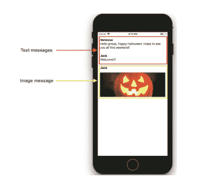

# 在表格视图中显示异构数据

> 原文：<https://dev.to/apium_hub/display-heterogeneous-data-in-a-table-view-46bo>

[移动应用](https://apiumhub.com/mobile-app-development-barcelona/)的一个常见发展是**使用表格**显示信息。当您有一个同构实体的集合时，这个任务可以很容易地完成，但是当这个集合有 n 个不同的实体时，这个任务就变得复杂了。在这篇文章中，我将展示一个如何使用适配器模式在表格视图中**显示异构数据的例子。公开的例子是一个消息应用程序，有两种类型的消息；文本和图像。**

[](https://res.cloudinary.com/practicaldev/image/fetch/s--v0yvXPLH--/c_limit%2Cf_auto%2Cfl_progressive%2Cq_auto%2Cw_880/https://apiumhub.com/wp-content/uploads/2019/04/Heterogeneous-data.png) 当我们面临在表格中显示异构数据集合的问题时，直接的解决方案是在方法“cellForRowAtIndexPath”中使用模式匹配来决定我们需要使用哪个单元格来显示集合中的当前实体。

```
func tableView(_ tableView: UITableView, cellForRowAt indexPath: IndexPath) -> UITableViewCell { 
            let currentItem = itemsArray[indexPath.row] 
            switch currentItem { 
            case let item as TextMessage:< 
                 let cell = tableView.dequeueReusableCell(withIdentifier: "TextMessageCell", for: indexPath) as! TextMessageCell< 
                 cell.configure(viewModel: item) 
                 return cell 
            case let item as ImageMessage: 
                 let cell = tableView.dequeueReusableCell(withIdentifier: "ImageMessageCell", for: indexPath) as! ImageMessageCell 
                 cell.configure(viewModel: item) 
                 return cell 
            default: 
                 fatalError("unsupported cell for type: \(currentItem)") 
            } 
} 
```

这种解决方案有几个缺点:

*   它是不可伸缩的，这意味着每当我们需要显示一个新类型的实体时，切换用例就会增加。
*   我们重复对 configure(viewModel:)方法的调用，该方法可能是单元接口的一部分。
*   因为我们没有严格类型化的实体数量，所以我们需要为开关提供一个默认情况。

## 适配器模式

[适配器模式](https://www.geeksforgeeks.org/adapter-pattern/)用于将一个接口转换成我们的系统将使用的另一个接口。

让我们看一个使用适配器模式的解决方案，使其可伸缩并避免重复代码。

该解决方案将包含两个组件:

*   适配器接口
*   适配器集合固定器(适配器映射)

首先，我们需要创建一个适配器接口，这个接口将具有基本的单元配置属性和配置。

```
protocol PostTableViewAnyCellAdapter { 
     var reuseIdentifier: String { get } 
     var preferredHeight: CGFloat { get } 
     func configure(cell: UITableViewCell, with viewModel: Post) 
} 
```

该接口的实现将接收模型和单元的泛型类型。

```
class PostCellAdapter: PostTableViewAnyCellAdapter where CellType.ViewModelType == ViewModelType { 
        var reuseIdentifier: String { 
            return CellType.reuseIdentifier 
        } 
        var preferredHeight: CGFloat { 
            return CellType.preferredHeight 
        } 
        init(tableView: UITableView) { 
            register(into: tableView) 
        } 
        func register(into tableView: UITableView) { 
             switch CellType.registerMethod { 
             case .nib(let nib): 
                 tableView.register(nib, forCellReuseIdentifier: 
CellType.reuseIdentifier) 
             case .classReference(let cellClass): 
                 tableView.register(cellClass, forCellReuseIdentifier: 
CellType.reuseIdentifier) 
             } 
      } 
      func configure(cell: UITableViewCell, with viewModel: Post) { 
           let typedCell = cell as! CellType 
           let typedViewModel = viewModel as! ViewModelType 
           typedCell.configure(viewModel: typedViewModel) 
      }
} 
```

然后我们创建一个类来保存这个适配器接口的集合。这个类将被称为适配器映射。

```
struct PostsAdapterMap { 
               typealias InternalMapType = [String: PostTableViewAnyCellAdapter] 
               private var internalMap = InternalMapType()

               subscript(viewModel: Post) -> PostTableViewAnyCellAdapter { 
                   let key = String(describing: type(of: viewModel)) 
                   return internalMap[key]! 
               } 
               mutating func add<CellType, ViewModelType>(adapter: PostCellAdapter<CellType, ViewModelType>) { 
                   let key = String(describing: ViewModelType.self) 
                   internalMap[key] = adapter 
               } 
} 
```

现在我们已经有了所有需要的组件，我们可以在视图控制器中使用它，只需创建一个适配器映射类的新实例。

```
var tableAdapter = PostsAdapterMap() 
```

为了将单元适配器注册到表视图，我们使用一对 UITableviewCell 子类和一个模型来创建适配器的实例:

```
let textAdapter = PostCellAdapter<TextMessageCell, TextMessage>(tableView: tableView)
tableAdapter.add(adapter: textAdapter) 
```

最后，我们的方法“cellForRowAtIndexPath”的新实现将如下所示:

```
func tableView(_ tableView: UITableView, cellForRowAt indexPath: IndexPath) -> UITableViewCell {
       let currentItem = itemsArray[indexPath.row]
       let currentAdapter = tableAdapter[currentItem]

       let cell = tableView.dequeueReusableCell(withIdentifier: currentAdapter.reuseIdentifier, for: indexPath)
       currentAdapter.configure(cell: cell, with: currentItem)

       return cell
} 
```

我们不再使用模式匹配直接配置单元视图类，而是使用适配器接口来接收模型和回收的单元视图。适配器映射将使用给定模型的适当方法来配置当前单元

这如何解决可伸缩性？如果我们需要在这个聊天应用程序中显示另一种类型的消息，比如说视频消息，我们只需要用它的配置方法创建单元视图，定义模型并将其添加到适配器映射中。适配器映射将处理一切，因此，我们的表视图数据源方法将保持不变。

帖子[以表格方式显示异构数据](https://apiumhub.com/tech-blog-barcelona/display-heterogeneous-data-table-view/)最早出现在 [Apiumhub](https://apiumhub.com) 上。