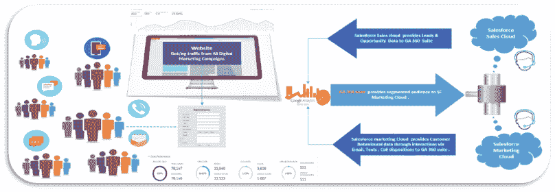
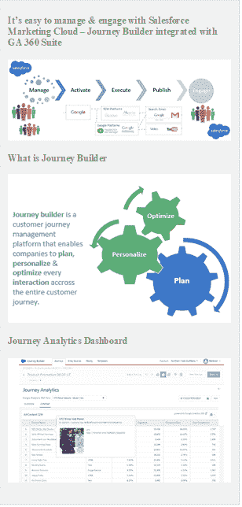
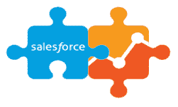
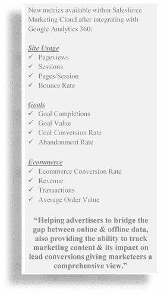

# Google Analytics 360 和 Salesforce 营销云集成

> 原文：<https://dev.to/girikon/google-analytics-360-salesforce-marketing-cloud-integration-2kh4>

Google Analytics 360 和 Salesforce 营销云集成

结合销售科学。

最后，来自网站的分析和通过电子邮件、文本和社交渠道在 Salesforce 中的活动生成的数据无缝协作，并通过 GA 360 套件与 [Salesforce 营销云的集成弥合了营销和销售之间的差距。](https://www.girikon.com/salesforce-marketing-cloud/)

帮助您投资正确的活动

作为任何企业中 CXO 团队的一员，CXO 总是面临着一种压力，要证明他们在特定活动上的投资是合理的。大多数企业使用 Google Analytics 360 suite (GA 360)来跟踪营销活动，使用 Salesforce 来跟踪销售运营。作为一个 CXO，你知道每个活动花费了你多少钱，但你不知道哪个活动或广告能产生最大的收入。有时你继续投资于回报率不高的渠道。

借助 IT 环境中的 GA connector，您可以:

*   知道哪个活动有利可图
*   知道什么在消耗你的时间和金钱
*   在不增加支出的情况下增加利润

在我最近的 B2B 实施中，我们发现了多种渠道，通过这些渠道，客户可以了解产品和服务——这些渠道包括社交媒体、电子邮件、付费和有机搜索、电话营销、展示广告，而不仅限于实体直邮。

衡量您的营销活动投资回报率

典型的 B2B 转化周期大约是 3-9 个月，客户在转化之前会在整个过程中使用各种营销接触点。为了分析每个渠道如何影响转化，大多数企业使用最后一次互动归因模型，这意味着在转化之前给予最后一个接触点完全的信任。这意味着所有其他接触点的贡献都被忽略了&花在这些接触点上的钱被认为是浪费了。企业之所以考虑最后一次点击或首次点击归因模型，是因为他们认为很难将所有数据放在一个地方。我们将在后续文章中详细介绍许多其他归因模型。

从集成中获得最大收益

通过网站、广告和电子邮件渠道的个性化体验，为营销人员提供更好的客户体验。

直到现在，营销人员发现很难理解和决定下一个最好的与客户的互动是什么。借助营销云，我们可以根据 GA 360 使用从销售云接收的销售线索和机会数据创建的归属，创建向特定受众发送电子邮件的旅程。当用户阅读电子邮件和电子邮件上的动作时，他们会进入网站页面。

电子邮件还携带旅程活动信息作为参数，然后传递给谷歌分析，以分析和确定流量来源&哪个渠道产生的收入最多。

随着 Salesforce Marketing Cloud 与 GA 360 suite 的集成，营销人员将拥有一套新的指标，这将有助于他们做出适当的决策，投资于正确的活动和渠道。

先决条件-作为一个企业，你需要谷歌分析 360 和销售队伍营销云。由于旅程构建器依赖于您拥有的版本，您可能需要额外付费来添加该产品。您可以联系您的 Salesforce 支持代表，讨论为您的企业启用 GA 360 & Salesforce 集成所涉及的定价。企业现在可以在营销云分析仪表板的单一视图中查看所有交互及其影响。

“Salesforce 很高兴与 Google 合作，携手将 Salesforce 营销云与@googleanalytics 360 集成。这是两全其美！[https://t.co/YsGbJsfK0](https://t.co/YsGbJsfK0)。马克·贝尼奥夫 5 月 21 日

“无论你的企业是大是小，你都需要以有效的方式推销你的产品。不要因为投资一个没有收获投资果实的渠道而输给你的竞争对手。这种整合将帮助您获得在营销活动上花费的每一分钱的价值，并弥合营销和销售团队之间的差距。作为 Salesforce 营销云合作伙伴，通过我们经验丰富的 Salesforce 营销云顾问，Girikon 将确保您的战略始终符合您的业务目标。”

Girikon 是一家 IT 咨询和开发公司，总部位于亚利桑那州凤凰城，在印度诺伊达设有开发中心，在澳大利亚墨尔本设有办事处。

我们在美国、印度和澳大利亚的全球办事处网络使 Girikon 能够快速响应客户的要求，从而有效地提供高质量的产品和服务。Girikon 拥有一支经验丰富的认证顾问团队，包括 Salesforce 架构师、开发人员、顾问和管理人员。我们的 MEAN Stack，Atlassian APP，Microsoft Dynamics CRM，Mobile APPs，JAVA，PHP，ASP，.网络和人工智能顾问和专业人士也提供首屈一指的服务。

我们的客户和服务种类繁多，从实施大型电子商务计划的财富 500 强公司到实施计费系统的中小型企业。

专业–Salesforce.com、云服务、Node.js、移动应用、Atlassian、定制软件开发、大数据分析、DevOps 自动化、SaaS 实施和集成、质量工程、项目管理和 PMO、电子商务、Salesforce 咨询、Salesforce 实施、Salesforce 开发、Salesforce 集成、Salesforce 迁移、Salesforce 咨询合作伙伴、 [Salesforce 顾问](https://www.girikon.com/salesforce-consulting-services/)和 Force.com

Girikon 的团队由充满活力、经验丰富且合格的专业人员组成，他们在 IT 领域的各个业务领域、软件/产品开发、设计、测试、维护和资源/人员配置选项方面拥有丰富的经验。

我们相信为我们的客户开发可扩展和简化的解决方案。

为了确保您的战略符合您的业务目标，请致电[sales@girikon.com](mailto:sales@girikon.com)联系我们

帖子[Google Analytics 360&sales force 营销云集成](https://www.girikon.com/blog/google-analytics-360-salesforce-marketing-cloud-integration/)首先出现在 [Salesforce 咨询公司|美国|亚利桑那州凤凰城](https://www.girikon.com/)上。