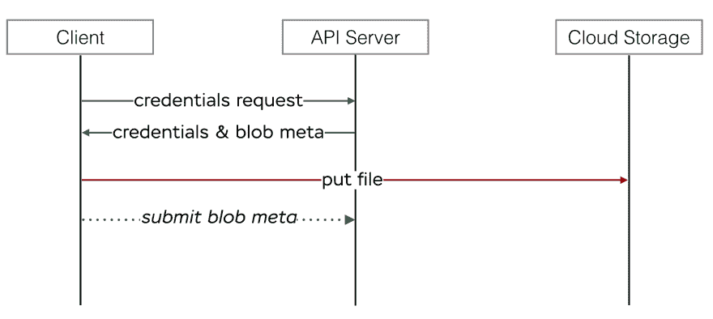
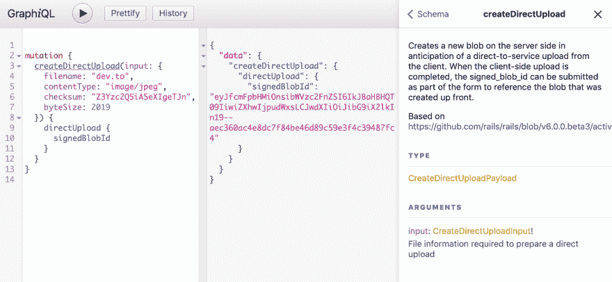

# 主动存储符合 GraphQL:直接上传

> 原文：<https://dev.to/evilmartians/active-storage-meets-graphql-direct-uploads-3n38>

*Part 2 可用[此处](https://dev.to/evilmartians/active-storage-meets-graphql-pt-2-exposing-attachment-urls-2mdn)T3】*

## 快乐的代码给快乐的人

我先来个强声明:**我是个快乐的人**。

这种快乐是多维度的，有些维度比其他维度带来更多的价值(而我今天说的不是最有价值的维度，抱歉)。

例如，我在工作中很开心，因为我终于有机会使用这样的“尖端技术”从零开始构建一个项目(如果我们可以这么说 15 年前的框架😉)技术，如 [**轨 6**](https://edgeguides.rubyonrails.org/6_0_release_notes.html) 。

信不信由你，我做了 5 年的 Rails 生产项目，连 Rails 5 都没碰过，只有 Rails 4！

“遗留 Rails 应用程序”是我的专长(顺便说一下，这是我即将到来的 [RailsConf](https://railsconf.com/program/sessions#session-832) 会议的主题)。

这些黑暗的日子在今年一月结束了[:我跑了`gem install rails --prerelease && rails new ***`。](https://weblog.rubyonrails.org/2019/1/18/Rails-6-0-Action-Mailbox-Action-Text-Multiple-DBs-Parallel-Testing/)

(其实是`rails new *** -d postgresql --skip-action-mailbox --skip-action-text --skip-action-cable --skip-sprockets --skip-spring --skip-test --skip-bundle`。)

我正在做的项目不是 100%的新代码库；它有很多最初为 Rails 4 编写的代码。

并且它有 [GraphQL](https://graphql.org) API 作为客户端(web 和移动应用程序)的主要入口点。

作为将旧代码库移植到新应用的一部分，我们从 [CarrierWave](https://github.com/carrierwaveuploader/carrierwave) 迁移到了[活动存储](https://edgeguides.rubyonrails.org/active_storage_overview.html)。体验很顺利。虽然主动存储有[一些](https://github.com/rails/rails/pull/34935) [缺失](https://github.com/rails/rails/pull/35390) [部分](https://github.com/rails/rails/pull/35290)，但它有自己的优势和*轨道*的简单性。

**注意:**如果你是主动存储的新手，可以看看我一年前和我的同事:[“Rails 5.2:主动存储和超越”](https://evilmartians.com/chronicles/rails-5-2-active-storage-and-beyond)写的帖子。

所以，是时候转向活动存储最显著的优势了:[直接上传](https://edgeguides.rubyonrails.org/active_storage_overview.html#direct-uploads)开箱即用。

## 主动储存前的寿命

首先，让我告诉你我们如何在 Rails 4 中处理文件上传。无论是 GraphQL 规范还是 [`graphql`](http://graphql-ruby.org/) Ruby gem 都没有指定一种正确烹饪文件上传的方式。

有一个[开源规范](https://github.com/jaydenseric/graphql-multipart-request-spec)，有不同语言的实现，包括 [Ruby](https://github.com/jetruby/apollo_upload_server-ruby) 。它“描述”了 [`Upload`](https://github.com/jetruby/apollo_upload_server-ruby/blob/2.0.0.beta.3/lib/apollo_upload_server/upload.rb) 标量类型，做了一些[框架中间件](https://github.com/jetruby/apollo_upload_server-ruby/blob/2.0.0.beta.3/lib/apollo_upload_server/middleware.rb)魔术般地将上传的文件作为变量传递，*透明地工作*。

听起来像是“即插即用”理论上。在实践中，它转化为“即插即用-n-播放-n-失败-n-修复-n-失败-n-修复”:

*   错误的客户端实现(特别是对于 React Native)
*   副作用由于一个不严格的 [`Upload`类型](https://github.com/jetruby/apollo_upload_server-ruby/blob/2.0.0.beta.3/lib/apollo_upload_server/upload.rb)(它不关心实际的对象*类型*)
*   阿波罗依赖(是的，我们说“再见！”到新版的阿波罗；但那是后话了)。

没有意外(和[没有警报](https://en.wikipedia.org/wiki/No_Surprises)😉)，我们决定去掉这个 hack，用一个好的老 REST 来上传文件。

接下来是直接上传的主动存储。

## 指挥上传🎥

顺便问一下，“直接上传”是什么？

该术语通常与云存储服务(例如，亚马逊 S3)结合使用，并表示以下内容:**客户端使用 API 服务器生成的凭证将文件直接上传到云存储，而不是使用 API 服务器上传文件**。

<figure>

[](https://res.cloudinary.com/practicaldev/image/fetch/s--pFzuQucc--/c_limit%2Cf_auto%2Cfl_progressive%2Cq_auto%2Cw_880/https://thepracticaldev.s3.amazonaws.com/i/6rv1ggpwgqi307zzbwxh.png)

<figcaption>Direct uploads diagram</figcaption>

</figure>

好消息——活动存储提供了一个服务器端 API 来处理直接上传和一个前端 JS 客户端[开箱即用](https://edgeguides.rubyonrails.org/active_storage_overview.html#direct-uploads)。

另一个好消息是——这个 API 是抽象的，可以与活动存储(即文件系统、S3、GCloud、Azure)支持的任何 [*服务*](https://edgeguides.rubyonrails.org/active_storage_overview.html#setup) 一起工作。这很好:您可以在本地使用文件系统，在生产中使用 S3，而不需要所有这些`if`和`else-`

然而，好消息总是伴随着坏消息。坏消息是 Active Storage(以及一般的 Rails)对 GraphQL 一无所知，而是依赖自己的 REST API 来检索直接上传凭证。

要在 GraphQL 中实现这一切，我们需要什么？

首先，使用 GraphQL API 获得直接上传凭证的能力(通过 [*突变*](https://graphql.org/learn/queries/#mutations) )。

其次，尽可能多地重用框架中的 JavaScript 代码，以避免重复发明轮子，这将是一件好事。

### `createDirectUpload`突变...

<figure>

[](https://res.cloudinary.com/practicaldev/image/fetch/s--Zk74RICj--/c_limit%2Cf_auto%2Cfl_progressive%2Cq_auto%2Cw_880/https://thepracticaldev.s3.amazonaws.com/i/re3jrbepmk0u4zxd0t97.png)

<figcaption>mutation preview in GraphiQL</figcaption>

</figure>

不幸的是，Rails 没有任何关于服务器端直接上传实现的文档。

我们所拥有的就是`DirectUploadsController` :
的[源代码](https://github.com/rails/rails/blob/v6.0.0.beta3/activestorage/app/controllers/active_storage/direct_uploads_controller.rb)

```
def create
  blob = ActiveStorage::Blob.create_before_direct_upload!(blob_args)
  render json: direct_upload_json(blob)
end

private

def blob_args
  params.require(:blob).permit(:filename, :byte_size, :checksum, :content_type, :metadata).to_h.symbolize_keys
end

def direct_upload_json(blob)
  blob.as_json(root: false, methods: :signed_id).merge(direct_upload: {
    url: blob.service_url_for_direct_upload,
    headers: blob.service_headers_for_direct_upload
  })
end 
```

看一下`checksum`参数:这是主动存储的众多*隐藏宝石*之一——内置文件内容验证。

当客户端请求直接上传时，它可以指定文件的校验和( [MD5](https://en.wikipedia.org/wiki/MD5) 哈希编码为 [Base64](https://www.google.com/url?sa=t&rct=j&q=&esrc=s&source=web&cd=3&cad=rja&uact=8&ved=2ahUKEwia_MD3mqvhAhUEVN8KHR22DBkQFjACegQIAhAB&url=https%3A%2F%2Fen.wikipedia.org%2Fwiki%2FBase64&usg=AOvVaw1QZr6n6e41rkPczxpoNpjT) )，服务(例如，活动存储本身或 S3)稍后将使用该校验和来验证上传的文件内容。

让我们回到 GraphQL。

GraphQL 变体非常像 Rails 控制器，因此将上面的代码转换成变体非常简单:

```
class CreateDirectUpload < GraphQL::Schema::Mutation
  class CreateDirectUploadInput < GraphQL::Schema::InputObject
    description "File information required to prepare a direct upload"

    argument :filename, String, "Original file name", required: true
    argument :byte_size, Int, "File size (bytes)", required: true
    argument :checksum, String, "MD5 file checksum as base64", required: true
    argument :content_type, String, "File content type", required: true
  end

  argument :input, CreateDirectUploadInput, required: true

  class DirectUpload < GraphQL::Schema::Object
    description "Represents direct upload credentials"

    field :url, String, "Upload URL", null: false
    field :headers, String,
          "HTTP request headers (JSON-encoded)",
          null: false
    field :blob_id, ID, "Created blob record ID", null: false
    field :signed_blob_id, ID,
          "Created blob record signed ID",
          null: false
  end

  field :direct_upload, DirectUpload, null: false

  def resolve(input:)
    blob = ActiveStorage::Blob.create_before_direct_upload!(input.to_h)

    {
      direct_upload: {
        url: blob.service_url_for_direct_upload,
        # NOTE: we pass headers as JSON since they have no schema
        headers: blob.service_headers_for_direct_upload.to_json,
        blob_id: blob.id,
        signed_blob_id: blob.signed_id
      }
    }
  end
end

# add this mutation to your Mutation type
field :create_direct_upload, mutation: CreateDirectUpload 
```

现在，要从服务器检索直接上传负载，您的 GraphQL 客户端必须执行以下请求:

```
mutation  {  createDirectUpload(input:  {  filename:  "dev.to",  # file name  contentType:  "image/jpeg",  # file content type  checksum:  "Z3Yzc2Q5iA5eXIgeTJn",  # checksum  byteSize:  2019  # size in bytes  })  {  directUpload  {  signedBlobId  }  }  } 
```

### ...和一些 JavaScript

**免责声明:**下面的 JS 实现只是一个草图，还没有经过实际测试(因为在我的项目中我们没有使用任何 Rails 的 JS 代码)。我只检查了它能编译。

要上传文件，客户端必须执行以下步骤:

*   获取文件元数据(文件名、大小、内容类型和校验和)
*   通过 API-`createDirectUpload`突变请求直接上传凭证和 blob ID
*   使用凭证上传文件(不涉及 GraphQL，HTTP PUT 请求)。

对于第 1 步和第 3 步，我们可以重用 Rails 附带的 JS 库中的一些代码(不要忘记将`"@rails/activestorage"`添加到您的`package.json`)。

我们来写一个`getFileMetadata`函数:

```
import { FileChecksum } from "@rails/activestorage/src/file_checksum";

function calculateChecksum(file) {
  return new Promise((resolve, reject) => {
    FileChecksum.create(file, (error, checksum) => {
      if (error) {
        reject(error);
        return;
      }

      resolve(checksum);
    });
  });
}

export const getFileMetadata = (file) => {
  return new Promise((resolve) => {
    calculateChecksum(file).then((checksum) => {
      resolve({
        checksum,
        filename: file.name,
        content_type: file.type,
        byte_size: file.size
      });    
    });
  });
}; 
```

[`FileChecksum`](https://github.com/rails/rails/blob/v6.0.0.beta3/activestorage/app/javascript/activestorage/file_checksum.js) 类负责计算所需的校验和，由 [`DirectUpload`](https://github.com/rails/rails/blob/v6.0.0.beta3/activestorage/app/javascript/activestorage/direct_upload.js#L16) 类中的活动存储器使用。

现在您可以使用这个函数来构建您的 GraphQL 查询负载:

```
// pseudo code
getFileMetadata(file).then((input) => {
  return performQuery(
    CREATE_DIRECT_UPLOAD_QUERY,
    variables: { input }
  );
}); 
```

现在是时候写一个函数直接上传文件到存储服务了！

```
import { BlobUpload } from "@rails/activestorage/src/blob_upload";

export const directUpload = (url, headers, file) => {
  const upload = new BlobUpload({ file, directUploadData: { url, headers } });
  return new Promise((resolve, reject) => {
    upload.create(error => {
      if (error) {
        reject(error);
      } else {
        resolve();
      }
    })
  });
}; 
```

我们完整的客户端代码示例如下:

```
getFileMetadata(file).then((input) => {
  return performQuery(
    CREATE_DIRECT_UPLOAD_QUERY,
    variables: { input }
  ).then(({ directUpload: { url, headers, signedBlobId }) => {
    return directUpload(url, JSON.parse(headers), file).then(() => {
      // do smth with signedBlobId – our file has been uploaded!
    });
  });
}); 
```

看来我们成功了！希望这有助于您构建令人敬畏的新 Rails + GraphQL 项目)

> 对于更真实的例子，请查看我们的 React 本地应用程序的这个片段:[https://gist . github . com/saion aro/7 ee 0 e 2c 02749 e 2729 DC 429 c 9 e 9 BFA 7 f 3](https://gist.github.com/Saionaro/7ee0e2c02749e2729dc429c9e9bfa7f3)

## 总之，还是怎么处理`signedBlobId`

让我提供一个简单的例子来说明我们如何在应用程序中使用签名的 blob id——`attachProfileAvatar`突变:

```
class AttachProfileAvatar < GraphQL::Schema::Mutation
  description <<~DESC Update the current user's avatar
   (by attaching a blob via signed ID) DESC

  argument :blob_id, String,
            "Signed blob ID generated via `createDirectUpload` mutation",
            required: true

  field :user, Types::User, null: true

  def resolve(blob_id:)
    # Active Storage retrieves the blob data from DB
    # using a signed_id and associates the blob with the attachment (avatar)
    current_user.avatar.attach(blob_id)
    {user: current_user}
  end
end 
```

就是这样！

* * *

阅读更多关于 https://evilmartians.com/chronicles 的文章！