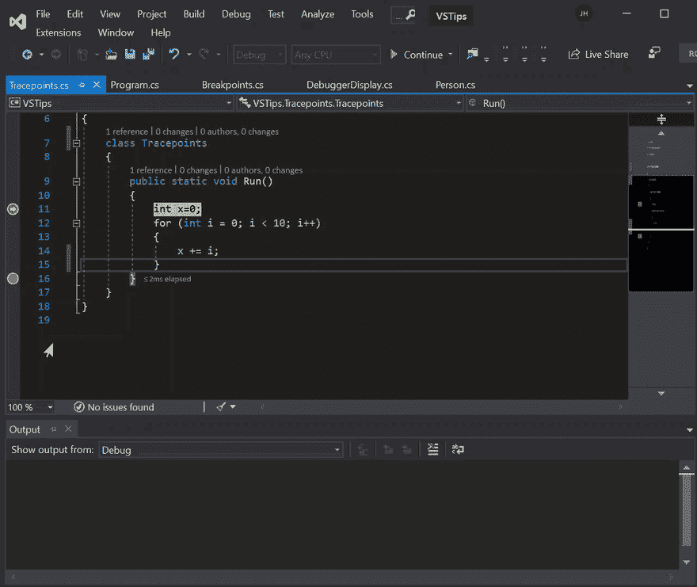

# Visual Studio 提示-跟踪点

> 原文：<https://dev.to/hutchcodes/visual-studio-tips-trace-points-4kd6>

跟踪点并不是一个新特性，它们从 2005 年就存在于 Visual Studio 中，但对我来说是一个新特性。我只是在为这个系列的帖子做研究时偶然发现了它们。跟踪点允许你把一个断点变成一个对`Debug.WriteLine()`的调用。

跟踪点只是一种特殊的断点，它允许您将消息记录到输出窗口并继续执行。这在断点处停止会使重现 bug 变得困难或不可能的情况下非常有用。

由于跟踪点只是一种断点，您还可以对它们设置条件，并像管理断点一样管理它们。要了解更多关于断点的信息，请看这篇文章。

要设置跟踪点，您需要设置一个普通断点，然后进入该断点的设置并检查`Actions`。这将显示一个文本框，让您创建日志消息，并显示另一个复选框，指定执行是应该停止还是继续。

