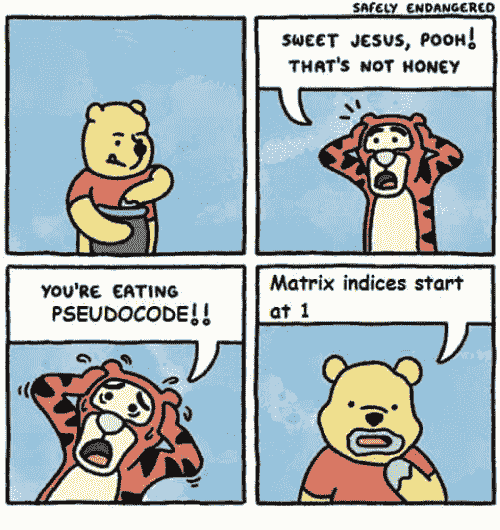
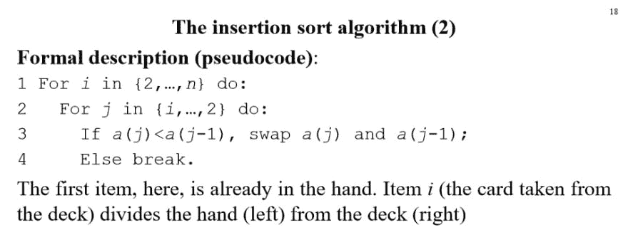
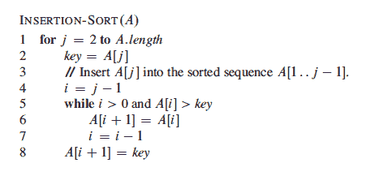
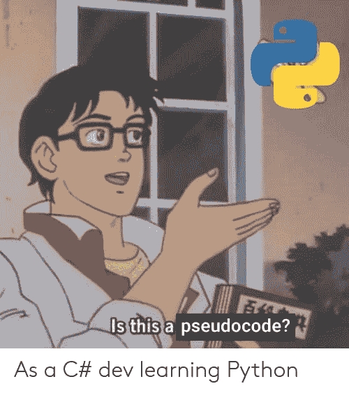

# 什么是伪代码？

> 原文：<https://dev.to/natreid/what-is-pseudocode-21n>

我们都听说过，而且作为开发者，我们可能都已经尽了自己的一份力量。但是伪代码到底是什么？

[](https://res.cloudinary.com/practicaldev/image/fetch/s--RxXcOX7g--/c_limit%2Cf_auto%2Cfl_progressive%2Cq_auto%2Cw_880/https://pics.me.me/safely-endangered-sweet-jesus-pooh-thats-not-honey-matrix-indices-29092044.png)

伪代码是语法和我们人类思想之间的自由形式的桥梁。这就是我们如何交流和形成一个算法或程序的概念，而不用完全写出来。我认为伪代码是我们用来交流思想的工具，就像任何工具一样，你必须学会使用它。

用纸和笔写出伪代码是理清思路的无价工具。但是当你第一次尝试伪代码的时候，有时候你脑子里完全有意义的东西对其他人来说完全是胡言乱语。

这种挫败感让我想到一个问题:一般来说，每种语言是否都有一种标准的编写方式？

我找到的简短答案是:不。伪代码是一个描述自由形式组织的松散术语——标准的伪代码就像标准的头脑风暴过程，可能存在，但这有点违背了表达个人想法的目的。

我发现的最长的答案是，它没有明确的语法/语言，但是有一些常规的规则可以改进你的伪代码，增加它作为一种交流工具的功效。

伪代码存在于语法和人类语言之间。一般来说，这意味着你要避免用简单的英语写作，因为那会给(错误的)解释留下太多的空间。

另一个显而易见但可能被无意中打破的规则是，用多种语言中不同的语法给你的伪代码调味。如果您经常使用多种语言，您的伪代码可能会变成 javascript-ruby 漩涡。

[](https://res.cloudinary.com/practicaldev/image/fetch/s--qAdfKz7B--/c_limit%2Cf_auto%2Cfl_progressive%2Cq_auto%2Cw_880/https://img.buzzfeed.com/buzzfeed-static/static/2017-07/12/20/enhanced/buzzfeed-prod-fastlane-02/original-grid-image-28003-1499905641-6.jpg%3Fcrop%3D990:990%3B0%2C8%26downsize%3D400:%2A%26output-format%3Dauto%26output-quality%3Dauto)

我知道漩涡是麦当劳最好的软食，但是这个

```
def occurrences (array, substring)
    let count = 0
    array.each do |x|
        x => {count += the number of times substring  appears in x}
    end 
    return count
end 
```

一点也不好吃。

你不应该用伪代码做的事情通常是直观的。所以，如果你正在写伪代码，并且开始感觉太抽象或者太怪异——很可能是这样。

一旦你经历过几次伪代码，避免这些问题通常是显而易见的，但是编写简洁有效的伪代码并不总是那么容易。

以下是我遵循的一些规则，以保持事情的一致性:

*   用原始语法编写函数调用和基本操作:这使得伪代码更容易翻译成真正的代码，让您专注于困难的部分。
*   使用适当的缩进和括号，便于结构和翻译
*   在任何相关的地方使用该语言的保留字:结构结构结构。
*   就像你的实际程序一样(希望是)**使用描述性的变量名**:这对于任何编程来说都是一个很好的实践，因为伪代码是明确针对人脑的，所以使用人脑容易识别的名字尤其重要。

归根结底，伪代码的质量主要取决于它的结构有多清晰。编写结构良好的伪代码可以让没有经验的开发人员立即(如果粗略的)理解真正复杂的程序。

除了可视化地构造你的伪代码和使用你要翻译的语言的基本语法之外，好的伪代码有一系列强大的实现。以这两个插入排序伪代码为例:

[ ](https://res.cloudinary.com/practicaldev/image/fetch/s--obuuCvmz--/c_limit%2Cf_auto%2Cfl_progressive%2Cq_auto%2Cw_880/https://i.stack.imgur.com/3KbgU.jpg) [ ](https://res.cloudinary.com/practicaldev/image/fetch/s--gfsoPk7T--/c_limit%2Cf_auto%2Cfl_progressive%2Cq_auto%2Cw_880/https://d2vlcm61l7u1fs.cloudfront.net/media%252Fc69%252Fc69ab81e-9934-472c-b935-f8443a0e1dde%252Fphp1cwAhU.png)

其中一个主要是简单的英语，但即使初学者也能很快理解，另一个是语法复杂的数学伪代码。这两个都是用于不同目的的相同算法的有效且有用的伪代码。第一个是介绍性的教学工具，第二个是实现插入排序的更具体的指南。无论你倾向于更多的语义还是更多的语法伪代码，都是你如何思考和思考的产物，两者都很棒！

在某些情况下，您的伪代码可能非常符合语法并接近最终产品，而在其他情况下，它将更加语义化和自由形式-有时它会开始松散，并随着想法的发展而用更多的语法进行精炼。

或者你的伪代码将是轻量级的语法，并且仍然接近最终产品，因为你使用的是 Python！
[T3】](https://res.cloudinary.com/practicaldev/image/fetch/s--_DZGJt6P--/c_limit%2Cf_auto%2Cfl_progressive%2Cq_auto%2Cw_880/https://pics.me.me/is-this-a-pseudocode-as-a-c-dev-learning-python-42171336.png)

如果你不经常写伪代码，就自己练习一下，看看你能用不同数量的实际语法描述你潜在的或现有的程序有多准确。

你的队友会感谢你用你得心应手的伪代码技巧节省了这么多时间，你也会感谢你自己改进了你思考代码的方式，所以今天就写一些伪代码吧！