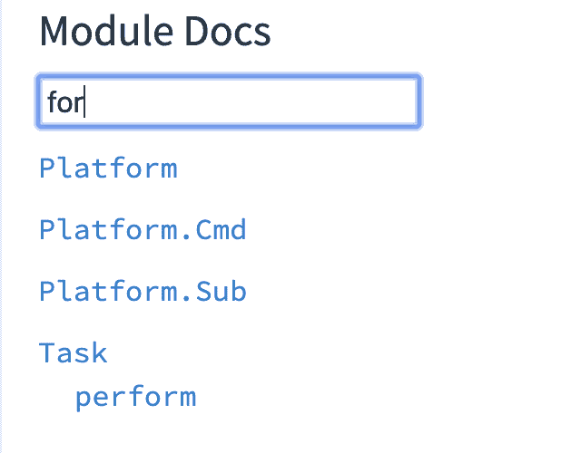

# 埃尔姆:那个拿走我 for-loops 的混蛋。

> 原文：<https://dev.to/rhg/elm-the-jerk-that-took-away-my-for-loops-1djh>

## 美好的旧时光

我第一次编写代码是在我高中三年级的时候。

那是 2010 年，她的名字叫 Java。

```
System.out.println("Hello, Ryan!"); 
```

Enter fullscreen mode Exit fullscreen mode

但是让我们假设她的名字是 Javascript:

```
console.log('Hello, Ryan!') 
```

Enter fullscreen mode Exit fullscreen mode

(*哎，少打字...*)

很快，我发现自己对各种各样的人说“你好”。

```
console.log('Hello, Ryan!')
console.log('Hello, Scott!')
console.log('Hello, mom!') 
```

Enter fullscreen mode Exit fullscreen mode

生活很容易...直到它不是。

## 感觉愚蠢

我的朋友:瑞安，你在做什么

**我:**“不知道。”

我的朋友:“你应该用 for 循环来做这件事。”

**我:**“窟。”

**我的朋友:**

```
var names = [ 'Ryan', 'Scott', 'mom' ]

for (var i = 0; i < names.length; i++) {
  var name = names[i]
  console.log('Hello, ' + name + '!')
} 
```

Enter fullscreen mode Exit fullscreen mode

**我:**“……”

**还我:**“窟。”

**我的伙伴:**“这并不太难。就做一个字符串数组，叫做“名字”。从那里，我们做一个 for 循环:

1.  说`var i = 0;`从零开始索引。
2.  我们说`i < names.length`来告诉 for 循环何时停止循环。
3.  然后键入`i++`,这样它在每次被调用后都会递增。

变量`i`将是 0、1 和 2。您可以使用它来索引数组以获取名称，然后使用该名称变量，这样就不必重复重复的“Hello”部分。"

**我:**“窟。”

## 感觉不笨

第一次见到 for 循环时，我有很多疑问:

1.  "索引到数组中？"
2.  “他们从 0 开始计数？”
3.  “为什么 i++没有分号？”

复制粘贴`console.log`语句很容易！For 循环向我介绍了许多新概念。经过一些练习，我熟悉了那些概念。

还不算太糟。很快，我就在任何地方使用它们了！

更好的是，我去哪里都带着 for 循环:Java、C#、Javascript、C、C++。

For-loops 是我的生命。生活是美好的！

...直到我遇见了榆树。

## 感觉反傻

快进:

*   我的名字仍然是瑞安
*   我在城里有一份制作网站的工作。
*   我是一个 JS 专业人员(或者至少我可以添加两个数字)

```
function add (a, b) {
  return a + b
} 
```

Enter fullscreen mode Exit fullscreen mode

但是在回家的火车上，我看了一个叫埃文的人做的鼓舞人心的技术演讲。

他设计了一些东西，让网络编程对人们来说更好！

那一年是 2016 年，她的名字叫榆树。

```
add a b = a + b 
```

Enter fullscreen mode Exit fullscreen mode

(*哎，少打字*)

语法绝对令人毛骨悚然。它看起来一点也不像 JS！

但是 HTML 和 CSS 都没有——我学会了这些！

就像 for 循环一样，这需要一点点的练习。

于是我跟着官方指南，在#初学者 Slack 频道提问，甚至开始把我的逗号放在*左侧*。

```
[ "who"
, "have"
, "I"
, "become??"
] 
```

Enter fullscreen mode Exit fullscreen mode

很疯狂，对吧？

接下来，这个 HTML 模板:

```
<!-- view.html -->
<div class="app">
  <p>Hello, Ryan!</p>
  <p>Hello, Scott!</p>
  <p>Hello, mom!</p>
</div> 
```

Enter fullscreen mode Exit fullscreen mode

变成了这个榆树函数:

```
view =
    div [ class "app" ]
        [ p [] [ text "Hello, Ryan!" ]
        , p [] [ text "Hello, Scott!" ]
        , p [] [ text "Hello, mom!" ]
        ] 
```

Enter fullscreen mode Exit fullscreen mode

哈哈，真是轻而易举！

## 感觉自己变笨了

等一下...看看这些复制品！

我知道-我会抓住我的可靠的 for-loop！

让我们在 Elm 文档中找到我正在寻找的函数:

[](https://res.cloudinary.com/practicaldev/image/fetch/s--s1ZEEfRE--/c_limit%2Cf_auto%2Cfl_progressive%2Cq_auto%2Cw_880/https://thepracticaldev.s3.amazonaws.com/i/boniv00l4xkldyfrzokx.png)

天哪...Evan *忘记了*实现 for 循环。

多么菜鸟的错误。

所以我跳上了松弛，找出该怎么办。

一个友好的 Elm 陌生人让我知道`List.map`是我正在寻找的功能。

**我:**“窟。”

**一个友好的榆树陌生人:**

```
names =
    [ "Ryan", "Scott", "mom" ]

viewParagraph name =
    p [] [ text ("Hello, " ++ name ++ "!") ]

view =
    div [] (List.map viewParagraph names) 
```

Enter fullscreen mode Exit fullscreen mode

**我:**“窟。”

一个友好的榆树陌生人:“lol，noob”

(*开个玩笑，我从来没被人说是榆树上的菜鸟*

一个友好的榆树陌生人:“让我们把它分解一下。

`List.map`只是一个函数，就像`view`或者`viewParagraph`。

它接受两个输入:

1.  将“事物”转化为“其他事物”的功能

2.  “事情”的清单。

如果你给它这些输入，它会返回一个“其他东西”的列表。

```
List.map : (things -> otherThings) -> List things -> List otherThings 
```

Enter fullscreen mode Exit fullscreen mode

在*你的*例子中，你有一个“字符串”列表，你想把它变成一个“HTML”列表。

所以你的“东西”是“字符串”，你的“其他东西”是“HTML”！

```
List.map : (String -> Html msg) -> List String -> List (Html msg) 
```

Enter fullscreen mode Exit fullscreen mode

只需告诉`List.map`如何将一个“字符串”变成“HTML 元素”(`viewParagraph`)，并给它你的“字符串”列表(`names`)。

您将得到您的“HTML”列表，这就是您可以打印到页面上的内容。"

**我:**“……”

**也是我:**“我很害怕。”

## 感觉不傻

在我对`List.map`进行了一些练习后，我开始掌握它的窍门。

不久之后，我发现 JavaScript 也有`map`功能！

而且已经很久了！

```
function sayHello (name) {
  console.log('Hello, ' + name + '!')
}

[ 'Ryan', 'Scott', 'mom' ].map(sayHello) 
```

Enter fullscreen mode Exit fullscreen mode

Elm 强迫我用他们奇怪的循环装置。

我觉得被耍了！但后来我更喜欢了。

现在我只在博客文章中使用 for-loops。

## 所以谢了，埃文。

我很高兴你忘了 for 循环。

另外，你的演讲相当精彩。

**感谢阅读！** ❤️