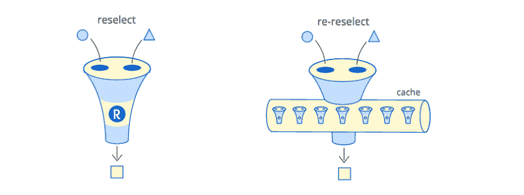
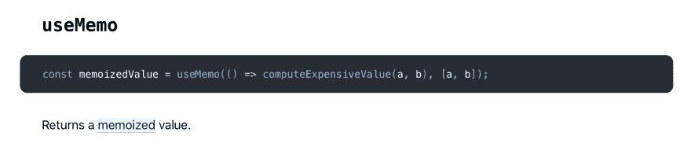

# 记忆勿忘我炸弹

> 原文：<https://dev.to/thekashey/memoization-forget-me-bomb-34kh>

你听说过`memoization`吗？顺便说一句，这是一件超级简单的事情——只要记住你从第一次函数调用中得到的结果，并使用它而不是第二次调用它——不要毫无理由地调用真实的东西，不要浪费你的时间。

跳过一些密集型操作是一种非常常见的优化技术。每次你可能不做某事的时候——不要做。尽量使用缓存— `memcache`、`file cache`、`local cache` —任意缓存！后端系统的必备工具，也是过去和现在任何后端系统的关键部分。

> 明白了吗？算了吧！

[](https://res.cloudinary.com/practicaldev/image/fetch/s--PTGEcEf0--/c_limit%2Cf_auto%2Cfl_progressive%2Cq_auto%2Cw_880/https://thepracticaldev.s3.amazonaws.com/i/znvvvubx5wtlp9s8dzna.png)

# 记忆与缓存

> 记忆化就像缓存。只是有点不同。不是 cache，姑且称之为 kashe 吧。

长话短说，但是记忆化不是缓存，也不是永久缓存。它可能是服务器端的，但不可能也不应该是客户端的缓存。更多的是关于可用资源、使用模式和使用原因。

## 问题——缓存需要一个“缓存键”

缓存使用一个**字符串**缓存`key`来存储和获取数据。构造一个唯一的、可用的键已经是一个问题了，但是你必须对数据进行序列化和反序列化，然后再存储在基于字符串的介质中……简而言之，缓存可能没有你想象的那么快。尤其是分布式缓存。

## 记忆不需要任何缓存键

同时，记忆不需要钥匙。*通常** 它按原样使用参数，不试图从它们创建单个键，也不像缓存通常做的那样，使用一些全局可用的共享对象来存储结果。

> 内存化和缓存的区别在 **API 接口**！

*通常** 不代表永远。 [Lodash.memoize](https://github.com/lodash/lodash/blob/4.17.11/lodash.js#L10547) 默认情况下使用`JSON.stringify`将传递的参数转换成字符串缓存(有没有其他方法？不要！).因为他们要用这个键来访问一个内部对象，保存一个缓存的值。 [fast-memoize](https://community.risingstack.com/the-worlds-fastest-javascript-memoization-library/) “最快的记忆库”也是如此。两个命名库都不是内存化库，而是缓存库。

> 值得一提的是，JSON.stringify 可能比一个函数慢 10 倍，你要记住。

显然，这个问题最简单的解决方案是不使用缓存键，也不使用那个键访问一些内部缓存。还记得你最后一次被传唤的理由吗？像[memoizeric](https://github.com/thinkloop/memoizerific)或者[重新选择](https://github.com/reduxjs/reselect)做。

> Memoizerific 可能是你唯一想使用的通用缓存库。

# 缓存大小

所有库之间的第二大区别是缓存大小和缓存结构。

你有没有想过——为什么`reselect`或`memoize-one`只有一个，最后的结果？不是为了*“不使用缓存键来存储一个以上的结果”*，而是因为**没有理由存储一个以上的结果**。

…它更多的是关于:

*   可用资源——单个缓存行是非常资源友好的
*   使用模式——记住“原地”的东西是一个好的模式。“就地”你通常只需要一个，最后一个，结果。
*   使用的理由——模块化、隔离和内存安全是很好的理由。就缓存冲突而言，不与应用程序的其余部分共享缓存更安全。

# 单一结果？！

是的——唯一的结果。一个结果是记忆了一些经典的东西，比如记忆了的斐波那契数生成(你可能会在每篇关于记忆的文章中找到一个例子*)**是不可能的**。但是，通常，你在做别的事情——谁需要前端的斐波那契数列？在后端？现实世界的例子与抽象的*相去甚远。**

 *但是，关于单值记忆类型还有两个大问题。

## 问题 1——它“脆弱”

默认情况下——所有参数都应该匹配，恰好是“===”相同。如果一个论点不匹配，游戏就结束了。即使这来自记忆化的想法——那可能不是你现在想要的东西。我的意思是——你想尽可能多地、尽可能频繁地回忆。

> 即使缓存未命中也是缓存擦除爆头。

“现在”和“过去”之间有一点点不同——不可变的数据结构，例如在 Redux 中使用的。

```
const getSomeDataFromState = memoize(state => compute(state.tasks)); 
```

好看吗？向右看？然而，当任务没有改变时，状态可能会改变，您只需要匹配任务。

结构选择器在这里用他们最强的战士**重新选择**来拯救世界，听候你的召唤。重新选择不仅仅是记忆库，它的力量来自记忆**级联**，或者透镜(它们不是，但是把选择器想象成光学透镜)。

```
// every time `state` changes, cached value would be rejected
const getTasksFromState = createSelector(state => state.tasks);
const getSomeDataFromState = createSelector(
  // `tasks` "without" `state`
  getTasksFromState,   // <---------- 
  // and this operation would be memoized "more often"
  tasks => compute(state.tasks) 
); 
```

因此，在不可变数据的情况下——你总是必须首先**“聚焦”到你真正需要的数据块，然后——执行计算，否则缓存将被拒绝，所有记忆化背后的想法将会消失。**

 **这实际上是一个大问题，尤其是对新手来说，但是作为不可变数据结构背后的思想，它有一个显著的好处- **如果某样东西没有被改变-它就没有被改变。如果某个东西发生了变化——很可能就是发生了变化**。这给了我们一个超级快速的比较，但有一些假阴性，就像第一个例子。

> 这个想法是关于“关注”你所依赖的数据

有两个时刻我应该提到:

*   `lodash.memoize`和`fast-memoize`正在将您的数据转换成一个字符串，用作一个键。这意味着它们 1)不快 2)不安全 3)可能产生误报——一些**不同的数据**可能有**相同的字符串表示**。这可能会提高“缓存热率”，但实际上是一件非常糟糕的事情。
*   有一种 ES6 代理方法，可以跟踪所有使用过的给定变量，并且只检查重要的键。虽然我个人想创建无数的数据选择器——你可能不喜欢或不理解这个过程，但可能想要开箱即用的适当记忆——然后使用 [memoize-state](https://github.com/theKashey/memoize-state) 。

## 问题 2——是“一条缓存线”

无限的缓存大小是一个杀手。只要内存非常有限，任何不受控制的缓存都是杀手。所以——所有最好的库都是“一个缓存行长”。这是一个功能和强大的设计决策。我只是写了它是多么正确，而且，相信我——这是一件**真正正确的事情**，但它仍然是一个问题。一个大问题。

```
const tasks = getTasks(state);

// let's get some data from state1 (function was defined above)
getDataFromTask(tasks[0]); 
// 🚀
equal(getDataFromTask(tasks[0]), getDataFromTask(tasks[0])) 
//🔥
getDataFromTask(tasks[1]); 
// a different task? What the heck?
// oh! That's another argument? How dare you!?
// TLDR -> task[0] in the cache got replaced by task[1]
🤷‍♂️ you cannot use getDataFromTask to get data from different tasks 
```

一旦同一个选择器不得不处理不同的源数据，甚至更多的源数据——一切都完了。而且很容易碰到这样的问题:

*   只要我们使用选择器从一个状态中获取任务，我们就可以使用相同的选择器从一个任务中获取某些东西。激烈来自于 API 本身。但它不工作，那么你只能记住最后一次调用，但必须与多个数据源。
*   多个 React 组件也有同样的问题——它们都是一样的，只是有一点不同，获取不同的任务，删除彼此的结果。

有 3 种可能的解决方案:

*   在重复的情况下，使用 mapStateToProps 工厂。它将创建每个实例的记忆。

```
const mapStateToProps = () => {
   const selector = createSelector(...); 
   // ^ you have to define per-instance selectors here
   // usually that's not possible :) 
   return state => ({
      data: selector(data), // a usual mapStateToProps
   });
} 
```

*   第二个变体几乎相同(对于 redux 也是如此)——它是关于使用[重新选择](https://github.com/toomuchdesign/re-reselect)。这是一个复杂的库，通过区分组件可以化险为夷。它可以理解，新的调用是针对“另一个”组件的，并且它可以为“前一个”组件保留缓存。

这个库可以帮助你“保留”记忆缓存，但不能删除它。尤其是因为它正在实现 5(五！)适合任何情况的不同缓存策略。那是一股难闻的气味。选错了怎么办？你记住的所有数据——你迟早会忘记的。重点不在于记住最后一次函数调用——重点是在适当的时候忘记它。不要太快，破坏记忆，也不要太晚。

> 明白了吗？现在算了吧！第三种变体在哪里？？

# 稍作停顿

停下来。放松点。做一个深呼吸。回答一个简单的问题-目标是什么？我们必须做些什么来达到目标？什么能拯救这一天？

> 提示:“缓存”在哪里！

[](https://res.cloudinary.com/practicaldev/image/fetch/s--iOgK4cbc--/c_limit%2Cf_auto%2Cfl_progressive%2Cq_auto%2Cw_880/https://thepracticaldev.s3.amazonaws.com/i/ocqzv58ryy472thyu1wy.jpeg)

“缓存”在哪里？是的，这是一个正确的问题。谢谢你的提问。答案很简单——它位于一个闭包里。在一个记忆函数的隐藏点。举个例子——这里是`memoize-one`代码:

```
function(fn) {
  let lastArgs;  // the last arguments
  let lastResult;// the last result   <--- THIS IS THE CACHE
// the memoized function
const memoizedCall = function(...newArgs) {
    if (isEqual(newArgs, lastArgs)) {
      return lastResult;
    }
    lastResult = resultFn.apply(this, newArgs);
    lastArgs = newArgs;
    return lastResult;
  };
return memoizedCall;
} 
```

您将获得一个`memoizedCall`，它将保存最近的结果，在它的本地闭包内，除了 memoizedCall，任何人都不能访问。一个安全的地方。这是一个安全的地方。

`Reselect`做同样的事情，唯一的方法是创建一个“fork ”,用另一个 cache——创建一个新的 memoization 闭包。

但是(另一个)主要问题是——它(缓存)什么时候会“消失”？

> TLDR:当函数实例被垃圾收集器吃掉时，它就和函数一起“消失”了。

实例？实例！那么——每个实例的记忆是怎么回事？在 [React 文档](https://reactjs.org/blog/2018/06/07/you-probably-dont-need-derived-state.html#what-about-memoization)中有一整篇关于它的文章

简而言之——如果你使用基于类的 React 组件，你可以:

```
import memoize from "memoize-one";
class Example extends Component {
  filter = memoize(          // <-- bound to the instance
    (list, filterText) => list.filter(...);
  // ^ that is "per instance" memoization
  // we are creating "own" memoization function
  // with the "own" lastResult
render() {
    // Calculate the latest filtered list. 
    // If these arguments haven't changed since the last render, 
    // `memoize-one` will reuse the last return value.
    const filteredList = this.filter(something, somehow);
    return <ul>{filteredList.map(item => ...}</ul>
  }
} 
```

那么——在哪里存储**“last result”**？在内存化的**过滤器**的局部范围内，在这个类实例内。它什么时候会“消失”？

这一次，它将随着一个类实例“消失”。一旦组件被卸载，它就消失得无影无踪。这是一个真正的“每个实例”，您可以使用`this.lastResult`来保存一个时态结果，具有完全相同的“记忆化”效果。

## 有什么反应。钩住

我们越来越近了。Redux 挂钩有几个可疑的命令，可能是关于内存化的。喜欢- `useMemo`、`useCallback`、`useRef`

[](https://res.cloudinary.com/practicaldev/image/fetch/s--C-LG_ZiC--/c_limit%2Cf_auto%2Cfl_progressive%2Cq_auto%2Cw_880/https://thepracticaldev.s3.amazonaws.com/i/bcaigenjb8t9hnpe0oho.png)

> 但问题是，这次它在哪里存储一个记忆值？

简而言之——它把它存储在“钩子”里，在 VDOM 元素的一个特殊部分，即与当前元素相关的纤维里。在并行数据结构中。

不那么短——钩子正在改变你的程序工作方式，把你的函数移到另一个函数中，在父闭包的*隐藏点中有一些变量。这样的函数被称为*可挂起的*或*可恢复的*函数-协程。在 JavaScript 中，它们通常被称为`generators`或`async functions`。*

但这有点极端。在一个很短的时间内，Memo 将存储的值存储在这里。只是“这个”有点不一样。

> 如果我们想创建一个更好的记忆库，我们应该找到一个更好的“这个”。

Zing！

[](https://res.cloudinary.com/practicaldev/image/fetch/s--ZDQxOGpg--/c_limit%2Cf_auto%2Cfl_progressive%2Cq_66%2Cw_880/https://thepracticaldev.s3.amazonaws.com/i/269y6jgh6hdi9vs5uuyo.gif)

# WeakMaps！

是啊！孬种！存储 key-value，这里的 key 应该是 this，只要 WeakMap 不接受除 this 以外的任何东西，即“objects”。

让我们创建一个简单的例子:

```
const createHiddenSpot = (fn) => {
  const map = new WeakMap(); // a hidden "closure"
  const set = (key, value) => (map.set(key, value), value);
  return (key) => { 
     return map.get(key) || set(key, fn(key))
  }
}
const weakSelect = createHiddenSpot(selector);
weakSelect(todos);    // create a new entry
weakSelect(todos);    // return an existing entry
weakSelect(todos[0]); // create a new entry
weakSelect(todos[1]); // create a new entry
weakSelect(todos[0]); // return an existing entry!
weakSelect(todos[1]); // return an existing entry!!
weakSelect(todos);    // return an existing entry!!! 
```

这非常简单，而且非常“正确”。所以“它什么时候会消失”？

*   忘记 weakSelect，整个“地图”都会消失
*   忘记 todos[0],他们的弱入口就会消失
*   忘记待办事项——记忆的数据将会消失！

> 很清楚什么时候某样东西会“消失”——只有在它应该消失的时候！

神奇的是，所有的重选问题都消失了。激进记忆化的问题——也是一个问题。

这种方法**记住**的数据，直到**忘记**为止。这令人难以置信，但是为了更好地记住一些事情，你必须能够更好地忘记它。

唯一持久的是——为这种情况创建一个更健壮的 API

# Kashe -是缓存

kashe 是一个基于 WeakMap 的记忆库，可以节省您的时间。

##  [喀什](https://github.com/theKashey) / [喀什](https://github.com/theKashey/kashe)

### 基于 weakmaps 的记忆库。🤯有时缓存是 kashe

<article class="markdown-body entry-content container-lg" itemprop="text">

# 喀什〔t0〕🔥

It's like **cache**, but with forget-me-bomb... remember it? No
[ ](https://www.npmjs.com/package/kashe) [](https://travis-ci.org/theKashey/kashe) 

一个基于 WeakMap 的内存库，用于更好更安全的缓存

## 记忆化

记忆是很酷的技术。但是它可靠*安全*吗？

`lodash.memoize`、`memoize-one`、`React.useMemo`有什么区别？

*   lodash.memoize 是个很酷的东西。但是默认情况下，它有无限的缓存大小。
*   只有记得最近的争论和结果。不需要担心**缓存破坏**机制，例如 maxAge、maxSize、exclusions 等等，这些机制容易导致**内存泄漏**。
*   [react.useMemo](https://reactjs.org/docs/hooks-reference.html#usememo) 是最伟大的。仍然只记忆**一个**调用，但是在每个组件级别上这样做`useMemo`的缺点是反应。您不能在功能组件之外使用它。

那么`reselect`，一个为整个`redux`生态系统提供动力的工具呢？还- **单个缓存项**。

*   它对服务器端友好吗？不，服务器处理许多请求…

</article>

[View on GitHub](https://github.com/theKashey/kashe)

这个库公开了 4 个函数

*   `kashe`-用于记忆。
*   `box` -对于前缀记忆，到*增加*记忆的几率。
*   `inbox` -嵌套前缀记忆化，以*减少*变化的记忆化
*   `fork` -到*叉*(明显)记忆化。

## 【kashe(fn)=>记忆码(…args)

它实际上是上一个示例中的 createHiddenSpot。它将使用第一个参数作为内部 WeakMap 的密钥。

```
const selector = (state, prop) => ({result: state[prop]});
const memoized = kashe(selector);
const old = memoized(state, 'x')
memoized(state, 'x') === old
memoized(state, 'y') === memoized(state, 'y') 
// ^^ another argument
// but
old !== memoized(state, 'x') // 'y' wiped 'x' cache in `state` 
```

第一个参数是一个键，如果你再次调用同一个键的函数，但是不同的参数——缓存将被替换，它仍然是一个缓存行长的内存化。要使它工作，你必须为不同的情况提供不同的键，正如我在 weakSelect 例子中所做的那样，以提供不同的 this to hold 结果。重选瀑布 A 还是那个东西。不是所有的功能都是可记忆的。第一个参数*让*成为一个对象、数组或函数。它应该可以作为 WeakMap 的钥匙。

## box(fn)=>memoizedfn 2(box，…args)

这是同一个函数，只是应用了两次。一次用于 fn，一次用于 memoizedFn，为参数添加一个前导键。它可能会使任何功能变得可记忆。

> 这是相当声明性的-嘿功能！我会把结果储存在这个盒子里。

```
// could not be "kashe" memoized
const addTwo = (a,b) => ({ result: a+b }); 
const bAddTwo = boxed(addTwo);
const cacheKey = {}; // any object
bAddTwo(cacheKey, 1, 2) === bAddTwo(cacheKey, 1, 2) === { result: 3} 
```

如果你将已经记忆的函数装箱，你将增加记忆的机会，就像每个实例记忆一样，你可以创建记忆级联。

```
const selectSomethingFromTodo = (state, prop) => ...
const selector = kashe(selectSomethingFromTodo);
const boxedSelector = kashe(selector);
class Component {
  render () {
    const result = boxedSelector(this, todos, this.props.todoId);
    // 1\. try to find result in `this`
    // 2\. try to find result in `todos`
    // 3\. store in `todos`
    // 4\. store in `this`
    // if multiple `this`(components) are reading from `todos` - 
    // selector is not working (they are wiping each other)
    // but data stored in `this` - exists.
    ...
  }
} 
```

## 收件箱(fn) = > memoizedFn2(box，…args)

这个与盒子相反，但做的几乎一样，命令嵌套缓存将数据存储到提供的盒子中。从一个角度来看——它降低了内存化的可能性(没有内存化级联),但从另一个角度来看——它消除了缓存冲突，并有助于隔离进程(如果它们不会因任何原因而相互干扰的话)。

> 相当具有宣示性——嘿！所有人都进去！这里有一个框可以使用

```
const getAndSet = (task, number) => task.value + number;
const memoized = kashe(getAndSet);
const inboxed = inbox(getAndSet);
const doubleBoxed = inbox(memoized);
memoized(task, 1) // ok
memoized(task, 2) // previous result wiped
inboxed(key1, task, 1) // ok
inboxed(key2, task, 2) // ok
// inbox also override the cache for any underlaying kashe calls
doubleBoxed(key1, task, 1) // ok
doubleBoxed(key2, task, 2) // ok 
```

## 叉(kashe-memo ized)=>kashe-memo ized

Fork 是一个真正的 fork——它获取任何 kashe-memoized 函数，并返回相同的结果，但带有另一个内部缓存条目。还记得 redux mapStateToProps 工厂方法吗？

```
const mapStateToProps = () => {
   // const selector = createSelector(...); // 
   const selector = fork(realSelector);
   // just fork existing selector. Or box it, or don't do anything
   // kashe is more "stable" than reselect.
   return state => ({
      data: selector(data),
   });
} 
```

## 重新选择

还有一件事你应该知道——kashe 可以代替 reselect。字面上。

```
import { createSelector } from 'kashe/reselect'; 
```

它实际上是相同的重选，只是用 kashe 作为记忆函数创建的。

# Codesandbox

这里有一个[小例子](https://codesandbox.io/s/v8953mz17l?from-embed)可以玩。你也可以加倍[检查测试](https://github.com/theKashey/kashe/tree/master/__tests__) -他们是紧凑和健全的。
如果你想了解更多关于缓存和记忆化的知识——看看一年前[我是如何编写最快的记忆化库](https://itnext.io/how-i-wrote-the-worlds-fastest-react-memoization-library-535f89fc4a17)的。

是的，你知道在哪里能找到我

> 安东·科尔祖诺夫[@ the kashey](https://dev.to/thekashey)[@ Alexander eardon](https://twitter.com/alexandereardon)耶——‘不可释放’缓存是 memoize 的阴暗面——one 或 reselect。几天后会修好的。2019 年 03 月 03 日 21 点 54 分[](https://twitter.com/intent/tweet?in_reply_to=1102326464563695617)[](https://twitter.com/intent/retweet?tweet_id=1102326464563695617)0[](https://twitter.com/intent/like?tweet_id=1102326464563695617)0

> PS:值得一提的是，比这种方法更简单的版本——weak-memo ize——在 emotion-js 中使用了一段时间。没有抱怨。nano-memoize 还使用 WeakMaps 来处理单个参数的情况。

明白了吗？一个更“弱”的方法会帮助你更好地记住一些东西，更好地忘记它。

是的，关于忘记一些东西，你能看看这里吗？

[](https://res.cloudinary.com/practicaldev/image/fetch/s--RHq_jESO--/c_limit%2Cf_auto%2Cfl_progressive%2Cq_auto%2Cw_880/https://thepracticaldev.s3.amazonaws.com/i/b53ypzy1mp0w1uenftsj.png)***