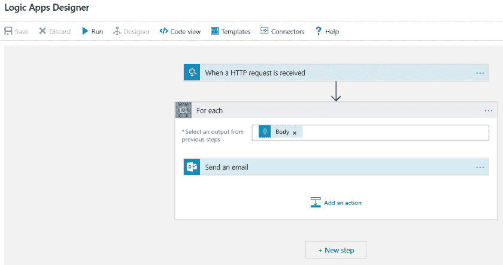
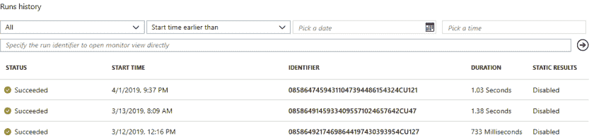
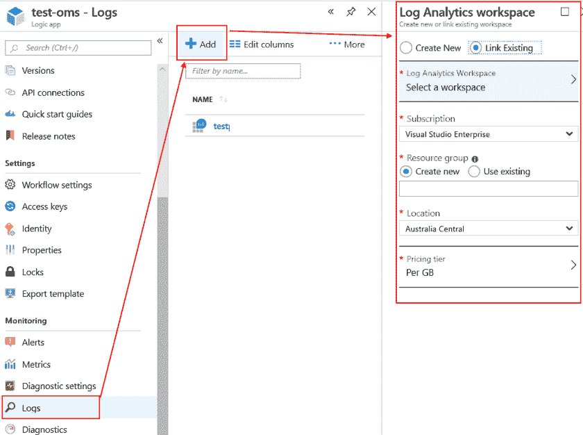
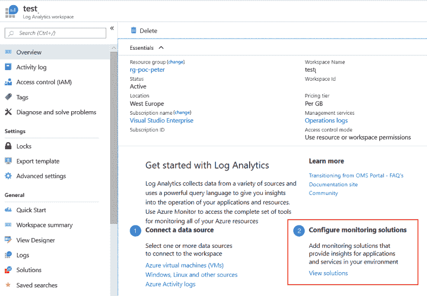
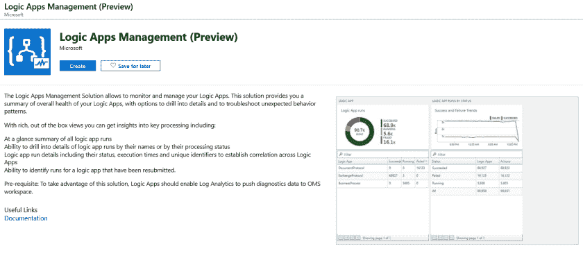
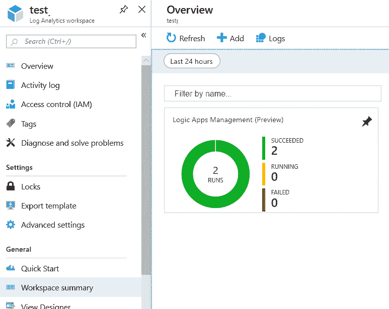
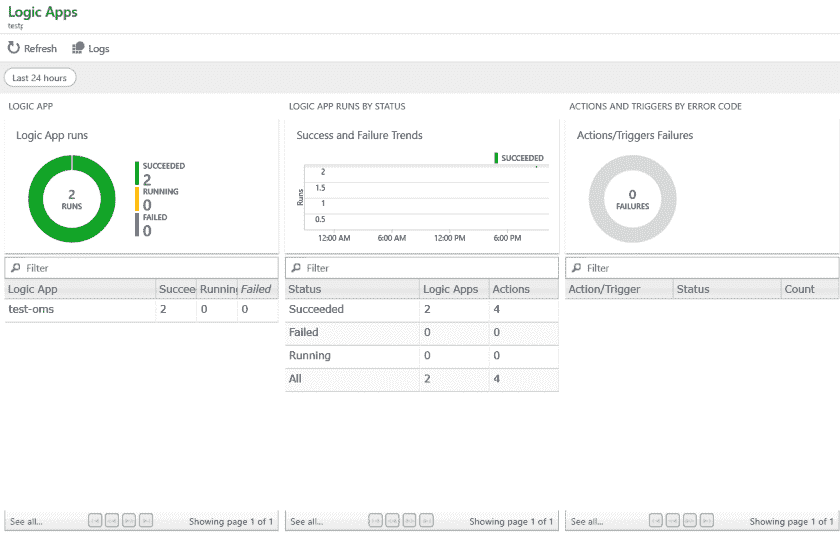
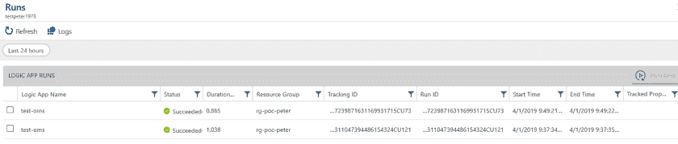
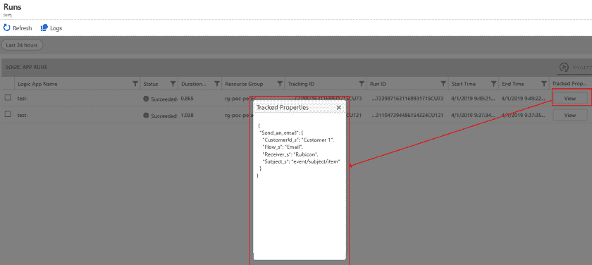
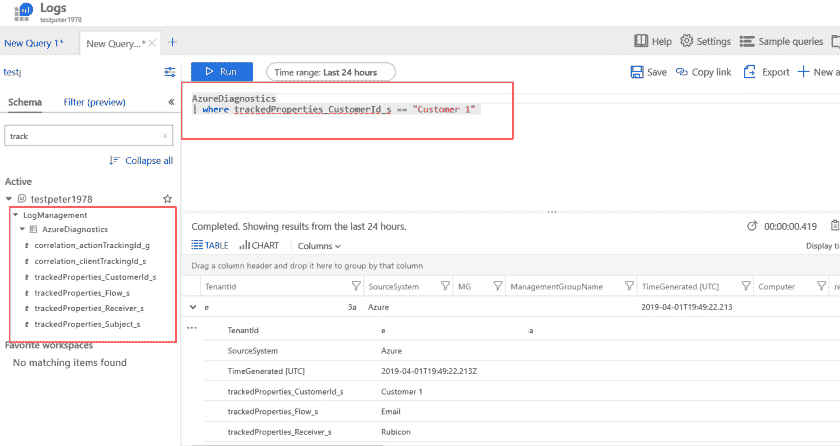

# 使用日志分析进行 LogicApps 监控

> 原文：<https://dev.to/sogeti/logicapps-monitoring-with-log-analytics-679>

azure[logicapp](https://azure.microsoft.com/en-us/services/logic-apps/)非常强大，我相信它应该出现在每个开发者的工具箱中。企业集成、即用型连接器，所有这些几乎都无需代码和服务器！

唉，监控和调试更复杂。在这篇博客中，我将解释如何将 LogicApps 添加到日志分析中，甚至跟踪过滤和警报的自定义属性。继续阅读令人兴奋的东西吧！

## 创建一个 LogicApp

让我们从一个非常简单的 LogicApp 开始。该应用程序将接收一个包含一组数据的 HTTP 请求，并针对每一项发送一封电子邮件:

[](https://res.cloudinary.com/practicaldev/image/fetch/s--H1fKadjl--/c_limit%2Cf_auto%2Cfl_progressive%2Cq_auto%2Cw_880/https://peterrombouts.files.wordpress.com/2019/04/logicappdesigner.png%3Fw%3D840)

## 标准测井

运行历史如下所示。您可以深入查看每个调用的实际结果，并查看哪个部分花费了多长时间以及更多详细信息。

[](https://res.cloudinary.com/practicaldev/image/fetch/s--3JvIxlxW--/c_limit%2Cf_auto%2Cfl_progressive%2Cq_auto%2Cw_880/https://peterrombouts.files.wordpress.com/2019/04/logicapphistory.png%3Fw%3D840)

## 进入日志分析工作区

标准日志记录看起来不错，但是如果您想要集成这个 LogicApp 并设置警报，该怎么办呢？首先，设置一个[日志分析工作区](https://docs.microsoft.com/en-us/azure/azure-monitor/learn/quick-create-workspace)。当您创建日志分析工作区时，请确保您的 LogicApp 向其发送日志。您可以直接进入 LogicApp 的日志部分:

[](https://res.cloudinary.com/practicaldev/image/fetch/s--yzb0YdNP--/c_limit%2Cf_auto%2Cfl_progressive%2Cq_auto%2Cw_880/https://peterrombouts.files.wordpress.com/2019/04/logicapplogs.png%3Fw%3D840)

如您所见，我已经将我的设置为现有的。完成后，您可以单击日志分析工作区，这将打开工作区的**概览**页面:

[](https://res.cloudinary.com/practicaldev/image/fetch/s--hgL6b5x1--/c_limit%2Cf_auto%2Cfl_progressive%2Cq_auto%2Cw_880/https://peterrombouts.files.wordpress.com/2019/04/laworkspace.png%3Fw%3D840)

点击“配置监控解决方案”上的“查看解决方案”将打开设置。点击“添加”并搜索**逻辑应用管理**。请注意，这是在**预览**的时候写的:

[](https://res.cloudinary.com/practicaldev/image/fetch/s--LDPO21uo--/c_limit%2Cf_auto%2Cfl_progressive%2Cq_auto%2Cw_880/https://peterrombouts.files.wordpress.com/2019/04/lamanagement.png%3Fw%3D840)

如果您选择**创建**并选择正确的设置，它将在日志分析的**工作区摘要**部分显示运行和日志记录:

[](https://res.cloudinary.com/practicaldev/image/fetch/s--2HNAeT8p--/c_limit%2Cf_auto%2Cfl_progressive%2Cq_auto%2Cw_880/https://peterrombouts.files.wordpress.com/2019/04/laoverview-1.png%3Fw%3D840)

如您所见，我们看到了一个包含基本信息的漂亮图表。向下钻取，您将看到向该工作区报告的所有 LogicApps。注意，我只配置了一个:

[](https://res.cloudinary.com/practicaldev/image/fetch/s--FO3vohrL--/c_limit%2Cf_auto%2Cfl_progressive%2Cq_auto%2Cw_880/https://peterrombouts.files.wordpress.com/2019/04/lalogs.png%3Fw%3D840)

## 详细记录并重新提交 LogicApps

如果我们进一步放大，我们可以重新运行几个 LogicApps 并查看更详细的信息:

[](https://res.cloudinary.com/practicaldev/image/fetch/s--ZOxhFUuk--/c_limit%2Cf_auto%2Cfl_progressive%2Cq_auto%2Cw_880/https://peterrombouts.files.wordpress.com/2019/04/lazoomedin.png%3Fw%3D840)

在这里，我们可以单击日志并进一步放大，或者我们可以重新提交多个 LogicApps。

## 跟踪自定义属性

假设我们有很多很多的事件进来，我们想通过 CustomerID 来跟踪。对于 LogicApp，我们必须定义被跟踪的属性。为此，返回到 LogicApp，进入代码视图，并添加您想要跟踪的属性:

```
"runAfter": {}, "trackedProperties": { "CustomerId": "@{items('For\_each')?['data']?['customerid']}", "Flow": "Email", "Receiver": "SomeReceiver", "Subject": "@{items('For\_each')['subject']}" } 
```

来解释上面这段代码；我已经在 forEach 循环中添加了“trackedProperties ”,这将把这些自定义属性发送到日志分析。显然，这些属性对应于我们在 HTTP 请求中得到的事件。

现在运行这个应用程序后，我们可以在日志分析中看到跟踪的属性！如果我们点击'**视图**按钮，它将调出实际属性:

[](https://res.cloudinary.com/practicaldev/image/fetch/s---xuO-W8Q--/c_limit%2Cf_auto%2Cfl_progressive%2Cq_auto%2Cw_880/https://peterrombouts.files.wordpress.com/2019/04/latracking.png%3Fw%3D840)

## 警报和过滤器

现在，对于高级场景，我们希望创建一个查询并搜索属性:

[](https://res.cloudinary.com/practicaldev/image/fetch/s--Nv0YXLaS--/c_limit%2Cf_auto%2Cfl_progressive%2Cq_auto%2Cw_880/https://peterrombouts.files.wordpress.com/2019/04/logquery.png%3Fw%3D840)

在上面的示例中，您可以看到一个简单的 schema 过滤器将显示所有跟踪的属性，在右边，您可以看到一个简单的查询来检索'**Customer 1**'的所有事件。基本上就是这样！现在你可以点击**创建警报规则**，在那里施展你的魔法，使用这些被跟踪的属性创建警报！

## 结论

使用 LogicApps 管理模块，设置 Logic Apps 以与 Log Analytics 通信是一件轻而易举的事情(是的，仍然是预览版)。跟踪属性有点像手工劳动，因为您必须进入代码视图，但在那里仍然不用担心。一定要小心；如果您将跟踪的属性添加到 JSON 的错误部分，您将看不到任何工作。另外，不要忘记，更新所有日志需要一些时间。低编码快乐！