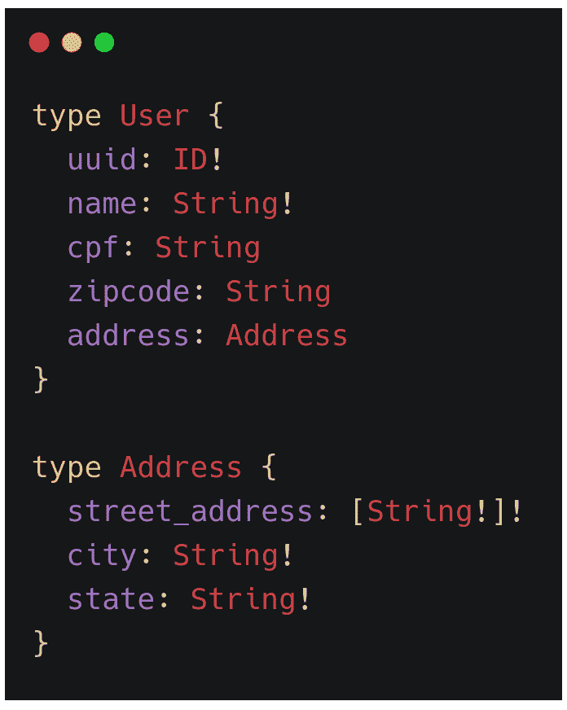
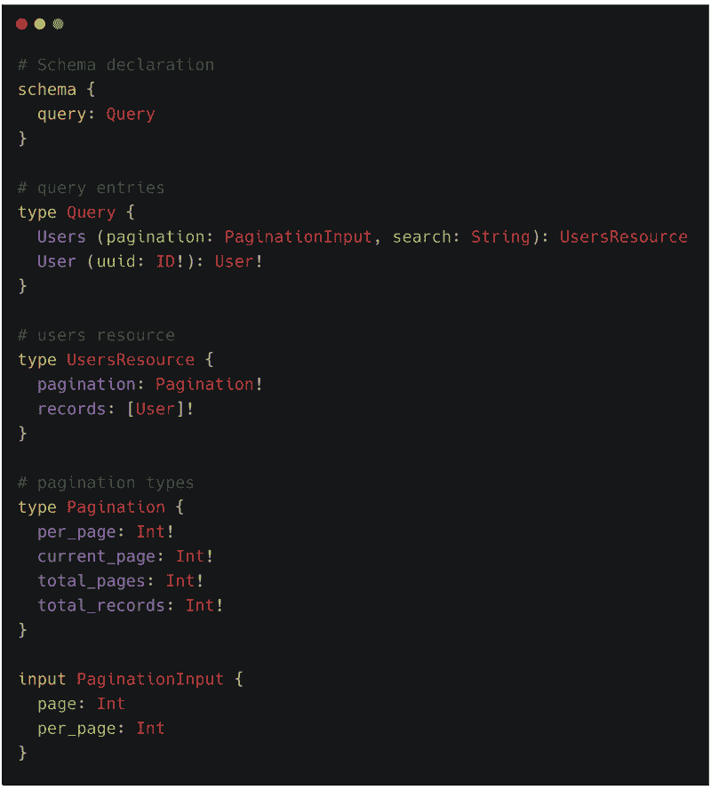
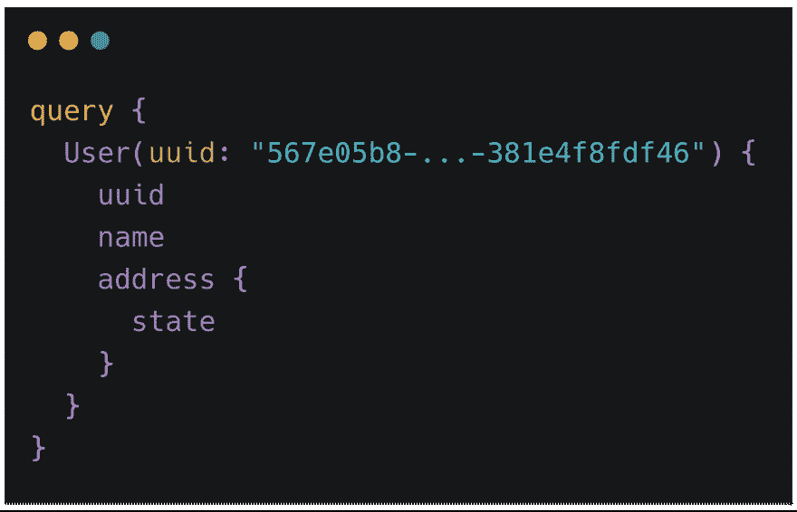
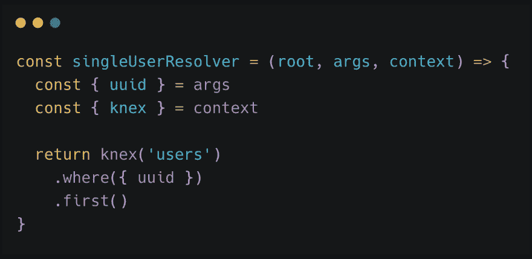
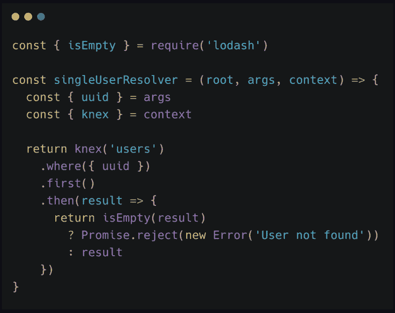
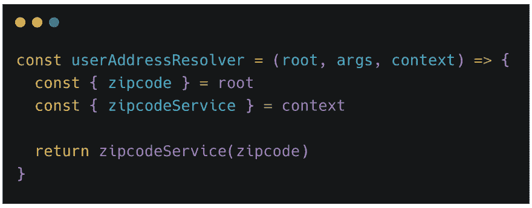
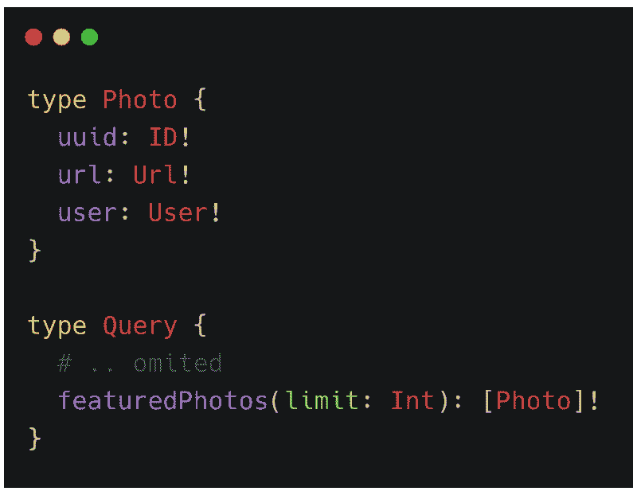
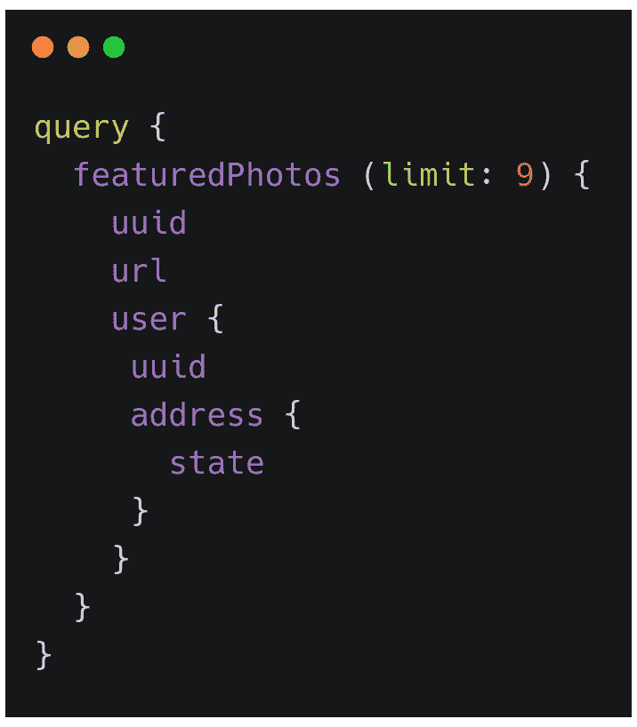

# 通过实例了解 GraphQL 是什么

> [https://dev . to/code 播客/了解-o-e-graph QL-through-example-1 gn 5](https://dev.to/codecasts/entendendo-o-que-e-graphql-atraves-de-exemplos-1gn5)

即使是在 GraphQL 的流行下人们也很怀疑他是什么人以及他能解决什么问题。本文拟通过实例说明什么是 GraphQL 及其目的。

* * *

# 什么不是图形 SQL？

也许这不是你所期望的话题，这里有些事情听起来很荒谬，但相信我，有一些人认为或曾经想过 GraphQL。

> [2019 年 3 月 10 日](https://blog.codecasts.com.br/entendendo-o-que-%C3%A9-graphql-atrav%C3%A9s-de-exemplos-c2fa35e8bf63)

## GraphQL 不是数据库

GraphQL 与数据库无关，也不是[form](https://en.wikipedia.org/wiki/Object-relational_mapping)。他甚至不需要数据库就能运行。
听说他是[查询语言](https://en.wikipedia.org/wiki/Query_language)时，也许这种联想就存在了。

## 图 QL 不是*框架*

这不是另外一个框架，其图形 SQL 本质上是一个规范，它具有[多种语言的实现](https://graphql.org/code/)。

## GraphQL 不是 HTTP/APIs 专用的

GraphQL 不仅仅是使用 HTTP 创建 API 的新方法。

其实他甚至不使用 HTTP 动词，他完全不知道这一层。GraphQL 不限于 HTTP 应用程序上下文。

* * *

# 什么是图形 SQL？

*查询*

不幸的是，这是一个简单而不客观的回答。虽然 GraphQL 本身很简单，但出于各种原因，它并不是最简单的解释。

本文的目的不是要进入更技术性的细微差别，但有必要解释一些关键概念。

## Tipos e 模式

GraphQL 是静态式的，它里面的一切都需要一个关联类型，这些类型形成了一个模式。

正是从这种*方案出发，*愿望*得到执行，并相应地得到了输入和输出两方面的验证。*

 *有一些基本类型，如 [`String`、`Int`、`Float`、`ID`和`Boolean`](https://graphql.org/learn/schema/#scalar-types) 。它们被称为*标量类型*，可以创建自己的类型、标量和对象。

以创建两种类型为例，**user**和 **Address**

伴有`!`的类型表示不接受`null`作为数值。

本例中最有趣的是*field****address***【user】，它指向另一种类型， **Address 【T】我们可以假定**用户**和**地址**之间存在关系。**

> 这种关系是如何形成的？没关系，GraphQL 不提供实施细节，o〖t0〗field〗t1〖T2〗address〖T3〗，可以来自任何地方，另一家银行，文件或 API。

为了进行咨询，在方案中有一种特殊的类型，它是□

这里我们有一个更全面、更详细的想法。在*图式*中，我们报告**查询**类型负责*的查询，这种类型通常也被称为 **RootQuery** 。*

 *在**查询**我们有两个*、 ***用户*** 和 ***用户***。我们还可以看到在 *fields* 中使用引数，这意味着要使用该资料，如果这些引数是强制性的，就必须传递这些引数。*

 *只有*有***【uuid】***带有强制引数，在 ***【用户】*** **中***

 *

以*查询*为例，消耗资源***【user】***，传递为引数***【uuid】***。根据 *field* 的签名，如果未返回 **User** 类型，则图 QL 将报告错误。

甚至在此之前的例子中，在*【用户】* 中，参数***【page】***也收到了作为参数的类型，作为回答，我们没有列出

 **

GraphQL 没有分页功能或类似功能，必须通过正在创建的“*架构设计”(*T3)来完成。这是这种情况下可能的设计之一。

### 解析器

> 从这里开始，文章将重点放在图 QL 的[JavaScript 实现](https://github.com/graphql/graphql-js)上，但概念在其他实现之间共享。

*解析器*是负责的功能，如名称暗示，旋转请求并返回请求的数据。以下是一个可能解析为 ***Query.User*** 的例子。

它是一个极其简单的函数，它接收三个参数:`_args_`、`_context_`。

> 因为是根解析器，所以根没有价值。接下来更多关于他的信息。

第二个参数( *args* 包含一个对象，当查询*查询*时，该对象被传递到 *field* ，在此例中，该对象具有属性 ***uuid***

第三个参数( *context* 由我们的图 QL 实例控制，所有*解析器*接收相同的 *context* 。它对于共享诸如当前用户、服务和数据库连接之类的东西非常有用。

在本例中，*args*中的*uuid*与*context*中的[t5]knex、T7]组合使用，从而从银行检索记录](https://knexjs.org/)

返回一个*解决*是[承诺](https://developer.mozilla.org/pt-BR/docs/Web/JavaScript/Reference/Global_Objects/Promise)，图 QL 等待这些承诺的解决，以返回结果。在上面的示例中，如果结果不满意，则 GraphQL 报告错误。但是，可能会产生更具断言性的错误。

现在，执行此查询的人将会收到更准确的错误。

### 关系

如上所述，可以在 GraphQL 中建立类型之间的关系。在**用户**和**地址**之间建立了关系。

我们有两种方法可以通过`Query.User`或`Query.Users.records`到达 User 类型。一个只返回一个**用户**，另一个返回一个用户列表，每个用户分别与各自的*解析*。这只是为了理解只需为 *field* **address** 创建一个解析器即可。

这是解决办法`User.address`。无论从哪里检索到 User 类型，对于 *address* 只有一个解析器。这意味着一旦映射，你的整个*图式*就会从中受益。

在`userAddressResolver` **根**是**使用者**中，从其中提取出 ***zipcode*** 的属性。然后 zipcode 作为参数传递给`zipcodeService`。他的实施细节并不重要，但可以想象这项服务与一个外部 API 通信，该 API 返回基于 *zipcode* 的信息。

我们将在我们的方案中增加一些类型。

现在在**查询**或 ***特征光子*** 中有**照片**和新*字段*。

> 注意，在字段 url 中，它返回类型 **Url** ，这不是本地的 QL 图形类型，它只是作为可以创建这样的类型的示例而放置的。

一旦照片与用户有关系，就可以进行如下查询:

# 概述

在应用程序中采用 GraphQL 时，一开始会有稍微慢一点的曲线，但很快就会突出 GraphQL 的附加价值，后端和*前端的开发变得更加敏捷和动态，往返次数减少*

GraphQL 最大的困难不在于它的实现和使用，而在于它的设计。他没有一个应用程序[*【rest】*](https://becode.com.br/o-que-e-api-rest-e-restful/)所存在的设计问题，但也带来了新的挑战。

与 GraphQL 的设计模式还没有达成广泛共识，但实例和事例有很大的来源。

我个人相信 GraphQL 相对于 Rest 解决方案的质量和通用性。创建一个不使用 GraphQL 作为 API 的应用程序，我不再感到舒服。

图 QL 的许多用途中，以为前端，以*为后端，以*为后端，被称为 [**为前端**](https://medium.com/tech-tajawal/backend-for-frontend-using-graphql-under-microservices-5b63bbfcd7d9) 。想象一下，一个前端必须访问多个不同的 API 才能获得信息的复杂性，GraphQL 非常适合这些情形。

# E o 休息？

可以争辩说，借助 ORM +请求的某些惊人模式，无需使用 GraphQL 即可获得这些结果

下面是一些加强采用 GraphQL 的要点

## 存在模式

在绝大多数情况下，您或您的团队会发明某种模式/方法或应用某种库来模拟这种行为(自定义答案、关系……)
t1】但是在 GraphQL 规范背后有一个庞大而认真的团队，本文并未涵盖一半的可能性。

## 自我文献

虽然需要应用生成与[swagger](https://swagger.io/)等兼容的文档的工具，但 GraphQL 拥有自动文档，而且测试环境非常高效。

*   [**/graph QL**](https://github.com/graphql/graphiql)
***   [**【棱镜/图 ql 操场】**](https://github.com/prisma/graphql-playground)**

 **## 自我验证

GraphQL 类型系统已充当输入和输出验证过程。还可以与代码编辑器集成，验证应用程序的“”愿望，以及可以集成到 CI/CD 进程中的命令行

*   [**prisma/vs code-graph QL**](https://github.com/prisma/vscode-graphql)
*   [**cjoudrey/graph QL-schema-linter**](https://github.com/cjoudrey/graphql-schema-linter)

## 实时

GraphQL 规范已预测实时。并非所有实施都受支持，但它存在且不复杂。

这为一些项目或团队打开了许多以前不存在的可能性。

[**facebook/graphql**](https://github.com/facebook/graphql/blob/master/rfcs/Subscriptions.md)

# 从 GraphQL 开始

本文不演示如何从 GraphQL 开始，因此下面列出了从 GraphQL 开始的有用功能。

记住图形 SQL 是用多种语言实现的，所以选择对你最友好的一种，开始你的实验。

*   [**【初学者用图 QL】***从图 QL*](https://medium.com/trainingcenter/graphql-para-iniciantes-a4cbe6c3da5d) 开始所需知道的一切
*   [**如何 graph QL——graph QL 的 Fullstack 教程** _Fullstack GraphQL 教程从零到生产涵盖所有基础和高级概念。](https://www.howtographql.com/)

[https://www.youtube.com/embed/8D9XnnjFGMs](https://www.youtube.com/embed/8D9XnnjFGMs)
[https://www.youtube.com/embed/KaxB8wPeTkI](https://www.youtube.com/embed/KaxB8wPeTkI)
[https://www.youtube.com/embed/-0uxxht4mko](https://www.youtube.com/embed/-0uxxht4mko)
[https://www.youtube.com/embed/m26i1L2D7Yk](https://www.youtube.com/embed/m26i1L2D7Yk)
[https://www.youtube.com/embed/vWdLM3IK0gw](https://www.youtube.com/embed/vWdLM3IK0gw)

* * *

有兴趣了解更多有关 GraphQL 的信息吗？进入我们组电报[【https://t . me/graph qlbrazil】](https://t.me/GraphQLBrasil)

* * *

别忘了分享和评论这篇文章。在评论中保留你对这件事的看法，你同意或不同意的观点。让我们增加更多的知识！

* * *

如欲了解更多有关我工作的信息，请访问 [**博客.com 播客. com.br**](https://blog.codecasts.com.br) 。订阅我们 YouTube 频道，您将在那里观看有关[【JavaScript】](https://www.youtube.com/watch?v=fBInMy61plk&t=0s&list=PLy5T05I_eQYNQs4Pta85XRSucm3IOHx2M&index=2)、[【jquery】](https://www.youtube.com/playlist?index=1&list=PLy5T05I_eQYN8T15w4KLLcDcjAmIXDyu-&playnext=1)、[【gulp】](https://www.youtube.com/watch?v=eukZI7Rcrss&t=0s&index=2&list=PLy5T05I_eQYPl_iF2aJ0T0JBgJMatOLwv)、[是 6】](https://www.youtube.com/watch?v=yRr8Wo4XfYY&list=PLy5T05I_eQYOoUz2TtAqq35RLCc-xBZCe&index=2&t=0s)、【t】的视频也不要忘了在[电报](https://t.me/codecasters)上我们小组联系

> 这是所有的乡亲********