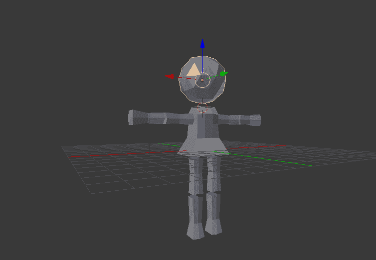
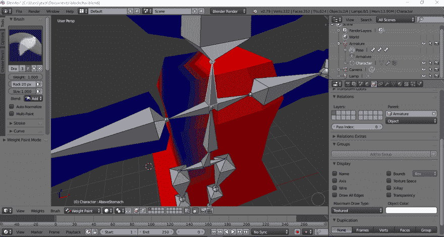
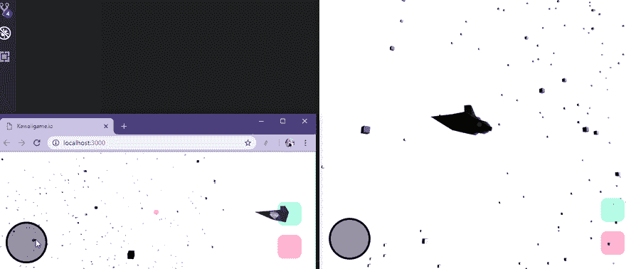
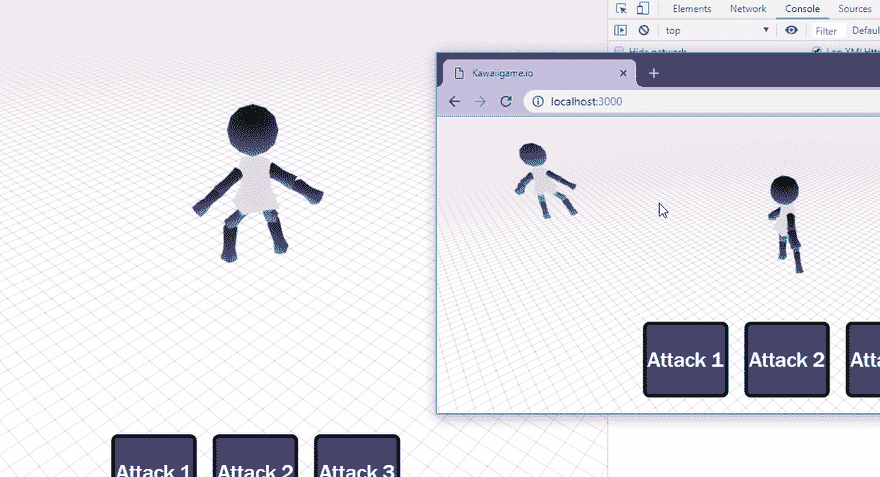
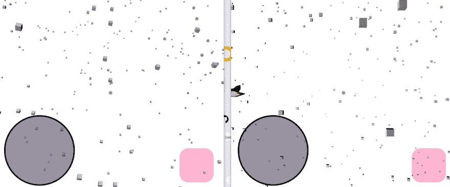

# Q1 2019 年报告

> 原文：<https://dev.to/webdva/q1-2019-report-1e03>

2019 年第一季度报告。

# 游戏开发效果和成就

我进一步提高了我的 3D 建模能力。

我进一步提高了我的 3D 动画能力。

我[实现了](https://webdva.github.io/how-i-implemented-client-side-linear-interpolation/)一个联网多人游戏的客户端线性插值结合客户端预测的实现。

我获得了创建和使用着色器的能力。我发布了一个[引用](https://webdva.github.io/a-very-brief-introduction-to-the-construction-of-shaders/)用于构造着色器。

我为一个联网的多人 3D 游戏实现了碰撞检测。

# 产品开发

我开始开发一款 3D 多人浏览器游戏，经历了多次迭代。

它最初看起来像这样，一个 RPG 战斗游戏:

然后它看起来像这样，一个创新的伪大型多人飞行射击游戏的想法:

# 获得工程和科学能力

*   我实现了一个有条件的前端浏览器源代码缩小系统的实现。
*   我学习了 3D 游戏开发中仿射变换的概念，包括沿前向向量的运动和三维空间中的位置平移。
*   我获得了在 3D 游戏中实现三维空间旋转的能力，包括欧拉角和旋转矩阵的知识。
*   我理解了四元数。
*   我学到了新的数学概念，比如用三维定向有界框实现碰撞检测的超平面分离定理。

# 战略性商业活动

*   我计划进入现代浏览器游戏市场，以获得一部分市场份额，努力实现繁荣计划的目标，即在 2020 年之前作为一名技术企业家获得收入。

*   我未能在本季度结束前实现 3D 多人浏览器游戏的初始产品发布。

*   由于可能缺乏创始人与客户的契合度，我考虑将游戏开发从企业转向消费者。由于一系列的认知偏见和扭曲，我实际上可能误解了这种消费者市场对我这个企业家的价值。

# 个人方面/运营代理状态

*   我发现并接受了永恒乐观的效用。我现在承担了满足拥有合适物品要求所需的所有工具。

# 季度总结

我致力于 3D 多人浏览器游戏的开发，并获得了非常有用的功能。与上一季度相比，我现在拥有更先进的技术、知识和流程( [Q4 2018](https://webdva.github.io/2018-q4-report/) )。

# 预测

## 短期

通过对繁荣计划和做正确的事情的巨大承诺，繁荣计划的成功将会实现，这最终会收敛到繁荣的局部最优。

## 遥远的未来

你将获得更大的勇气、正直、承诺和其他财富。更大的非支配解将会收敛，而较小的支配状态将会偏离。

有了预测的繁荣后将获得的资产和资本，我将能够最终建立一个影响深远的企业，从事实验物理学，并以创新的方式修补世界。