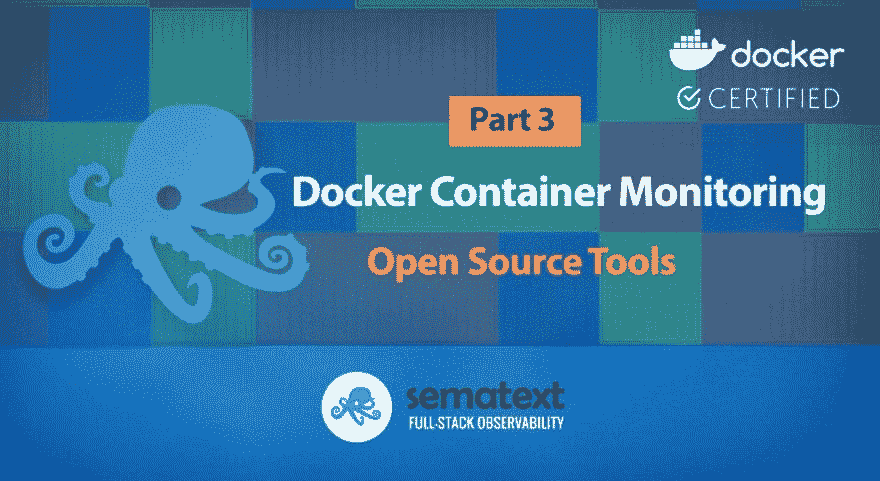
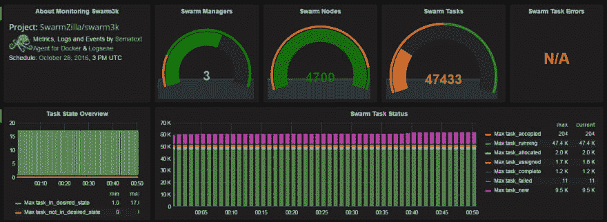
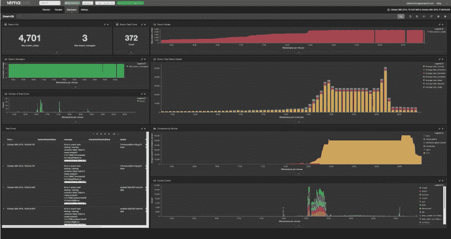

# Docker 容器监控开源工具

> 原文：<https://dev.to/sematext/docker-container-monitoring-open-source-tools-2afj>

在第 1 部分: [Docker 容器监控和管理挑战](https://sematext.com/blog/docker-container-monitoring-management-challenges/)——我们讨论了为什么容器监控具有挑战性，尤其是在编排工具的环境中。在第 2 部分中，我们描述了要监控的[十大容器指标](https://sematext.com/blog/top-docker-metrics-to-watch/)。接下来，让我们看一下示例和可用的容器监控工具，以便更好地了解容器部署的操作。

## **命令行工具**

了解容器基础设施的第一步可能是使用内置工具，如 [docker 命令行](https://sematext.com/docker-commands-cheat-sheet/)和 [kubectl for Kubernetes](https://sematext.com/kubernetes-cheat-sheet/) 。有一整套用于查找容器相关信息的命令。请注意，kubectl 和 docker 命令的使用通常只对少数直接访问编排工具的人可用。然而，所有云工程师都需要命令行技能，在某些情况下，命令行工具确实是唯一可用的工具。

在我们开始研究 Docker 日志收集工具之前，先看看这两个有用的 Docker 备忘单。

查看 [Docker 命令备忘单](https://dev.to/docker-commands-cheat-sheet/?utm_medium=blogpost&utm_source=blogpost&utm_campaign=docker-container-monitoring-open-source-tools-blogpost&utm_content=blog-docker-commands-cheatsheet)

查看 [Docker Swarm 备忘单](https://dev.to/docker-swarm-cheat-sheet/?utm_medium=blogpost&utm_source=blogpost&utm_campaign=docker-container-monitoring-open-source-tools-blogpost&utm_content=blog-doecker-smarm-cheatsheet)

有几个监控仪表板可用于编排工具，如 Rancher、Portainer、Docker Enterprise。它们通常提供简单的实时指标和实时日志视图。导航到容器需要点击几下。但是，通常不会集成具有聚合指标或集群范围日志搜索的概览。因此，大多数编排工具中的基本监控功能都太简单了。需要更好的工具。让我们看看一些更有吸引力、更强大的监控和日志管理解决方案。

## **用于 Docker 监控、记录和追踪的开源工具**

几个[开源工具可用于 DIY 风格的容器监控和记录](https://sematext.com/blog/open-source-docker-monitoring-logging/)。通常，日志和指标存储在不同的数据存储中。弹性堆栈是日志的首选工具，而[普罗米修斯](https://prometheus.io/)是受欢迎的度量工具。

根据您的指标和日志数据存储选择，您可能需要使用一组不同的数据收集器和仪表板工具。Telegraf 和 Prometheus 是我们评估过的最灵活的开源数据收集器。Prometheus exporters 需要一个 scraper (Prometheus 服务器或替代的第三方 scraper)或 Prometheus 服务器的远程存储接口，以便在替代数据存储中存储指标。Grafana 是最灵活的监控仪表板工具，支持大多数数据源，如 Prometheus、InfluxDB、Elasticsearch 等。

用于数据收集的 Kibana 和 metric beats 与 Elasticsearch 紧密绑定，因此不能与任何其他数据存储一起使用。

下表显示了哪些数据收集器通常与哪些存储引擎和监控仪表板工具配合使用。请注意，还有其他几种可能的变化。

| 集装箱数据收集器 | 存储/时间序列数据库 | 用户界面 |
| --- | --- | --- |
| 日志收集器 |  |  |
| - |  |  |
| Fluentd |  |  |
| Filebeat | 弹性搜索 | Kibana |
| Telegraf / syslog + docker syslog 驱动程序 | InfluxDB | 克罗诺格拉夫·格拉夫纳 |
| 对数函数 | 弹性搜索和语义云 | Kibana & Sematext |
| 度量收集器 |  |  |
| - |  |  |
| 普罗米修斯出口商 | 普罗米修斯 |  |
| 各种第三方和商业集成 | 格拉法纳·普罗姆达什 |  |
| 公制节拍 | 弹性搜索 | Kibana |
| 电报？电报 | InfluxDB | 克罗诺格拉夫·格拉夫纳 |
| Telegraf 弹性搜索输出 | 弹性搜索 | Kibana |
| 语义代理 | InfluxDB 和 Sematext 云 | Chronograf & Sematext 云 |

*监控工具与时序存储引擎的兼容性*

弹性堆栈似乎是在一个数据存储中统一度量和日志的绝佳候选。作为 [Elasticsearch 咨询](https://semaext.com/consulting/elasticsearch)、培训和 [Elasticsearch 支持](https://semaext.com/support/elasticsearch)的提供者，我们非常希望每个人不仅能使用 Elasticsearch 获取日志，还能获取指标。然而，事实是 **Elasticsearch 并不像时间序列数据库那样高效。相信我们，我们已经运行了大量的基准测试，应用了大量 Elasticsearch 技巧中的各种性能调优技巧，但结果表明，有比 Elasticsearch 更好、更高效、更快的指标数据存储。当日志记录和监控基础设施达到较大规模时，其设置和维护会变得复杂。**

在初始设置度量和日志的存储引擎之后，耗时的工作开始了:设置日志传送器和监控代理、仪表板和警报规则。处理容器的日志收集可能会很棘手，所以你需要参考[10 大 Docker 日志记录陷阱](https://sematext.com/blog/top-10-docker-logging-gotchas/)和 [Docker 日志驱动替代方案](https://sematext.com/blog/docker-log-driver-alternatives/)。

### **码头工人用 Grafana 监控**

在设置数据收集器之后，我们需要可视化指标和日志。最流行的仪表板工具是 Grafana 和 Kibana。Grafana 作为一个仪表板工具做得非常好，可以显示来自多个数据源的数据，包括 Elasticsearch、InfluxDB 和 Prometheus。不过，总的来说，Grafana 确实更适合度量标准，尽管[也可以将 Grafana 用于带有弹性搜索](https://sematext.com/blog/using-grafana-with-elasticsearch-for-log-analytics-2/)的日志。Grafana 对于临时日志搜索仍然非常有限，但是已经集成了日志警报。

### **码头工人用基巴纳监控**

另一方面，Kibana 只支持 Elasticsearch 作为数据源。一些仪表板视图是“不可能”实现的，因为不同的监视和日志记录工具在关联来自不同数据存储的数据方面具有有限的选项。一旦构建了仪表板并准备好与团队共享，Kibana 用户的下一个热门话题就是安全性、身份验证和基于角色的访问控制(RBAC)。Grafana 支持用户认证和简单的角色，而 Kibana(或一般的弹性堆栈)需要 X-Pack 作为商业扩展来支持各种安全特性，如用户认证和 RBAC。根据您组织的要求， [X-Pack 替代产品](https://sematext.com/blog/x-pack-alternatives/)可能会有所帮助。

### 总拥有成本

在规划开源监控的设置时，人们通常会低估监控代理和日志传送器生成的数据量。更具体地说，随着数据量的增长，大多数组织低估了处理、存储和检索指标和日志所需的资源，更重要的是，组织常常低估了必须投入到监控基础设施和开源工具的持续维护中的人力和时间。当这种情况发生时，不仅监控和日志记录的基础设施成本会超出任何人的预测，而且维护所需的时间和资金也会增加。解决这一问题的常见方法是限制数据保留期。这需要更少的资源，更少的扩展基础设施和工具所需的专业知识，从而减少维护，但这当然会限制人们从长期数据中获得的可见性和洞察力。

基础设施成本只是我们经常看到度量、跟踪和日志存储有限的一个原因。例如，InfluxDB 在开源版本中没有集群或分片，而 [Prometheus 只支持短保留时间](https://prometheus.io/docs/prometheus/latest/storage/#remote-storage-integrations)以避免性能问题。

另一种用于处理这种情况的方法是将度量的粒度从 10 秒精度降低到一分钟或更长时间，进行采样等等。因此，开发运维团队获得的信息不太准确，分析问题的时间也更少，并且对永久性或重复性问题、进行历史趋势分析或容量规划的了解也有限。

## **微服务分布式事务追踪**

在本文中，我们只讨论了监控和日志记录。我们暂时完全忽略了分布式事务跟踪作为可观察性的第三个支柱。请记住，一旦我们开始跨微服务收集事务跟踪，数据量将会激增，从而进一步增加本地监控设置的总拥有成本。请注意，这篇文章中提到的数据收集工具只处理指标和日志，不处理跟踪(关于事务跟踪的更多信息，更具体地说，OpenTracing 兼容的跟踪器，请参见我们的 [Jaeger vs. Zipkin)](https://sematext.com/blog/jaeger-vs-zipkin-opentracing-distributed-tracers/) 。类似地，我们在这里讨论的仪表板工具没有提供数据收集和事务跟踪的可视化。**这意味着，对于分布式事务跟踪，如果我们想组合并运行我们自己的监控设置，我们需要第三套工具——欢迎来到 DevOps 丛林！**

## **DIY 集装箱监控利弊**

有许多用于日志记录、监控和跟踪的[开源容器可观察性工具](https://sematext.com/blog/open-source-docker-monitoring-logging/)。如果您和您的团队有时间，并且如果可观察性真的需要成为您团队的核心能力，您将需要投入时间来寻找最有前途的工具，学习如何在评估它们的同时实际使用它们，并最终安装、配置和维护它们。明智的做法是比较多种解决方案，并检查各种工具的配合情况。我们建议采用以下评估标准:

*   **收集指标的覆盖范围**。有些工具只收集少量的指标，有些收集大量的指标(您可能并不真正需要)，而其他工具允许您配置收集哪些指标。当一个人在解决生产问题的压力下工作时，缺少相关的指标会令人沮丧，就像有太多或错误的指标会使定位真正重要的信号变得更加困难。*需要*配置来收集或可视化每个指标的工具设置和维护起来非常耗时。不要选择这样的工具。相反，寻找那些给你好的默认值和自由来定制收集哪些度量的工具。
*   **日志格式覆盖**。典型的应用程序堆栈由多个组件组成，如数据库、web 服务器、消息队列等。确保您可以从您的应用程序中[构造日志](https://sematext.com/logagent/)。如果您不仅想将日志用于故障排除，而且还想从日志中获得洞察力，这是非常关键的。用正则表达式或 grok 定义[日志解析器模式](https://sematext.com/docs/logagent/parser/)非常耗时。拥有一个现有模式库是非常有帮助的。这可以节省时间，尤其是在使用官方 docker 图像的容器世界中。
*   **事件集合**。任何关于服务重启或崩溃原因的指示都有助于您快速对问题进行分类，并更快找到根本原因。因此，如果运行 Kubernetes，任何容器监控工具都应该收集 [Docker](https://docs.docker.com/engine/reference/commandline/events/) [事件](https://docs.docker.com/engine/reference/commandline/events/)和 Kubernetes 状态事件。
*   **指标、日志和跟踪的相关性**。无论您最初是通过指标、日志还是跟踪发现问题，访问所有这些可观察性数据都可以使故障排除更快。因此，显示来自各种来源的数据的单一 UI 是交互式深入查看、快速故障排除、更快 MTTR 的关键，并且坦率地说，使开发人员的工作更加愉快。[见例](https://sematext.com/metrics-and-logs/)。
*   **机器学习功能和** **[异常检测，用于对日志和指标进行警报](https://sematext.com/alerts/)** 。基于阈值的警报仅适用于已知和恒定的工作负载。在动态环境中，基于阈值的警报会产生太多噪音。确保您选择的解决方案具有这种核心能力，并且不需要花费很多时间来学习基线，也不需要太多的调整、培训等等。
*   **检测与** **[关联的指标](https://sematext.com/product-updates/#/2018/automatic-metrics-correlation)** **具有相同的行为。**当指标的行为模式相似时，我们通常会发现其中一个指标是性能瓶颈根本原因的症状。我们在实践中看到的一个很好的例子是高 CPU 使用率与容器交换活动和磁盘 IO 相结合——在这种情况下，可以通过关闭容器交换来减少 CPU 使用率甚至更多的磁盘 IO。对于以上的系统指标，相关性通常是已知的，但当您跟踪特定于应用的指标时，您可能会在您的微服务中发现新的相关性和瓶颈以进行优化。
*   **单点登录。**关联存储在孤岛中的数据是不可能的。此外，使用多个服务通常需要多个帐户，并迫使您学习不是一个，而是多个服务，它们的用户界面等。每次您需要使用它们时，都需要调整时间范围之类的东西，然后才能在单独的窗口中查看其中的数据，这是令人痛苦的开销。这耗费了时间和金钱，并且使得与团队共享数据更加困难。
*   基于角色的访问控制。缺乏 RBAC ** **将成为任何寻求在企业层面采用的工具的绊脚石。适用于小型团队和中小型企业的工具，但缺乏对角色和权限的多用户支持，几乎永远无法满足大型企业的需求。

## 结论

综上所述，DevOps 工程师需要具有高级功能(如指标、跟踪和日志之间的关联)的良好集成的监控、记录和跟踪解决方案。运行内部监控所需的工程和基础设施成本可以很快得到回报。每个受监控服务的可调数据保留时间有助于优化成本并满足运营需求。更好的用户体验对您的 DevOps 团队很有帮助，尤其是一旦关键错误或性能问题影响到您的商业服务，更快的故障排除可以最大限度地减少收入损失。在第 4 部分中，我们将使用语义描述[容器监控。在开发](https://sematext.com/blog/docker-container-monitoring-with-sematext/) [Sematext Cloud](https://sematext.com/cloud/) 的时候，我们已经有了上述想法，目标是提供一个更好的集装箱监控解决方案。

Docker 容器监控开源工具的帖子[首先出现在](https://sematext.com/blog/open-source-docker-monitoring-logging/) [Sematext](https://sematext.com) 上。