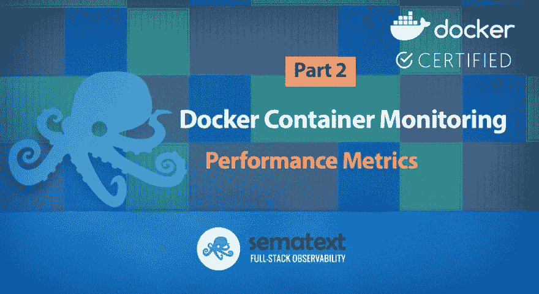
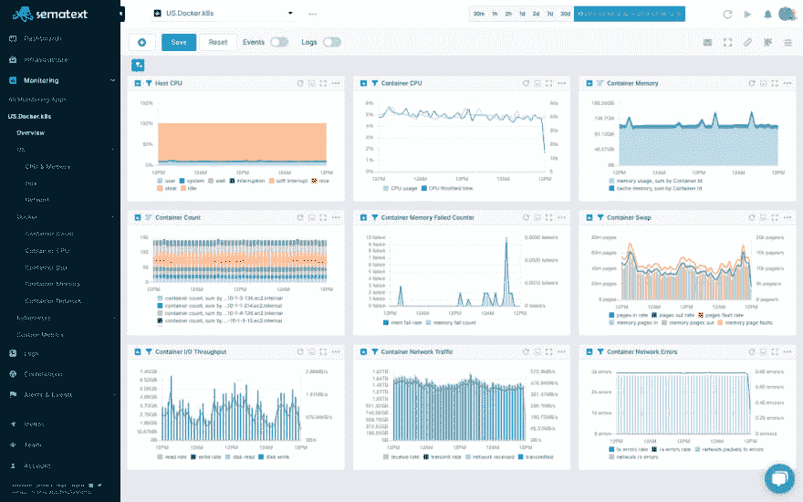
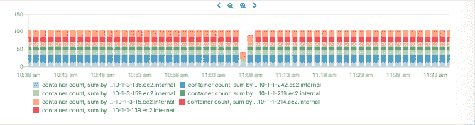
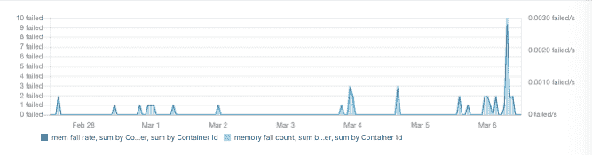
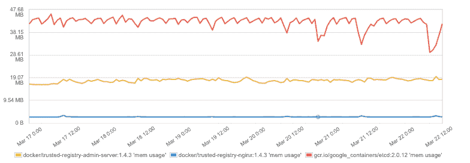
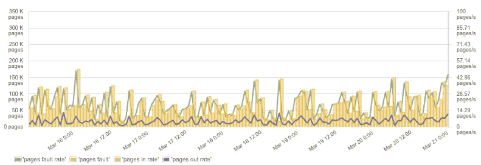
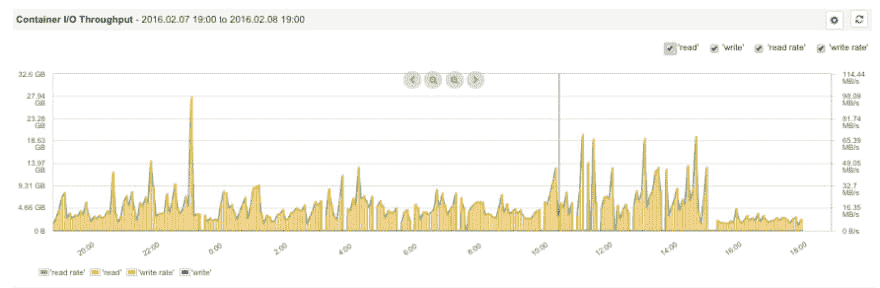
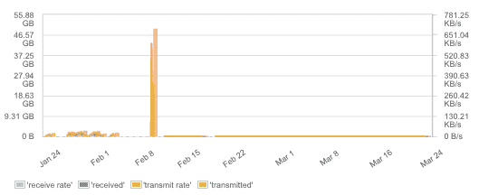

# Docker 容器性能指标

> 原文：<https://dev.to/sematext/docker-container-performance-metrics-3a09>

在第 1 部分中，我们已经描述了[是什么使得监控容器环境具有挑战性](https://dev.to/sematext/docker-container-monitoring-and-management-challenges-4480-temp-slug-2993350)。因为每个容器通常运行一个进程，有自己的环境，利用虚拟网络，或者有各种管理存储的方法。传统的监控解决方案从每台服务器及其运行的应用程序中获取指标。这些服务器和其上运行的应用程序通常非常静态，正常运行时间非常长。容器部署是不同的:一组容器可能运行许多应用程序，所有应用程序共享一个或多个底层主机的资源。Docker 服务器运行数千个短期容器(例如..对于批处理作业),同时一组永久服务并行运行。不适应这种动态环境的传统监控工具不适合这种部署。另一方面，一些现代监控解决方案在构建时就考虑到了这种动态系统，甚至为[码头监控](https://sematext.com/docker)提供了开箱即用的报告。此外，容器资源共享要求更严格地执行资源使用限制，这是一个您必须仔细观察的额外问题。为了对资源配额进行适当的调整，您需要很好地了解容器可能达到的任何限制，或者它们可能遇到或导致的错误。我们建议根据定义的限制使用[监控警报](https://sematext.com/alerts)；这样，您甚至可以在错误开始发生之前调整限制或资源使用。

*注:本帖所有截图均来自* *[Sematext 云](https://sematext.com/cloud)* _ 及其 _*[Docker](https://sematext.com/docker)**[监控](https://sematext.com/docker)* *[整合](https://sematext.com/docker)* *。*

## 查看您的 Docker 主机的资源

### 主机 CPU

了解主机和容器的 CPU 利用率有助于优化 Docker 主机的资源使用。可以调节容器 CPU 的使用，以避免一个繁忙的容器耗尽所有可用的 CPU 资源，从而降低其他容器的速度。限制 CPU 时间是确保基本服务所需的最低处理能力的好方法——这就像 Unix/Linux 中良好的旧水平。

当资源使用被优化时，实际上可能预期甚至期望高 CPU 利用率，并且警报可能仅在 CPU 利用率下降(认为服务中断)或者增长超过某个最大限制(例如 85%)的较长时间时才有意义。

### 主机内存

了解每个 Docker 主机中使用的总内存对于当前操作和容量规划非常重要。像 Docker Swarm 这样的动态集群管理器使用主机上可用的总内存和容器请求的内存来决定新容器应该在哪个主机上启动。如果集群管理器找不到为容器提供足够资源的主机，部署可能会失败。这就是为什么知道主机内存使用情况和容器的内存限制很重要。根据 Docker 应用程序的占用空间调整新集群节点的容量有助于优化资源使用。

### 主机磁盘空间

Docker 图像和容器会消耗额外的磁盘空间。例如，一个应用程序映像可能包含一个 Linux 操作系统，大小可能为 150-700 MB，具体取决于基本映像的大小和容器中安装的工具。持久 Docker 卷也会消耗主机上的磁盘空间。根据我们的经验，监视磁盘空间和使用清理工具对于 Docker 主机的持续运行至关重要。

因为磁盘空间非常重要，所以定义磁盘空间利用率警报作为早期警告并提供足够的时间来清理磁盘或添加额外的卷是有意义的。比如 [Sematext Monitoring](https://sematext.com/spm/) 自动为你设置磁盘空间使用的预警规则，你就不用记得去做了。

一个好的做法是通过经常删除未使用的容器和映像来运行清理磁盘的任务。

## 正在运行的集装箱总数

出于多种原因，容器的当前和历史数量是一个有趣的指标。例如，在部署和更新期间，检查一切是否像以前一样运行非常方便。

当像 Docker Swarm、Mesos、Kubernetes 这样的集群管理器使用不同的调度策略自动调度容器在不同的主机上运行时，在每个主机上运行的容器的数量可以帮助验证激活的调度策略。显示每个主机上的容器数量和容器总数的堆叠条形图提供了集群管理器如何在可用主机之间分配容器的快速可视化。

*一段时间内每个码头主机的集装箱数量*

根据不同的用例，这个指标可以有不同的“模式”。例如，在容器中运行的批处理作业和长时间运行的服务通常会导致不同的容器计数模式。批处理作业通常按需启动容器或定期启动，包含该作业的容器在相对较短的时间后终止。在这种情况下，人们可能会看到运行的容器数量有很大的变化，从而导致“尖峰”容器计数指标。另一方面，web 服务器或数据库等长期运行的服务通常会一直运行，直到它们在软件更新期间被重新部署。尽管缩放机制可能根据负载、流量和其他因素来增加或减少容器的数量，但是容器计数度量通常将是相对稳定的，因为在这种情况下，容器通常被更加缓慢地添加和移除。因此，对于正在运行的容器数量，我们没有一个通用的默认 Docker 警报规则。

然而，基于[异常检测](https://sematext.com/alerts/)的警报对于大多数用例来说是非常方便的，该警报检测短时间窗口内容器总数(或特定主机)的突然变化。只有当运行容器的最大或最小数量已知时，简单的基于阈值的警报才有意义，而在基于外部因素上下扩展的动态环境中，情况往往并非如此。

## Docker 容器指标

Docker 容器指标基本上与每个 Linux 进程可用的指标相同，但包括 Docker 通过 cgroups 设置的限制，例如 CPU 或内存使用的限制。请注意，像 [Sematext Cloud](https://sematext.com/cloud) 这样的复杂监控解决方案能够在不同级别上聚合容器指标，如 Docker 主机/集群节点、映像名称或 ID 以及容器名称或 ID。有了这种能力，就很容易跟踪主机、应用程序类型(映像名称)或特定容器的资源使用情况。在下面的示例中，我们可能会在不同的级别上使用聚合。

### 容器 CPU–节流 CPU 时间

最基本的信息之一是关于所有容器、图像或特定容器消耗了多少 CPU 的信息。使用 Docker 的一个很大的优点是能够限制容器对 CPU 的使用。当然，如果不进行测量，就无法对某些东西进行调优和优化，因此监控这样的限制是必不可少的。观察容器的 CPU 使用被抑制的总时间，可以提供调整 Docker 中的 [CPU 份额设置所需的信息。请注意，只有当主机 CPU 使用率达到最大值时，CPU 时间才会受到限制。只要主机有空闲的 CPU 周期可供 Docker 使用，它就不会限制容器的 CPU 使用率。因此，被节流的 CPU 通常为零，并且该指标的峰值通常是一个或多个容器需要超过主机所能提供的 CPU 能力的良好指示。](https://docs.docker.com/engine/reference/run/#cpu-share-constraint)

*容器 CPU 使用率和节流 CPU 时间*

### 容器存储器–故障计数器

为容器设置内存限制是一个很好的做法。这样做有助于避免内存紧张的容器占用所有可用内存并使同一服务器上的所有其他容器处于饥饿状态。资源的运行时约束可以在 [Docker 运行命令](https://docs.docker.com/engine/reference/run/)中定义。例如，“-m 300M”将容器的内存限制设置为 300 MB。Docker 公开了一个称为容器内存失败计数器的指标。每次内存分配失败时，即每次达到预设的内存限制时，此计数器都会增加。因此，该指标中的峰值表明一个或多个容器需要比分配的更多的内存。如果容器中的进程由于这个错误而终止，我们也可能会从 Docker 中看到内存不足事件。

内存失败计数器中的峰值是一个关键事件，在内存失败计数器上放置警报非常有助于检测内存限制的错误设置，或者发现试图消耗比预期更多内存的容器。

### 容器内存使用情况

不同的应用程序有不同的内存占用。** **了解应用程序容器的内存占用对于拥有一个稳定的环境非常重要。** **容器内存限制确保应用程序运行良好，而不会使用过多的内存，过多的内存会影响同一主机上的其他容器。最佳实践是通过几次迭代来调整内存设置:

1.  监控应用程序容器的内存使用情况
2.  根据观察结果设置内存限制
3.  继续监控内存、内存故障计数器和内存不足事件。如果发生 OOM 事件，可能需要增加容器内存限制，或者需要进行调试以找到高内存消耗的原因。

*容器内存使用量*

### 集装箱互换

像任何其他进程的内存一样，容器的内存可以交换到磁盘。对于像 Elasticsearch 或 Solr 这样的应用程序，人们通常会找到在 Linux 主机上停用交换的指令——但是如果您在 Docker 上运行这样的应用程序，只需在 Docker run 命令中设置“–memory-swappiness = 0”就足够了！

*容器交换、内存页面和交换率*

### 容器磁盘 I/O

在 Docker 中，多个应用程序同时使用相同的资源。因此，监视磁盘 I/O 有助于定义特定应用程序的限制，并为关键应用程序(如数据存储或 web 服务器)提供更高的吞吐量，同时抑制批处理操作的磁盘 I/O。例如，docker run-it–device-write-bps/dev/sda:1mb mybatchjob 命令会将容器磁盘写入限制为最大 1 MB/s。

*集装箱输入输出吞吐量*

### 集装箱网络指标

集装箱联网可能非常具有挑战性。默认情况下，所有容器共享一个网络，或者容器可以链接在一起，在同一台主机上共享一个单独的网络。然而，当在不同主机上运行的容器之间联网时，需要一个[覆盖网络](https://en.wikipedia.org/wiki/Overlay_network)，或者[容器可以共享主机网络](https://docs.docker.com/network/network-tutorial-host/)。有许多网络配置选项意味着网络错误有许多可能的原因。

此外，不仅错误或丢失的数据包很重要。如今，大多数应用程序都深深依赖于网络通信。虚拟网络的吞吐量可能是一个瓶颈，特别是对于像负载平衡器这样的容器。此外，网络流量可能是客户端使用多少应用程序的一个很好的指标，有时您可能会看到高峰值，这可能表明拒绝服务攻击、负载测试或客户端应用程序中的故障。

因此，观察容器网络流量——在许多情况下，这是一个有用的指标，是对 it 网络监控的补充。

*网络流量和传输速率*

## 总结

这就是你想要的——值得关注的顶级 Docker 指标。关注这些顶级指标和相应的分析将有助于您在多种平台上成功部署 Docker，如 Docker Enterprise、Kubernetes、AWS EKS、Google GKS 或任何其他支持 Docker 容器的平台。

如果您想了解更多关于 Docker 监控和日志记录的信息，请继续阅读本系列的第 3 部分[容器监控工具](https://sematext.com/blog/open-source-docker-monitoring-logging/)。

帖子[Docker Container Performance Metrics](https://sematext.com/blog/top-docker-metrics-to-watch/)首先出现在 [Sematext](https://sematext.com) 上。