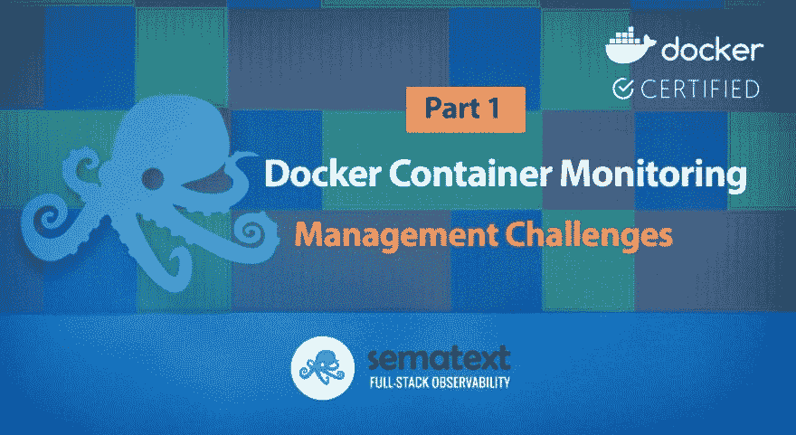

# 码头集装箱监控和管理挑战

> 原文：<https://dev.to/sematext/docker-container-monitoring-and-management-challenges-3jfe>

采用容器编排工具进行应用程序部署的组织面临着新的维护挑战。像 Kubernetes 或 Docker Swarm 这样的编排工具旨在决定应该将一个容器部署到哪个主机上，并且可能会持续地这样做。尽管这一功能对于帮助我们更好地利用底层基础设施非常有用，但它也给生产带来了新的挑战。进行故障排除时，常见的第一个问题是“哪个特定容器有问题？”。第二个问题往往是“它在哪个主机上运行？”。能够将容器部署映射到底层容器主机对于故障排除至关重要。但是关于[集装箱监控](https://sematext.com/docker)还有更多要学习的，让我们看看为什么[基础设施监控](https://sematext.com/spm)对于集装箱是不同的。

监控容器基础设施不同于传统的[服务器监控](https://sematext.com/server-monitoring)。首先，容器提供了一个我们以前根本没有的新的基础设施层。其次，我们必须处理可能运行在不同云服务上的一个或多个集群中的动态放置。最后，容器为资源管理提供了新的方式。

## **新建基础设施层**

容器为基础设施增加了一个新的层次，容器到服务器的映射让我们可以看到每个容器在基础设施中的确切位置。因此，现代容器监控工具必须自动发现所有正在运行的容器，以便捕捉部署中的动态变化，并实时更新容器到主机的映射。因此，没有考虑到这些需求的传统服务器性能监控不足以监控容器。

## **新的动态部署和编排**

像 [Kubernetes](https://sematext.com/kubernetes) 或 [Docker Swarm](https://docs.docker.com/engine/swarm/) 这样的容器编排工具经常被用来动态地将容器分配给最合适的主机，通常是那些有足够资源运行它们的主机。因此，容器可能会从一个主机移动到另一个主机，尤其是在容器数量增加或减少时，或者在容器重新部署期间。主机和它们运行的服务之间不再有静态关系！对于故障排除，这意味着必须首先弄清楚哪个主机正在运行哪个容器。反之亦然，当主机表现出较差的性能时，能够隔离哪个容器是问题的来源以及是否有任何容器受到性能问题的影响是非常有价值的。

## **新的资源管理和指标**

可以限制容器对资源的使用。使用不适当的容器资源限制会导致容器性能不佳的情况，这仅仅是因为它不能分配足够的资源。同时，集群主机本身可能没有得到充分利用。如何发现和解决这个问题？一个很好的例子是监控内存故障计数器——一个关键容器指标或节流的 CPU 时间。在这种情况下，仅仅监控整体服务器性能并不能表明容器达到资源限制的速度有多慢。在这种情况下，只有监控每个容器的实际[容器度量](https://sematext.com/docs/integration/docker/#metrics)才有帮助。设置正确的资源限制需要详细了解容器在负载下可能需要的资源。一个好的实践是[监控容器指标](https://sematext.com/docker)并调整资源限制以匹配实际需求或扩展负载均衡器后面的容器数量。

## **新增日志管理需求**

Docker 不仅改变了应用程序的部署，也改变了日志管理的工作流程。Docker 日志不是将日志写入文件，而是来自容器的控制台输出流。Docker 日志记录驱动程序收集日志并将其转发到目的地。为了与这种新的日志模式相匹配，遗留应用程序需要更新，以便将日志写入控制台，而不是写入本地日志文件。一些容器启动多个进程，因此日志流可能包含来自启动脚本的纯文本消息和来自不同容器化应用程序的非结构化或结构化日志的混合。问题是显而易见的——您不能将来自多个进程和容器的两个日志流(stderr/stdout)混在一起，像 blob 一样对待它们，或者假设它们都使用相同的日志结构和格式。您需要能够判断哪个日志事件属于哪个容器、哪个应用程序、正确解析它等等。

为了正确解析日志，需要识别容器日志输出的来源。然后可以使用这些知识来应用正确的解析器，并向每个日志事件添加元数据，如容器名、容器图像、容器 ID。Docker 日志驱动程序大大简化了日志记录，但是仍然有许多 [Docker 日志记录陷阱](https://dev.to/sematext/top-10-docker-logging-gotchas-1mlk)。幸运的是，[现代日志运送器](https://sematext.com/logagent/)集成了 Docker API 或 Kubernetes API，并且能够为不同的应用程序应用日志解析器。

## **新的微服务架构和分布式事务跟踪**

微服务已经以这样或那样的名字存在了十多年。现在通常部署在单独的容器中，显然我们需要一种方法来跟踪各种微服务层的事务，从客户端一直到队列、存储、对外部服务的调用等。这引起了人们对[分布式事务跟踪](https://sematext.com/tracing/)的兴趣，尽管这并不新鲜，但现在已经重新成为[的第三个可观察性支柱](https://sematext.com/blog/opentracing-distributed-tracing-emerging-industry-standard/)。

## **新型集装箱监控工具**

在第 2 部分中，我们将探索[关键容器指标](https://sematext.com/blog/top-docker-metrics-to-watch/)，在第 3 部分中，我们将学习[基本的容器监控命令和开源监控工具](https://sematext.com/blog/open-source-docker-monitoring-logging/)。

帖子[码头工人集装箱监控和管理挑战](https://sematext.com/blog/docker-container-monitoring-management-challenges/)首先出现在 [Sematext](https://sematext.com) 上。