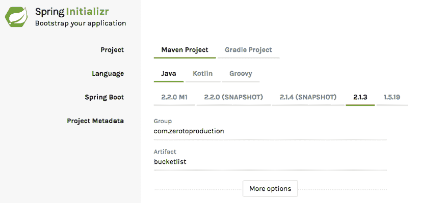
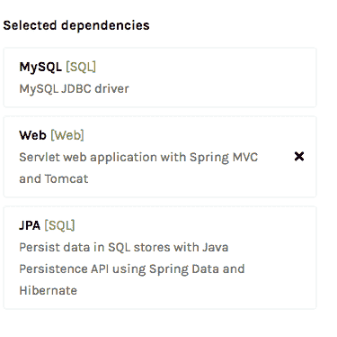
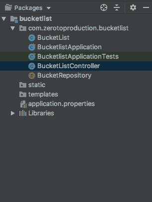
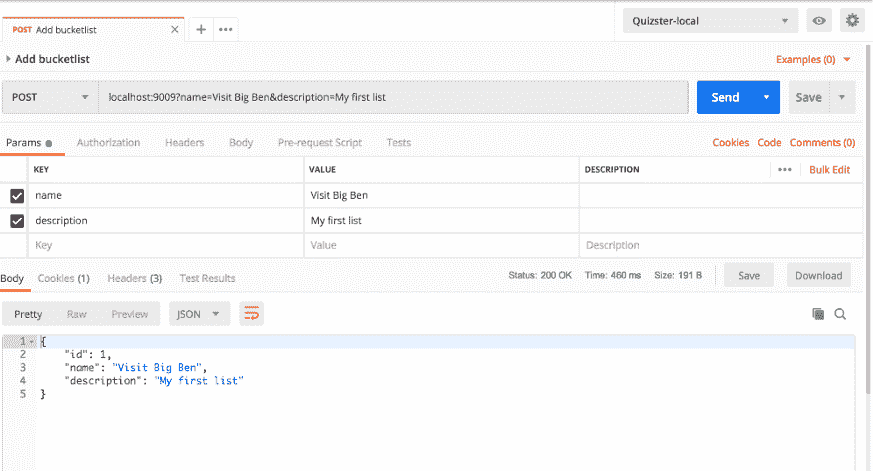
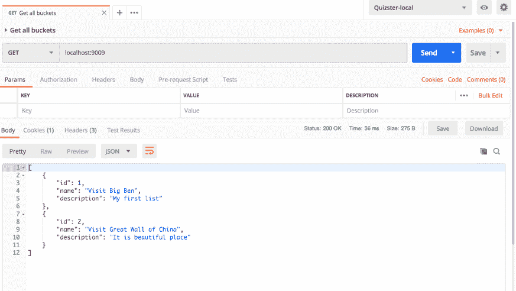
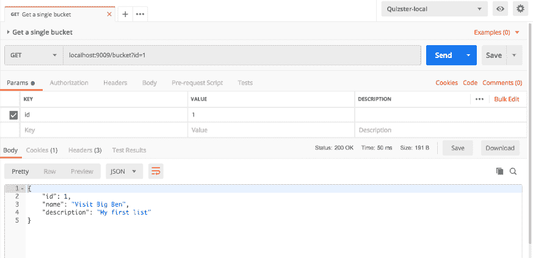
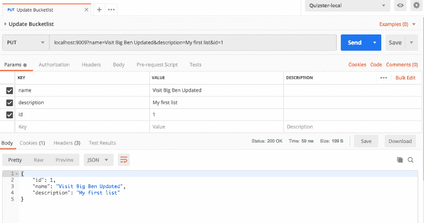
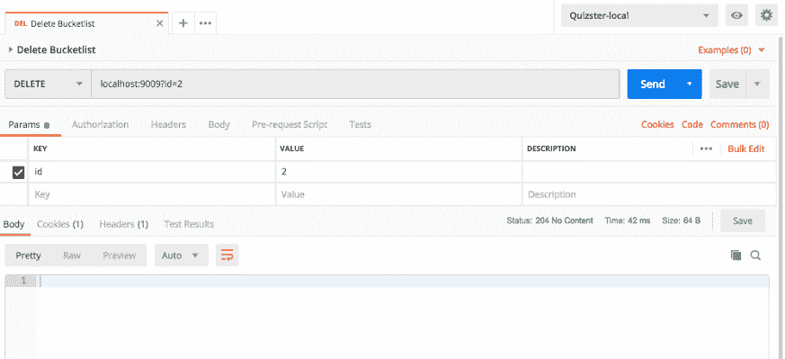

# 使用 Mysql 和 Heroku 开发和部署 Rest Api

> 原文：<https://dev.to/paultofunmi/develop-and-deploy-your-rest-api-using-mysql-and-heroku-a61>

在 Rest API 的第一部分中，我们使用 Spring Boot 和赫罗库构建了一个虚构的列表，列出了我们希望在有生之年去旅游或参观的地方。但是，存储桶不存储在数据库中。这意味着每当我们重启服务器时，我们的桶信息都会丢失。

[](https://res.cloudinary.com/practicaldev/image/fetch/s--45ncqtea--/c_limit%2Cf_auto%2Cfl_progressive%2Cq_auto%2Cw_880/https://thepracticaldev.s3.amazonaws.com/i/pf0fk2mc68lif2n171c3.jpg)

让我们解决这个问题。

在本教程的第二部分，您将学习如何在 MySQL 数据库中存储我们的桶列表，并将其部署到 Heroku。

要获得完整的代码，请向下滚动到本页底部。如果你不知道什么是休息，或者想复习一下我们已经学过的内容，请在这里阅读教程的第 1 部分。

**教程中使用的工具**

```
1\. IDE: IntelliJ    
2\. Framework: Spring Boot
3\. Web Maven Dependency: It provides with tomcat server which handles request and response mapping among other things.
4\. Mysql maven dependency: This provides a connector for connect to mysql database
5\. Maven JPA dependency: This is the ORM, Hibernate to be precise. It provides a wrapper for mapping Java classes to tables in the database.
6\. Build Tool: Maven
7\. Language: Java
8\. Hosting platform: Heroku
9\. Mysql database
10\. Database GUI (not required) 
```

我的选择已经显示在这里

[](https://res.cloudinary.com/practicaldev/image/fetch/s--_6dpwOKX--/c_limit%2Cf_auto%2Cfl_progressive%2Cq_auto%2Cw_880/https://cdn-images-1.medium.com/max/873/1%2Aw17Mgb_34zW-o1HXY8ZTbg.png)

[](https://res.cloudinary.com/practicaldev/image/fetch/s--vOBzsxCx--/c_limit%2Cf_auto%2Cfl_progressive%2Cq_auto%2Cw_880/https://cdn-images-1.medium.com/max/873/1%2AGzXgjOngiyXWBmAaETk_XA.png)

Spring boot starter web 包含引导嵌入式服务器等应用程序所需的一切。Tomcat 是默认的。

**第二节**

我们需要创建两个 Java 类。一个将作为接收请求和响应的控制器。第二个将作为数据模型。

下面是我们的数据模型(BucketList)的样子:

```
package com.zerotoproduction.bucketlist;

import javax.persistence.*;

@Entity
public class BucketList {

@Id
@Column(name = "id", unique = true, nullable = false)
@GeneratedValue(strategy = GenerationType.IDENTITY)
private long id;

@Column(name = "name", length = 60, nullable = false)
private String name;

@Column
private  String description;

BucketList() {

}

BucketList(String name, String description){
    this.name = name;
    this.description = description;
}

BucketList(long id, String name, String description){
    this.id = id;
    this.name = name;
    this.description = description;
}

public long getId() {
    return id;
}

public void setId(long id) {
    this.id = id;
}

public String getName() {
    return name;
}

public void setName(String name) {
    this.name = name;
}

public String getDescription() {
    return description;
}

public void setDescription(String description) {
    this.description = description;
}

@Override
public String toString() {
    return "BucketList{" +
            "id=" + id +
            ", name='" + name + '\'' +
            ", description='" + description + '\'' +
            '}';
}
} 
```

对每个注释的解释

1.  @Entity:通过这个注释，我们已经指定这个类表示数据库中的一个实体。

2.  [@id](https://dev.to/id) :指定该属性为主键

3.  @Column(name = "id "，unique = true，nullable = false): @Column 指定此字段应为列，其名称应为 id，值应唯一且不能为 null。

4.  @ generated value(strategy = generation type。身份)。我们被指定这些值应该由 DB 使用身份生成类型来生成。

我们还需要数据访问对象(DAO)。幸运的是，Spring 提供了很多选项，从 CrudRepository 到 JPARepository。这些接口为用@Entity 注释注释的对象提供了现成的 CRUD 功能。但是，需要注意的是，您的 DAO 接口必须扩展它们，并为该实体指定实体和主键的数据类型。在我们的例子中，我们像这样扩展 JPARepository:JPARepository。实体为 BucketList，其主键的数据类型为 Long。现在我们已经拥有了在数据库中持久存储我们的存储桶所需要的一切。

这是我们的 bucket list 仓库的样子

```
package com.zerotoproduction.bucketlist;

import org.springframework.data.jpa.repository.JpaRepository;

public interface BucketRepository extends JpaRepository<BucketList, Long> {
} 
```

这是控制器的样子:

```
 package com.zerotoproduction.bucketlist;

 import org.springframework.beans.factory.annotation.Autowired;
 import org.springframework.http.ResponseEntity;
 import org.springframework.web.bind.annotation.*;
 import java.util.Optional;

 @RestController
 public class BucketListController {

@Autowired
BucketRepository bucketRepository;

@GetMapping(value = "/")
public ResponseEntity index() {
    return ResponseEntity.ok(bucketRepository.findAll());
}

@GetMapping(value = "/bucket")
public ResponseEntity getBucket(@RequestParam(value="id") Long id) {
    Optional<BucketList> foundBucketList = bucketRepository.findById(id);

    if(foundBucketList.isPresent()){
        return ResponseEntity.ok(foundBucketList.get());
    }else {
        return ResponseEntity.badRequest().body("No bucket with specified id " + id + " found");
    }
}

@PostMapping(value = "/")
public ResponseEntity addToBucketList(@RequestParam(value="name") String name, @RequestParam(value="description") String desc) {
    return ResponseEntity.ok(bucketRepository.save(new BucketList(name, desc)));
}

@PutMapping(value = "/")
public ResponseEntity updateBucketList(@RequestParam(value="name") String name, @RequestParam(value="id") Long id, @RequestParam(value="description") String desc) {
    Optional<BucketList> optionalBucketList = bucketRepository.findById(id);
    if(!optionalBucketList.isPresent()){
        return ResponseEntity.badRequest().body("No bucket with specified id " + id + " found");
    }

    BucketList foundBucketList = optionalBucketList.get();
    foundBucketList.setName(name);
    foundBucketList.setDescription(desc);

    return ResponseEntity.ok(bucketRepository.save(foundBucketList));
}

@DeleteMapping(value = "/")
public ResponseEntity removeBucketList(@RequestParam(value="id") Long id) {
    bucketRepository.deleteById(id);
    return ResponseEntity.noContent().build();
} 
```

}

下面是我的文件夹结构的样子
[](https://res.cloudinary.com/practicaldev/image/fetch/s--HuJ_JO9T--/c_limit%2Cf_auto%2Cfl_progressive%2Cq_auto%2Cw_880/https://cdn-images-1.medium.com/max/873/1%2A0KppgN1ZwRwCeQ6sK0s2UA.png)

因为我们连接到一个数据库，我们需要数据库的地址、用户名和密码。

在部署到 Heroku 之前，我们将在我们的 pc 上进行本地测试。我已经在 application.properties 中指定了属性，让我们来看一下

```
 spring.datasource.url=jdbc:mysql://localhost:3306/zero_to_production_bucketlist_jpa?serverTimezone=UTC
 spring.datasource.username=root
 spring.datasource.password=Toor1234

# Hibernate ddl auto (create, create-drop, update)
spring.jpa.hibernate.ddl-auto=update

#MySQL DIALECT
#spring.jpa.properties.hibernate.dialect=org.hibernate.dialect.MySQL5Dialect

server.port=9009 
```

**解释**

1.  url 指定连接到数据库的连接字符串
2.  指定连接到数据库的用户名
3.  spring.datatsource.password 指定密码。
4.  ddl-auto 指定 hibernate 将如何处理数据库中的实体。create 选项意味着每次重新启动时都会删除并创建所有实体，而 update 选项会在不删除实体的情况下向实体添加更改。在生产中，您需要使用更新，否则您的数据将被刷新。
5.  server.port 指定我们的应用程序将运行的端口号。

是时候进行测试了，这次我们将在本地进行。我们将使用邮递员

**测试 1:添加一个桶列表**

[http://localhost:9009？name =参观](http://localhost:9009?name=Visit)大本钟&description =我的第一张清单

[](https://res.cloudinary.com/practicaldev/image/fetch/s--DhG80rQG--/c_limit%2Cf_auto%2Cfl_progressive%2Cq_auto%2Cw_880/https://cdn-images-1.medium.com/max/873/1%2AH7OzLP2erz5Mt0eGF2JFnw.png)

**测试 2:获取所有存储桶列表**

[http://localhost:9009](http://localhost:9009)

您应该会看到与下面的
[](https://res.cloudinary.com/practicaldev/image/fetch/s--DQ4IpkqL--/c_limit%2Cf_auto%2Cfl_progressive%2Cq_auto%2Cw_880/https://cdn-images-1.medium.com/max/873/1%2A7zAFa2PvEPJps1GxdDbE5A.png) 类似的响应

**测试 3:获取单个桶列表**

[http://localhost:9009/bucket？id=1](http://localhost:9009/bucket?id=1)
[](https://res.cloudinary.com/practicaldev/image/fetch/s--UovfWv-w--/c_limit%2Cf_auto%2Cfl_progressive%2Cq_auto%2Cw_880/https://cdn-images-1.medium.com/max/873/1%2AEsTN3uen_PxSfmzMhXGtHQ.png)

**测试四:更新桶**
[http://localhost:9009？name =拜访](http://localhost:9009?name=Visit)大本钟更新&description =我的第一份名单& id=1

[](https://res.cloudinary.com/practicaldev/image/fetch/s--qFUlm13X--/c_limit%2Cf_auto%2Cfl_progressive%2Cq_auto%2Cw_880/https://cdn-images-1.medium.com/max/873/1%2AMmW27rXn9--TmoV2cVD7NQ.png)

**测试 5:删除存储桶**

[http://localhost:9009？id = 2](http://localhost:9009?id=2)
[T5】](https://res.cloudinary.com/practicaldev/image/fetch/s--aZDGNRN3--/c_limit%2Cf_auto%2Cfl_progressive%2Cq_auto%2Cw_880/https://cdn-images-1.medium.com/max/873/1%2Ao3ZrriYb6R2zxRQ5T_MbrQ.png)

**第二部分:部署到 Heroku 的时间**

```
You need to create an account on Heroku
Install Heroku Cli. Heroku CLI is a command line application that lets you     create, deploy and manage Heroku apps from the command line. 
You can download Heroku CLI from Heroku Dev Center.
Login using your email and password 
```

**设置 Git 并创建一个 Heroku app**
Git init
Git add。
git commit -m "初始提交"
heroku 登录

现在，使用 heroku 创建一个应用程序，如下所示

```
heroku create 
```

接下来，您需要像这样添加 mysql DB:

```
heroku addons:create cleardb:ignite 
```

现在您已经添加了 clearDB，您需要连接 url。要得到这个，像这样键入:

```
heroku config 
```

它应该会返回您的连接字符串。

您需要用从 heroku config 返回的值替换 spring.datasource.url 值。

不过，最后一件事，要使它工作，添加一个数据库配置文件，如下所示:

```
package com.zerotoproduction.bucketlist;

import com.zaxxer.hikari.HikariConfig;
import com.zaxxer.hikari.HikariDataSource;
import org.springframework.beans.factory.annotation.Value;
import org.springframework.context.annotation.Bean;
import org.springframework.context.annotation.Configuration;

import javax.sql.DataSource;

@Configuration
public class DatabaseConfig {

@Value("${spring.datasource.url}")
private String dbUrl;

@Bean
public DataSource dataSource() {
    HikariConfig config = new HikariConfig();
    config.setJdbcUrl(dbUrl);
    return new HikariDataSource(config);
}
} 
```

**将应用部署到 Heroku**

```
git push heroku master 
```

**我们的应用现在已经部署到 Heroku**

```
https://tranquil-mountain-81706.herokuapp.com/ 
```

让我们再次测试，但是您必须用 heroku 给出的 url 删除本地主机和端口。

例如，为了获得我们的桶列表中的所有项目，我们使用

```
https://tranquil-mountain-81706.herokuapp.com/ 
```

为了得到我们使用的物品

```
https://tranquil-mountain-81706.herokuapp.com//bucket?id=1 
```

我们今天的教程到此结束。

要了解构建、保护和部署 Spring Boot Rest Api 的完整系列，请访问我们的博客:

[https://medium.com/zero-to-production](https://medium.com/zero-to-production)

```
Contact us via email on: zerotoproduction@gmail.com 
```

完整的代码可以在这里找到:

[https://github.com/zero-to-production/bucketlist](https://github.com/zero-to-production/bucketlist)