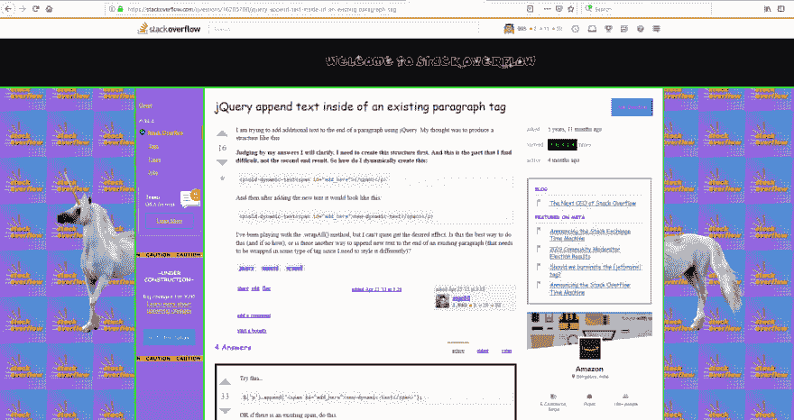

# 为什么我会看到堆栈溢出网站这样，它被黑客攻击了吗？

> 原文：<https://dev.to/madhu/why-i-am-seeing-stack-overflow-site-this-way-is-it-hacked-34am>

[这里是链接>>>>stackoverflow.com](https://stackoverflow.com/questions/16205788/jquery-append-text-inside-of-an-existing-paragraph-tag)