# 第八部分。上下班打卡系统:使用环境部署前端(角度 6+)

> 原文：<https://dev.to/carlillo/part-8-clock-in-out-system-deploy-frontend-angular-6-using-environments-nog>

这篇文章是我描述上下班打卡系统的一系列文章的一部分，如果你想了解更多，你可以阅读下面的文章:

*   第一部分。上下班打卡系统:图表。
*   第二部分。上下班打卡系统:基本后端— AuthModule。
*   第三部分。上下班打卡系统:基本后端—用户模块。
*   第四部分。上下班打卡系统:基本后端应用模块。
*   第五部分。打卡系统:种子数据库和迁移数据
*   第六部分。上下班打卡系统:基本前端。
*   第七部分。打卡/下班系统:使用 docker/docker-compose 部署后端(nestJS)。
*   第八部分。上下班打卡系统:使用环境部署前端(角度 2+)。
*   第九部分。测试:后端测试—单元测试—服务
*   第十部分。测试:后端测试—单元测试—控制器
*   第十一部分。测试:后端测试— E2E 测试
*   第十二部分。测试:前端测试—单元测试
*   第十三部分。测试:前端测试—集成测试

### 简介

在上一篇文章(第七部分。打卡上班/下班系统:使用 docker/docker-compose 部署后端(nestJS)，我们使用环境
变量和 docker/docker-compose 在生产服务器中部署我们的系统后端。在这篇文章中，我们将使用环境变量(用 Angular CLI 创建)和 docker/docker-compose 来部署我们的前端，它是用 Angular 开发的。

这里有一个在 angular 中管理环境变量的通用解决方案，使用 angular-cli(我们很快就会用到)。另一个解决方案是使用 gulp 或 webpack 等工具创建自己的部署系统。

最后，使用 [docker 的容器](https://www.docker.com/)部署我们的代码。我们将从我们的代码中创建一个图像，
[docker-compose](https://docs.docker.com/compose/) 。

### Angular 的环境变量

默认情况下，Angular CLI 会创建一个包含环境文件的 src/environments 文件夹。最初有两个文件:1) `environment.ts`和 2) `environment.prod.ts`。

`environment.ts`文件用于开发环境，而`environment.prod.ts`文件用于生产环境。这些文件都在`angular.json`文件中被引用。

[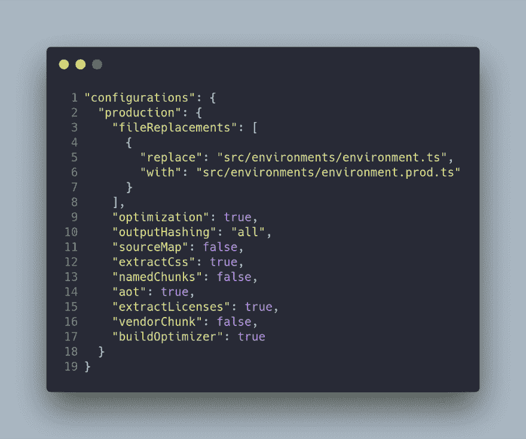](https://res.cloudinary.com/practicaldev/image/fetch/s--Orqm_gBX--/c_limit%2Cf_auto%2Cfl_progressive%2Cq_auto%2Cw_880/https://cdn-images-1.medium.com/max/1000/1%2AgypdxSLP_4U_Q3cfwX8RUA.png)

`fileReplacements`数组是 angular 的环境键，因为它用于指示当使用`production`配置时哪个文件将被替换。

在我们的代码中，我们只需要从环境文件中导入对象来使用我们的环境变量。下面的代码显示了一个导入所述环境文件的组件。

[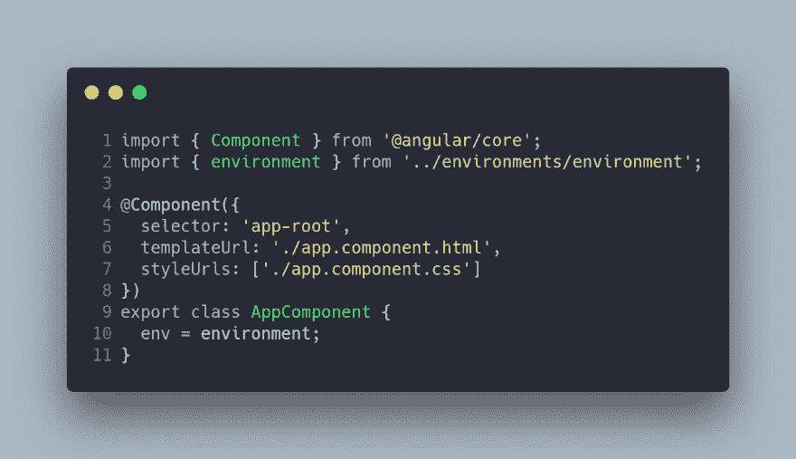](https://res.cloudinary.com/practicaldev/image/fetch/s--WyMOqnLX--/c_limit%2Cf_auto%2Cfl_progressive%2Cq_auto%2Cw_880/https://cdn-images-1.medium.com/max/1000/1%2AgbYlLmnTSqej5MJJgFJM-Q.png)

在不同环境之间切换的方法是使用`--configuration`选项，该选项可以在`ng serve`和`ng build`命令中使用:

[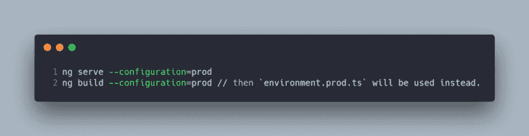](https://res.cloudinary.com/practicaldev/image/fetch/s--a_LtYkdR--/c_limit%2Cf_auto%2Cfl_progressive%2Cq_auto%2Cw_880/https://cdn-images-1.medium.com/max/1000/1%2Aahv-Zh0V0J3vpJzn8ecgVg.png)

我们可以拥有任意多的配置环境。例如:

1.  `environment.test.ts`。此配置可用于更改单元测试环境中的几个变量。
2.  `environment.e2e-test.test`。这个配置可以用来改变 e2e 测试环境中的几个变量。
3.  `environment.qa.ts`。此配置可用于更改 QA 环境中的几个变量。

因此，我们的环境文件的内容如下:

[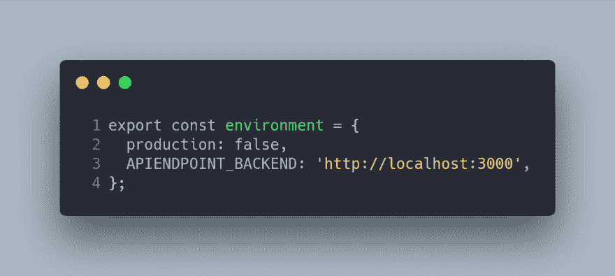](https://res.cloudinary.com/practicaldev/image/fetch/s--5RR30y7G--/c_limit%2Cf_auto%2Cfl_progressive%2Cq_auto%2Cw_880/https://cdn-images-1.medium.com/max/1000/1%2A9kmbQgGylnR-R7UUJ7DlfQ.png)

[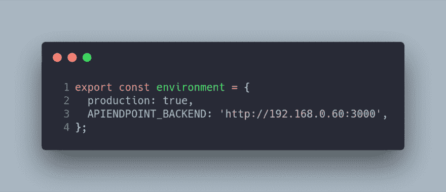](https://res.cloudinary.com/practicaldev/image/fetch/s---G4mBGyN--/c_limit%2Cf_auto%2Cfl_progressive%2Cq_auto%2Cw_880/https://cdn-images-1.medium.com/max/1000/1%2AzsJGyAu-LnMkx61GxxGBZg.png)

在环境文件之间变化的变量是`APIENDPOINT_BACKEND`
和`production`。在`main.ts`文件中使用了`production`变量来调用`enableProdMode`，后者用于在最终的`bundle`中进行一些优化。

[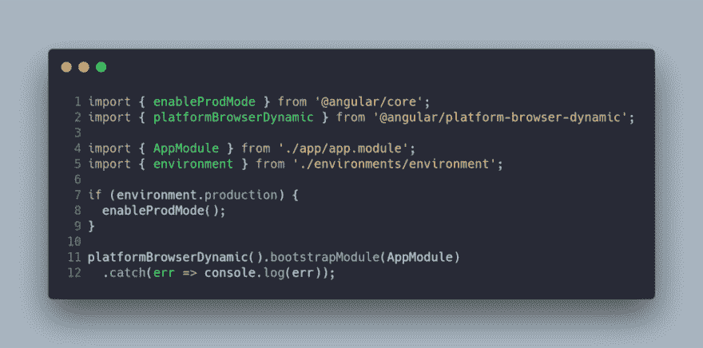](https://res.cloudinary.com/practicaldev/image/fetch/s--FpwkrCOL--/c_limit%2Cf_auto%2Cfl_progressive%2Cq_auto%2Cw_880/https://cdn-images-1.medium.com/max/1000/1%2At5OWGAJoZc50KEWUuHknog.png)

在我们的项目中，有一个包含项目常数的文件。该文件包含端点列表，这些端点是使用`APIENDPOINT_BACKEND`的关系。这个想法是使用环境文件(`environment`)，您可以在下面的代码中看到:

[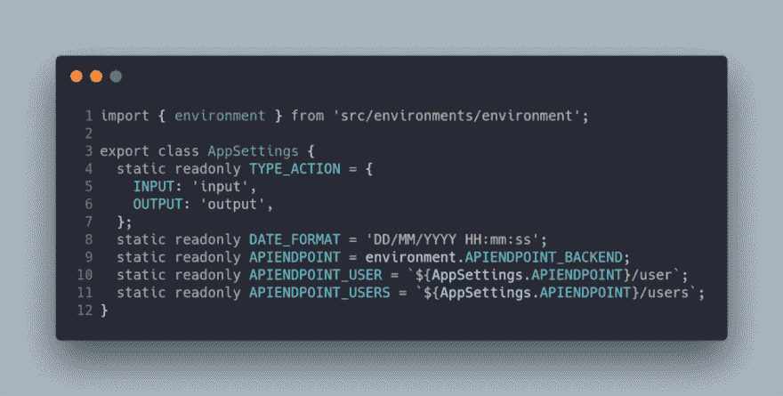](https://res.cloudinary.com/practicaldev/image/fetch/s--GpwQzvR9--/c_limit%2Cf_auto%2Cfl_progressive%2Cq_auto%2Cw_880/https://cdn-images-1.medium.com/max/1000/1%2AsE-LerIthjLeph633v8mmQ.png)

### 部署:Docker 和 Docker-撰写

这个想法是在开发和生产中使用相同的环境。在这种情况下，Docker 是完美的工具，因为它允许我们配置不同的容器，从而切换环境的配置。我们需要构建自己的映像，一个 docker 容器，它将通过使用`Docker-compose`来编排。

### 码头工人

我们的`dockerfile`文件基于`nginx:alpine`图像，因为项目不需要系统库。该图像仅复制了使用命令`ng build --configuration=prod`构建到发行版后的`nginx.conf`配置和角度项目。

angular 代码部署在 web 服务器中非常重要，比如`apache`或者`ngnix`。

`nginx`配置现在如下:

[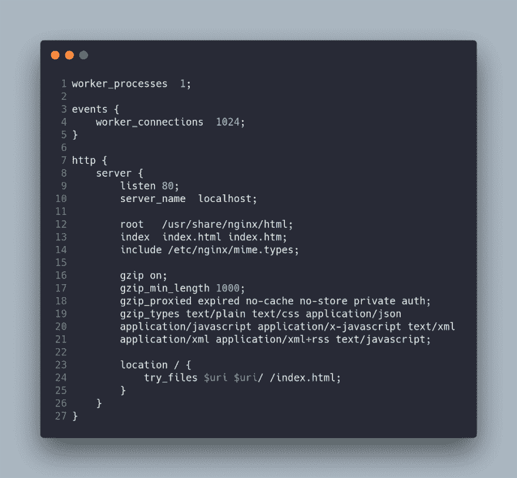](https://res.cloudinary.com/practicaldev/image/fetch/s--SQ-eEmGl--/c_limit%2Cf_auto%2Cfl_progressive%2Cq_auto%2Cw_880/https://cdn-images-1.medium.com/max/1000/1%2A5sKR7uuRlklbxaDUgOlsLA.png)

### 码头工-化合物

在我们的项目中，我们有一个 docker-compose 文件，用于部署我们的 docker 映像。这个文件非常简单，因为它仅仅部署了包含我们 Angular 项目编译代码的容器。

[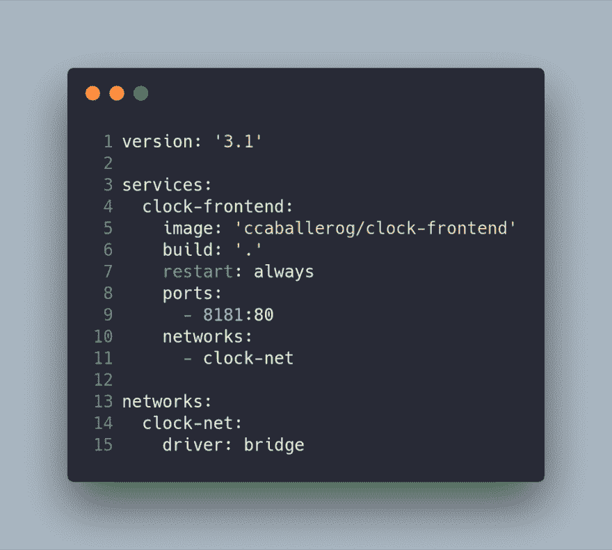](https://res.cloudinary.com/practicaldev/image/fetch/s--_iDaC-Dr--/c_limit%2Cf_auto%2Cfl_progressive%2Cq_auto%2Cw_880/https://cdn-images-1.medium.com/max/1000/1%2AMSUJCC_TNf8ElC-9Rcu0TA.png)

### 要部署的 Shell 脚本

我们流程的最后一步是自动化容器的构造和执行。我有两个脚本来完成这项任务；第一个脚本创建图像(首先删除图像，如果有图像的话)，第二个脚本
使用 docker-compose 部署代码。

[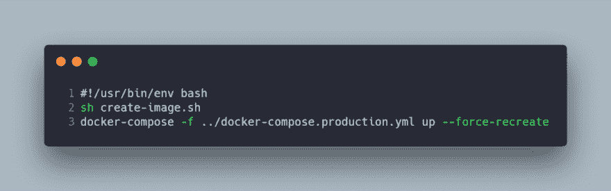](https://res.cloudinary.com/practicaldev/image/fetch/s--NytjdKnH--/c_limit%2Cf_auto%2Cfl_progressive%2Cq_auto%2Cw_880/https://cdn-images-1.medium.com/max/1000/1%2AxAerpYSNPjixJH3gfGXDNQ.png)

[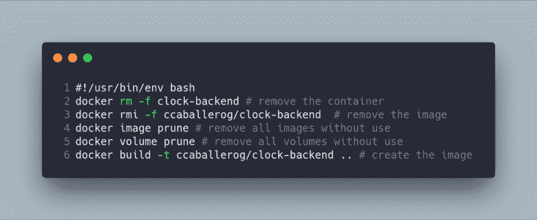](https://res.cloudinary.com/practicaldev/image/fetch/s--xqCFZ8T8--/c_limit%2Cf_auto%2Cfl_progressive%2Cq_auto%2Cw_880/https://cdn-images-1.medium.com/max/1000/1%2AM9WUfCPHSZZqXr1OxoIjCA.png)

### 结论

在这篇文章中，我解释了如何使用 docker 和 docker-compose 来部署 Angular 前端。这段代码最有趣的特性是，我们可以加载自己的环境变量，使用 Angular-CLI 在开发和生产环境之间切换。

* * *

原载于[www . carloscaballero . io](https://carloscaballero.io/part-8-deploy-frontend-angular-docker-docker-compose/)2019 . 2 . 15。