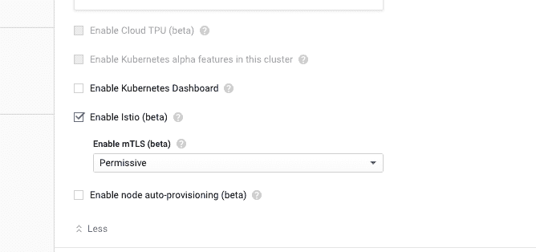
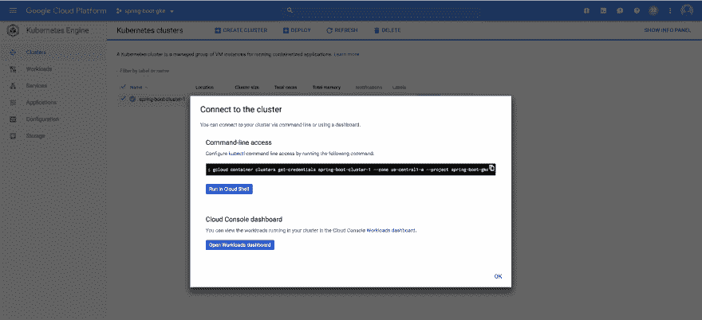
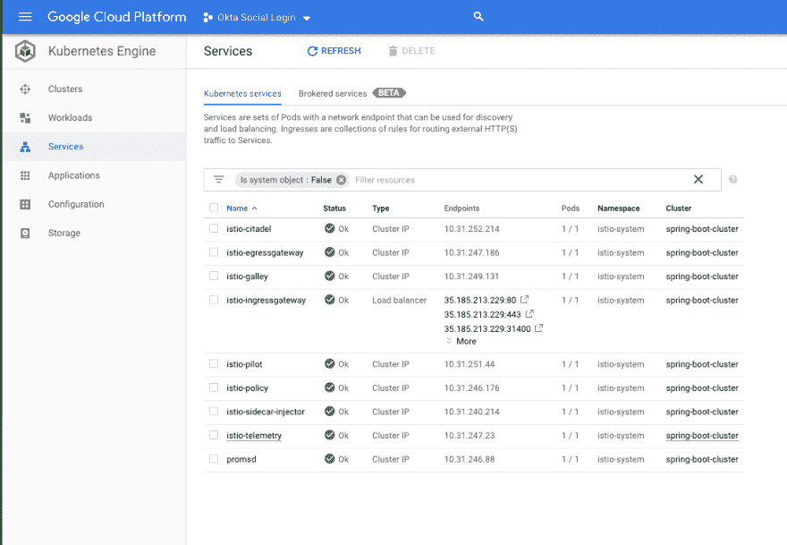
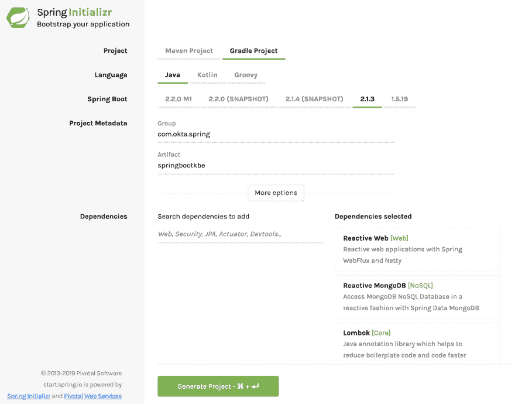
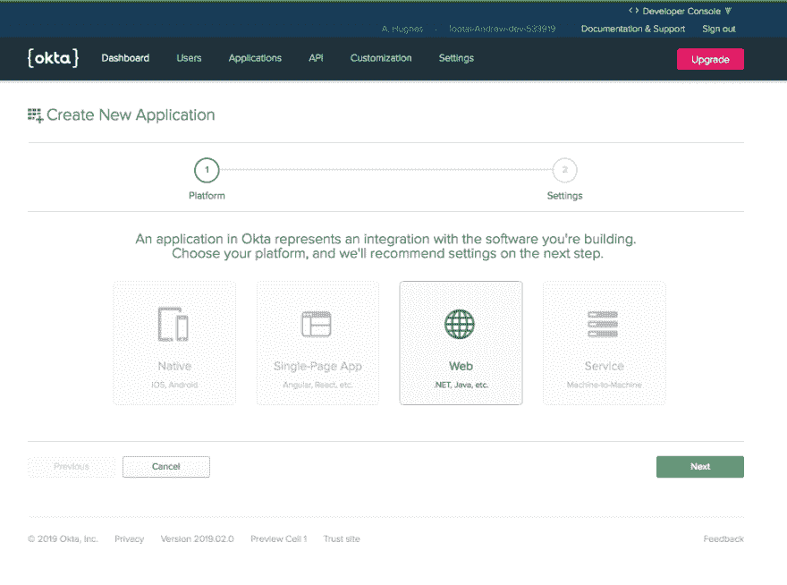
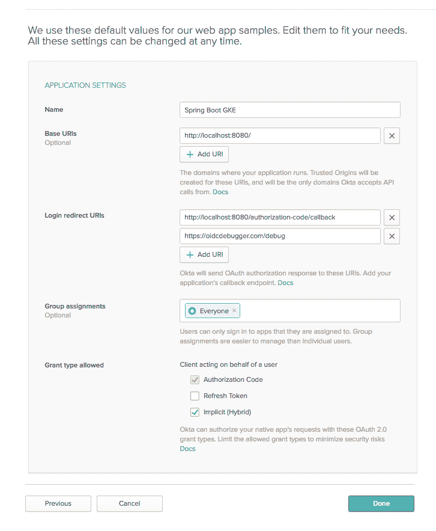

# 与 Spring Boot 和 Kubernetes 一起构建微服务架构

> 原文：<https://dev.to/oktadev/build-a-microservice-architecture-with-spring-boot-and-kubernetes-3j3k>

在本教程中，您将使用 Kubernetes 将 Spring Boot 微服务架构部署到谷歌云，具体来说就是谷歌 Kubernetes 引擎(GKE)。您还将使用 Istio 创建一个服务网格层和一个公共网关。整个事情将使用 Okta OAuth JWT 认证来保护。

那是一堆术语。这里不打算深入解释微服务。简而言之，微服务是一种设计模式，它将较大的整体服务分割成较小的、独立的“微”服务。这些服务通过网络松散耦合。这种架构的好处是每个服务都变得可测试、可维护和可独立部署。在互联网的规模上，以及在像亚马逊和网飞这样的大公司里，这种架构是伟大的，因为它允许公司将可管理的、离散的功能单元的责任分配给小团队；而不是让成千上万的人监督庞大的代码块。缺点是复杂性和基础设施的初始成本较高，这对于无法扩展的小型项目来说可能没有意义。

Kubernetes 是一个部署容器化服务的平台。你可以把它想象成 Docker 容器的容器编排器(这是一种简化，但也是可行的)。它将允许我们编写 YAML 脚本，自动将我们的微服务架构部署到我们选择的平台 GKE。这是一个巨大的项目，有很多东西需要挖掘。看看[他们的文档](https://kubernetes.io/docs/home/)了解更多信息。

Istio 在 Kubernetes 的基础上增加了另一层功能，增加了一些很棒的监控、安全、访问控制和负载平衡功能。查看[他们的网站](https://istio.io/docs/concepts/what-is-istio/)了解更多信息。

微服务架构的最后一块是**谷歌云和 GKE** 。这是您将用来部署微服务的平台。本教程中没有涉及的另一个选项是 Minikube。Minikube 在您的计算机上本地运行，可能对某些人很有用；我发现谷歌 Kubernetes 引擎更容易使用，性能更好。

我们假设你熟悉 Spring Boot 和 Java。如果没有，看看教程末尾的一些链接，让你开始学习。

## 对 Spring Boot 和库伯内特的要求

**HTTPie** :从[他们的网站](https://httpie.org/)安装 HTTPie，这样我们就可以从终端轻松运行 HTTP 请求。

**Docker** :如果你还没有安装 Docker 桌面，请从[他们的网站](https://www.docker.com/products/docker-desktop)下载并安装。

**kubectl** :这是 Kubernetes 的命令行界面。安装说明在[他们的网站](https://kubernetes.io/docs/tasks/tools/install-kubectl/)上。

**Google Cloud** :你需要一个启用计费的 Google Cloud 账户。免费试用是可用的，应该包括足够多的学分和时间让你通过本教程。去[谷歌云网站](https://cloud.google.com/free/)注册。

**developer.okta.com**:我们在[我们的开发者网站](https://developer.okta.com)上提供免费的开发者账户。请[现在就报名](https://developer.okta.com/signup/)一个。您将在本教程的最后使用它。

**gcloud** :这是谷歌云 CLI。使用他们网站上的说明进行安装。一旦完成，您将需要通过运行以下命令来安装`gcloud kubectl`组件:

```
gcloud components install kubectl 
```

我提到过微服务的初始复杂性成本很高吗？

## 用 Istio 创建一个 Google Kubernetes 引擎项目

您现在应该有一个启用了计费的 Google Cloud 帐户。同样，你应该不需要实际花任何钱，但没有账单，你将无法获得免费试用。

创建新项目。将其命名为`spring-boot-gke`(或者您想要的任何名称，但是您将需要各种命令的项目 ID)。等待项目被创建。

项目名称可能会在末尾加上一个 ID 号，就像`spring-boot-gke-232934`一样。您将多次需要这个项目名称，所以继续将它存储在一个 shell 变量中并记下来。

```
PROJECT_NAME=<your project name and ID> 
```

项目准备好后，打开项目仪表板，打开导航菜单，点击 **Kubernetes Engine** 。点击**启用计费**按钮(如果您尚未启用计费)并选择一个计费账户。

点击**创建集群**。

[](https://res.cloudinary.com/practicaldev/image/fetch/s--3ZTTUU0u--/c_limit%2Cf_auto%2Cfl_progressive%2Cq_auto%2Cw_880/https://developer.okta.com/assets-jekyll/blog/spring-boot-kubernetes/google-cloud-create-cluster-ea383e22b3494da4d57cd7998a4e23d4bf5b7fd4d1522b9e92ac3ecaa60dee6a.png)

从左侧面板中，选择**您的第一个集群**。

将集群命名为“spring-boot-cluster”

选择区域“美国西部 1-a”。

点击集群配置面板底部的**高级选项**链接，显示高级选项。向下滚动到底部，选中**启用 Istio (beta)** 复选框。这将自动在集群上安装 Istio。

[](https://res.cloudinary.com/practicaldev/image/fetch/s--Ywx0HpFr--/c_limit%2Cf_auto%2Cfl_progressive%2Cq_auto%2Cw_880/https://developer.okta.com/assets-jekyll/blog/spring-boot-kubernetes/enable-istio-56b7e19cf2ccaa2cc3c2558a97533f4006d77cc5fd43df4821aaa3b080eaf03b.png)

在底部，单击 **Create** 创建集群。喝杯咖啡或者休息一下；创建群集需要几分钟时间。

与此同时，如果您还没有这样做，请运行:
来初始化`gcloud` CLI

```
gcloud init 
```

在初始化过程中，您可以将新项目设定为默认项目，并将项目的片段设定为默认片段。

一旦部署了集群，您需要使用以下命令将您的本地`gcloud`和`kubectl` CLI 连接到集群:

```
gcloud container clusters get-credentials {yourClusterName} --zone us-west1-a --project {yourProjectId} 
```

如果您使用了不同的项目名称，您需要更改命令来反映这一点。

**注意:**如果你点击谷歌云平台仪表盘右侧的**连接**按钮，你会看到正确的输入命令:

[](https://res.cloudinary.com/practicaldev/image/fetch/s--BXtoHOuJ--/c_limit%2Cf_auto%2Cfl_progressive%2Cq_auto%2Cw_880/https://developer.okta.com/assets-jekyll/blog/spring-boot-kubernetes/connect-to-cluster-b5ca947b8ea5d0f9662db417227dccbd7db4aa8b2cfea64944906a86e46748c7.png)

您应该会看到类似下面这样的结果:

```
Fetching cluster endpoint and auth data.
kubeconfig entry generated for spring-boot-cluster. 
```

您还需要在集群上给自己管理员权限:

```
kubectl create clusterrolebinding cluster-admin-binding --clusterrole=cluster-admin --user=$(gcloud config get-value core/account) 
```

现在您需要检查并确保 Istio 服务已经安装并正在运行。有几种方法可以检查这一点。首先，在你的谷歌云平台 Kubernetes 引擎仪表盘中，点击**服务**按钮。您应该会在您的`spring-boot-cluster`中看到 Istio 服务列表。它们的状态栏下都应该有绿色的“Ok”。

当您在那里时，请注意类型为`LoadBalancer`的名为`istio-ingressgateway`的服务。这是集群的公共负载平衡器，条目显示了公共 IP 和开放端口。

[](https://res.cloudinary.com/practicaldev/image/fetch/s--EoEdjLDE--/c_limit%2Cf_auto%2Cfl_progressive%2Cq_auto%2Cw_880/https://developer.okta.com/assets-jekyll/blog/spring-boot-kubernetes/kubernetes-services-3ae0407ab89b844a41337cbf8eda240fdf32d6fec6ad44248d5385ba365fcdba.png)

另一种检查方法是使用`kubectl` CLI。

使用以下命令检查服务:`kubectl get services --all-namespaces`。需要使用`--all-namespaces`来显示位于`istio-system`名称空间中的 Istio 服务。

```
$ kubectl get services --all-namespaces
NAMESPACE      NAME                     TYPE           CLUSTER-IP      EXTERNAL-IP      PORT(S)                                                                                                                   AGE
default        kubernetes               ClusterIP      10.31.240.1     <none>           443/TCP                                                                                                                   5m
istio-system   istio-citadel            ClusterIP      10.31.252.214   <none>           8060/TCP,9093/TCP                                                                                                         3m
istio-system   istio-egressgateway      ClusterIP      10.31.247.186   <none>           80/TCP,443/TCP                                                                                                            3m
istio-system   istio-galley             ClusterIP      10.31.249.131   <none>           443/TCP,9093/TCP                                                                                                          3m
istio-system   istio-ingressgateway     LoadBalancer   10.31.244.186   35.185.213.229   80:31380/TCP,443:31390/TCP,31400:31400/TCP,15011:30675/TCP,8060:31581/TCP,853:32460/TCP,15030:30998/TCP,15031:31606/TCP   3m
istio-system   istio-pilot              ClusterIP      10.31.251.44    <none>           15010/TCP,15011/TCP,8080/TCP,9093/TCP                                                                                     3m
istio-system   istio-policy             ClusterIP      10.31.246.176   <none>           9091/TCP,15004/TCP,9093/TCP                                                                                               3m
istio-system   istio-sidecar-injector   ClusterIP      10.31.240.214   <none>           443/TCP                                                                                                                   3m
istio-system   istio-telemetry          ClusterIP      10.31.247.23    <none>           9091/TCP,15004/TCP,9093/TCP,42422/TCP                                                                                     3m
istio-system   promsd                   ClusterIP      10.31.246.88    <none>           9090/TCP                                                                                                                  3m
kube-system    default-http-backend     NodePort       10.31.250.134   <none>           80:31955/TCP                                                                                                              4m
kube-system    heapster                 ClusterIP      10.31.250.242   <none>           80/TCP                                                                                                                    4m
kube-system    kube-dns                 ClusterIP      10.31.240.10    <none>           53/UDP,53/TCP                                                                                                             4m
kube-system    metrics-server           ClusterIP      10.31.245.127   <none>           443/TCP 
```

要检查 Kubernetes pods，请使用:`kubectl get pods --all-namespaces`

```
$ kubectl get pods --all-namespaces
NAMESPACE      NAME                                                      READY     STATUS      RESTARTS   AGE
istio-system   istio-citadel-7c4864c9d5-7xq9x                            1/1       Running     0          10m
istio-system   istio-cleanup-secrets-ghqbl                               0/1       Completed   0          10m
istio-system   istio-egressgateway-c7f44ff8-tz7br                        1/1       Running     0          10m
istio-system   istio-galley-698f5c74d6-hmntq                             1/1       Running     0          10m
istio-system   istio-ingressgateway-774d77cb7c-qvhkb                     1/1       Running     0          10m
istio-system   istio-pilot-6bd6f7cdb-gb2gd                               2/2       Running     0          10m
istio-system   istio-policy-678bd4cf9-r8p6z                              2/2       Running     0          10m
istio-system   istio-sidecar-injector-6555557c7b-99c6k                   1/1       Running     0          10m
istio-system   istio-telemetry-5f4cfc5b6-vj8cf                           2/2       Running     0          10m
istio-system   promsd-ff878d44b-hlkpg                                    2/2       Running     1          10m
kube-system    heapster-v1.6.0-beta.1-8c76f98c7-2b4dm                    2/2       Running     0          9m
kube-system    kube-dns-7549f99fcc-z5trl                                 4/4       Running     0          10m
kube-system    kube-dns-autoscaler-67c97c87fb-m52vb                      1/1       Running     0          10m
kube-system    kube-proxy-gke-spring-boot-cluster-pool-1-b6988227-p09h   1/1       Running     0          10m
kube-system    l7-default-backend-7ff48cffd7-ppvnn                       1/1       Running     0          10m
kube-system    metrics-server-v0.2.1-fd596d746-njws2                     2/2       Running     0          10m 
```

这些单元都需要有一个状态`Completed`或`Running`。我遇到了几次问题，自动配置不起作用，一些吊舱从未达到`Running`状态，卡在`ContainerCreating`中。我不得不删除集群，并重新安装它才能工作。

如果发生这种情况，您可以使用`describe pods`命令来查看发生了什么:`kubectl describe pods -n istio-system`。这将为您提供大量关于使用`-n`选项指定的`istio-system`名称空间中所有 pod 的信息。

如果到目前为止没有问题，那么您现在已经在 GKE 上部署了一个 Kubernetes 集群，并安装了 Istio！很可爱。

如果你有问题，谷歌和 Istio 都有一些非常有用的文档。查看[谷歌 GKE 文档](https://cloud.google.com/kubernetes-engine/docs/quickstart)和 [Istio GKE 文档](https://istio.io/docs/setup/kubernetes/quick-start-gke/)获得进一步支持。

## 为您的微服务创建一个 Spring Boot 项目

现在转到 [Spring Initializer](https://start.spring.io/) 并创建您的起始项目。

*   将构建工具从 Maven 改为 **Gradle**
*   使用 **Java** 和 Spring Boot 版本 **2.1.3**
*   将**组**更新为:`com.okta.spring`
*   使用**神器** : `springbootkbe`
*   添加三个**依赖** : `Reactive Web`、`Reactive MongoDB`和`Lombok`

[](https://res.cloudinary.com/practicaldev/image/fetch/s--So1cC1Dl--/c_limit%2Cf_auto%2Cfl_progressive%2Cq_auto%2Cw_880/https://developer.okta.com/assets-jekyll/blog/spring-boot-kubernetes/spring-initializr-3d77fe119a9f68402458efbcbde9ac53c5be95c643d38c74f172dc40b96cc3ca.png)

点击**生成项目**，下载项目。将项目解压缩到本地计算机上的某个位置，并在您喜欢的 IDE 或编辑器中打开它。

Spring Initializer 创建了一个带有 MongoDB 支持的准系统反应式 Webflux 项目，供您扩展。

正如在我的一些其他教程中一样，因为我喜欢 kayak，所以您将构建一个简单的 reactive REST 服务来维护 kayak 条目的数据库。它实际上只是为了演示基本的 CRUD 功能(创建、读取、更新和删除),并且可以推广到任何类型的资源。

在`src/main/java`下的`com.okta.spring.springbootkbe`包中，创建一个名为`Kayak.java`的文档类，并将以下内容粘贴到其中。这是您的反应式数据模型文档。

```
package com.okta.spring.springbootkbe;

import lombok.AllArgsConstructor;  
import lombok.Data;  
import lombok.NoArgsConstructor;  
import org.springframework.data.mongodb.core.mapping.Document;  

@Document  
@Data  
@AllArgsConstructor  
@NoArgsConstructor  
public class Kayak {  

    private String name;  
    private String owner;  
    private Number value;  
    private String makeModel;  
} 
```

现在在同一个包中创建另一个名为`KayakRepository.java`的文件。

```
package com.okta.spring.springbootkbe;  

import org.springframework.data.mongodb.repository.ReactiveMongoRepository;  

public interface KayakRepository extends ReactiveMongoRepository<Kayak, Long> {  
} 
```

在本教程中，我不打算详细介绍这里发生的事情。Spring Boot 在这两个文件之间做了大量的自动变戏法，以创建一个全功能的反应式 Mongo 文档。

接下来，您需要添加一个控制器来允许访问 Kayak 文档数据模型。在`com.okta.spring.springbootkbe`包中创建一个名为`KayakController`的文件。

```
package com.okta.spring.springbootkbe;

import org.springframework.beans.factory.annotation.Autowired;
import org.springframework.stereotype.Controller;
import org.springframework.web.bind.annotation.*;
import reactor.core.publisher.Flux;
import reactor.core.publisher.Mono;

@Controller
@RequestMapping(path = "/kayaks")
public class KayakController {

    private final KayakRepository kayakRepository;

    public KayakController(KayakRepository kayakRepository) {
        this.kayakRepository = kayakRepository;
    }

    @PostMapping()
    public @ResponseBody
    Mono<Kayak> addKayak(@RequestBody Kayak kayak) {
        return kayakRepository.save(kayak);
    }

    @GetMapping()
    public @ResponseBody
    Flux<Kayak> getAllKayaks() {
        Flux<Kayak> result = kayakRepository.findAll();
        return result;
    }} 
```

这个控制器向`/kayaks`端点添加了两个方法，一个是 POST 端点，另一个是 GET 端点，分别添加一个新的 kayak 和列出所有 kayak。

最后，添加一个简单的名为`RootController`的根控制器。

```
package com.okta.spring.springbootkbe;  

import org.springframework.stereotype.Controller;  
import org.springframework.web.bind.annotation.*;  
import reactor.core.publisher.Flux;  

@Controller  
public class RootController {  

    @GetMapping("/")  
    @ResponseBody  
    public Flux<String> getRoot() {  
      return Flux.just("Alive");  
    }
} 
```

这个控制器是必需的，因为 Kuberenetes 在我们的服务的根端点上执行健康检查，并且需要返回一个响应，否则集群会认为您的服务停止了。实际的端点是可配置的，但是现在您可以把它放在根上。

为了将一些样本数据引导到我们的数据库中，更新`SpringbootkbeApplication`类定义以匹配以下内容。

```
package com.okta.spring.springbootkbe;  

import org.springframework.boot.ApplicationRunner;  
import org.springframework.boot.SpringApplication;  
import org.springframework.boot.autoconfigure.SpringBootApplication;  
import org.springframework.context.annotation.Bean;  
import reactor.core.publisher.Flux;  

@SpringBootApplication  
public class SpringbootkbeApplication {

    public static void main(String[] args) {
        SpringApplication.run(SpringbootkbeApplication.class, args);
    }

    @Bean
    ApplicationRunner init(KayakRepository repository) {

        Object[][] data = {
            {"sea", "Andrew", 300.12, "NDK"},
            {"creek", "Andrew", 100.75, "Piranha"},
            {"loaner", "Andrew", 75, "Necky"}
        };

        return args -> {
            repository
                .deleteAll()
                .thenMany(
                    Flux
                        .just(data)
                        .map(array -> {
                            return new Kayak((String) array[0], (String) array[1], (Number) array[2], (String) array[3]);
                        })
                        .flatMap(repository::save)
                )
                .thenMany(repository.findAll())
                .subscribe(kayak -> System.out.println("saving " + kayak.toString()));

        };
    }
} 
```

至此，您已经有了一个功能完整的 Spring Boot 应用程序(减去一个 MongoDB 服务器)。要测试您的应用程序，请将以下依赖项添加到您的`build.gradle`文件中。

```
compile 'de.flapdoodle.embed:de.flapdoodle.embed.mongo' 
```

这将向您的项目添加一个嵌入式 MongoDB 数据库。在部署到集群之前，您需要移除此依赖关系，但这将允许您在本地运行 Spring Boot 应用程序。

使用`gradle bootRun`运行 Spring Boot 应用程序。

您应该会看到一串以
结尾的输出

```
2019-02-14 19:29:34.941 INFO 35982 --- [ntLoopGroup-2-4] org.mongodb.driver.connection : Opened connection [connectionId{localValue:5, serverValue:5}] to localhost:61858
2019-02-14 19:29:34.946 INFO 35982 --- [ntLoopGroup-2-3] org.mongodb.driver.connection : Opened connection [connectionId{localValue:4, serverValue:4}] to localhost:61858
saving Kayak(name=sea, owner=Andrew, value=300.12, makeModel=NDK)
saving Kayak(name=loaner, owner=Andrew, value=75, makeModel=Necky)
saving Kayak(name=creek, owner=Andrew, value=100.75, makeModel=Piranha) 
```

使用 HTTPie 测试应用程序:`http :8080`(这将在默认的 Spring Boot 端口上运行一个 get 请求)。

```
HTTP/1.1 200 OK
Content-Type: text/plain;charset=UTF-8
transfer-encoding: chunked

Alive 
```

并使用`http :8080/kayaks`获得您的`/kayaks`端点。

```
HTTP/1.1 200 OK
Content-Type: application/json;charset=UTF-8
transfer-encoding: chunked
[
  {
    "makeModel": "NDK",
    "name": "sea",
    "owner": "Andrew",
    "value": 300.12
  },
  {
    "makeModel": "Necky",
    "name": "loaner",
    "owner": "Andrew",
    "value": 75
  },
  {
    "makeModel": "Piranha",
    "name": "creek",
    "owner": "Andrew",
    "value": 100.75
  }
] 
```

假设一切正常，**删除嵌入的 Mongo 依赖项**。您将使用 Mongo Kubernetes pod，这种依赖性将导致集群部署出现问题。

```
compile 'de.flapdoodle.embed:de.flapdoodle.embed.mongo' 
```

## 为您的 Spring Boot 应用程序部署 MongoDB Kubernetes Pod

Kubernetes 通过使用 YAML 部署脚本部署 Docker 容器来工作(概括和简化)。

在项目的根目录下创建一个名为`deployment-mongo.yml`的文件。

```
apiVersion: apps/v1  
kind: Deployment  
metadata:  
  name: mongodb  
  labels:  
    appdb: mongodb  
spec:  
  replicas: 1  
  selector:  
    matchLabels:  
      appdb: mongodb  
  template:  
    metadata:  
      labels:  
        appdb: mongodb  
    spec:  
      containers:  
        - name: mongodb  
          image: mongo:3.6.6  
          ports:  
            - containerPort: 27017  
---  
apiVersion: v1  
kind: Service  
metadata:  
  name: mongodb  
  labels:  
    app: mongodb  
spec:  
  ports:  
    - port: 27017  
      protocol: TCP  
  selector:  
    appdb: mongodb 
```

这定义了在集群上创建 Mongo 数据库所需的 MongoDB Kubernetes `Deployment`和`Service`。我不打算在这里尝试并完全解释这些对象是什么，但是您可以阅读 Kubernetes [部署文档](https://kubernetes.io/docs/concepts/workloads/controllers/deployment/)和[服务文档](https://kubernetes.io/docs/concepts/services-networking/service/)。粗略地说，部署定义了在部署的 pod 中运行的微应用程序，而服务提供了总体抽象，定义了 pod 中应用程序的访问点。这种抽象提供了必要的连续性，因为 pod 可能被终止和重启，并且可能有多个 pod 运行单个服务。

现在来点刺激的！您将把 Mongo 数据库部署和服务部署到您的 GKE 集群。

使用以下命令:

```
kubectl apply -f deployment-mongo.yml 
```

你应该看到:

```
deployment.apps "mongodb" created
service "mongodb" created 
```

通过运行
检查 pod

```
$ kubectl get pods 
```

你应该看到:

```
NAME READY STATUS RESTARTS AGE
mongodb-c5b8bf947-rkw5f 1/1 Running 0 21s 
```

如果状态列为`ContainerCreating`，等待片刻，再次运行命令。如果它卡在`ContainerCreating`上超过几分钟，很可能出了问题。您可以使用`kubectl describe pods`和`kubectl get events`命令来了解正在发生的事情。

这使用标准 docker 映像`mongo:3.6.6`配置了一个运行在端口 27017 上的 Mongo 数据库。

很棒，是吧？下一站，火箭科学！

## 将 Spring Boot 应用部署到集群

在根目录下添加一个名为`Dockerfile`的文件:

```
FROM openjdk:8-jdk-alpine 
ENV APP_FILE springbootkbe-0.1.0-SNAPSHOT.jar 
ENV APP_HOME /usr/app 
EXPOSE 8000 
COPY build/libs/*.jar $APP_HOME/ 
WORKDIR $APP_HOME 
ENTRYPOINT ["sh", "-c"] 
CMD ["exec java -jar $APP_FILE"] 
```

更新`src/main/resources/application.properties` :

```
server.port=8000
spring.data.mongodb.host=mongodb
spring.data.mongodb.port=27017 
```

这将把您的 Spring Boot 端口配置为您在`Dockerfile`中公开的端口，并配置 MongoDB 主机和端口。默认情况下，主机将是集群内服务的名称。

重新构建你的应用程序(你移除了对`flapdoodle`的依赖，对吗？):

```
gradle clean build 
```

在根项目目录
中创建另一个名为`deployment.yml`的 Kubernetes 部署脚本

```
apiVersion: v1  
kind: Service  
metadata:  
  name: kayak-service  
  labels:  
    app: kayak-service  
spec:  
  ports:  
    - name: http  
      port: 8000  
  selector:  
    app: kayak-service  
---  
apiVersion: extensions/v1beta1  
kind: Deployment  
metadata:  
  name: kayak-service  
spec:  
  replicas: 1  
  template:  
    metadata:  
      labels:  
        app: kayak-service  
        version: v1  
    spec:  
      containers:  
        - name: kayak-app  
          image: gcr.io/spring-boot-gke-<id>/kayak-app:1.0  
          imagePullPolicy: IfNotPresent  
          env:  
            - name: MONGODB_HOST  
              value: mongodb  
          ports:  
            - containerPort: 8000  
          livenessProbe:  
            httpGet:  
              path: /  
              port: 8000  
            initialDelaySeconds: 5  
            periodSeconds: 5 
```

**注:**仔细看看带`gcr.io/spring-boot-gke/kayak-app:1.0`的那一行。中间部分是谷歌云项目名称。这需要与您使用的项目名称以及分配的 ID 号(类似于`spring-boot-gke-43234`)相匹配。

`gcr.io`为美国的 docker 映像指定一个 Google Cloud 主机。有可能指定其他位置。查看[谷歌容器注册文档](https://cloud.google.com/container-registry/docs/pushing-and-pulling)了解更多信息。

对将要发生的事情做一个简单的总结，因为有很多移动的部分。Spring Boot 的应用程序将被 docker 化:内置于 docker 图像中。当您在集群上运行部署脚本时，它将尝试从 Google 容器注册表中提取这个映像。因此，您需要将图像推送到容器注册表中，并对其进行标记，以便 Kubernetes 可以找到正确的图像。

如果您使用的是本地 Docker 桌面，请启动它并等待它启动。

在你做任何事情之前，你需要配置 Google Cloud 和 docker 来很好地合作:

```
gcloud auth configure-docker 
```

构建 docker 映像:

```
docker build -t kayak-app:1.0 . 
```

标记图像并将其推送到 Google 容器注册中心(再次注意 Google Cloud 项目名称):

```
docker tag kayak-app:1.0 gcr.io/$PROJECT_NAME/kayak-app:1.0;  
docker push gcr.io/$PROJECT_NAME/kayak-app:1.0 
```

现在将`deployment.yml`文件应用到 GKE 集群:

```
kubectl apply -f deployment.yml 
```

检查以确保吊舱正确展开:

```
kubectl get pods 
```

```
NAME                             READY     STATUS    RESTARTS   AGE
kayak-service-7df4fb9c88-srqkr   1/1       Running   0          56s
mongodb-c5b8bf947-dmghb          1/1       Running   0          16m 
```

然而，此时您的集群还没有完全准备好。这不是公开的。

创建一个名为`istio-gateway.yml`的文件。

```
apiVersion: networking.istio.io/v1alpha3  
kind: Gateway  
metadata:  
  name: kayak-gateway  
spec:  
  selector:  
    istio: ingressgateway # use Istio default gateway implementation 
  servers:  
  - port:  
      name: http  
      number: 80  
      protocol: HTTP  
    hosts:  
    - '*'  
---  
apiVersion: networking.istio.io/v1alpha3  
kind: VirtualService  
metadata:  
  name: kayak-service  
spec:  
  hosts:  
  - "*"  
  gateways:  
  - kayak-gateway  
  http:  
  - match:  
    - uri:  
        prefix: /  
    route:  
    - destination:  
        port:  
          number: 8000  
        host: kayak-service 
```

并应用:

```
 kubectl apply -f istio-gateway.yml 
```

你应该得到:

```
gateway.networking.istio.io "kayak-gateway" created
virtualservice.networking.istio.io "kayak-service" created 
```

## 测试部署的 Google Kubernetes 引擎+ Spring Boot App

既然您已经成功地将 Spring Boot 应用程序部署到 Google Kubernetes 集群，并创建了将您的服务链接到外部世界的网关，那么您将需要测试端点。

Istio 网站上有一些关于入口流量的[好文档，里面有很多有用的信息。下面是从该页面复制的一些命令，这些命令将确定面向公众的主机/ip 地址和端口，并将它们保存到 shell 变量中。](https://istio.io/docs/tasks/traffic-management/ingress/) 

```
export INGRESS_HOST=$(kubectl -n istio-system get service istio-ingressgateway -o jsonpath='{.status.loadBalancer.ingress[0].ip}');
export INGRESS_PORT=$(kubectl -n istio-system get service istio-ingressgateway -o jsonpath='{.spec.ports[?(@.name=="http2")].port}'); 
```

在您的配置中，`INGRESS_PORT`可能只是 HTTP 的默认 80(没有 SSL)。

运行以下命令查看主机和端口:

```
echo "$INGRESS_HOST, HTTP PORT=$INGRESS_PORT"; 
```

公共 IP 地址也可以通过查看**云平台仪表板- > Kubernetes 引擎- >服务**中的负载平衡器 IP 地址来找到。寻找**负载平衡器**类型的**istio-Ingres gateway**服务。

测试应用程序！

```
http $INGRESS_HOST:$INGRESS_PORT/ 
```

你应该看到:

```
HTTP/1.1 200 OK
content-type: text/plain;charset=UTF-8
...

Alive 
```

并点击`/kayaks`终点:

```
http $INGRESS_HOST:$INGRESS_PORT/kayaks 
```

你应该看到:

```
HTTP/1.1 200 OK
content-type: application/json;charset=UTF-8
...
[
  {
    "makeModel": "NDK",
    "name": "sea",
    "owner": "Andrew",
    "value": 300.12
  },
  {
    "makeModel": "Piranha",
    "name": "creek",
    "owner": "Andrew",
    "value": 100.75
  },
  {
    "makeModel": "Necky",
    "name": "loaner",
    "owner": "Andrew",
    "value": 75
  }
] 
```

欢迎来到微服务的世界！

很明显，GKE 和伊斯蒂奥还有很多事情可以做。在实践中，微服务通常管理一个大型的服务网络和部署的 pod，它们可以根据需要进行扩展和缩减，复杂的安全架构可以在不同部分之间以及与外部世界进行管理。本教程不会深入讨论这个问题，但是还有一个步骤:用 Okta 添加 JSON web token 身份验证。

## 在 Okta 上创建 OpenID Connect App

[登录](https://login.okta.com/?SAMLRequest=fc%2B7CsJAEAXQXvAflu1NNJUMeZBGELTx1a%2FrYILJTtyZGD%2FfSBRiYzlw77lMnD3rSj3Qc0ku0YtgrhU6S5fSXRN9PKxmS52l00nMpq6iBvJWCrfDe4ss6vStRe9aDzmGIZfo1jsgwyWDMzUyiIV9vt1AH4XGk5ClSvewUgMNa%2BYW%2FVj5jxhm9NLP67QQaSAMu64L6CYmsFSHlnzT4ZlLwTgcL6Sf8%2FeX9AU%3Dhttps://login.okta.com/?SAMLRequest=fc%2B7CsJAEAXQXvAflu1NNJUMeZBGELTx1a%2FrYILJTtyZGD%2FfSBRiYzlw77lMnD3rSj3Qc0ku0YtgrhU6S5fSXRN9PKxmS52l00nMpq6iBvJWCrfDe4ss6vStRe9aDzmGIZfo1jsgwyWDMzUyiIV9vt1AH4XGk5ClSvewUgMNa%2BYW%2FVj5jxhm9NLP67QQaSAMu64L6CYmsFSHlnzT4ZlLwTgcL6Sf8%2FeX9AU%3D)你的 developer.okta.com 账户(你注册了他们的一个免费开发者账户，对吧？如果不是团长去 developer.okta.com。

点击**应用**顶部菜单，然后点击**添加应用**按钮。

选择应用类型 **Web** 。

[](https://res.cloudinary.com/practicaldev/image/fetch/s--ujww7RMB--/c_limit%2Cf_auto%2Cfl_progressive%2Cq_auto%2Cw_880/https://developer.okta.com/assets-jekyll/blog/spring-boot-kubernetes/create-new-application-e0bfa6e6640b3dc4f45a16ba27ca843f082ee4c7603ce8d069c7bd2c00880bd7.png)

点击**下一个**。

给应用程序命名。我给我的取名为“Spring Boot·GKE”

在**登录下重定向 URIs** 添加`https://oidcdebugger.com/debug`。

在底部的**许可类型**下，勾选**隐式(混合)**框。

[](https://res.cloudinary.com/practicaldev/image/fetch/s--hjZdoYMF--/c_limit%2Cf_auto%2Cfl_progressive%2Cq_auto%2Cw_880/https://developer.okta.com/assets-jekyll/blog/spring-boot-kubernetes/oidc-application-settings-7f8fdf4cbd0f4cd28bd59fe07d8a298f52fa1dbefa96d449af2473a4b3780f5a.png)

点击**完成**。

保持页面打开，记下**客户端 ID** 和**客户端密码**。当您使用 OIDC 调试器生成 JSON web 令牌时，马上就会用到它们。

## 为 OAuth 2.0 更新您的 Spring Boot 微服务

将以下依赖项添加到您的`build.gradle` :

```
 compile 'org.springframework.security:spring-security-oauth2-client'
compile 'org.springframework.security:spring-security-oauth2-resource-server' 
```

您还需要将以下内容添加到您的`src/main/resources/application.properties`文件中(填写您自己的 Oktadeveloper URL，类似于 dev-123456.okta.com):

```
spring.security.oauth2.resourceserver.jwt.issuer-uri=https://{yourOktaDomain}/oauth2/default 
```

这告诉 Spring 它需要去哪里验证您马上要生成的 JSON web 令牌(JWT)。

最后，您需要添加一个名为`SecurityConfiguration.java` :
的新 Java 类

```
package com.okta.spring.springbootkbe;  

import org.springframework.context.annotation.Bean;  
import org.springframework.security.config.annotation.web.reactive.EnableWebFluxSecurity;  
import org.springframework.security.config.web.server.ServerHttpSecurity;  
import org.springframework.security.web.server.SecurityWebFilterChain;  

@EnableWebFluxSecurity
@EnableReactiveMethodSecurity
public class SecurityConfiguration {

    @Bean
    public SecurityWebFilterChain securityWebFilterChain(ServerHttpSecurity http) {
        http
            .authorizeExchange()
            .pathMatchers("/").permitAll()
            .anyExchange().authenticated()
            .and()
            .oauth2ResourceServer()
            .jwt();
        return http.build();
    }
} 
```

该文件将项目配置为允许根端点上的所有事务，但授权所有其他事务。

## 构建新的 Docker 映像并推送到 GKE 集群

现在您已经有了一个新的、支持授权的 Spring Boot 应用程序，您需要构建它，将其打包到 Docker 容器中，将其推送到 Google Cloud Docker 注册表，并向您的 Kubernetes 集群应用一个新的部署。

从您的 shell 转到项目根目录。

使用认证更新构建 Spring Boot 应用:

```
gradle clean build 
```

建立新的码头工人形象。注意新的图像名称(它包括`-auth`)。另外:确保你的 Docker 桌面正在运行。

```
docker build -t kayak-app-auth:1.0 . 
```

标记并把你的 Docker 图片推送到 Google Cloud container 注册表。如有必要，更改 repo 路径中的项目名称。

```
docker tag kayak-app-auth:1.0 gcr.io/$PROJECT_NAME/kayak-app-auth:1.0;  
docker push gcr.io/$PROJECT_NAME/kayak-app-auth:1.0; 
```

删除集群上已部署的 pod:

```
kubectl delete -f deployment.yml 
```

更新`deployment.yml`文件以反映新的图像名称(文件中的第 28 行):

```
spec:  
  containers:  
    - name: kayak-app  
      image: gcr.io/spring-boot-gke/kayak-app-auth:1.0 
```

重新部署更新后的 Kubernetes 部署:

```
kubectl apply -f deployment.yml 
```

使用`kubectl get pods`检查 pod 的状态。完全更新需要几秒钟时间。准备就绪后，测试`/`端点。

```
http $INGRESS_HOST:$INGRESS_PORT/
HTTP/1.1 200 OK
...

Alive 
```

和应该被保护的`/kayaks`端点:

```
$ http $INGRESS_HOST:$INGRESS_PORT/kayaks
HTTP/1.1 401 Unauthorized
... 
```

如此接近！您需要做的最后一件事是使用 OIDC 调试器工具来生成令牌并测试 JWT 身份验证。

## 生成 JWT 并测试 OAuth 2.0

转到 [OIDC 调试器](http://oidcdebugger.com)。你需要从你的 Okta OIDC 申请中获得你的**客户 ID** 。

*   填写授权 URI: `https://{yourOktaDomain}/oauth2/default/v1/authorize`。
*   填写**客户 ID** 。
*   将`abcdef`置为**状态**。
*   在底部，点击**发送请求**。

复制生成的令牌，为了方便起见，将其存储在一个 shell 变量中:

```
TOKEN=eyJraWQiOiI4UlE5REJGVUJOTnJER0VGaEExekd6bWJqREp... 
```

再次在`/kayaks`端点上运行 GET，这次使用标记:

```
http $INGRESS_HOST:$INGRESS_PORT/kayaks Authorization:"Bearer $TOKEN" 
```

注意双引号！单引号不起作用，因为变量不会在字符串中展开。

你应该得到:

```
HTTP/1.1 200 OK
cache-control: no-cache, no-store, max-age=0, must-revalidate
content-type: application/json;charset=UTF-8
...
[
  {
    "makeModel": "NDK",
    "name": "sea",
    "owner": "Andrew",
    "value": 300.12
  },
  {
    "makeModel": "Piranha",
    "name": "creek",
    "owner": "Andrew",
    "value": 100.75
  },
  {
    "makeModel": "Necky",
    "name": "loaner",
    "owner": "Andrew",
    "value": 75
  }
] 
```

## 与 Spring Boot 微服务和 Kubernetes 一起前进

就是这样！你已经走了很多路了。您用 Istio 在 Google Cloud 上使用 Google Kubernetes 创建了一个 Kubernetes 集群。您使用`gcloud`和`kubectl`将本地系统配置为与集群交互。您创建了一个使用 MongoDB 后端的 Spring Boot 应用程序，对其进行了 dockerized，将其推送到 Google Cloud registry，并将其部署到您的集群中。您还在应用程序中添加了 OIDC 身份验证。

你可以在 GitHub 的[okta developer/okta-spring-boot-microservice-kubernetes](https://github.com/oktadeveloper/okta-spring-boot-microservice-kubernetes)找到这个例子的源代码。

如果你对微服务和 Spring Boot 感兴趣，你可能也会喜欢这些帖子:

*   [构建 Spring 微服务并将其用于生产](https://developer.okta.com/blog/2019/02/28/spring-microservices-docker)
*   [使用 HTTPS 和 OAuth 2.0 保护服务对服务的 Spring 微服务](https://developer.okta.com/blog/2019/03/07/spring-microservices-https-oauth2)
*   [使用 Spring Boot 2.0 和 OAuth 2.0 构建和保护微服务](https://developer.okta.com/blog/2018/05/17/microservices-spring-boot-2-oauth)

如果你对这篇文章有任何问题，请在下面添加评论。更多精彩内容，请在 Twitter 上关注 [@oktadev](https://twitter.com/oktadev) ，就像我们在脸书关注[，或者订阅](https://www.facebook.com/oktadevelopers/)[我们的 YouTube 频道](https://www.youtube.com/channel/UC5AMiWqFVFxF1q9Ya1FuZ_Q)。