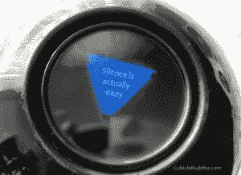

# 如何不再成为一个令人讨厌、爱说话的同事(8 个小贴士)

> 原文：<https://dev.to/cubiclebuddha/how-to-stop-being-an-annoying-talkative-coworker-8-tips-3bl7>

老实说，我是一个“健谈的凯西”作为一个健谈的程序员是不寻常的，但唉，这就是我。当我有一些新技术要分享时，保持安静的努力会大大增加。或者至少我告诉自己，我对沉默的恐惧源于崇高的目标。尽管如此，当我们的职业要求我们保持安静和专注时，我该如何与同事交谈？

每当我想分享时，团队应该准备好并愿意学习一些新的技术或模式吗？当然不是。在大多数职业中，环境切换是生产力的杀手(尤其是软件)。这是对我的同行的不尊重，他们经常需要安静，这样他们才能做出好的作品。我明白了。听着，如果我在做一些复杂的算法，当人们打断我的时候，我也可以毫不犹豫地表达我的沮丧。所以我明白需要安静。

但是认识到沉默的需要并没有让我(或者任何 A 型血的人)安静下来变得容易(T2)。和往常一样，我向我最喜欢的佛教僧侣求助，帮助我理解这种对谈话间歇的病态恐惧:

> “我们到底在害怕什么？我们可能会感到一种内心的空虚，一种孤独、悲伤和不安的感觉。我们可能会感到孤独和不被爱。我们可能会觉得我们缺少了一些重要的东西。其中一些感觉非常古老，一直伴随着我们，隐藏在我们所有的行为和思想中。有大量的刺激使我们很容易从我们的感受中转移注意力。但是当寂静的时候，所有这些事情都清晰地呈现出来。”

当我允许自己保持沉默，即使是几个不舒服的时刻，我的头脑会完全按照一行禅师上面描述的那样做——它告诉我，我在试图避免一些事情。这让我们想到了技巧 1:

1.  **问问你自己*为什么*你这么想说话。**在开口之前，它有助于识别你说话的欲望是源于分享有价值信息的目标，还是源于满足 A 型人格之痒的欲望。佛教徒称这个过程为“正念沟通”，苏格拉底称之为“认识你自己”。当我意识到我的人际交往配额很低时，给自己机会澄清我的欲望让我能够充分享受谈话。然而，如果我允许自己保持安静，而我头脑中的神奇八球突然冒出来说，“你只是在逃避你的问题”，那么我知道要切断自己无意识的谈话。听着，我已经接受了这样一个事实:我经常起床和同事聊天，以此来拖延一件让我不感兴趣的事情。我寻求更好刺激的欲望并没有让我的分心对其他人公平。但是有时候你必须说出来，如果需要的话，你应该拥抱自己健谈的一面。CubicleBuddha.com 致力于传播自我保健，所以如果你需要倾诉……那么我们有更进一步的提示，告诉你如何找到合适的时间和地点来释放你的话匣子。然而，在办公室里找到合适的时间可能是一个挑战；所以，有时候最好的选择是寻求其他刺激，比如…
2.  选择音乐来替代耗费精力的喋喋不休。音乐，尤其是没有歌词的歌曲，有助于抑制闲聊的欲望。我总是推荐视频游戏配乐(因为我是个书呆子)。如果你错过的是对话，那么有大量令人难以置信的播客。
3.  选择运动作为消耗能量的另一种方式。去散步，跑上楼梯间，或者去健身房。有时候，从你的系统中释放能量会帮助你把让你觉得喋喋不休的消极情绪抛在脑后。此外，众所周知，锻炼可以集中注意力，提高工作效率。
4.  给自己写下你想谈论的话题。写笔记、感恩日志，甚至写博客都可以帮助你组织自己的想法，这样你就不会觉得有必要与那些当时可能不欣赏它们的人分享了
5.  学习你想与之交谈的人的肢体语言。如果他们戴着耳机，那么他们可能在努力集中注意力。可能不是时候。或者他们是一个总是戴着耳机的人。在这种情况下，你可以测试他们的眼睛是否非常专注，或者他们是否看到你走过。如果他们不是非常专注于电脑屏幕，那么他们可能愿意聊天。当你进入他们的小隔间时，你可以简单地观察他们的椅子摆动了多远，以此来衡量他们有多愿意交谈。事实上，你足够关心这一点会让你成为一个更好的同事和朋友。
6.  **适时分享。这里有一个简单的技巧:去吃午饭！人们可能不想在办公桌前聊天，但是一旦他们同意去吃午饭，你就可以尽情地聊天了。**
7.  在你工作的地方安排一次午餐和学习会议或读书俱乐部。通过表明你的回馈意愿，你知道任何出现的员工都是在给你机会与他们分享你的兴奋和知识。这个知识共享的解决方案产生了奇迹，因为它解决了一个问题，一行禅师称之为“一颗被错误引导的好奇的心”所以去明智地指引自己吧！
8.  在工作之外搔搔你说话的痒处。有些日子，你开始工作，真的很想和工作中的朋友聊天，而且有些重要的截止日期会阻止人们和你聊天。不要让孤独影响你。提醒你自己，工作是*而不是唯一的*你可以与其他人互动的时间和地点。其他重大机遇包括:
    *   **志愿服务**。一个简单的志愿活动是在疗养院或康复医院陪老人或病人。这些病人也很孤独，真的可以从你的时间中受益。也许你也会发现自己不再那么孤独。VolunteerMatch.org 的[让你很容易找到与你正在寻找的经历相匹配的当地机会。](https://www.volunteermatch.org)
    *   **给朋友或家人打电话**。安排一个时间和你已经失去联系的远方朋友聊聊，这是补充你 A 型血储备的一个简单而有效的方法。在我们这个越来越以文本为基础的世界里，我们经常忘记 FaceTime 和电话的存在。
    *   **用语音聊天功能玩在线视频游戏**，最好是和老朋友一起玩，这样你会感觉联系更紧密。
9.  最后……原谅自己的多嘴。我们大多数建议的核心是自我保健，因为我们知道，接受自己身上的好的和坏的特质可以让你在未来有更好的表现。不要因为你健谈的天性而贬低自己——因为这种品质也会让你变得伟大！A 型人格在软件工程和许多技术行业中很少见，但我们通常是非常有用的一群人。我们倾向于领导办公室的变革，但是如果我们不注意，我们可能会变得令人讨厌。所以告诉你自己你并不讨厌。原谅自己会让你有自信表现得自然。自信的头脑是平静的头脑。一行禅师在一次名为“做你自己，要美丽”的采访中说:

> 佛陀建议我们不要试图逃避自己，而是要学会照顾好自己，转化我们的苦难。

如果你采取以上步骤来倾听你的想法，给自己健康的需求，那么我保证你会在工作中更快乐，你的同事也会感谢你。你现在有无数的选择，如何识别你的思想在要求什么，以及如何积极引导能量的新技术。最后，我们在[CubicleBuddha.com](https://CubicleBuddha.com)想要重申的是，这种健谈的天性造就了你——我们因此而爱你。

————————————】如果你喜欢这篇文章，看看另一面:[在喧闹的办公室找到宁静的 10+小贴士](https://dev.to/cubiclebuddha/10-tips-to-find-peace-in-a-loud-office-1429)