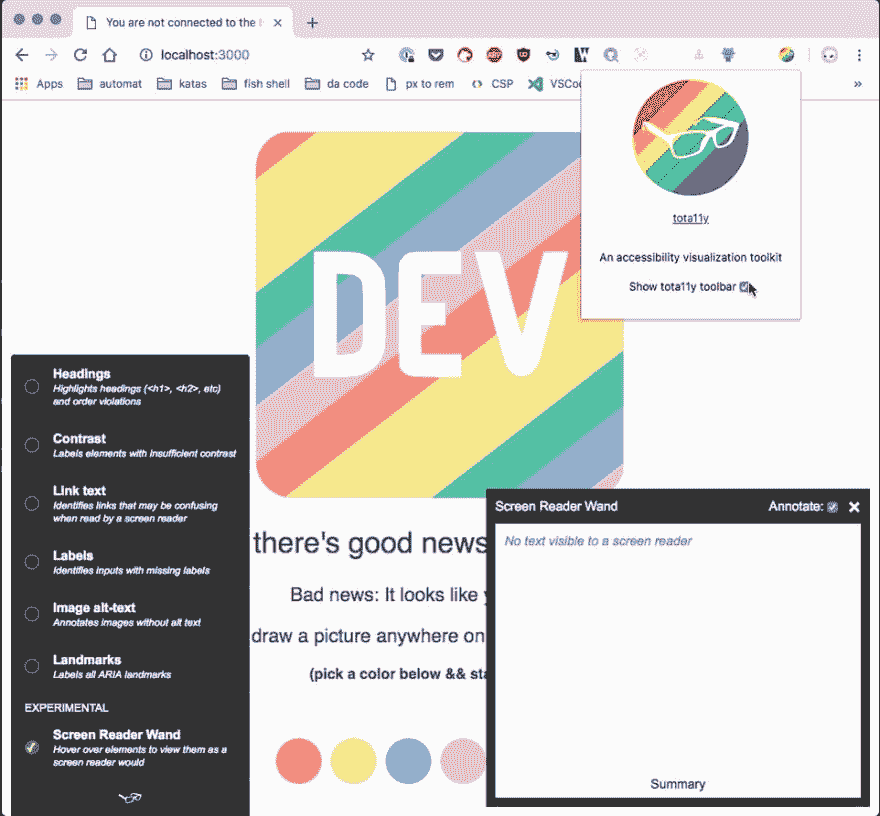
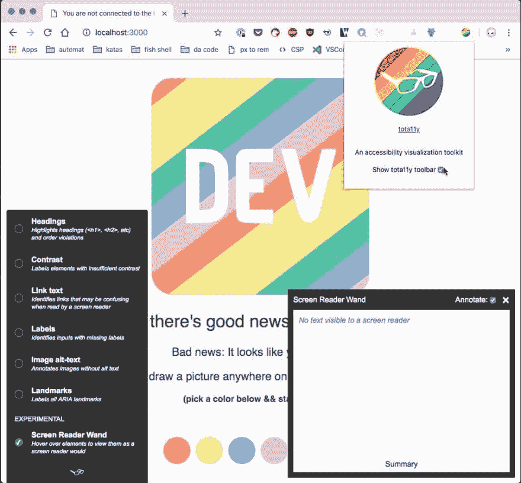

# 一个 a11y 扩展来到你附近的浏览器

> 原文：<https://dev.to/nickytonline/an-a11y-extension-coming-to-a-browser-near-you-1mg2>

去年，当我在某个地方寻找一个新的角色时，我面试的地方之一是可汗学院。TLDR，我不是被雇佣的😉。然而，作为候选人，我想脱颖而出。相关职位👇

[](/nickytonline) [## 抓住机会，脱颖而出

### 尼克·泰勒(他/他)1 月 7 日 195 分钟阅读

#career #interview #motivation](/nickytonline/take-chances-and-standout-because-who-knows-3kh6)

简而言之，我向 Khan 的 tota11y 库发布了一个 PR T1，将他们的 a11y 工具转换为浏览器扩展。

##  [可汗](https://github.com/Khan) / [ tota11y](https://github.com/Khan/tota11y)

### 易访问性(a11y)可视化工具包

<article class="markdown-body entry-content container-lg" itemprop="text">

# tota11y [](https://travis-ci.org/Khan/tota11y)

易访问性可视化工具包

[](https://camo.githubusercontent.com/01c8eb63d7edbf229c89426cd6aeae585d72b7cf7acfadc0a14d72f0332a0e0a/687474703a2f2f6b68616e2e6769746875622e696f2f746f74613131792f696d672f746f74613131792d6c6f676f2e706e67)

试着在你的浏览器中阅读，或者[阅读我们为什么要建造 totaly](http://engineering.khanacademy.org/posts/tota11y.htm)。

## 装置

`npm install @khanacademy/tota11y`

将它包含在`</body>`之前，就像这样:

```
<script src="tota11y.min.js"></script>
```

Enter fullscreen mode Exit fullscreen mode

## 发展

想为 tota11y 做贡献？厉害！在您的终端中运行以下命令:

```
git clone https://github.com/Khan/tota11y.git
cd tota11y/
npm install
```

Enter fullscreen mode Exit fullscreen mode

## 架构概述

tota11y 中的大部分功能来自它的**插件**。每个插件在 [`plugins/`](https://github.com/Khan/tota11y/tree/master/plugins) 中获得自己的目录，维护自己的 JavaScript、CSS 甚至手柄。[下面是简单的 LandmarksPlugin 的样子](https://github.com/Khan/tota11y/blob/master/plugins/landmarks/index.js)。

[`plugins/shared/`](https://github.com/Khan/tota11y/tree/master/plugins/shared) 包含各种插件的共享实用程序，即[信息面板](https://github.com/Khan/tota11y/tree/master/plugins/shared/info-panel)和[注释](https://github.com/Khan/tota11y/tree/master/plugins/shared/annotate)模块，用于在屏幕上报告易访问性违规。

[`index.js`](https://github.com/Khan/tota11y/blob/master/index.js) 汇集了这一切。

tota11y 使用了多种技术，包括 [jQuery](https://jquery.com/) 、 [webpack](https://webpack.github.io/) 、 [babel](https://babeljs.io/) 和 [JSX](https://facebook.github.io/jsx/) 。没有必要知道所有的事情

</article>

[View on GitHub](https://github.com/Khan/tota11y)

除了脱颖而出，PR 的目标是使它成为一个扩展，而不干扰他们的工具作为 [bookmarklet](https://khan.github.io/tota11y/#Try-it) 加载时的工作方式。

我先说一下，我不是 a11y 专家，所以这个工具实际上对我学习一些东西很有帮助。这是它的一个动作镜头。

> <video loop="" controls=""><source src="https://video.twimg.com/tweet_video/DnG6mkSVAAAEQt4.mp4" type="video/mp4"></video>【尼克·泰勒】[@ nickytonline](https://dev.to/nickytonline)这就是行动。2018 年 9 月 15 日上午 04:22[](https://twitter.com/intent/tweet?in_reply_to=1040818193911173120)[](https://twitter.com/intent/retweet?tweet_id=1040818193911173120)[](https://twitter.com/intent/like?tweet_id=1040818193911173120)

最酷的功能之一是屏幕阅读器棒(汗的作品，不是我的)。

[](https://res.cloudinary.com/practicaldev/image/fetch/s--STpPP6aq--/c_limit%2Cf_auto%2Cfl_progressive%2Cq_auto%2Cw_880/https://dev-to-uploads.s3.amazonaws.com/uploads/articles/69eecgpq40a25yed3u0z.jpeg)

公关还没有合并，但希望在下个月左右。无论如何，你今天可以在 Chrome、FireFox、Brave 或任何允许你加载 Chrome 网络商店扩展的浏览器中试用它。你需要做的就是[克隆我的分支](https://github.com/nickytonline/tota11y/tree/poc/tota11y-as-chrome-extension)并在本地构建它。参见[自述文件](https://github.com/nickytonline/tota11y/tree/poc/tota11y-as-chrome-extension#loading-tota11y-as-an-unpacked-chrome-extension)获取将其作为解压缩扩展加载的说明。

我希望你能发现它的有用之处，并为 Khan 的开发者们大声欢呼，因为他们制作了这个伟大的工具。