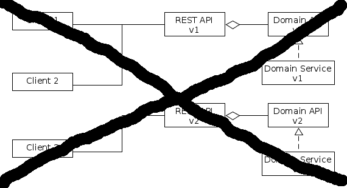
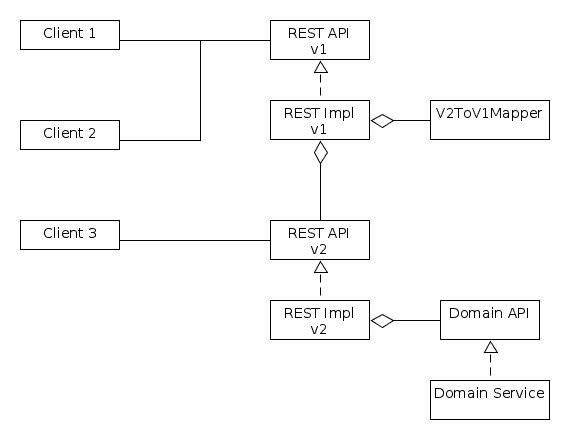
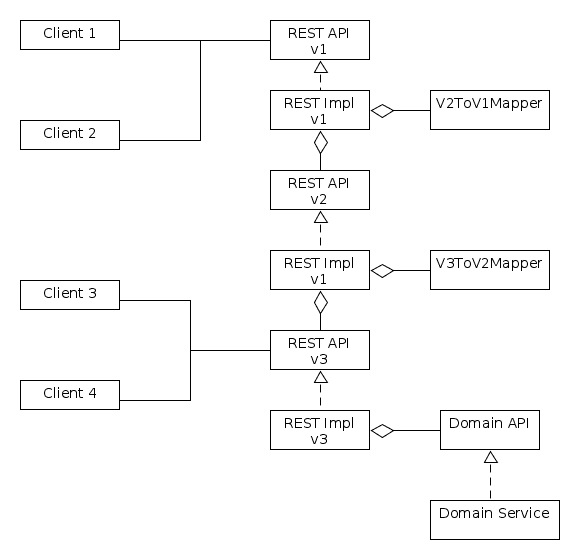

# 用一个宽宏大量的作者来版本化 REST APIs

> 原文：<https://dev.to/gossie/versioning-rest-apis-with-a-magnanimous-writer-5d60>

当维护一个应该由未知数量的客户机使用的公共 API 时，向下兼容性是一个至关重要的话题。不同的客户使用不同版本的 API，通常 API 的操作者对拥有尽可能多的用户感兴趣。

当服务第一次发布时，一切都是完美的。这是域逻辑的实现，REST API 只有一个版本。所有依赖于该服务的客户端都使用这一个 API。

但是完美的世界不会永远存在。随着新功能的开发，API 很可能也会发展和变化。也很有可能不是每个客户端都会立即迁移到 API 的当前版本。

最糟糕的事情是实现不同版本的领域逻辑。不改变 API 和错误修复的特性将不得不在不同的上下文中实现不止一次。维护将是一场噩梦。

那么还有什么选择呢？解决这个问题的一个方法是把服务设计成一个宽宏大量的作者。如果拥有多个版本的域逻辑是个坏主意，那么一个实现显然应该是最新的 REST API 的实现。为了确保客户端的请求到达正确的端点，API 的版本需要在请求中的某个地方。这里的介绍了放置版本的不同方法。

在我看来，版本应该是 Content-Type 和 Accept 头的一部分。这样，版本就是请求资源的表示的一部分。

旧版本的 REST 端点不调用域逻辑，而是调用映射器，将请求中的数据转换为域逻辑期望的格式。然后，结果被转换成适合 REST API 版本 1 的格式。

实现这样的映射器可能并不总是容易的。找到成本和使用的平衡点很重要。但是如果编写一个映射器的成本不是很高，那么集成它是相当容易的，因为没有必要调整前面的映射。

海量的编写器使系统能够同时提供必要数量的 API 版本。必须考虑到，随着产生越来越多的版本，旧客户端的响应时间会增加，因为必须遍历所有映射。这也可能是一个优势，因为它增加了迁移到当前版本的需求。

我在 Github 上提供了一个 Spring-Boot [示例实现](https://github.com/gossie/magnanimous-writer)。