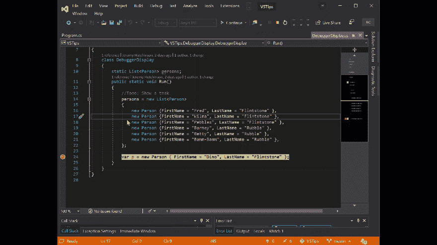
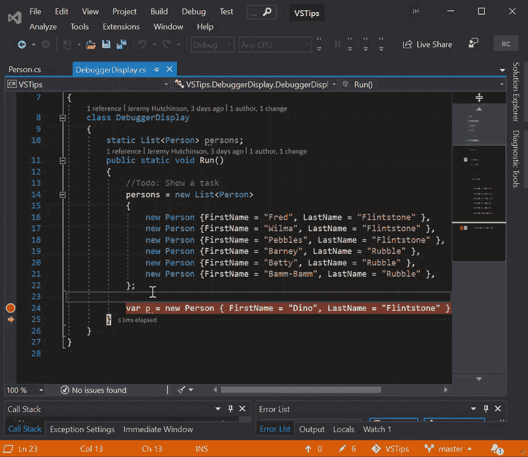
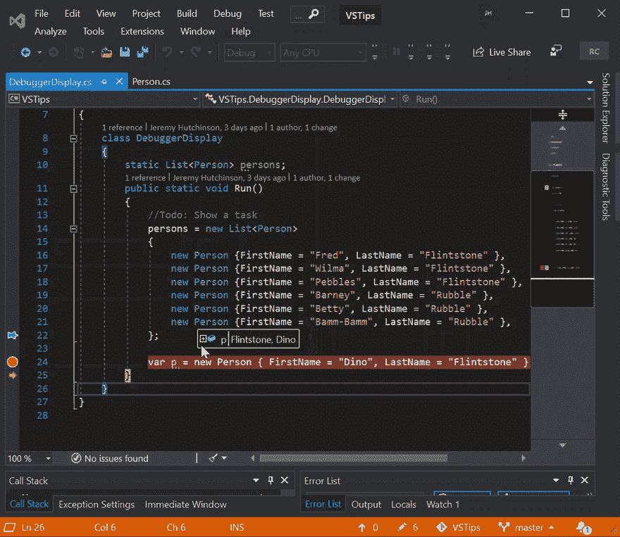
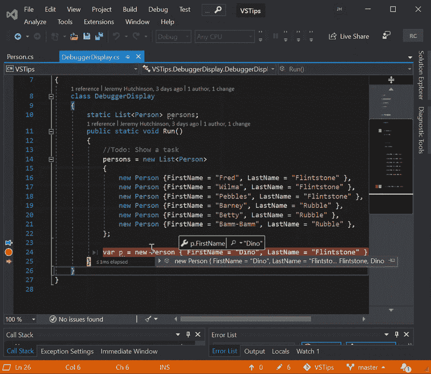
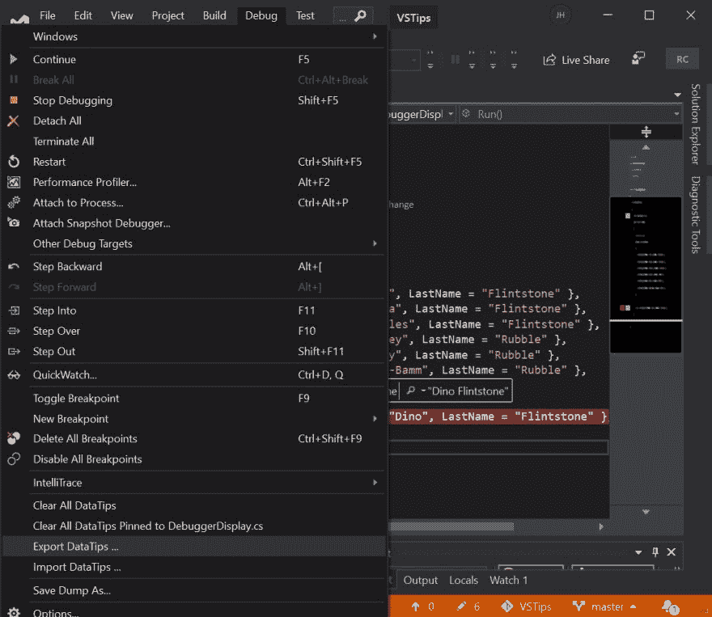

# Visual Studio 提示-使用数据提示

> 原文：<https://dev.to/hutchcodes/visual-studio-tips-using-data-tips-4bh4>

数据提示是 Visual Studio 的一项功能，允许您在调试时将鼠标悬停在变量上并查看其值，这非常有用。这里有几个你可能不知道的小技巧。

你是否曾经在查看数据提示时需要查看它们背后的代码？好消息，你可以。只要按住`Ctrl`键，数据提示就会变得透明，直到你松开`Ctrl`键。当您在数据提示中向下钻取一点或试图进行比较时，这尤其有用

您可以做的另一件事是固定数据提示。这将保持数据提示，以便您可以导航到其他代码，重新启动调试，甚至重新启动 Visual Studio，并且在您下次中断该块时，数据提示仍然存在。一旦锁定了数据提示，您可以通过点击和拖动来移动数据提示，您可以通过点击`x`来删除它，或者您可以通过点击锁定图标来浮动数据提示。这允许您在滚动代码或查看另一个文件时查看该数据提示。

一旦锁定了数据提示，就可以通过右键单击该数据提示并选择“添加表达式”来向该数据提示添加表达式。这可以让您锁定比通常显示的对象更有用的内容。在这种情况下， [DebuggerDisplay](https://dev.to/2019/03/visual-studio-tips-debugger-display/) 显示的是`LastName, FirstName`，但是我们可以添加一个表达式将 Person 对象显示为`FirstName LastName`。当你不能改变对象的`DebuggerDisplay`时，这真的很方便。

DataTips 的另一个有趣的特性是您可以给它们添加注释。

但是如果不能分享，评论又有什么用呢？那么，您可以将您的数据提示导出到 XML 文件中，并与您的源代码共享或签入它们。您可以拥有一组数据提示，当您面临一个常见的调试场景时，就可以加载这些数据提示。

您可能还会注意到，这里有“清除所有数据提示”和“从[当前文件名]中清除所有数据提示”的选项。