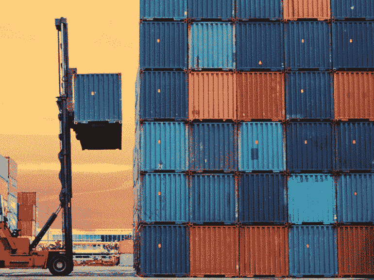
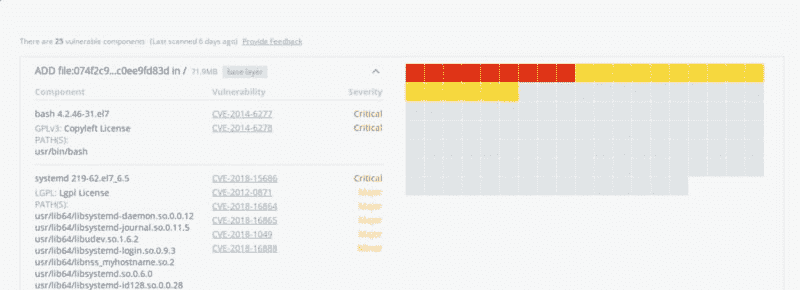
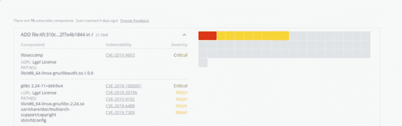
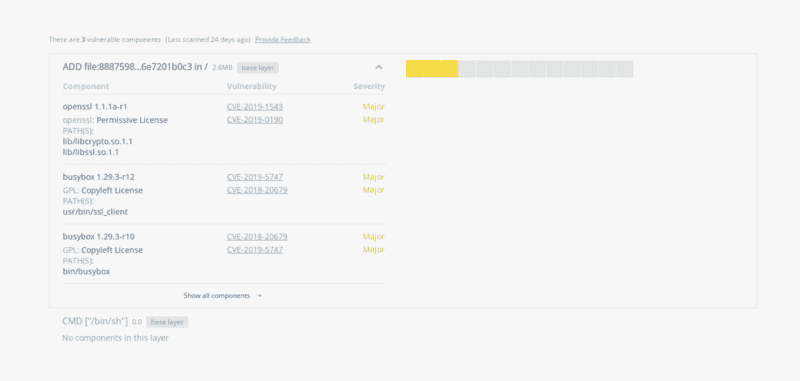

# 我秋，秋，选择你的容器图像第 1 部分。

> 原文：<https://dev.to/scottyc/i-cho-cho-chose-you-container-image-part-1-227p>

[](https://res.cloudinary.com/practicaldev/image/fetch/s--R6ZB9Azf--/c_limit%2Cf_auto%2Cfl_progressive%2Cq_66%2Cw_880/https://zdnet4.cbsistatic.com/hub/i/r/2015/12/08/bcdcf7e6-e974-4cd4-a6ea-e4cf766989a5/thumbnail/770x578/a988ca1561a24f749fbbfd7de069858e/shipping-containers.gif)

当我第一次开始使用 Docker 和 Kubernetes 时，我遇到的一个问题是“我的应用程序应该使用什么样的基本图像？”外面有很多选择。例如，我喜欢 Debian，这是我在笔记本电脑上运行的程序，所以我选择 Debian 是因为我了解它吗？做出这样的决定似乎很直接，但就像生活中的任何事情一样，我们做出的选择都会产生影响。作为一名开发人员，您希望对为什么选择基本映像有最好的了解。不仅是应用程序性能或部署映像大小，还有安全性等。

我将把我们的应用程序分成两组不同的编译语言，比如 Go 或 Rust。其他动态语言，如 Python、Ruby 或 node.js。在本系列文章中，我将在第 2 部分使用两个示例 Go 应用程序，在第 3 部分使用 Python 应用程序。

但是，让我们先来看看基本映像的选项。我们有四种选择，像 Debian 这样的完整操作系统映像，也有完整操作系统的精简版本，接下来是 alpine，最后是 scratch。

所以在这篇文章中，我不会说谁的操作系统供应商更好或更差，因为这是个人的选择。因此，我们将完整操作系统、超薄操作系统、Alpine 和 scratch 划分为单独的组。

让我们从完整的操作系统开始吧，它们是最容易上手的，也很可能是启动和运行应用程序的最简单方法，因为它们包含了默认情况下安装的最多的软件包。在本系列的第 1 部分中，我们只是比较图像，还不担心应用程序。完整操作系统映像中最突出的一点是，它们开箱后附带了易受攻击的软件包。现在，这些对你来说可能不是表演的绊脚石，你可能有适当的风险缓解来使用这些图像。关于图像状态的信息可以在 DockerHub 的标签信息下免费获得。下面是一个例子。

[](https://res.cloudinary.com/practicaldev/image/fetch/s--fHSik0or--/c_limit%2Cf_auto%2Cfl_progressive%2Cq_auto%2Cw_880/https://cdn-images-1.medium.com/max/800/1%2A7AhjBjJBl-zJsuMtbpx1uw.png)

如您所见，在您添加代码之前，就已经部署了相当多的关键漏洞。现在让我们来看看我们的苗条图片。现在只有 Debian 有一个苗条的形象，但是什么是苗条的形象呢？这是一个完整映像的精简版本，只有基础包，它希望您安装应用程序所需的任何包。通过使用精简映像，您可以节省大约 50%的映像大小，例如，完整的操作系统映像大约为 100mb，而精简映像大约为 54mb。

[](https://res.cloudinary.com/practicaldev/image/fetch/s--JqTUf13P--/c_limit%2Cf_auto%2Cfl_progressive%2Cq_auto%2Cw_880/https://cdn-images-1.medium.com/max/800/1%2AcIKTiJIncJJlZdLYeLJdgQ.png)

正如你在图片安全扫描中看到的，我们已经减少了易受攻击的包。不幸的是，仍然有两个关键包。接下来，我们将继续讨论 [Alpine Linux](https://alpinelinux.org/) 。这个操作系统是从底层开始构建的，是一个容器原生操作系统。这个操作系统对传统操作系统映像(胖或瘦)的主要改变是 Alpine 不使用 glibc，而是使用 [musl libc](https://www.musl-libc.org/) 。了解您的应用程序是否依赖于 glibc 非常重要。默认情况下，Alpine Linux 只附带基础包，您必须安装应用程序需要的任何东西。从好的方面来看，这张图片的 Alpine 大小不到 6mb。

[](https://res.cloudinary.com/practicaldev/image/fetch/s--d4C0LD_C--/c_limit%2Cf_auto%2Cfl_progressive%2Cq_auto%2Cw_880/https://cdn-images-1.medium.com/max/800/1%2Azrq9C4JYHre2M8aQ2e6LYA.png)

正如您从我们的漏洞扫描中看到的，此映像中没有严重的漏洞。Alpine 一开始可能有点难适应，因为它有自己的包管理器，您需要学习。如果你坚持下去，我认为它的好处是值得你花时间的。最后，我们将看看 scratch。什么是 scratch？Scratch 是所有容器图像的起点。使用临时“映像”向构建过程发出信号，表明您希望 docker 文件中的下一个命令成为映像中的第一个文件系统层。所以没有包管理器或包。它只是一个空的分层文件系统。您可以拉 scratch，因为它是一个保留的名称空间。也不会有任何易受攻击的包，因为默认情况下没有包。

```
FROM scratch
ADD rootfs.tar.xz /
CMD ["bash"] 
```

以上是一个完整的操作系统映像 Dockerfile 文件的例子，它们都是从零开始的。

在本系列的下一篇文章中，我们将从这篇文章中吸取经验，并将它们应用到用 GO 编写的实际应用程序中。

如果你想了解更多关于容器或 Kubernetes 的知识，请到我的 GitHub 页面参加一个开源研讨会。