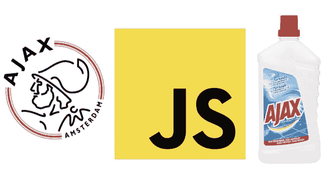
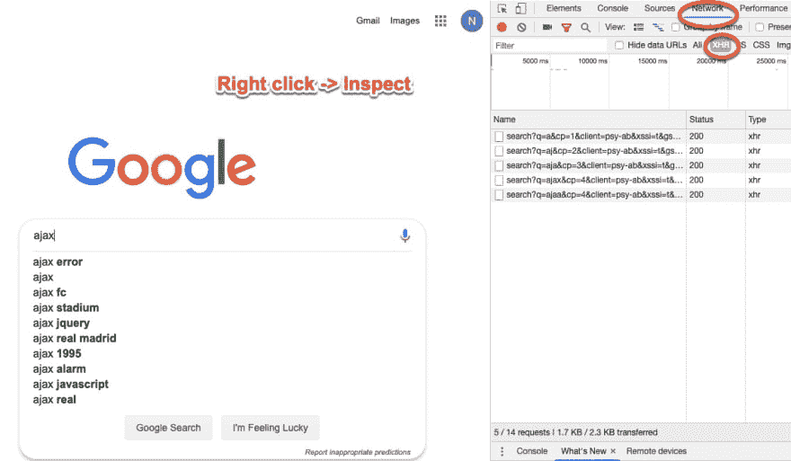
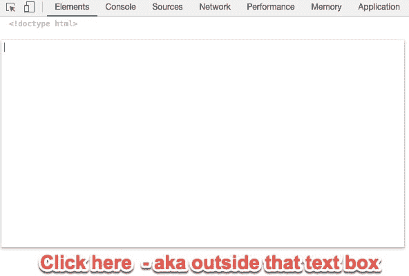
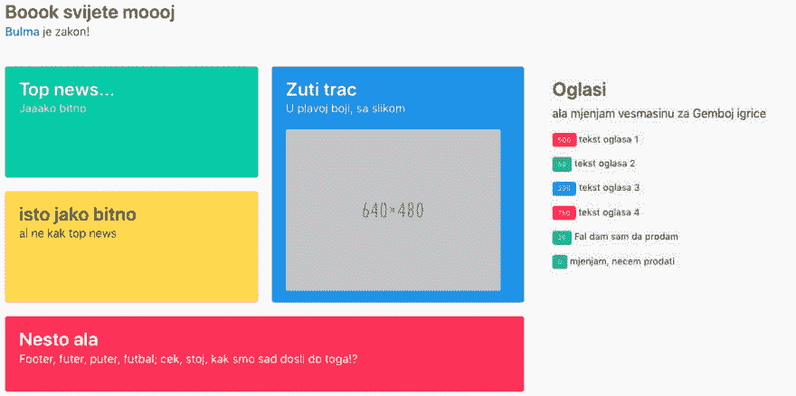

# 用纯 JavaScript 进行 AJAX 调用，老方法

> 原文：<https://dev.to/nikola/making-ajax-calls-in-pure-javascript-the-old-way-ed5>

[](https://res.cloudinary.com/practicaldev/image/fetch/s--HvESijro--/c_limit%2Cf_auto%2Cfl_progressive%2Cq_auto%2Cw_880/https://thepracticaldev.s3.amazonaws.com/i/avjcvdwdejffu44aaf26.jpg)

*最初发布于[我的博客](http://www.nikola-breznjak.com/blog/javascript/making-ajax-calls-pure-javascript/)。*

## TL；速度三角形定位法(dead reckoning)

在这篇面向初学者的文章中，我将用几个例子一步一步地向你展示如何用纯 JavaScript 进行 AJAX 调用。

## 那么，AJAX 是什么？

AJAX 代表:

*   异步——意味着如果您开始某个请求(调用某个 API ),您可以在该请求完成之前转移到另一个任务。这与同步执行的情况正好相反——在这种情况下，您必须等待它完成，然后才能继续执行另一个任务。
*   JavaScript——有史以来最好的语言👺
*   和-增加了“和”作为三个字母的首字母缩略词，不再有用了
*   XML - [网络上没人再用的可扩展标记语言](https://en.wikipedia.org/wiki/XML):， [JSON](https://www.json.org/) FTW:)

## 好吧，但是它有什么用呢？

AJAX 允许你加载一些新的数据到你的网页，而不需要重新加载整个网页。这种行为让你的网站感觉更快，响应更快。更不用说现在这是事实上的标准。也就是说，如果你遇到一个网站，你在上面填写并提交一个表单，然后它必须重新加载，这个网站基本上是在向你尖叫:“OOOOOLD！”。

## 哪里可以看到它在行动？

我认为，如今你可以在任何像样的网页上看到它的运行。例如，在你的浏览器中加载[谷歌网站](http://google.com)，打开开发工具。在 Chrome 上，你可以点击鼠标右键并选择`Inspect`，然后点击`Network`标签。

如果您还选择了`XHR`过滤器并开始在搜索栏中写东西，您将开始看到 AJAX 请求。这里需要注意的非常重要的一点是，网站没有重新加载。

[](https://res.cloudinary.com/practicaldev/image/fetch/s--xD84q5Vp--/c_limit%2Cf_auto%2Cfl_progressive%2Cq_auto%2Cw_880/https://i.imgur.com/uWW641A.jpg)

如果您单击`Name`列中的其中一项，然后单击`Response`选项卡，您将看到服务器发回的实际响应。

> ⚠️:这是一个需要记住的重要概念:网络以一种请求/响应的方式工作。一个客户端(您的浏览器)发送`Request`到某个服务器，服务器返回一个`Response`，然后客户端进行处理。

AJAX 应用的另一个例子是当你在某个网站上看到一个时事通讯注册表单时。你填写姓名和电子邮件地址，点击发送，网站不会刷新。相反，你得到的信息就在那里，就像“你已经被订阅了，检查你的电子邮件”。

## 这个很棒，但是我怎么用呢？

没有人喜欢这个理论，但它实际上可能对这里有所帮助。要在 JavaScript 中使用 AJAX，您需要做四件事:

*   创建一个 XMLHttpRequest 对象
*   编写回调函数
*   打开请求
*   发送请求

我知道我知道，你一定想:

[](https://res.cloudinary.com/practicaldev/image/fetch/s--W5AbvxmK--/c_limit%2Cf_auto%2Cfl_progressive%2Cq_auto%2Cw_880/https://i.imgur.com/WT9nMjQ.jpg)

好吧，好吧，让我们从上面的步骤开始，把它们变成代码:

*   创建一个 XMLHttpRequest 对象
    *   `var xhr = new XMLHttpRequest();`
    *   当然，您也可以用不同的方式命名变量，但是我希望您对 JS 或一般的编程有这么多的了解，所以这里就不赘述了😉)
*   编写回调函数
    *   `xhr.onreadystatechange = function() {};`
*   打开请求
    *   `xhr.open('GET', 'http://www.google.com');`
    *   第一个参数是请求的类型。另一个常见的是‘帖子’，我们会在下一个帖子中详细讨论。
    *   第二个参数是您希望将请求发送到的 URL(一个链接)。在我们的例子中，那是谷歌的网站。
*   发送请求
    *   `xhr.send()`
    *   最后，发送请求

如果我们把它们都放在一个地方，我们得到这个:

```
var xhr = new XMLHttpRequest();
xhr.onreadystatechange = function() {};
xhr.open('GET', 'http://www.google.com');
xhr.send() 
```

Enter fullscreen mode Exit fullscreen mode

## 很好，但是，嗯，我在哪里测试这个？！

得知上面的代码没做多少事，你会有点失望。

此外，您可以在哪里测试这个？首先，你不能在本地机器上通过创建一个`index.html`并在你的浏览器中打开它的方式来测试它。

你必须在一些在线网站上测试这个。事实胜于雄辩，所以让我们在你的浏览器中打开[http://www.google.com](http://www.google.com)。

现在让我们做几件事:

*   打开开发工具
*   选择`Elements`选项卡
*   右击`html`元素并选择`Edit as HTML`
*   删除所有内容，在出现的框外点击，你会得到一个空白页面
    *   
*   向`body`标签添加一个 div，如下所示:`<div id="result">Testing</div>`

接下来，在开发工具的控制台标签中，写下这个:

```
var clearResult = function() {
    document.getElementById('result').innerHTML = '';
} 
```

Enter fullscreen mode Exit fullscreen mode

然后这样叫:`clearResult()`。

*纯粹主义者会因为[使用 var 而不是 let](https://dev.to/johnwolfe820/should-you-never-truly-use-var-bdi)T3 而杀了我😱*

为了解决为什么使用`clear`作为函数名不起作用的问题，你可以看看[这篇文章](http://www.nikola-breznjak.com/blog/javascript/dont-name-global-javascript-function-clear/)。

现在，将下面的代码复制粘贴到 Console 选项卡上，并按 Enter 键执行它:

```
var xhr = new XMLHttpRequest();
xhr.onreadystatechange = function() {
    if (xhr.readyState === 4){
        document.getElementById('result').innerHTML = xhr.responseText;
    }
};
xhr.open('GET', 'https://www.google.com');
xhr.send(); 
```

Enter fullscreen mode Exit fullscreen mode

哇，你得到了什么？你刚刚加载了谷歌主页💪

## 大多数时候，AJAX 只能做到这一步

如果你尝试使用`open`命令中的 URL，你很快就会发现 [CORS](https://developer.mozilla.org/en-US/docs/Web/HTTP/CORS) 。这基本上意味着，如果您的域是 google.com，那么您不能从以下位置加载数据:

*   一些其他领域，比如 example.com
*   像 abc.google.com 这样的子域
*   同一个域中的不同端口，如 google.com:8080
*   像 http 这样的不同协议

有一些方法可以解决这个问题(同一个域上的服务器代理、JSONP、域服务器上的 CORS 设置、使用浏览器插件)，我鼓励你深入挖掘并自己了解更多(或者等到我在其他帖子中写了相关内容之后)。

## 我想要更多例子

很好，很乐意为您提供。

加载[我的考点](http://nikola-breznjak.com/_testings/ajax/test1.html)。复制上面的 AJAX 函数，用`http://nikola-breznjak.com/_testings/ajax/test1.php`替换`https://www.google.com`，观察会发生什么。

尝试将链接改为`http://nikola-breznjak.com/_testings/ajax/test1.php?ime=Nikola`，看看会发生什么。这被称为在 URL 中发送参数(`ime`)。这让我想到了以下不同之处...

# 获取与发布

发送 HTTP 请求有两种常用方法:

*   GET -用于大多数请求。每当浏览器请求新的网页、CSS 文件、图像等时，它都使用 GET 方法。当您想从服务器“获取”某些东西时，请使用 GET。
*   POST -经常与 web 表单一起使用，将数据发送到服务器。当发送将在服务器上存储、删除或更新的数据时，请使用 POST。

您可以在 URL 中用 GET 发送参数，这是一个好处，也是一个缺点，因为 GET 请求中的参数长度有限制(2048 个字符)，而且还有一个安全问题。有了 POST，你可以安全地发送更多数据。

## XML vs. JSON

XML 是可扩展标记语言的缩写，你可以在这里了解更多。它曾经用于传输计算机容易解析的结构化数据。你会注意到它类似于 HTML 比如:

```
<phones>
    <phone>+38598123456</phone>
    <phone>+38598654321</phone>
</phones> 
```

Enter fullscreen mode Exit fullscreen mode

不过，TBH，它不会在网上使用，所以我不会用它来烦你。如今在网络上广泛使用的是 [JSON](https://www.json.org/) 。它看起来非常像 JavaScript object literal，只是增加了一点——键也需要用双引号括起来。比如:

```
[
    {"phone":"+38598123456"},
    {"phone":"+38598654321"}
] 
```

Enter fullscreen mode Exit fullscreen mode

这是一个对象数组，由一个名为`phone`的属性组成。

## 迷你项目

现在是迷你项目时间。假设你的老板说你需要更新[这个页面](http://nikola-breznjak.com/_testings/ajax/test2.html)，让侧边栏从 API 加载广告，可以在这里[找到](http://nikola-breznjak.com/_testings/ajax/test2.php)。

他还补充说，你需要使它与当前的设计保持一致([布尔玛](https://bulma.io/)摇滚顺便说一句！)并根据以下规则使价格具有不同的颜色:

如果价格(API 响应中的`cijena`)低于 100，就用绿色。如果它在 100 到 300 之间，那就把它染成蓝色。如果超过 300，就变成红色。

你打算怎么做？

我鼓励你亲自尝试一下，然后回来看看我下面的方法。

最后你应该有这个:

[](https://res.cloudinary.com/practicaldev/image/fetch/s--j_MwbhRU--/c_limit%2Cf_auto%2Cfl_progressive%2Cq_auto%2Cw_880/https://i.imgur.com/fZ5RFlC.jpg)

你现在完全可以通过在控制台的[页面](http://nikola-breznjak.com/_testings/ajax/test2.html)上粘贴下面的代码来测试。

```
var xhr = new XMLHttpRequest();
xhr.onreadystatechange = function(){
    if (xhr.readyState === 4){
        var oglasi = JSON.parse(xhr.responseText);
        var oglasiHTML = '';
        for (var i=0; i<oglasi.length; i++){
        var klasaCijene = '';
        if (oglasi[i].cijena <100){
            klasaCijene = 'is-success';
        }
        else if (oglasi[i].cijena >= 100 && oglasi[i].cijena < 300){
            klasaCijene = 'is-info';
        }
        else if (oglasi[i].cijena >= 300){
            klasaCijene = 'is-danger';
        }

            oglasiHTML += '<p><span class="tag ' + klasaCijene + '">' + oglasi[i].cijena + '</span>' + ' ' + oglasi[i].tekst + '</p>';
        }

        document.getElementById('oglasi').innerHTML = oglasiHTML;
    }
};

xhr.open('GET', 'http://nikola-breznjak.com/_testings/ajax/test2.php');
xhr.send(); 
```

Enter fullscreen mode Exit fullscreen mode

## 结论

就这些了，希望对您有用，下次再见，我将向您展示使用 jQuery 做这些事情有多简单。当然，在后面的一些帖子中，我们也会提到[获取 API](https://developer.mozilla.org/en-US/docs/Web/API/Fetch_API) 。但是首先，一步一步来💪

*编辑:第二个帖子在这里:[使用 jQuery 进行 AJAX 调用](https://dev.to/hitman666/making-ajax-calls-using-jquery-3bp7)T3】*