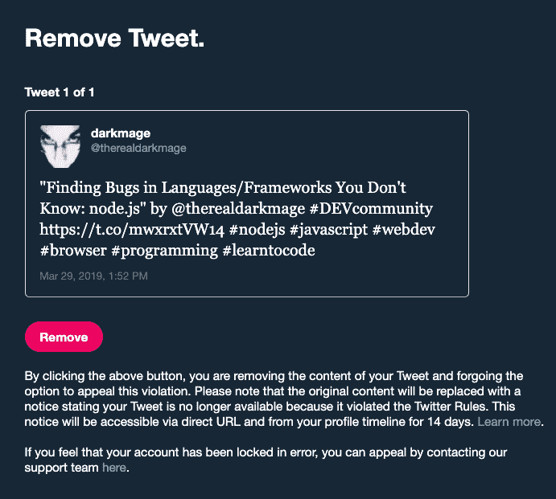
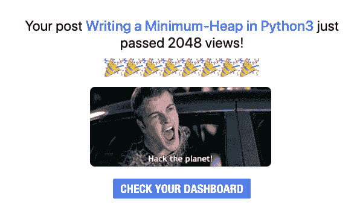

# 审查出错:“学习编码”

> 原文：<https://dev.to/therealdarkmage/censorship-gone-wrong-learn-to-code-2c0k>

**警告:这篇文章不是关于代码本身，而是关于代码和决策的后果**

最近我收到了一条推特禁令:

> 《寻找你不知道的语言/框架中的 bug:node . js》作者[@ therealdarkmage](https://dev.to/therealdarkmage)# dev community[https://t.co/mwxrxtVW14](https://t.co/mwxrxtVW14)# nodejs # JavaScript # web dev # browser # programming # learn code

这大概是整个[学编码的屁话](https://knowyourmeme.com/memes/learn-to-code)结束了。

我喜欢标签。这是一种很酷很简单的信息分类方式。问题是，这个特定的标签，以及许多其他标签，可能会因为政治原因而被劫持。这可能是一个意外，这样一个不恰当的说法似乎被永久标记为“巨魔行为”，但请听我说完:

我是一名计算机科学导师。我喜欢写代码，与代码打交道，帮助别人写代码和解决问题，以及大多数涉及软件的事情。我非常喜欢它，所以我靠它赚钱，并计划在这个领域做很长很长一段时间。

最近，我开始喜欢写关于计算机科学话题的博客。对我来说，这是巩固知识和与他人分享信息的一个很好的途径。自然，社交媒体是推动分享我的帖子的工具。

Twitter 在用户界面方面基本上是好的。手机浏览器，即使加载在桌面上，在夜间模式下也非常出色，在我的“想用”方面击败了脸书。

然而，我发现了一个带有标签的禁令，我觉得这是一个中性的声明(嘿，你应该和我这个计算机科学导师一起“学习编码”！)，很难知道我在这一切中有多少权力。

我有一种天生的“诀窍”，不仅能发现软件中的“错误”、“漏洞”和“漏洞”，还能发现整个系统中的“漏洞”。例如，我总是在寻找食物和产品的好交易，并且总是寻找利用失败的方法来获得更多。任何想要成为黑客的人都应该已经自然而然地、本能地这样想了，但是最好的 bug 是那些我甚至没有试图去发现的。

我的博客在发布后的几天内就获得了成千上万的浏览量。我越来越引人注目了。也许这也是一个地方，让我注意到一个事实，一个标签，在大计划中是无辜的，三个小词，被贴错了标签，结果，那些可能或可能甚至没有意识到整个崩溃的人受到了惩罚。

此外，关于标签的讨论彻底失败的事实...Twitter 的系统是否在算法上自动禁止了仅仅使用标签的人？

比如，我为什么要关心那些因为一些旧迷因而受伤的记者？任何想使用“学习编码”标签的人都将受到惩罚，不管他们是否真的在引诱任何人。

我希望能够用“学习编码”这个短语来宣传我的服务，而不会被贴上骚扰者或巨魔之类的标签。事实上，我甚至不得不写或说这是绝对他妈的可笑和荒谬的。

在过去的两年里，我一直通过不同的途径辅导学生，但我很久以前就做过了，那时我还在上大学。我负责课后实验室，所以我面前大概有三十(30)名学生。我告诉他们“伙计们，听着...我和你一样，都是同学。如果我被迫坐在这里听某个自以为知道自己在说什么的家伙没完没了地说一些我自己能做得更好更快的事情，我会很无聊。如果是你，那你可以走了。有人真正需要我的帮助吗？呆一会儿，听听。我会在这里待 90 分钟。”

我也给他们的作业打分。这导致了后来的研究和编译器的机会，但我跑题了。让我把这个包起来。

这就是当你试图控制思想并定量分析“意图”时所发生的事情:你最终得到了一个真正的程序员，他能真正地写代码，真正地以教学生写代码为生(相信我，这比送披萨的报酬高得多)，他实际上拥有计算机科学的学士学位(我走上了舞台，并计划获得博士学位)...所以，你知道我能做的不仅仅是“写代码”)实际上，我拿着数百万美元的代码库工作，在公司网站和移动套件中寻找漏洞(见我的 [linkedin](https://www.linkedin.com/in/darkmage/) ) yada yada yada(我只是说我会写代码)乞求一家价值数十亿美元的国际公司:

1.  把...弄在一起
2.  停止惩罚使用#LearnToCode 标签的人
3.  学会自己编码

* * *

# [如果你需要一名计算机科学导师、代码审核员，或者仅仅是一个可以和程序配对的人，请联系我](https://codementor.io/mikebell66)