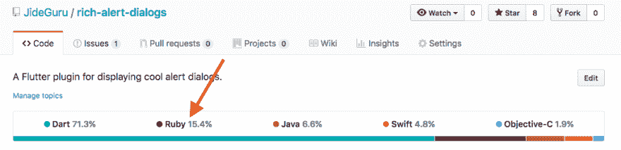

# 为什么 Flutter 项目包含 Ruby？

> 原文：<https://dev.to/jideguru/why-does-flutter-projects-contain-ruby-2jo5>

大家好，
我注意到，每当我将一个 flutter 项目推送到 Github 时， *Ruby* 总是被指示为它所用语言的一部分。例子是我下面的截图

此外，在本[教程](https://medium.com/flutter-io/test-flutter-apps-on-travis-3fd5142ecd8c)之后，我将 *Travis CI* 与 Github 上的一个 flutter 项目进行了整合，我还注意到 *Travis CI* 认为该项目使用了 *Ruby* 。查看我下面的截图

我问了一些人，他们是否能解释这一点，但我得不到任何答案。我希望你们能帮忙。

谢了。