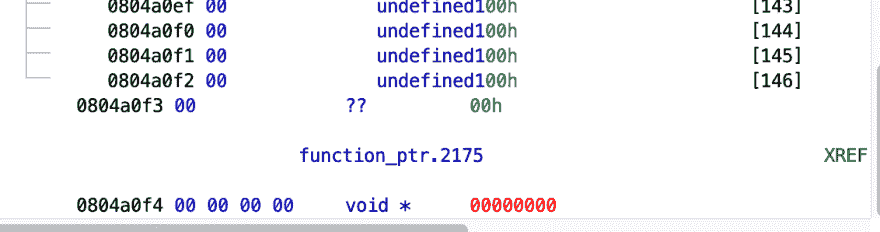
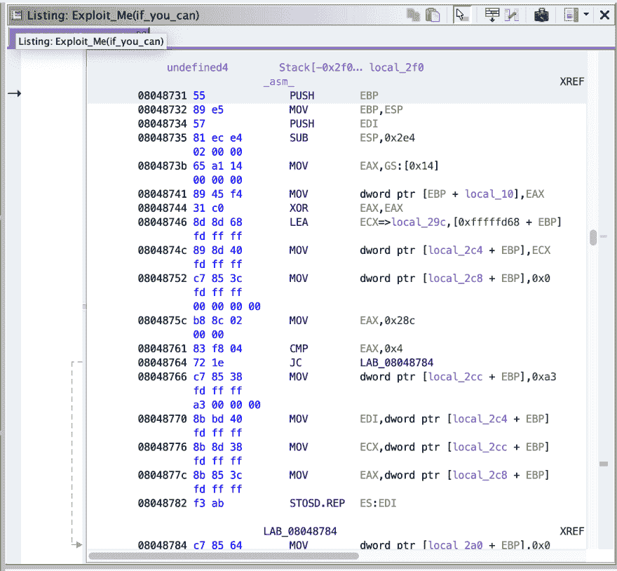

# root-Me:exploit Me–基本缓冲区溢出

> 原文：<https://dev.to/nuculabs_dev/root-me-exploitme-basic-buffer-overflow-4l1e>

你好，

在这篇文章中，我向你展示了来自 [Root-Me](https://www.root-me.org/en/Challenges/Cracking/ELF-ExploitMe) 的又好又短的破解挑战的解决方案。在 [Ghidra](https://ghidra-sre.org/) 中打开后，我看到这个挑战很容易解决，你所需要的就是找到密码，密码是明文的。基本上只是复制粘贴，你得到了旗帜，但等等，有一个转折！

我应该从 Root-Me 的另一个挑战中吸取教训，它也有一个[转折](https://dnutiu.wordpress.com/2018/12/25/keygenme-or-not/)。

我感到惭愧的是，我没有注意到这一点，就像密码一样，一切都一目了然😦

[](https://res.cloudinary.com/practicaldev/image/fetch/s--z9uinCvt--/c_limit%2Cf_auto%2Cfl_progressive%2Cq_auto%2Cw_880/https://thepracticaldev.s3.amazonaws.com/i/rp8a58jnpj8kbeqjjxjj.png)

明白我的意思吗？

**function_ptr.2175** 是一个指向函数的指针，在程序的 main 中它指向 **auth** 的地址，然后它被调用。

```
0804869e b8 f4 86        MOV        dest,auth
         04 08
080486a3 a3 f4 a0        MOV        [function_ptr.2175],dest                         = 00000000
         04 08 
```

Enter fullscreen mode Exit fullscreen mode

并且，如果我们检查 **auth** 函数，我们可以看到如果我们提供的密码匹配，它就调用 ***asm*** 函数。

```
cmp_ret = strcmp(buff,dest);
   if (cmp_ret == 0) {
     _asm_();
   } 
```

Enter fullscreen mode Exit fullscreen mode

我们可以输入正确的密码并获得标志，这是我最初所做的，或者，我们可以做一个简单的缓冲区溢出利用，以便强制程序直接调用 ***asm*** 函数。

函数指针和缓冲区位于。二进制文件的 bss 部分。[。bss](https://en.wikipedia.org/wiki/.bss#BSS_in_C) 部分包含未初始化的对象，在我们的例子中是全局和静态变量。

不知何故，编译器决定将**函数指针**放在之后*的右边**缓冲区**，在这个缓冲区上执行下面的代码:* 

```
strcpy(buffer.2176,argv[1]); 
```

Enter fullscreen mode Exit fullscreen mode

缓冲区只有 146 字节宽，在 146+2 处启动函数指针，这意味着如果我们可以溢出缓冲区，我们就可以控制函数指针中写的内容。

我们可以这样做，因为， **strcpy** 继续将值复制到缓冲区中，除非到达一个 **NULL** 终止字符。

我们现在需要知道的，是 ***asm*** 函数的地址。这很容易找到。要么查看分解器视图，要么使用 **nm** 工具。

```
➜  /vagrant nm Exploit_Me(if_you_can)
 08048731 T asm 
```

Enter fullscreen mode Exit fullscreen mode

如果我们构造一个有效载荷，输出‘x’148 次以溢出缓冲区，然后将 *asm* 的地址附加到它上面，我们就成功地利用了二进制:

```
➜  /vagrant ./Exploit_Me(if_you_can) $(python -c "print('x'*148+'\x31\x87\x04\x08')")
 [+] Felicitation password de validation de l'épreuve:: <redacted> 
```

Enter fullscreen mode Exit fullscreen mode

*   $()–生成新的外壳
*   python -c " .. "将程序解析为字符串

的。/Exploit_Me(if_you_can)二进制将输出作为第一个参数，就是这样！缓冲区溢出，函数指针被覆盖，程序执行 ***asm*** 而不是 **auth** 。

```
function_ptr.2175 = auth; # Had this been after the strcpy things would have been different.
strcpy(buffer.2176,argv[1]);
*(undefined *)((int)dest + 8) = '_';
*(undefined *)((int)dest + 9) = '.';
iVar1 = (*(code *)function_ptr.2175)(buffer.2176,dest); 
```

Enter fullscreen mode Exit fullscreen mode

如果您想知道为什么 asm 地址被写成 **'\x31\x87\x04\x08'** ，那是因为我们希望它采用 little-endian 格式。在大端的地址是 **0x08048731** 。

[](https://res.cloudinary.com/practicaldev/image/fetch/s--4QAorfH1--/c_limit%2Cf_auto%2Cfl_progressive%2Cq_auto%2Cw_880/https://thepracticaldev.s3.amazonaws.com/i/uad9oas4xhcmxf4v1neh.png)

asm 函数非常复杂，它解密标志，这里的神奇之处在于它不依赖于程序状态或任何参数，因此如果我们设法执行它，我们可以直接获得标志。

你也可以用其他方式来解决这个挑战，查看 Root-Me 上的解决方案，寻找更有创意的方式来解决这个难题。

感谢您的阅读！