# 使用 React native 和 Firebase 进行电子邮件身份验证

> 原文：<https://dev.to/kris/email-authentication-with-react-native-and-firebase-1nia>

#### 在每一个应用程序中，你都会看到几种认证方式，比如登录脸书、谷歌等。但是，人们仍然喜欢输入电子邮件和密码。在本教程中，我们将把电子邮件认证与 React native 和 Firebase 集成在一起。使用 firebase 更容易使用。让我告诉你怎么做？

[](https://res.cloudinary.com/practicaldev/image/fetch/s--2K9q0ZJ9--/c_limit%2Cf_auto%2Cfl_progressive%2Cq_auto%2Cw_880/https://cdn-images-1.medium.com/max/940/1%2AQjW6170L-FbtceBPQeB5kw.png)

让我们开始吧。所以我们要从头开始。以…开始

### 用 expo 创建新的 react 本地项目:

我们不会使用 react-native-cli，而是使用 Expo。这将使我们的任务稍微容易一点。因为使用 react-native-cli，我们至少需要安装 XCode 或 Android studio 来运行和测试一个应用程序。

[https://medium . com/media/18214d 8333 adbb 5668 f 31791 a 3202 b 60/href](https://medium.com/media/18214d8333adbb5668f31791a3202b60/href)

**用 Expo 制作 app，需要输入终端或 CMD:**

**Expo init react-native-firebase**

[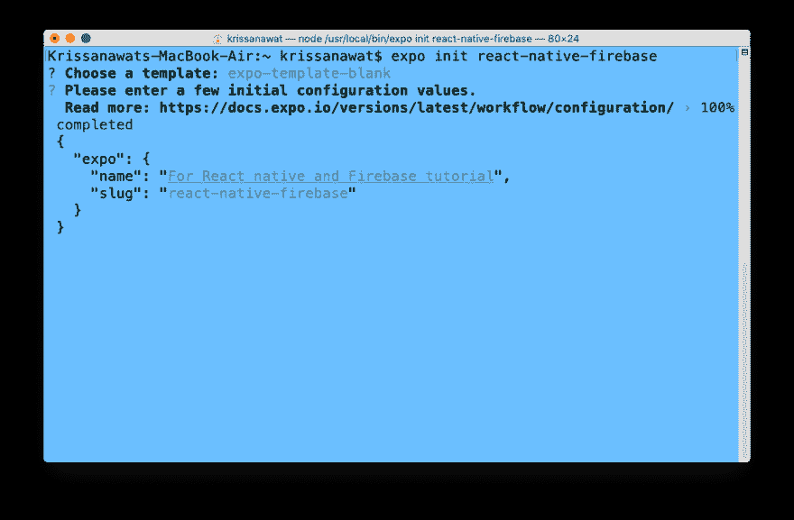](https://res.cloudinary.com/practicaldev/image/fetch/s--TXWBlrgv--/c_limit%2Cf_auto%2Cfl_progressive%2Cq_auto%2Cw_880/https://cdn-images-1.medium.com/max/1017/1%2AexsdG3TQ42ezlqVhjhTMsQ.png)

一旦你按下回车键，安装开始。安装完成后，用 VS 代码打开项目。

[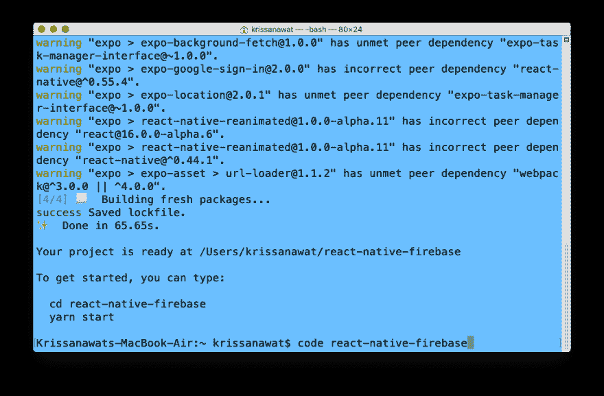](https://res.cloudinary.com/practicaldev/image/fetch/s--PpaWCNin--/c_limit%2Cf_auto%2Cfl_progressive%2Cq_auto%2Cw_880/https://cdn-images-1.medium.com/max/1017/1%2Abk6EzrBbgqklwLQhvM_RAA.png)

要运行这个应用程序，你需要使用 **cd app-folder-name** 进入里面，然后运行命令 **yarn start。**

[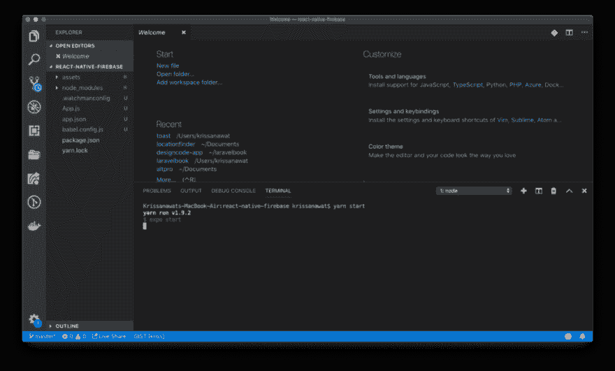](https://res.cloudinary.com/practicaldev/image/fetch/s--H6z45GwM--/c_limit%2Cf_auto%2Cfl_progressive%2Cq_auto%2Cw_880/https://cdn-images-1.medium.com/max/1024/1%2ARzPQZqA07UH5TEyvQ58Meg.png)

一旦你运行这个应用程序，世博会将打开一个新的浏览器窗口。

[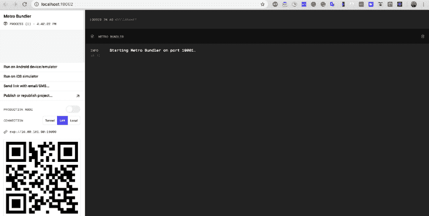](https://res.cloudinary.com/practicaldev/image/fetch/s--p2o6fkI6--/c_limit%2Cf_auto%2Cfl_progressive%2Cq_auto%2Cw_880/https://cdn-images-1.medium.com/max/1024/1%2ALYRaz_caBlP8j-4CrWR2sQ.png)

您可以看到许多选项可用于运行 Android 和 iOS 模拟器以及二维码。这里我们使用 iOS 模拟器来运行这个应用程序。然后打开模拟器或使用您的设备打开 expo 应用程序。

您将看到如下所示的屏幕:

[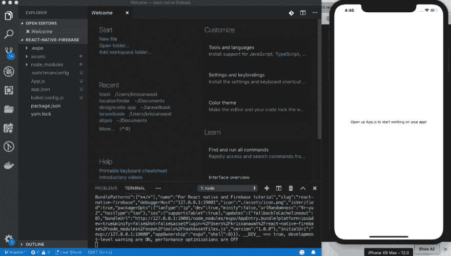](https://res.cloudinary.com/practicaldev/image/fetch/s--961kffVz--/c_limit%2Cf_auto%2Cfl_progressive%2Cq_auto%2Cw_880/https://cdn-images-1.medium.com/max/1024/1%2A32KpAm8viRiNkBGzediHYg.png)

如果一切正常，我们就可以开始了。所以让我们开始真正的编码:

### 自举形式很快有了原生基础

为了快速开发我们的界面，我们使用 Nativebase 进行开发。

[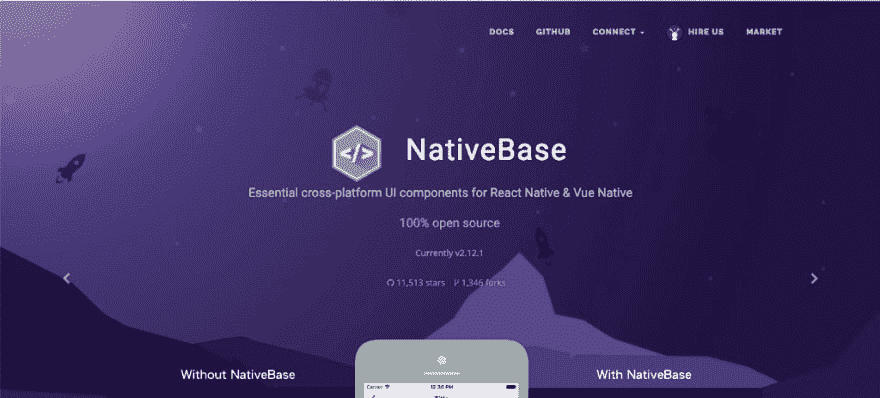](https://res.cloudinary.com/practicaldev/image/fetch/s--x_pFhNiJ--/c_limit%2Cf_auto%2Cfl_progressive%2Cq_auto%2Cw_880/https://cdn-images-1.medium.com/max/1024/1%2AiXoNtRcrpY5cYkt9nyV-2A.png)

**要安装 native base** ，打开一个新的终端运行下面给出的命令:

**npm i native-base -s**

[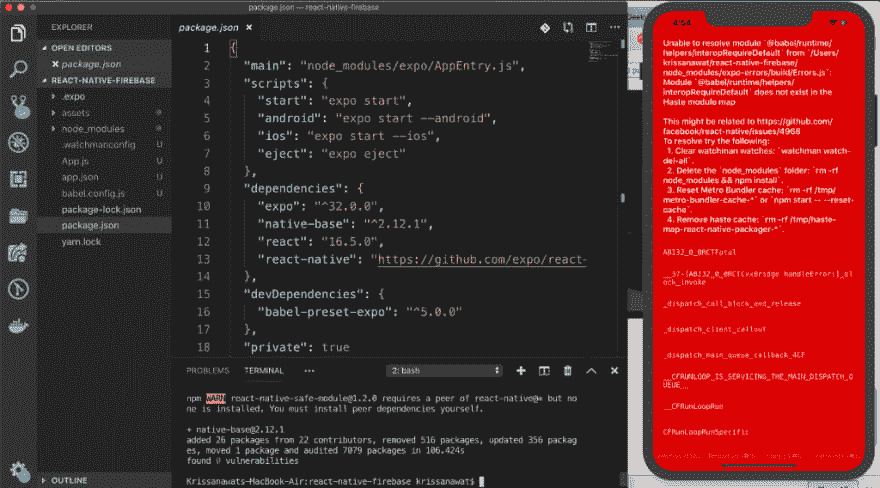](https://res.cloudinary.com/practicaldev/image/fetch/s--JM3twXlT--/c_limit%2Cf_auto%2Cfl_progressive%2Cq_auto%2Cw_880/https://cdn-images-1.medium.com/max/1024/1%2AdiK-LWKPpGi5jo4TYIGcVQ.png)

如果您在进行本机基础安装时遇到一些错误，请不要担心。**停止世博，再次运行** **npm 安装。**

[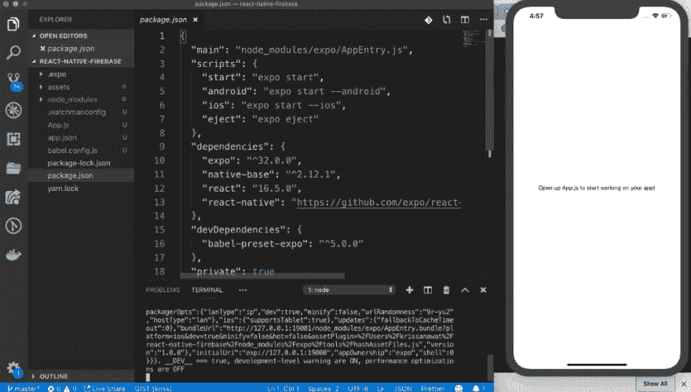](https://res.cloudinary.com/practicaldev/image/fetch/s--51LAFYJz--/c_limit%2Cf_auto%2Cfl_progressive%2Cq_auto%2Cw_880/https://cdn-images-1.medium.com/max/1024/1%2A89K8z6jqWYN6aus-k9mIzw.png)

我们会回到正常模式

### 用原生基础组件设置表单

现在，我们已经准备好将必要的 Nativebase 组件导入到 App.js

```
import { Container, Item, Form, Input, Button, Label } from "native-base"; 
```

导入后，我们将为前端表单构建一个用户界面。

```
render() {
**return** (
 \<Container\>
 \<Form\>
 \<Item floatingLabel\>
 \<Label\>Email\</Label\>
 \<Input autoCapitalize="none" autoCorrect={false} /\>
 \</Item\>
 \<Item floatingLabel\>
 \<Label\>Password\</Label\>
 \<Input
 secureTextEntry={true}
 autoCapitalize="none"
 autoCorrect={false}
 /\>
 \</Item\>
 \<Button full rounded\>
 \<Text\>SignIn\</Text\>
 \</Button\>
 \</Form\>
 \</Container\>
 );
 } 
```

一旦你保存了上面显示的代码，你就可以在屏幕上看到即时的结果。这个概念也被称为热重装。

[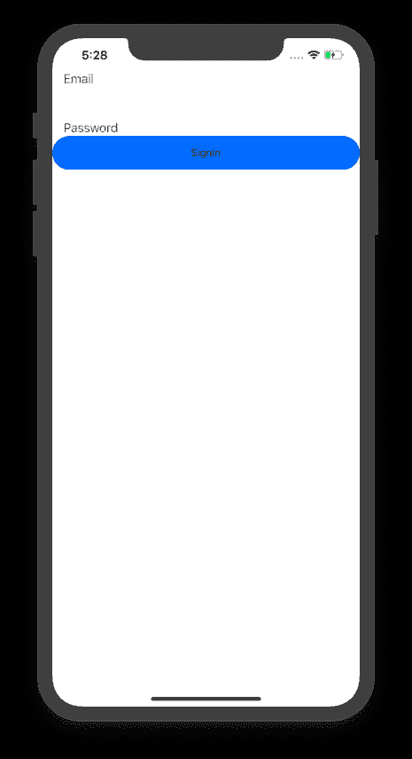](https://res.cloudinary.com/practicaldev/image/fetch/s--SrUI1kV2--/c_limit%2Cf_auto%2Cfl_progressive%2Cq_auto%2Cw_880/https://cdn-images-1.medium.com/max/465/1%2AXZgwmM0YZyrw04LR4pnYCg.png)

因此，让我们使表单居中对齐。为此，我们将播放样式表属性。只要看看下面的代码，你就很容易理解我们是在用容器玩样式表中的属性。

```
\<Container style={styles.container}\> 
```

只需给样式添加一个注释，我们就能让它成为中心。

```
**const** styles = StyleSheet.create({
 container: {
 flex: 1,
 backgroundColor: "#fff",
 // alignItems: "center",
 justifyContent: "center"
 }
}); 
```

现在保存代码，看看结果。所有组件居中对齐。太棒了，让我们进入下一步:

[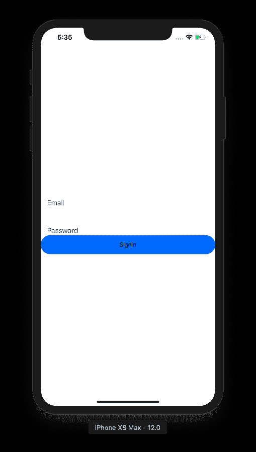](https://res.cloudinary.com/practicaldev/image/fetch/s--LGGPOz8t--/c_limit%2Cf_auto%2Cfl_progressive%2Cq_auto%2Cw_880/https://cdn-images-1.medium.com/max/509/1%2Ab8vk4ZHyHYG0hmJa7qVTfg.png)

### 添加 firebase 来反应原生项目

要添加 firebase，我们需要在 App.js 上运行命令 **npm i firebase - save** 和 after import firebase，如下所示:

```
import \* as firebase from "firebase"; 
```

下一步是**创建 firebase 项目。**进入 **firebase 控制台，**创建一个项目，找到 apikey 和配置，如下图所示:

[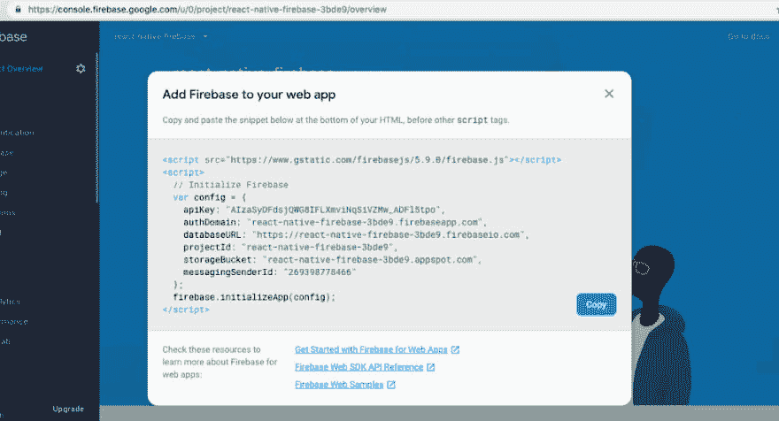](https://res.cloudinary.com/practicaldev/image/fetch/s--2kIg6Fxu--/c_limit%2Cf_auto%2Cfl_progressive%2Cq_auto%2Cw_880/https://cdn-images-1.medium.com/max/1024/1%2AWtL--ZtXbX0F3_5Bg2oFsQ.png)

抓取 config 并粘贴到 App.js，如下所示:

```
import \* as firebase from "firebase";
import { Container, Item, Form, Input, Button, Label } from "native-base";

var config = {
 apiKey: "AIzaSyDFdsjQWG8IFLXmviNqSiVZMw\_ADFl5tpo",
 authDomain: "react-native-firebase-3bde9.firebaseapp.com",
 databaseURL: "https://react-native-firebase-3bde9.firebaseio.com",
 projectId: "react-native-firebase-3bde9",
 storageBucket: "react-native-firebase-3bde9.appspot.com",
 messagingSenderId: "269398778466"
};

firebase.initializeApp(config); 
```

最后，我们已经成功地将 firebase 添加到我们的项目中。

#### 报名

对于电子邮件认证，我们需要在 Firebase 控制台上激活电子邮件认证。转到 firebase 控制台并启用它。

[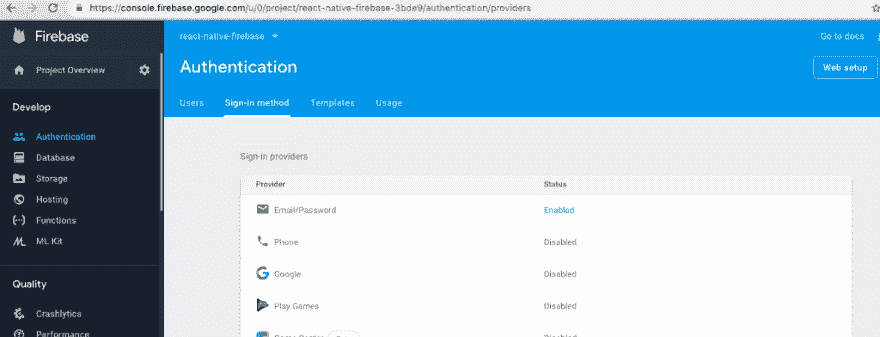](https://res.cloudinary.com/practicaldev/image/fetch/s--05h-GG0s--/c_limit%2Cf_auto%2Cfl_progressive%2Cq_auto%2Cw_880/https://cdn-images-1.medium.com/max/1024/1%2AHzPcNSS8XKUdzVtnAa97mA.png)

再次回到 VS 代码，添加一个注册按钮。以便用户可以填写信息。

```
\<Button full rounded success style={{ marginTop: 20 }}\> \<Text\>Signup\</Text\>
\</Button\> 
```

添加按钮后，您将能够看到登录和注册按钮的结果。

[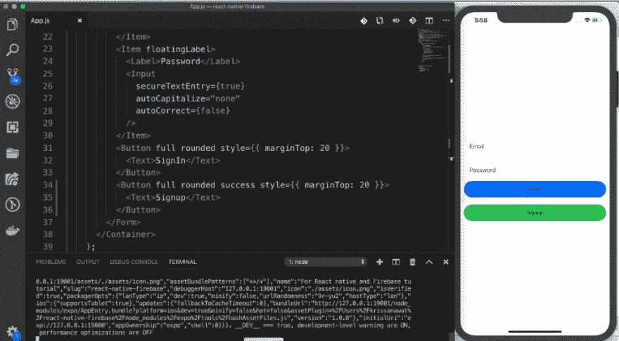](https://res.cloudinary.com/practicaldev/image/fetch/s--rOp0kuVc--/c_limit%2Cf_auto%2Cfl_progressive%2Cq_auto%2Cw_880/https://cdn-images-1.medium.com/max/1024/1%2AZfvkxKlUEi6ALFyz1sEQ9Q.png)

让我们为注册按钮编写一点代码。你可以跟着我做所有的步骤。如果你这样做，很少有机会犯错误和看到任何种类的错误。

```
export default class App extends React.Component {
 constructor(props) {
 super(props);
 this.state = {
 email: "",
 password: ""
 };
 }
 SignUp = (email, password) =\> {
 try {
 firebase.auth().createUserWithEmailAndPassword(email, password);
 } catch (error) {
 console.log(error.toString(error));
 }
 }; 
```

现在，我们创建一个状态来处理表单中的电子邮件和密码，并创建注册函数来处理 firebase 代码。

下一步是用 onChangeText 将表单值添加到状态中。

```
\<Item floatingLabel\>
 \<Label\>Email\</Label\>
 \<Input
 autoCapitalize="none"
 autoCorrect={false}
 onChangeText={email =\> this.setState({ email })}
 /\>
 \</Item\>
 \<Item floatingLabel\>
 \<Label\>Password\</Label\>
 \<Input
 secureTextEntry={true}
 autoCapitalize="none"
 autoCorrect={false}
 onChangeText={password =\> this.setState({ password })}
 /\> 
```

我们将用注册按钮的 **onPress 事件**触发**注册功能**。

```
onPress={() =\> this.SignUp(this.state.email, this.state.password)} 
```

让我们尝试保存并提交表单，以测试我们的方向是否正确。

[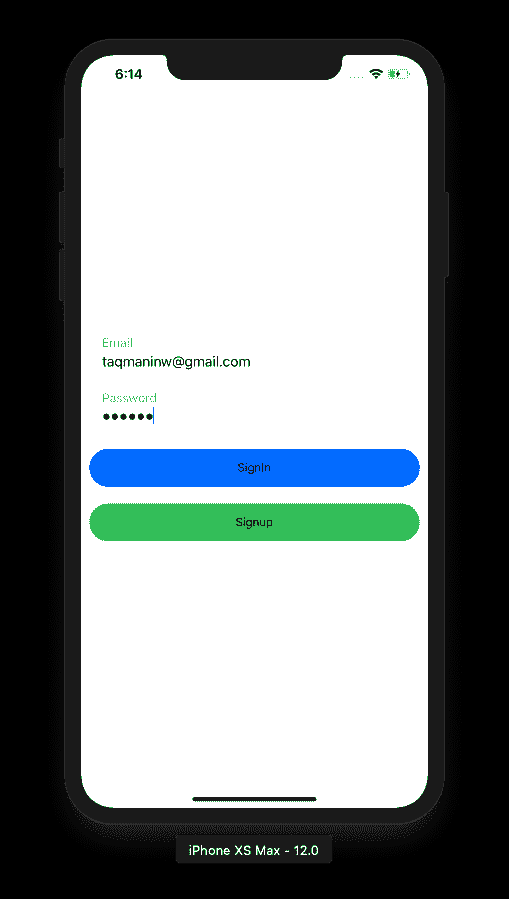](https://res.cloudinary.com/practicaldev/image/fetch/s--IyHIat00--/c_limit%2Cf_auto%2Cfl_progressive%2Cq_auto%2Cw_880/https://cdn-images-1.medium.com/max/509/1%2Am6qmo8ogo712er_edLfwQg.png)

进入并点击注册后，进入 firebase 控制台。你好，我们做到了。查看 firebase 数据库，在那里您可以看到我们输入的值。

[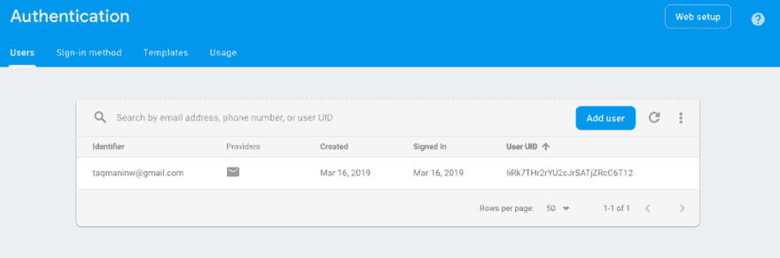](https://res.cloudinary.com/practicaldev/image/fetch/s--RFpcJ_Rj--/c_limit%2Cf_auto%2Cfl_progressive%2Cq_auto%2Cw_880/https://cdn-images-1.medium.com/max/1024/1%2A96IDGlljZ8vR0oRwFMZccQ.png)

现在，我们已经成功地向 Firebase 添加了一个新用户。

#### 签到

让我们为登录按钮编码。我们使用注册方法的代码，并在 firebase 函数中做了一点修改。这样我们就能实现我们想要的。

```
SignIn = (email, password) =\> {
**try** {
 firebase.auth().signInWithEmailAndPassword(email, password);
 firebase.auth().onAuthStateChanged(user =\> {
 alert(user.email);
 })

} **catch** (error) {
 console.log(error.toString(error));
 }
 }; 
```

接下来，使用 **onAuthStateChanged** 从 firebase 获取用户数据。因此，如果我们按下这个按钮，那么一个 onPress 甚至会呼叫**登录**按钮来检查正确的电子邮件和密码。

```
onPress={() =\> this.SignIn(this.state.email, this.state.password)} 
```

所以让我们试着登录。

[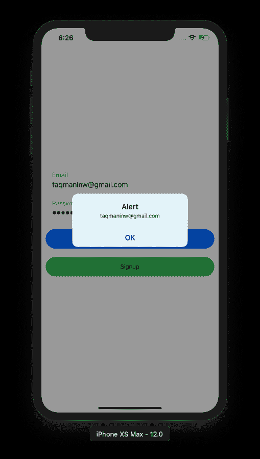](https://res.cloudinary.com/practicaldev/image/fetch/s--Nts4KblD--/c_limit%2Cf_auto%2Cfl_progressive%2Cq_auto%2Cw_880/https://cdn-images-1.medium.com/max/509/1%2AAP6IOJ_cnfDdNpSl6sZP0g.png)

它工作了。最后，我们做到了。你可以看到一切都非常好。

#### 结论

我们用过 Expo，Nativebase，Firebase。希望你已经学会了。如果你被困在某个地方，下面的 [GitHub](https://github.com/krissnawat/react-native-firebase-tutorial) repo。在那里你会得到完整的代码。如果你觉得有价值，继续分享。

#### 了解更多

*   [Master React 原生动画| Udemy](https://click.linksynergy.com/link?id=qt/jYwyHv8A&offerid=507388.1331625&type=2&murl=https%3A%2F%2Fwww.udemy.com%2Fmaster-react-native-animations%2F)
*   [React Native:高级概念| Udemy](https://click.linksynergy.com/link?id=qt/jYwyHv8A&offerid=507388.1172996&type=2&murl=https%3A%2F%2Fwww.udemy.com%2Freact-native-advanced%2F)
*   [React Native 实用指南:构建 iOS/Android 应用](https://click.linksynergy.com/link?id=qt/jYwyHv8A&offerid=507388.1436092&type=2&murl=https%3A%2F%2Fwww.udemy.com%2Freact-native-the-practical-guide%2F)
*   [使用 React Native | Coursera 开发多平台移动应用](https://click.linksynergy.com/link?id=qt/jYwyHv8A&offerid=467035.13079845234&type=2&murl=https%3A%2F%2Fwww.coursera.org%2Flearn%2Freact-native)

### 免责声明

此帖子包含产品的附属链接。我们可能会收到通过这些链接购买的佣金。

* * *