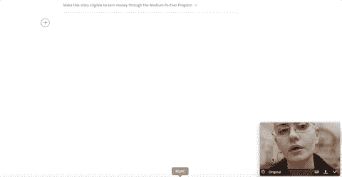
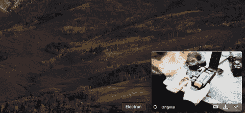
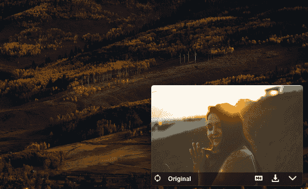
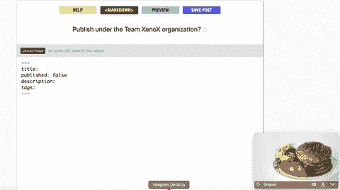
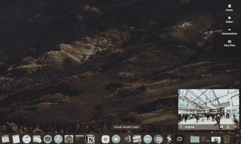

# Dragula:一个免费的股票图片工具🦇

> 原文：<https://dev.to/xenoxdev/dragula-a-free-stock-images-tool-on-steroids-4o86>

我刚刚在[产品搜索](https://www.producthunt.com/posts/dragula-2)上发布了 Dragula，我需要我的开发家人的支持。所以我在这里:

#### 什么是德拉古拉？

Dragula 是一个简单的电动工具，可以让你在屏幕上的任何地方轻松地拖动 n-drop Unsplash 股票图像！

#### 你能用它做什么？

***1)用关键词*搜索**

***2)下载图片***

***3)使用裁剪或未裁剪的原始图像***

***4)复制链接或降价***

*注意:Markdown 特性是专门为开发者和开发者开发的*

#### 最棒的是什么？

***是开源免费的。【T2***

##  [解剖学](https://github.com/sarthology) / [德拉古拉](https://github.com/sarthology/dragula)

### 🦇类固醇上的免费股票图片

<article class="markdown-body entry-content container-lg" itemprop="text">

## Dragula

<g-emoji class="g-emoji" alias="bat" fallback-src="https://github.githubassets.cimg/icons/emoji/unicode/1f987.png">🦇</g-emoji>一个简单的工具栏，可以将图像从 unsplash 拖放到任何地方。

## 特征

#### 1.将图像拖放到任何地方

只需将图像拖放到任何地方。它支持所有具有拖放图像选项的软件，包括所有的 **Adobe 软件**、 **Microsoft Office** 等。

#### 2.使用“原始”以原始大小删除图像

Dragula 使用智能编辑，以提供一个完美的景观图像，你可以使用，但如果你想使用完整的图像点击原始，以查看原始的未经编辑的版本。

#### 3.搜索图像

你也可以从 dragula 中搜索随机图片。只需键入关键字并输入，就这么简单。

#### 4.将图像复制为降价

如果您使用 markdown，只需点击一下就可以将 Markdown 图像代码复制到您的剪贴板上。

#### 5.下载图像

只需点击一下鼠标，即可将图像下载到您的下载文件夹中。

## 先决条件

在本地运行之前，您必须…

</article>

[View on GitHub](https://github.com/sarthology/dragula)

#### 你能帮上什么忙？

除了贡献，你还可以做以下几件事:

***1。[为 macOS 下载](https://github.com/sarthology/dragula/releases/download/v1.0.2/Dragula-1.0.2.dmg)，尽情享受。***
***2。【Windows 版下载，玩得开心。😃***
***3。 [Tweet](https://twitter.com/sarthology) me，任何你想要的功能。***
***4。为 [Dragula](https://www.producthunt.com/posts/dragula-2) 提供产品搜索的反馈。***

请在评论区让我知道你对它的看法，并随时投稿。你们一直很支持我。这次也请支持我。爱你们所有人！

