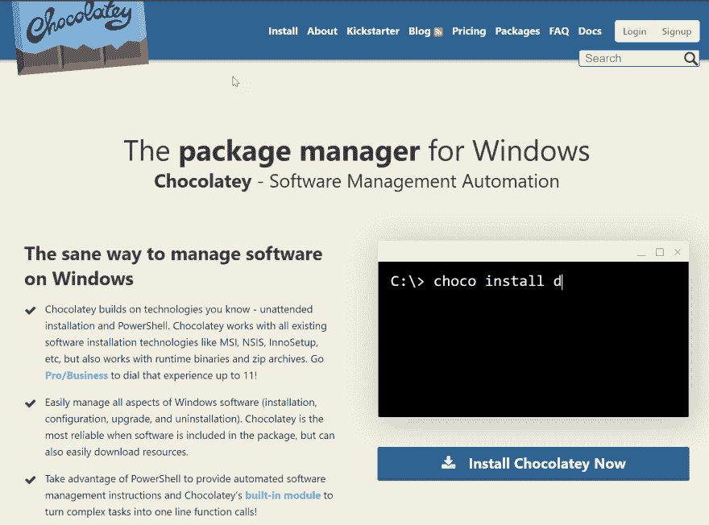

# Chocolatey，在 windows 上安装软件的更好方法

> 原文：<https://dev.to/codingcoach/chocolatey-a-better-way-to-install-software-on-windows-ljo>

这篇文章主要针对使用 windows 的软件开发人员。你应该对你的操作系统有基本的了解。

当您需要安装一个新工具时，您会遇到这样的问题:试图找到下载它的位置，为您的 SO 获取最新版本，等等。

为了改善与管理软件安装相关的用户体验， [Chocolatey](https://chocolatey.org/) 来帮忙了。

[](https://res.cloudinary.com/practicaldev/image/fetch/s--syBoyCa4--/c_limit%2Cf_auto%2Cfl_progressive%2Cq_auto%2Cw_880/https://i.imgur.com/u8r7Jzr.png)

这个软件将允许你使用 windows 命令行来安装、更新或卸载你喜欢的工具和程序。

你可以在这里看到一个精选的可用包列表[。](https://chocolatey.org/packages)

以下[链接](https://chocolatey.org/install)中提供了安装说明。

简而言之，在管理员模式下打开 PowerShell CLI 并执行以下命令:

```
iwr https://chocolatey.org/install.ps1 -UseBasicParsing | iex 
```

如果您收到一条关于在您的系统中禁用运行脚本的错误消息，只需在您当前的 PowerShell 窗口中运行它([更多信息](https://docs.microsoft.com/es-es/powershell/module/microsoft.powershell.core/about/about_execution_policies?view=powershell-6)):

```
Set-ExecutionPolicy -ExecutionPolicy RemoteSigned 
```

之后，以管理员身份打开 windows 命令提示符，使用 *choco -？*命令查看更多信息。
例如，我可以用以下命令安装 ConsoleZ:

```
choco install consolez 
```

或者更新为:

```
choco upgrade consolez 
```

通常，同一个安装程序会将程序添加到路径中，因此，在这种情况下，使用*控制台*命令打开新安装的软件。