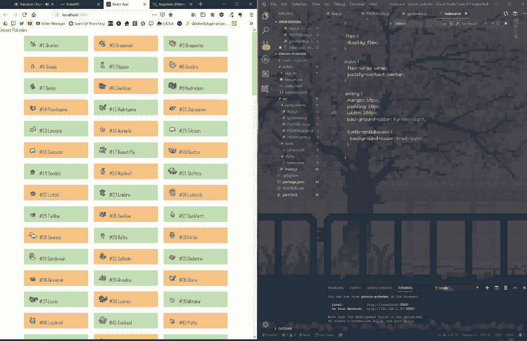
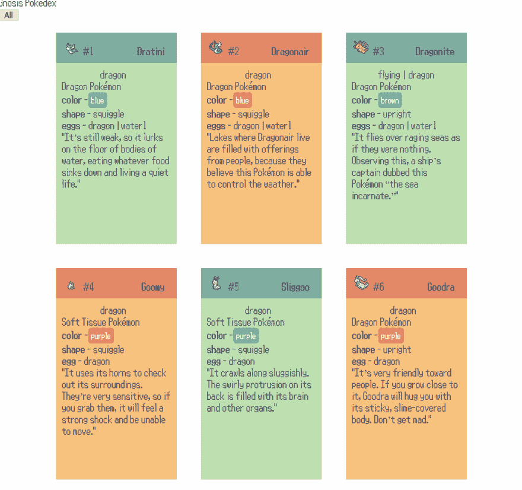
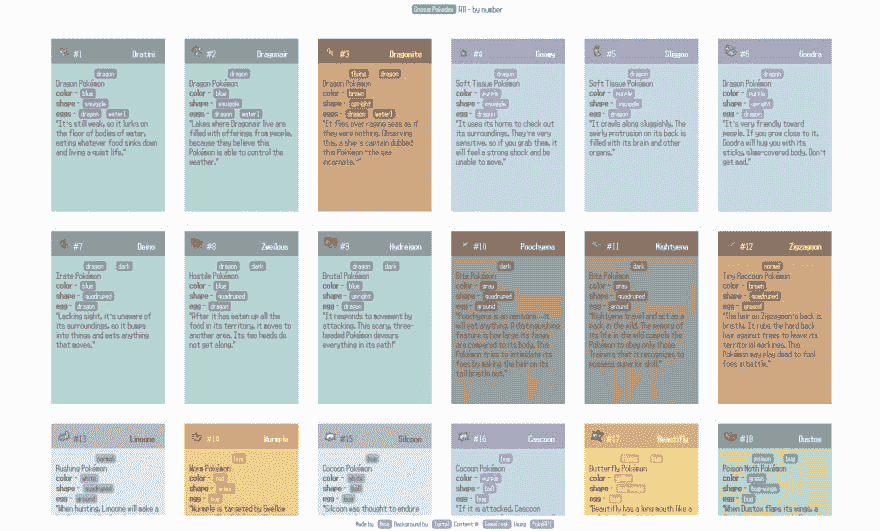

# 小项目反思:自然 Pokedex (React)

> 原文：<https://dev.to/misnina/small-project-reflection-natural-pokedex-react-3oj8>

编辑:我修复了一些问题，我在这里详述了

项目[在这里](https://misnina.github.io/gnosis-pokedex/)

### 更多口袋妖怪！100 天代码日 11 - 13

我现在可能应该做一个更大的项目，但是我喜欢我朋友给我的建议，我做黑客的 pokedex(？)我们正在研究的叫做灵知！*(用祖母绿的[反汇编&反汇编还算黑客吗？)](https://github.com/pret/pokeemerald)*这些是你能在天梭地区找到的原生口袋妖怪。有一些不同的形式和巨大的演变，但为了这个指数的目的，我们只是再次从 [PokéAPI](https://pokeapi.co/) 的普通条目中抽取。虽然我可以从很多数据中提取，但我决定，因为一些数据会在新游戏中有所不同，我会从这些数据中提取自然属性和类型。除此之外，我唯一的目标是能够“搜索”相关条目，所以让我们开始吧！

[](https://res.cloudinary.com/practicaldev/image/fetch/s--DaNw2G2X--/c_limit%2Cf_auto%2Cfl_progressive%2Cq_auto%2Cw_880/https://thepracticaldev.s3.amazonaws.com/i/0fh5g6s5dnuez2c7lt0z.PNG)

### 显示精灵

起初我想完整地使用[这个资源](https://github.com/msikma/pokesprite),但是我不太能理解，所以我最终只是抓取了命名菜单精灵的主列表来显示口袋妖怪。我真的很挑剔让一切都匹配，自从过渡到 3D 模型，精灵资源和 3D 模型和旧精灵之间的分裂，而 PokeApi 链接到一个精灵资源，使用**和**。也有粉丝制作的资源来分享它们，但是质量参差不齐。这对我没有好处，所以口袋妖怪的一个一致的图像来源是菜单精灵，不管游戏是否是 3D 的。在这里希望剑和盾不要打破趋势！

在这个阶段，我只是在 dex 中有一个 200 口袋妖怪的数组。我在入口组件上迭代了 200 次，并将它们存储在 JSX 元素的数组中。这将尝试在其生命周期内重新呈现，因此我们不会将其推送到阵列，而是根据其 ID 设置特定实例。在条目中，我们有一个 PKMNSprite 组件，它只获取与其 ID 相关的名称数组，并将其用作。我拯救的精灵的 png。

```
 for (let i = 0; i < 200; i++) {
      entries[i] =
        <PKDEXEntry
          pkmnID={i}
          key={`entry-${i + 1}`}
        />
    }
...
export default function PKMNSprite(props) {
  return  } 
```

Enter fullscreen mode Exit fullscreen mode

### 从 PokéAPI 获取

虽然这可能并不理想，但我已经让子组件处理信息请求。这不理想的原因是，当它只是条目获得自己的信息时，它是好的，我必须向应用程序组件报告关于搜索标准收到了什么信息。稍后会详细介绍。

省略了一些控制父状态的函数，这就是我们的 API 调用的样子:

```
 axios.get(`https://pokeapi.co/api/v2/pokemon/${name.toLowerCase()}`)
      .then(res => {
        this.setState({ info: res.data });
        return axios.get(res.data.species.url);
      }).then(res => {
        this.setState({ species: res.data });
        this.setState({ loading: false });
      }).catch(err => {
        console.log(name + err);
      })
  } 
```

Enter fullscreen mode Exit fullscreen mode

PokéAPI 在页面中存储每个口袋妖怪的一般信息，然后在另一个地方详细介绍该物种，这与信息页面有很好的链接。**注意:** *即使 setState 还在加载，代码也会继续。由于这个原因，我使用响应数据来查找物种 url，而不是 this.state.info.* 然而，令人讨厌的是，具有不同形式且没有“常规”状态的口袋妖怪将它放在 API 调用的名称中。所以，我不能让它像我希望的那样优雅，必须在调用之前添加一个异常。

```
 let name = "bulbasaur";
    if (GPOKEDEX[this.props.pkmnID] === "Minior") {
      name = "minior-red-meteor";
    } else if (GPOKEDEX[this.props.pkmnID] === "Aegislash") {
      name = "aegislash-shield";
    } else {
      name = GPOKEDEX[this.props.pkmnID];
    } 
```

Enter fullscreen mode Exit fullscreen mode

[](https://res.cloudinary.com/practicaldev/image/fetch/s--O_ZaHqqP--/c_limit%2Cf_auto%2Cfl_progressive%2Cq_66%2Cw_880/https://thepracticaldev.s3.amazonaws.com/i/68xy1wts7r4pocrn8x0s.gif)

在这一点上，我只是让条目的颜色交替。后来，我会让他们在 pokedex 连接到他们的颜色。

### 搜索

仅仅显示 dex 是足够容易的，但是我希望能够按照相似的属性对口袋妖怪进行分组。这就是事情变得有点混乱的地方。初始条目组件只包含空白组件，没有关于条目中实际内容的数据。

PKMNEntry 组件将调用的信息发送回父应用程序组件。我们创建两个变量来存储信息数据和物种条目，并将这些函数作为道具传递给条目，以便在条目收集到数据后进行填充。我也可以只让它发送我需要的数据，而不是为两个调用发送两个数组，但我觉得这最终不会有太大的改变。

```
 setInfoEntry = (pkmnID, data) => {
    infoEntries[pkmnID] = data;
  }

  setSpeciesEntry = (pkmnID, data) => {
    speciesEntries[pkmnID] = data;
  } 
```

Enter fullscreen mode Exit fullscreen mode

我遇到的一个问题是，如果你试图在页面加载完所有数据之前使用按钮进行搜索，它会出错，因为一些搜索词没有定义。由于这个原因，当整个页面在加载屏幕上时，PKMNEntry 组件被加载但被隐藏，然后一旦加载数组中的第 200 个 pokemon 加载条目被设置为真，它就正确地加载条目。这是很不幸的，因为它加载了两次，但是我不确定除了在每个条目的父条目中调用 axios 并作为道具传递之外的最佳方式。这是一个你希望你的数据在哪里的问题。我可能会重构它来做到这一点，我现在还不确定。

一旦我们在两个数组中有了所有的数据，绑定到父元素的搜索函数将作为 props 传递到 PKMNStats 组件并添加到 buttons 中。这个特定的函数将获取给定的颜色，并将其输入到这个函数中。我们首先清除所有先前过滤的条目，然后遍历 200 个条目的数组，查看它们是否与相关信息数组中的路径匹配。因此，搜索类型都是不同的函数。我觉得我可以创建一个函数来考虑所有的条件，但是如果每个条件都有 if 语句，那就太乱了，所以我宁愿把它们分开。

```
 showColorEntries = (color) => {
    filteredEntries = [];
    entries.forEach((entry, i) => {
      if (speciesEntries[i].color.name === color) {
        filteredEntries.push(entry);
      }
    })
    this.setState({ showAll: false, showFiltered: true });
    this.setPageFilter('Color', color);
  } 
```

Enter fullscreen mode Exit fullscreen mode

然后，如果显示了所有条目或过滤后的条目，我将进行交换。顶部的按钮将带我们回到所有条目，这样我们就可以再试一次。最后，设计非常简单，我不觉得有必要把它弄得如此复杂，因为我们只是想显示简单快捷的数据。

[](https://res.cloudinary.com/practicaldev/image/fetch/s--OaWzNhHr--/c_limit%2Cf_auto%2Cfl_progressive%2Cq_auto%2Cw_880/https://thepracticaldev.s3.amazonaws.com/i/jc41yzv7hpojlekuqu23.PNG)

### 结论

我真的需要做一个更中等规模的项目，但很难找到有趣的事情没有做过。我是这么说的，但是我的上一个待办事项应用程序失败了，所以我仍然需要重做一些被认为是简单和过度的事情。我对此很高兴，我喜欢思考口袋妖怪的自然属性，而不仅仅是相关的统计数据。找到所有歪歪扭扭的口袋妖怪，并阅读滑稽可怕的 dex 条目总是一种乐趣！