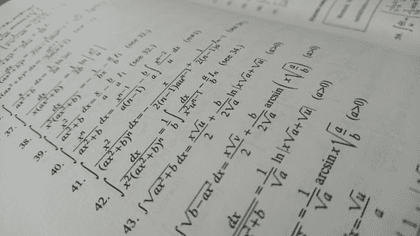
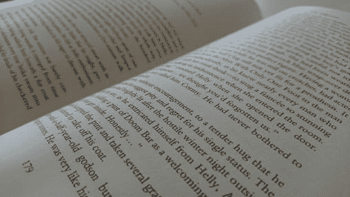

# 编程:数学还是写作？

> 原文：<https://dev.to/henrikwarne/programming-math-or-writing-db7>

编程是像数学，还是像写作？我认为这两者都有，尽管编程是一门独立的学科。尽管如此，想想哪些方面像数学，哪些方面像写作，还是很有趣的。也许它甚至会让你更好地理解什么是编程。

## 喜欢数学

有时，程序的领域需要数学，例如机器学习、图形编程或金融建模。然而，在这里，我感兴趣的是与数学的相似之处，它适用于任何领域。

**问题解决。**程序是关于如何解决问题的指令。为了编写程序，你需要把问题分解成更小的问题，就像解数学题一样。您需要考虑解决较小问题所需的输入，以及如何组合这些结果以获得解决方案。您还需要考虑所有可能的情况(“如果这些信息丢失了怎么办？”).所有这些都非常类似于你如何解决一个数学问题。

**抽象概念。对我们程序员来说，我们的程序感觉真实。有层、套接字、对象图、函数、散列图等。但最终，运行的系统只是电路中的电流。其他的都是抽象，在构建和推理程序时是有用的。对抽象概念进行精确推理的能力也在数学中得到了发展。Keith Devlin 认为这就是程序员从学习数学中受益的原因:[“为什么大学要求计算机科学的学生上数学课”](http://devlinsangle.blogspot.com/2015/04/the-importance-of-mathematics-courses.html)。**

**函数和数字。**编程中有很多例子要么是实际的数学，要么非常接近。示例包括:函数(将输入转换为输出)、二进制和十六进制数、布尔逻辑(组合*和*、*或*和*而非*)，以及用于分析算法性能的大 O 符号。此外，递归非常类似于归纳法的证明。当然，当我们谈到机器指令时，都是(二进制)数字和各种形式的计算。

## 喜欢写作

编程类似于写作(至少是非虚构的，但甚至可能是虚构的)。甚至我们使用的词语也暗示:你*用一种编程*语言*编写*一个程序。以下是它们相似的一些具体方式:

**沟通。成功的程序有变大的趋势，需要许多合作的程序员。因此，代码的任务不仅是与编译器通信(语法和算法正确的代码)，而且还要与其他程序员交流程序的结构和组织。否则程序将变得很难修改和扩展。**

这种代码结构与优秀的写作非常相似。写作的时候，需要把故事讲清楚。你需要有良好的整体结构，遵循逻辑顺序。所有的部分需要组合在一起，这样文本才容易理解。布局也很重要。文本墙比分成段落的文本更难阅读。这同样适用于程序。一个 300 行的方法比几个较小的命名良好的方法的组合更难理解。

* *编辑和修改。** 对我来说，写程序和写文字(比如这篇博文)的过程非常相似。在这两种情况下，我都有一个想法，我花一些时间计划应该做什么。然后就是非常迭代的编码/编写过程，频繁的重构/修改。对我来说，第一次尝试就做对很难。逐步调整细化就容易多了。一旦我写了一些东西，即使它远非完美，修改和改进它也相对容易。这同样适用于代码和文本。

**风格。正如写作一样，编程中也有相当多的个人风格空间。想象一下，100 个人写一页纸的说明，比如说，如何做意大利面。即使他们都完全同意如何制作(我对此表示怀疑)，我也不认为任何一页会完全相同。有太多的方式来表达相同的基本步骤。我认为程序也是如此。即使对于一个像频率问题这样简单的问题(在编程风格的[练习中使用)，我也不认为如果 100 个程序员解决它，任何解决方案会完全相同。基本原理是相同的，但是有很多方法可以改变实现。因此，正如在写作中一样，在编程中也有个人风格的空间。](https://dev.to/henrikwarne/exercises-in-programming-style-37ag)**

## 结论

这些是编程像数学的一些方式，编程像写作的一些方式。然而，也有许多方式，编程是它自己的事情。例如，程序通常会不断地修改和扩展——它们永远不会完成。此外，它们最终是运行的，运行时行为增加了另一个维度，与创建程序的行为相分离。

不过，寻找与其他领域的相似之处还是很有趣的。问一个好的作家是否比一个差的作家更有可能成为一个好的程序员也很有趣。或者擅长数学是否有助于你变得擅长编程。你有什么看法？