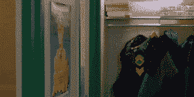

# 在 CSS 中进行切换

> 原文：<https://dev.to/jckuhl/making-a-switch-in-css-5no>

# 我们来切换一下！

对于最近的一个项目，我想我会使用 Materialize CSS，在使用它之后，我决定，虽然它是一个很好的库，但它不适合我的项目。然而，我真的很喜欢他们设计的开关元素，所以我决定在 CSS 中重新制作它。

这样做需要我进入 CSS 中我以前从未涉足的领域，即伪元素。通过操作`::before`和`::after`，我可以对复选框进行功能切换。

下面是最终产品。这是一个开关，从关闭切换到打开，当禁用时，变成灰色和不可用。

[https://codepen.io/jkuhl/embed/ZPRYOw?height=600&default-tab=result&embed-version=2](https://codepen.io/jkuhl/embed/ZPRYOw?height=600&default-tab=result&embed-version=2)

# 入门

我们将从不起眼的复选框开始，将它包装在一个标签中，因为我们应该这样，当用户单击标签时，它将切换复选框

> 出于可访问性的目的，您应该始终将标签与表单元素结合使用。

为了确保我们的 CSS 不影响网站上的其他复选框，我们将为标签指定一个类，并在继续操作时修改该类及其后代。

```
<label class="switch">
  Off
  <input type="checkbox">
  On
</label> 
```

让我们来设置 CSS:

```
.switch input[type="checkbox"] {

} 
```

我们需要做的第一件事是去掉默认的复选框样式。这需要一些研究，但我找到了解决办法。我们的复选框现在将消失。

然后，我们需要确定旋钮(红色或蓝色的圆圈)和旋钮“移动”的小滑块(后面的灰色矩形)的位置。这些将由伪元素组成，它们需要相对于复选框元素的*位置*移动*。*

这是一个很大的提示，我们将需要为绝对定位的旋钮样式，但绝对定位，默认情况下，将基于整个窗口。我们希望复选框中有`position: relative`,因为它是伪元素`::before`和`::after`的父元素。

最后，一旦开关出现，我们需要在开关周围留一些空间，这样“开”和“关”的文本就不会在它旁边破碎，我们可以用边距来做到这一点。

```
.switch input[type="checkbox"] {
  -webkit-appearance: none;
  position: relative;
  margin: 0 1rem;
} 
```

这将设置我们的复选框。但是现在，我们没有什么可看的，所以让我们制作滑块

# Mmmm 滑块

没有什么比一盘迷你汉堡更让我高兴的了。但这是一篇 CSS 文章，而不是一个墙上挂着美国食物、乡村音乐和傻瓜式广告的当地小镇烧烤。

[](https://i.giphy.com/media/2agCyh9S58i2I/giphy.gif)

在这种情况下，滑块只是我们的旋钮行进的轨迹。我们将从`::after`伪元素中创建它。

但是首先，什么是`::after`元素，就此而言，`::before`元素是什么？嗯，伪元素是带有各种标签的元素，这些标签可以处理各种事情。我知道这是一个非常笼统和无益的回答，但有很多这样的回答。有些，像`::first-line`可以修改段落的第一行。有一个实验性的可以让你摆弄`::spell-check`。MDN 有很多关于[伪元素](https://developer.mozilla.org/en-US/docs/Web/CSS/Pseudo-elements)的信息

`::before`和`::after`是大多数 HTML 元素中的元素，它们被认为是元素的子元素。`::before`是第一个孩子，`::after`是最后一个孩子。就我们的目的而言，哪个是第一个或最后一个孩子并不重要。这些可以用于很多目的，甚至创造[胡子](https://www.youtube.com/watch?v=Y0_FMCji3iE)。

但是我们将保持简单，使用`::after`来创建我们的滑块。它只是一个普通的灰色长方形盒子。

为了瞄准它，我们只需要将`::after`附加到一个新的 css 规则

```
.switch input[type="checkbox"]::after {

} 
```

要让它出现，我们需要做五件事。首先，伪元素需要一些内容。我们的将是一个简单的空字符串，所以`content: ''`就足够了。接下来，它需要具有显示属性。我们将把它定为`block`，因为经过一些欺骗，我发现这是这里最有效的。它需要一个背景颜色，我选择了`grey`。

> 不要犯我经常犯的设置`color`属性的错误！`color`为文字！`background`就是我们要设定的！

最后，我们需要高度和宽度。因为它应该被设置在正文中，所以基于词根 em (rem)似乎是最符合逻辑的。我把它设置为 1 雷姆宽，0.5 雷姆高。

```
.switch input[type="checkbox"]::after {
  content: '';
  display: block;
  width: 1rem;
  height: 0.5rem;
  background-color: grey;
} 
```

一个灰色的长方形出现了！

# 造型旋钮

现在是旋钮。这里我们有一个旋钮，可以是右或左，但总是一个圆形，总是有阴影(使其具有一些 3d 效果)并且总是有相同的内容和大小，所以我们想把我们的 CSS 写得干巴巴的，不要重复自己。

我们想为我们的`::before`伪元素写一个基线。

```
.switch input[type="checkbox"]::before {

} 
```

同样，我们需要为它提供内容、尺寸和显示属性。

```
.switch input[type="checkbox"]::before {
  content: '';
  display: block;
  width: 1rem;
  height: 1rem;
} 
```

那将使我们成为一个广场。我们还看不到它，因为它没有颜色，所以我们要为复选框何时被选中和取消选中制定规则，因为颜色根据该值而变化。

瞄准一个选中的复选框很简单，我们可以创建一个选择`:checked`的新规则。瞄准一个未选中的框有点棘手，因为没有`:unchecked`。我们必须使用`:not()`伪选择器，所以我们可以制定两个新规则:

```
.switch input[type="checkbox"]:checked::before {
}

.switch input[type="checkbox"]:not(:checked)::before {
} 
```

这里的顺序很重要。我们希望将 checkbox 类型的选中输入元素的`::before`伪元素作为目标，该元素是 switch 类元素的后代。我们不希望在 `::before`之后出现`:checked` *，因为`::before`没有`checked`属性。*

如果它被选中，我希望它是蓝色的，并移动到左边 10 个像素。如果它没有被选中，我希望它是红色的，并向右移动 10 个像素。

```
.switch input[type="checkbox"]:checked::before {
  left: 10px;
  background-color: blue;
}

.switch input[type="checkbox"]:not(:checked)::before {
  right: 10px;
  background-color: red;
} 
```

因为我们正在修改`left`和`right`属性，我们的基线需要为`position: absolute` :
设置

```
.switch input[type="checkbox"]::before {
  content: '';
  display: block;
  position: absolute;
  width: 1rem;
  height: 1rem;
} 
```

现在我们快到了。旋钮在轨道上有点不居中，要修复它，我发现设置顶部位置-0.25 放在我想要的位置:

```
.switch input[type="checkbox"]::before {
  content: '';
  display: block;
  position: absolute;
  top: -0.25rem;
  width: 1rem;
  height: 1rem;
} 
```

最后，让我们把它做成一个有阴影的圆。圆很容易，只要给它一个 50%的边界半径。另一方面，我从不手工制作阴影，我发现了一个很好的在线工具。我喜欢用 [CSSMatic](https://www.cssmatic.com) 来做这个。他们有一个实时的盒子阴影工具，可以为你自动生成代码。使用我喜欢的边界半径和值，基线选择器的最终 CSS 看起来像这样:

```
.switch input[type="checkbox"]::before {
  content: '';
  display: block;
  position: absolute;
  top: -0.25rem;
  width: 1rem;
  height: 1rem;
  border-radius: 50%;
  -webkit-box-shadow: 2px 2px 5px 0px rgba(0,0,0,0.75);
  -moz-box-shadow: 2px 2px 5px 0px rgba(0,0,0,0.75);
  box-shadow: 2px 2px 5px 0px rgba(0,0,0,0.75);
} 
```

现在你知道了！一个功能开关！

# 但是等等，还有！

没有目标样式的表单元素是不完整的，我们的用户需要一个视觉提示来知道这个元素现在不能使用。为此，我们可以使用我们的旋钮，我们的`::before`元素，并在复选框被禁用时改变颜色:

```
.switch input[type="checkbox"]:disabled::before {
  background-color: darkgrey;
} 
```

如果旋钮被禁用，它将变成灰色。尝试在`input`标签中添加“disabled”来测试它。

# 我们到此结束！

下面是完整的代码:

```
<label class="switch">
  Off
  <input type="checkbox">
  On
</label> 
```

```
.switch input[type="checkbox"]:checked::before {
  left: 10px;
  background-color: blue;
}

.switch input[type="checkbox"]:not(:checked)::before {
  right: 10px;
  background-color: red;
}

.switch input[type="checkbox"]::before {
  content: '';
  display: block;
  position: absolute;
  top: -0.25rem;
  width: 1rem;
  height: 1rem;
  border-radius: 50%;
  -webkit-box-shadow: 2px 2px 5px 0px rgba(0,0,0,0.75);
  -moz-box-shadow: 2px 2px 5px 0px rgba(0,0,0,0.75);
  box-shadow: 2px 2px 5px 0px rgba(0,0,0,0.75);
}

.switch input[type="checkbox"]::after {
  content: '';
  display: block;
  width: 1rem;
  height: 0.5rem;
  background-color: grey;
}

.switch input[type="checkbox"] {
  -webkit-appearance: none;
  position: relative;
  margin: 0 1rem;
}

.switch input[type="checkbox"]:disabled::before {
  background-color: darkgrey;
} 
```

这是一个简单的小开关，可以为网站增添一点趣味。如果用户想要*这个*或者用户想要*那个*，这对二元情况非常有用。

你可以随意使用和修改它。尝试调整大小或颜色。让它变得更奇特，从中获得乐趣。如果你看到任何可以在 CSS 中做得更好的方法，请告诉我。

快乐编码