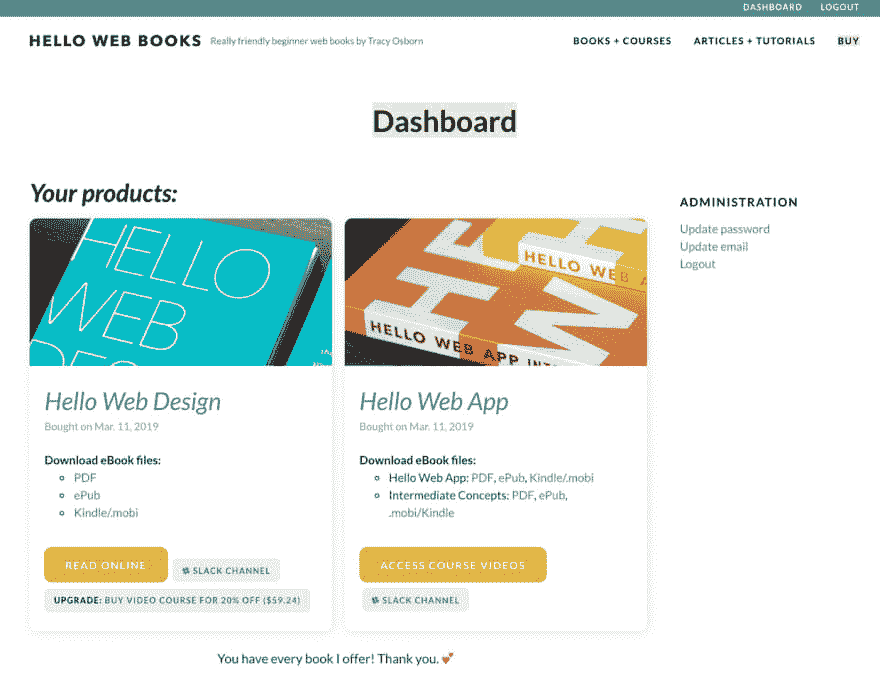
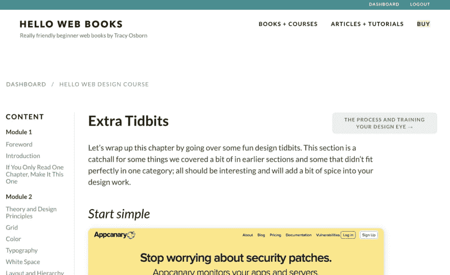
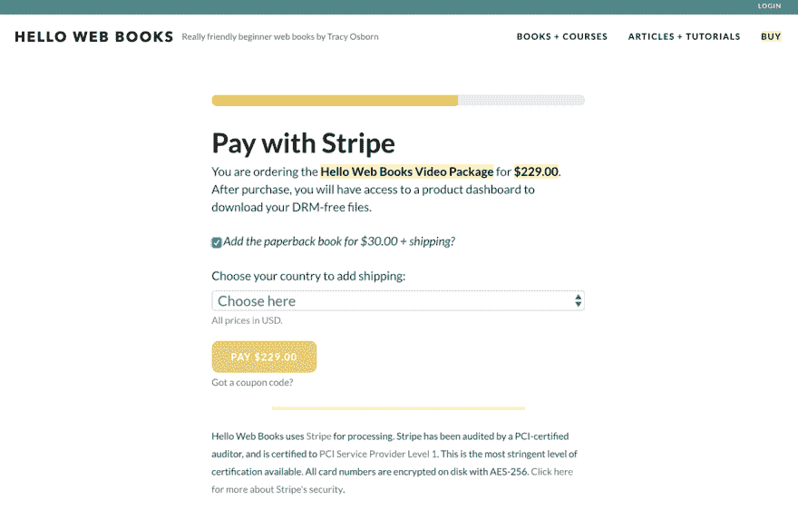

# 新的 Hello Web Books 网站已经推出！

> 原文：<https://dev.to/tracymakes/the-new-hello-web-books-website-has-launched-2hbi>

在过去的几个月里，我一直在[慢慢地增加](https://hellowebbooks.com/news/moved-hellowebbookscom-static-site-generator-full-django-site/)这个网站的[功能，最终目标是取代我所依赖的几个外部服务。我很兴奋地说，工作终于完成了！](https://hellowebbooks.com/news/new-hello-web-books-website-nearly-completed/)

HelloWebBooks.com 现在有一个完整的教育网站后台。你可以订购我的图书包，这将提示你注册一个帐户，在这个帐户上你可以访问你的可下载文件，以及(新的)按章节划分的在线完整图书内容。这将包括嵌入的视频，如果你的软件包包括它们。

<figure> 

<figcaption>新书/课程仪表盘。</figcaption>

</figure>

以前，如果你为 [Hello Web Design](https://dev.to/learn-design) 购买了一个视频包，你会被提示在 Gumroad 上创建一个帐户来访问你的文件，其中包括一个 janky hack——一个带有 Podia 100%优惠券 URL 的文本文件，你可以在那里注册一个帐户*再注册*，以访问那里托管的视频文件。我喜欢 Podia 的体验，但是 Podia 没有办法在外部网站上嵌入注册按钮或表单，所以这是我的变通办法。糟糕。

<figure> 

<figcaption>嵌入视频内容。</figcaption>

</figure>

<figure> 

<figcaption>书籍可以在线阅读(并且更新方便！)</figcaption>

</figure>

因为我想更换服务，所以我也用定制条纹/条纹结账体验更换了 Gumroad。如果你不介意我在细节上极客化，这是一个我没有(但应该)预料到的巨大骚动。我开始想，“哦，我只要嵌入 Stripe Checkout 表单就可以了！”当然，还有很多其他的细节需要考虑。优惠券呢？送礼呢？有人登录自动应用优惠券怎么办？啊！这很难弄清楚，有太多的边缘案例，但最终这是一次有趣的经历。

<figure> 

<figcaption>条纹结账。</figcaption>

</figure>

下一步是什么？

*   追踪臭虫！肯定还有更多的。
*   今天，我的简讯列表中已经有*和*本书/课程的所有人都将自动导入系统。**如果你是之前的客户，并且取消订阅(这完全没问题)或者在 Kindle 上购买，请将你的收据转发给我，我很乐意让你访问。**(我在几乎所有销售网站上购买的商品都保存在时事通讯的客户数据中，这也是我这样做的原因。)
*   **我将更新图书登陆页面/本网站,**推广这一新功能。

我也在考虑未来使用按需印刷的方式(至少在 Kickstarter 首次运行后)。)一旦完成，我将考虑提高所有软件包的价格，以反映我在这个网站上添加的额外功能。所以，如果你正在考虑购买，现在就在涨价前买吧！

*   [订购 *Hello Web App* ，一套两本书，起价 34.95 美元](https://hellowebbooks.com/order/#hwa)
*   [订购 *Hello 网页设计*，起价 24.95 美元](https://hellowebbooks.com/order/#hwd)
*   [或者两者兼得！套餐起价 49.95 美元](https://hellowebbooks.com/order/#all)

所有套餐都包括访问教育网站。

感谢朋友们，很兴奋这是正式推出！