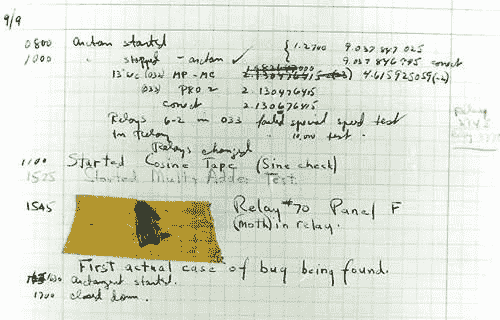

# WebStorm 的 Nuxt.js 调试

> 原文：<https://dev.to/fernalvarez590/nuxt-js-debugging-for-webstorm-365a>

<figure> 

<figcaption>第一个记录在案的计算机 bug ( [下一个 Web](https://thenextweb.com/shareables/2013/09/18/the-very-first-computer-bug/) )</figcaption>

</figure>

您曾经尝试过只使用控制台日志来调试问题吗？这前后你的头疼吗？是否花了很长时间才发现它是某个对象中缺失的属性？让我们面对现实吧…几乎每个人都不得不求助于这个方法，包括我自己。

> console.log 不是也永远不会是调试的灵丹妙药

调试器是我们之间已经存在多年的工具，但由于某种原因，人们在 NodeJS 世界中停止使用它们。我们来自 NodeJS、VSCode 和 Jetbrains 的朋友已经创建了大量的工具，帮助我们“停止”应用程序，并及时获得应用程序在该时刻的当前状态。

另一方面，NuxtJS 一直是试图让调试器启动并运行的一个令人头疼的问题，很难解决，以至于人们倾向于放弃竞争，开始使用 console.log。

<figure> 

<figcaption>每个人都试图让 NuxtJS 调试器运行起来，包括我自己</figcaption>

</figure>

别害怕，我的朋友！事实上，我有一个快速、安全、好的解决方案来解决你所有的问题！实际上，NuxtJS 调试比每个人想象的都要简单，我想让你知道这一点，因为几乎没有关于这个主题的文档，我想让你的生活更简单。

### 项目配置

打开 nuxt.config.js 并转到 build 属性，因为我们要修改 extend 方法。

我们只需要添加**一行**代码，但这对启用调试非常有意义: